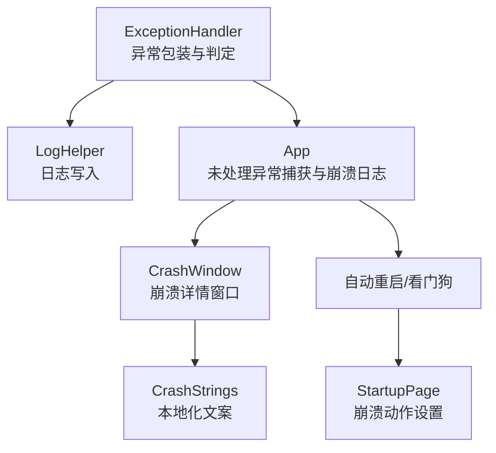
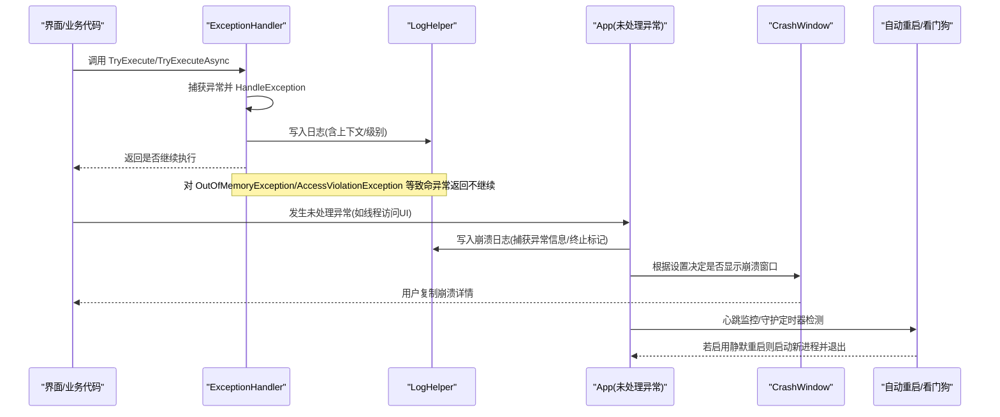
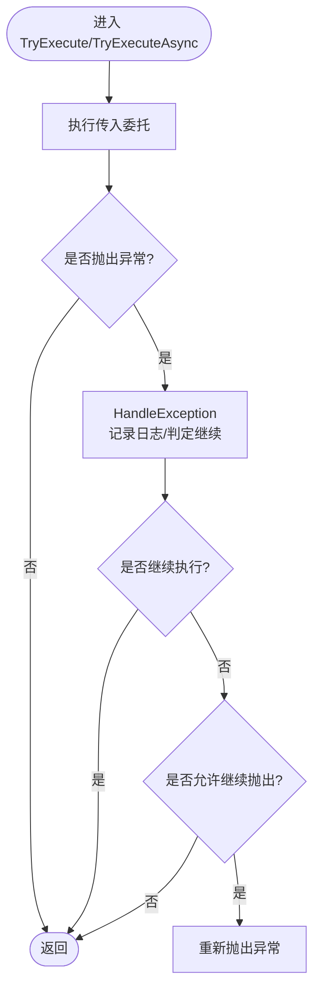
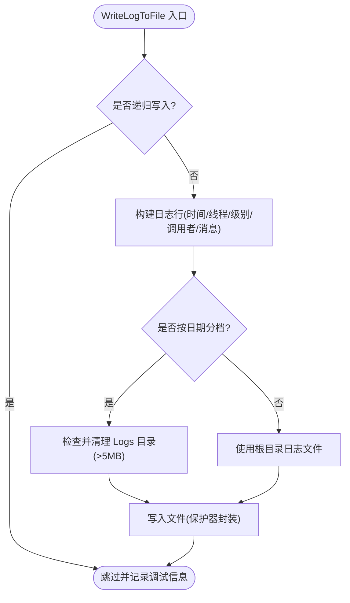
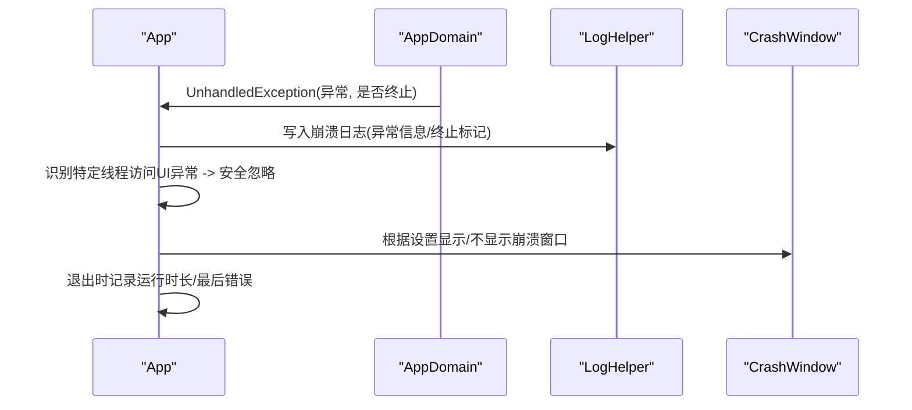
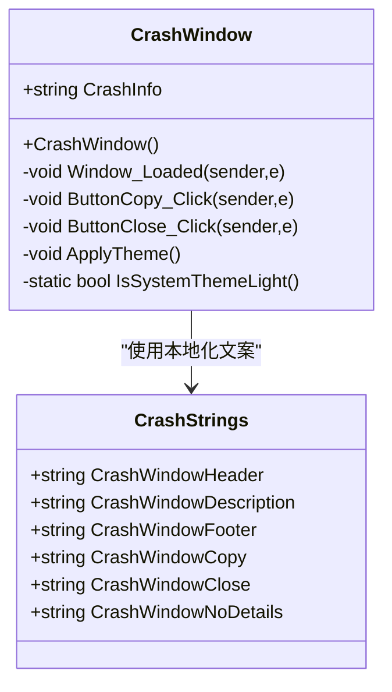
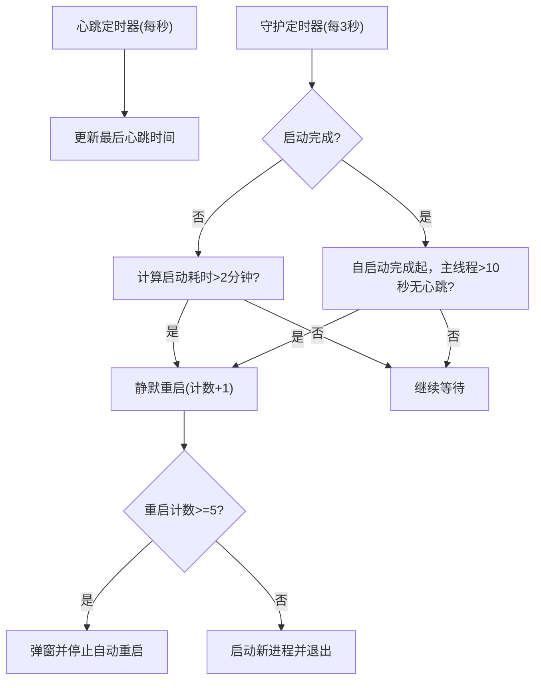
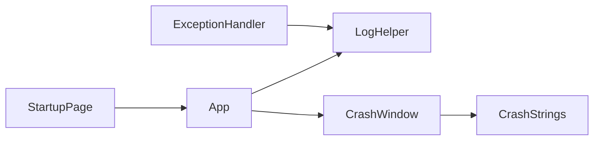

# 异常处理与崩溃恢复

## 简介
本文件面向 InkCanvasForClass 的异常处理与崩溃恢复系统，系统性梳理异常捕获机制、错误分类与处理策略、崩溃监控与致命异常检测、自动重启机制、错误报告生成与日志记录、最佳实践与排障建议。目标是帮助开发者与测试人员快速理解并有效维护该系统的稳定性与可维护性。

## 项目结构
围绕异常处理与崩溃恢复的关键文件分布如下：
- 异常处理与包装器：Helpers/ExceptionHandler.cs
- 日志与错误报告：Helpers/LogHelper.cs、App.xaml.cs 中的崩溃日志写入
- 崩溃窗口与用户交互：Windows/CrashWindow.xaml、CrashWindow.xaml.cs、Properties/CrashStrings.*
- 自动重启与守护：App.xaml.cs 中的心跳监控、看门狗与重启逻辑
- 用户设置入口：SettingsViews/Pages/StartupPage.xaml

## 核心组件
- 异常包装与判定器：提供统一的异常捕获、日志记录与“是否继续执行”的决策，支持同步与异步执行包装。
- 日志系统：集中写日志、带时间戳、线程ID、调用者信息、递归保护、按启动时间分档与大小清理。
- 崩溃监控与日志：捕获未处理异常、记录崩溃日志、区分终止性异常、识别特定线程访问UI异常并安全忽略。
- 崩溃窗口与用户反馈：展示崩溃详情、复制日志、主题适配、本地化文案。
- 自动重启与看门狗：心跳监控、守护定时器、连续重启上限、看门狗进程与信号文件。
- 用户设置：崩溃动作选择（静默重启/不处理/显示崩溃窗口）。

## 架构总览
下图展示了从异常发生到用户反馈与自动重启的整体流程。

## 组件详解

### 异常包装与判定器（ExceptionHandler）
- 功能要点
  - HandleException：记录异常消息与内层异常，按日志级别输出；基于异常类型判定是否继续执行。
  - TryExecute/TryExecuteAsync：提供同步与异步的 try-catch 包装，支持“是否在非致命异常时抛出”选项。
  - 致命异常判定：对 OutOfMemoryException、AccessViolationException 等直接返回不继续执行，避免进一步损坏。
- 设计原则
  - 统一入口，避免散落的 try-catch。
  - 明确“可恢复/不可恢复”边界，防止误判导致数据损坏或资源泄漏。
- 使用建议
  - 所有潜在风险操作均应通过 TryExecute/TryExecuteAsync 包裹。
  - 对关键路径（I/O、IPC、渲染）优先使用异步包装，避免阻塞 UI。

### 日志系统（LogHelper）
- 功能要点
  - 写日志：统一格式，包含时间戳、线程ID、日志级别、调用者信息。
  - 递归保护：通过原子标志避免日志写入过程中的递归调用。
  - 分档与清理：支持按启动时间命名日志文件；日志目录超限时清理。
  - 异常记录：支持直接记录 Exception，包含类型、消息、堆栈与内层异常。
- 性能与可靠性
  - 写入过程采用互斥保护，避免并发冲突。
  - 目录与文件写入通过保护器封装，降低权限问题导致的失败。
- 输出位置
  - 默认根目录日志文件；开启按日期分档时写入 Logs/Log_YYYY-MM-dd-HH-mm-ss.txt。

### 崩溃监控与日志（App.xaml.cs）
- 未处理异常捕获
  - 捕获 UI 线程与后台线程未处理异常，记录崩溃日志；对终止性异常做特殊标记。
  - 特定场景安全忽略：识别 WPF InkCanvas DynamicRenderer 线程访问 UI 的已知问题，记录警告并放行。
- 崩溃日志写入
  - 按应用启动时间命名崩溃日志文件，确保每次启动独立日志。
- 退出与收尾
  - 进程退出时记录运行时长、最后错误信息、设备标识等。
- 终止监控
  - 通过 Windows 事件钩子监控主窗口销毁，配合看门狗实现健壮的崩溃检测。

### 崩溃详情窗口与用户反馈（CrashWindow）
- 功能要点
  - 展示崩溃详情文本，支持复制到剪贴板。
  - 主题适配：根据设置或系统主题应用 Modern 主题。
  - 本地化文案：标题、描述、按钮文本来自资源文件。
- 错误处理
  - 复制失败与主题应用失败均记录警告日志，避免影响窗口显示。

### 自动重启与看门狗（App.xaml.cs）
- 心跳监控与守护
  - 启动心跳定时器与守护定时器，分别用于检测启动阶段假死与主线程无响应。
  - 启动阶段超过两分钟未完成启动或主线程超过十秒无心跳，触发静默重启。
- 连续重启保护
  - 连续重启达到阈值（默认5次）弹窗提示并停止自动重启，防止无限循环。
- 看门狗进程
  - 通过命令行参数 --watchdog 启动看门狗，监控主进程生命周期与退出信号文件。
  - 收到退出信号或主进程异常退出时，依据设置执行重启或直接退出。
- 重启条件与退出信号
  - 用户主动退出时写入退出信号文件并通知看门狗，避免误重启。

### 用户设置入口（StartupPage.xaml）
- 崩溃动作设置项：静默重启、不处理、显示崩溃窗口。
- 与本地化资源绑定，保证文案一致性。

## 依赖关系分析
- ExceptionHandler 依赖 LogHelper 进行日志输出；对致命异常类型进行短路判定。
- App 作为全局异常捕获与崩溃日志中心，协调 CrashWindow 与自动重启。
- CrashWindow 依赖 CrashStrings 实现本地化文案与主题应用。
- StartupPage 提供用户配置入口，影响崩溃动作行为。

## 性能考量
- 日志写入的互斥保护与递归防护避免了异常链路中的额外开销与死锁风险。
- 心跳与守护定时器频率合理，避免频繁 IO 与进程创建。
- 连续重启上限防止资源耗尽与用户体验恶化。
- 崩溃窗口与主题应用的异常被降级为警告，不影响主流程。

## 故障排除指南
- 症状：应用频繁自动重启
  - 排查要点：检查连续重启计数是否达到阈值；查看崩溃日志定位根本原因；确认是否为启动阶段假死或主线程无响应。
- 症状：崩溃详情窗口未显示
  - 排查要点：确认设置中的崩溃动作是否为“显示崩溃窗口”；检查异常是否被判定为“致命异常”而直接终止。
- 症状：日志文件过大或无法写入
  - 排查要点：检查 Logs 目录是否超过限制并被清理；确认写入权限与磁盘空间；查看递归日志保护是否触发。
- 症状：复制崩溃详情失败
  - 排查要点：检查剪贴板访问权限；查看日志中是否有警告记录。

## 结论
该系统通过“异常包装与判定 + 集中日志 + 崩溃监控 + 自动重启 + 用户反馈”的闭环，实现了对常见与致命异常的稳健处理。建议在新增模块时统一使用 ExceptionHandler 包装高风险操作，结合日志与崩溃日志定位问题，并通过设置页面灵活调整崩溃动作，以平衡稳定性与用户体验。

## 附录
- 最佳实践清单
  - 使用 TryExecute/TryExecuteAsync 包裹所有潜在异常路径。
  - 对 OutOfMemoryException、AccessViolationException 等致命异常不要吞掉，直接让系统接管。
  - 在关键资源释放处使用异常包装，确保资源清理不中断。
  - 异步任务中优先使用 TryExecuteAsync，避免 UI 阻塞。
  - 日志记录包含上下文与调用者信息，便于回溯。
  - 崩溃详情窗口仅用于非致命异常或需要用户反馈的场景。
  - 设置连续重启上限，防止无限重启导致资源耗尽。
  - 使用看门狗与退出信号文件确保优雅退出与正确重启。
