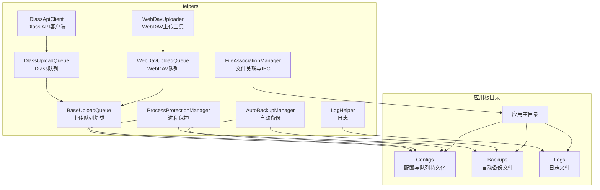
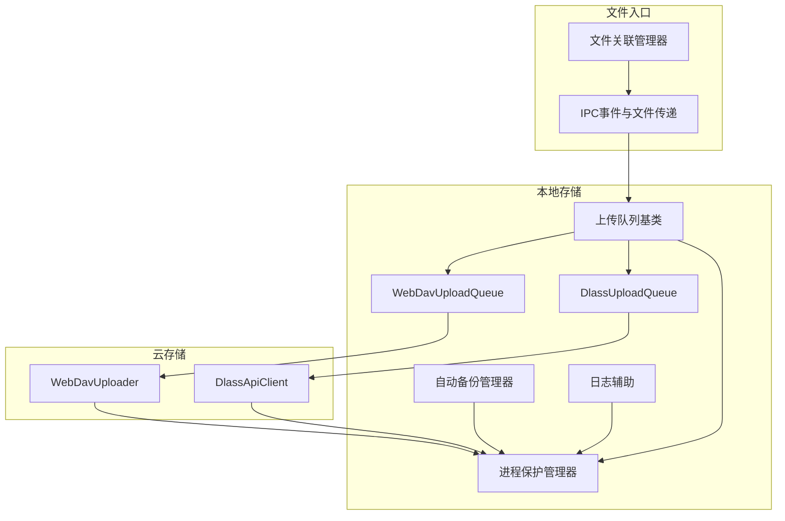
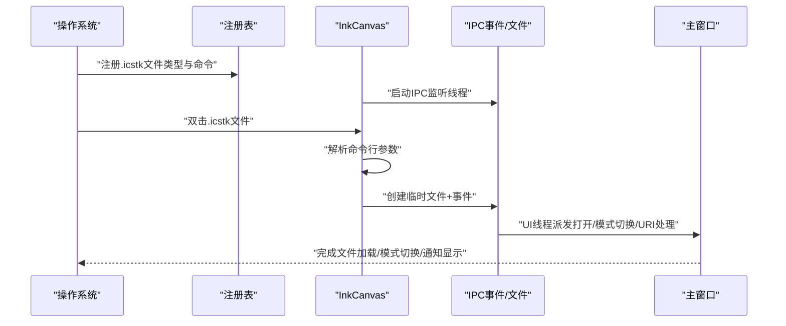
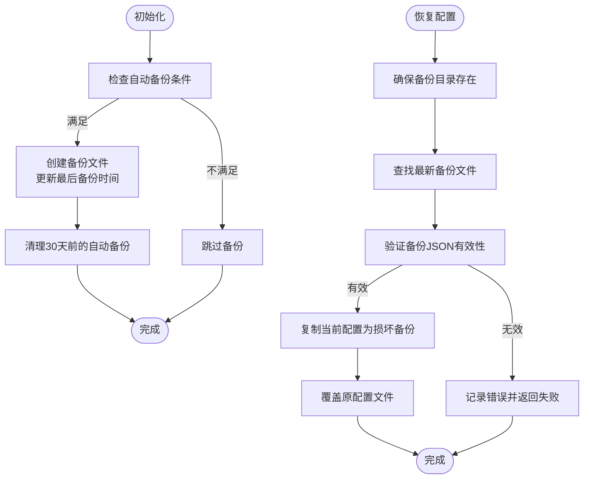
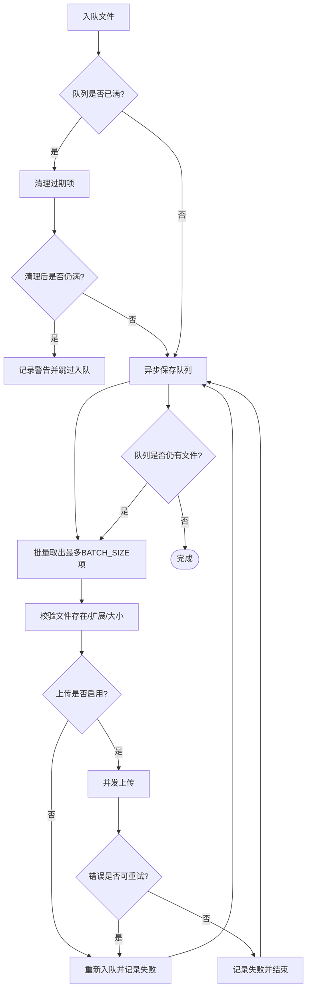
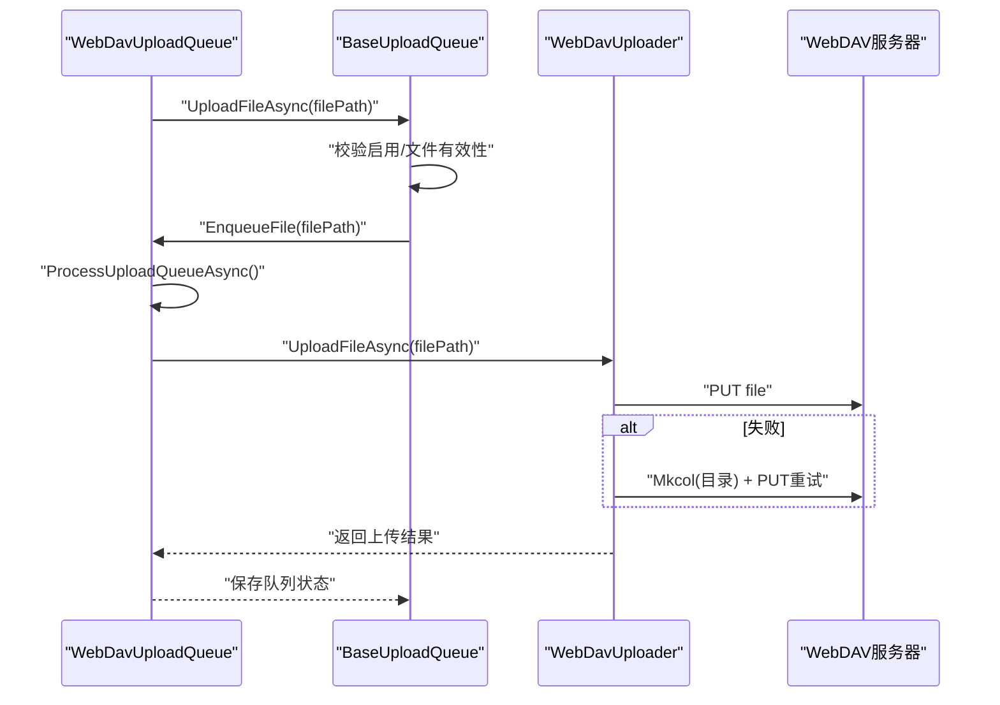
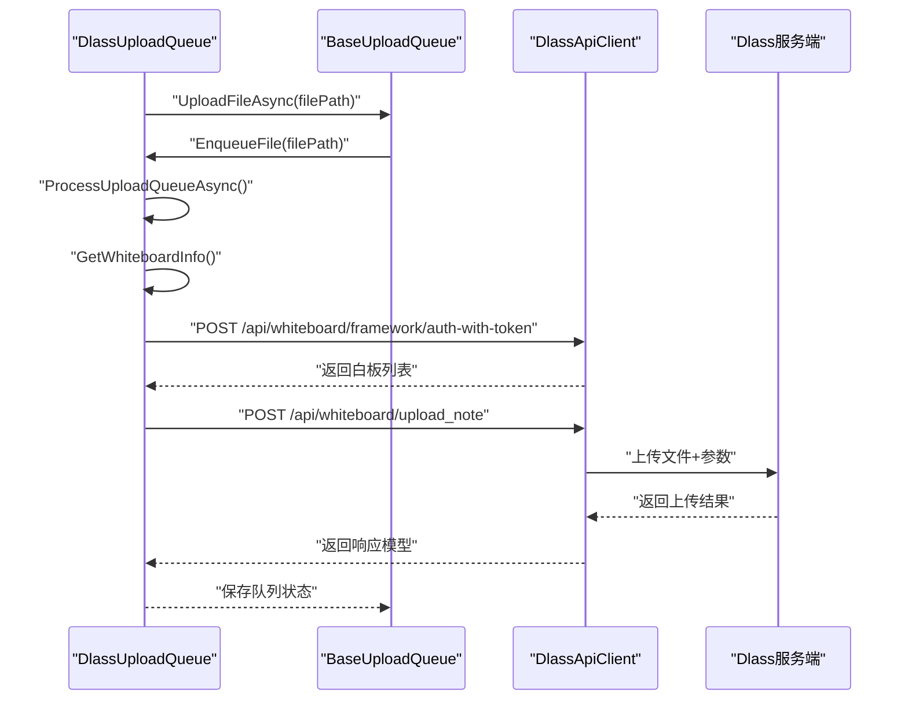
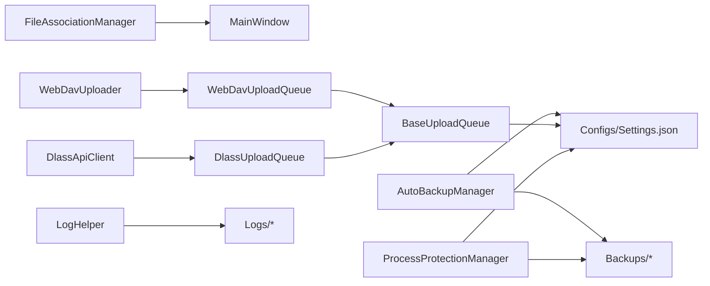

# 文件管理与存储

## 简介
本文件面向 InkCanvasForClass 的文件管理与存储系统，重点围绕以下主题：
- 文件关联管理器：文件类型注册、默认程序设置、协议处理与 IPC 交互。
- 自动备份系统：备份策略、存储位置管理、版本控制与恢复。
- 上传队列管理：任务调度、重试逻辑、进度跟踪与持久化。
- 云存储集成：WebDAV 与 Dlass 上传队列的实现与协作。
- 文件操作最佳实践：文件锁定、并发访问、错误恢复与配置建议。

## 项目结构
本节聚焦与文件管理、存储、上传相关的核心文件组织与职责划分：
- Helpers 层：集中存放文件关联、自动备份、上传队列、云存储客户端、进程保护与日志等通用能力。
- 存储位置约定：配置与备份统一位于应用根目录下的 Configs 与 Backups 子目录，日志可按日期归档至 Logs 子目录。

## 核心组件
- 文件关联管理器：负责 .icstk 文件类型注册、命令行参数解析、IPC 事件与文件传递、白板模式与显示模式命令转发、URI 命令处理与监听。
- 自动备份管理器：基于设置判断是否执行备份、生成带时间戳的备份文件、清理过期备份、从最新备份恢复配置。
- 上传队列基类：抽象上传队列的通用能力，包括队列持久化、并发控制、批量处理、重试策略、过期项清理、文件校验与大小限制。
- WebDAV 上传队列与上传工具：封装 WebDAV 上传流程，支持目录创建与重试。
- Dlass 上传队列与 API 客户端：封装 Dlass 服务端接口，支持白板鉴权、笔记上传、标签与描述构建。
- 进程保护管理器：在高安全场景下对关键目录与文件加锁，避免被外部进程占用或修改，提供写入门控与降级写入能力。
- 日志辅助：统一日志输出、按需按日期归档、大小上限清理与递归日志防护。

## 架构总览
整体架构由“文件关联层”“备份层”“上传队列层”“云存储客户端层”“进程保护与日志层”构成，形成从文件入口、本地持久化、云端上传到安全保护的闭环。

## 详细组件分析

### 文件关联管理器
- 功能要点
  - 注册/注销 .icstk 文件类型与默认图标、打开命令。
  - 命令行参数解析，识别 .icstk 文件路径。
  - IPC 事件与文件传递：通过临时文件与事件句柄通知已运行实例打开文件、切换白板模式、展开浮动栏、处理 URI 命令。
  - 系统文件关联缓存刷新。
- 关键流程
  - 注册流程：创建文件类型与扩展名注册项，设置默认图标与命令，刷新缓存。
  - IPC 监听：后台线程等待事件，扫描临时文件，派发到 UI 线程执行对应操作。
  - 命令行入口：解析参数，定位 .icstk 文件，尝试 IPC 传递，否则直接加载。

### 自动备份系统
- 功能要点
  - 基于设置判断是否执行备份（启用开关、上次备份时间、间隔天数）。
  - 生成带时间戳的备份文件，保存至 Backups 目录。
  - 从最新备份恢复配置，若原配置存在则先复制为“损坏备份”。
  - 清理 30 天前的自动备份文件。
- 关键流程
  - 初始化：检查条件，执行备份，清理过期备份。
  - 恢复：验证备份 JSON 有效性，复制当前配置为“损坏备份”，覆盖原配置。

### 上传队列管理机制
- 设计要点
  - 抽象基类提供通用队列能力：并发队列、批量处理、重试策略、过期项清理、文件校验与大小限制、队列持久化。
  - 上传前校验：扩展名白名单、文件大小限制、文件存在性与有效性。
  - 重试策略：根据错误类型判定是否可重试，最大重试次数限制，失败后重新入队。
  - 持久化：队列项序列化保存至 Configs 下的独立 JSON 文件，采用临时文件+原子替换避免写入冲突。
- 关键流程
  - 入队：检查队列容量与过期项，入队并异步保存。
  - 处理：批量取出最多 BATCH_SIZE 项，检查启用状态与有效性，异步并发上传，失败按规则重试。
  - 保存：上传完成后异步保存队列状态。

### WebDAV 上传队列与上传工具
- WebDAV 上传队列
  - 继承基类，定义队列文件名，检查上传是否启用（依赖 WebDavUploader 的启用检测）。
  - 内部上传：再次校验文件存在与启用状态，调用 WebDavUploader 执行上传。
- WebDAV 上传工具
  - 读取设置（URL、用户名、密码、根目录），构造目标路径。
  - 直接上传，失败时尝试逐级创建目录并重试。
  - 启用检测：校验 URL 有效性。

### Dlass 上传队列与 API 客户端
- Dlass 上传队列
  - 继承基类，定义队列文件名，检查上传是否启用（依赖设置中的自动上传开关）。
  - 内部上传：获取白板信息（鉴权、查找匹配班级），准备上传参数（标题、描述、标签），调用 DlassApiClient 上传笔记。
  - 白板信息获取：通过用户 Token 与应用凭据鉴权，查询白板列表并匹配班级名称。
- Dlass API 客户端
  - 支持 Access Token 获取（应用凭据或用户 Token），自动续期与过期处理。
  - 提供 GET/POST/PUT/DELETE 通用方法，支持认证头注入。
  - 上传笔记：构造 multipart/form-data，添加文件与可选参数，返回响应模型。

### 进程保护与日志
- 进程保护管理器
  - 在启用状态下对应用根目录递归加锁关键文件与目录，防止被外部进程占用。
  - 提供写入门控（写入门闩）与降级写入：当无法获取门闩时，临时释放目标路径的锁后执行写入并恢复。
  - 支持按需开启/关闭，应用关闭时统一释放资源。
- 日志辅助
  - 统一日志格式（时间戳、线程ID、日志类型、调用者），支持按日期归档与大小上限清理。
  - 与进程保护结合，确保日志写入稳定可靠。

## 依赖关系分析
- 组件耦合
  - 上传队列基类与具体队列（WebDav、Dlass）松耦合，通过抽象方法扩展上传逻辑。
  - WebDav 与 Dlass 上传均依赖进程保护与日志辅助，确保写入与可观测性。
  - 文件关联管理器与主窗口交互，通过 UI 线程派发操作，避免跨线程 UI 访问。
- 外部依赖
  - WebDAV 客户端库用于 HTTP/DAV 传输。
  - JSON 序列化用于队列持久化与备份恢复。
  - 注册表 API 用于文件类型注册与状态检查。

## 性能考量
- 并发与锁
  - 队列处理与保存分别使用信号量控制并发，避免竞争与阻塞。
  - 写入采用临时文件+原子替换，降低写入冲突概率。
- 批量与限流
  - 批量大小限制（BATCH_SIZE），避免一次性处理过多文件导致阻塞。
  - 最大队列长度与过期项清理，防止内存与磁盘压力累积。
- I/O 与网络
  - WebDAV 上传失败时逐级创建目录再重试，减少失败率。
  - Dlass API 客户端内置超时与认证头管理，提升稳定性。
- 进程保护
  - 在高安全场景下启用文件/目录句柄锁定，避免外部进程干扰，但需注意对写入性能的影响。

## 故障排查指南
- 文件关联问题
  - 注册失败：检查权限与异常日志，确认注册表写入成功与缓存刷新。
  - IPC 无响应：检查事件句柄创建、临时文件清理、UI 线程派发是否正常。
- 自动备份问题
  - 备份未执行：检查设置开关与间隔天数，查看日志中的条件判断结果。
  - 恢复失败：确认备份文件 JSON 有效，检查“损坏备份”生成与覆盖流程。
- 上传队列问题
  - 队列卡住：检查是否达到最大队列长度或过期项未清理，查看保存锁等待与并发处理状态。
  - 重试无效：确认错误类型是否被判定为可重试，检查最大重试次数与启用状态。
- WebDAV 问题
  - 上传失败：检查 URL、凭据、根目录，查看目录创建与重试逻辑。
- Dlass 问题
  - 白板鉴权失败：检查用户 Token、应用凭据与班级选择，确认白板列表返回与匹配。
- 进程保护与日志
  - 写入失败：启用降级写入路径，检查门闩超时与目录链释放逻辑；查看日志大小上限清理与按日期归档。

## 结论
InkCanvasForClass 的文件管理与存储体系以“文件关联—本地备份—上传队列—云存储—进程保护—日志”为主线，实现了从文件入口、本地持久化、云端上传到安全保护的完整闭环。通过抽象基类与具体实现解耦、并发控制与持久化保障、可重试与过期清理策略，系统在复杂场景下具备良好的稳定性与可维护性。建议在生产环境中结合安全策略启用进程保护，并合理配置备份与上传策略以平衡可靠性与性能。

## 附录
- 配置示例与存储策略建议
  - 自动备份
    - 启用开关：在设置中开启自动备份。
    - 间隔天数：建议 7/14/30 天，视数据变更频率调整。
    - 存储位置：Backups 目录，自动清理 30 天前备份。
  - 上传队列
    - 扩展名白名单：.png/.icstk/.xml/.zip。
    - 文件大小限制：zip 50MB，其他 10MB。
    - 批量大小：默认 10，可根据网络环境调整。
    - 最大重试次数：默认 3，结合错误类型判定。
  - WebDAV
    - URL 与凭据：确保 URL 可达、凭据正确。
    - 目录创建：失败时自动逐级创建。
  - Dlass
    - 用户 Token 与应用凭据：优先使用用户 Token。
    - 白板鉴权：确保班级选择与白板密钥匹配。
  - 进程保护
    - 启用条件：高安全场景或与杀软冲突时启用。
    - 写入门控：注意写入性能与门闩超时。
  - 日志
    - 按日期归档：避免单文件过大。
    - 大小上限：建议 5MB，超出自动清理。
