# 高级功能模块

## 简介
本文件面向 InkCanvasForClass 的高级功能模块，系统性梳理并说明以下能力：
- 异常处理与崩溃恢复：崩溃监控、自动重启策略、错误报告生成
- 国际化与本地化：多语言资源管理、动态语言切换、文本格式化
- 文件管理与存储：文件关联管理、自动备份、云存储（WebDAV）集成
- 性能监控与遥测：遥测数据采集、用户行为分析、数据上报
- 安全机制：权限控制、数据加密、访问审计
- 高级配置与调试：调试控制台、日志轮转、上传队列管理

## 项目结构
围绕高级功能模块的关键代码分布如下：
- Helpers：异常处理、本地化、遥测、安全、文件关联、重启、日志、WebDAV、上传队列等
- Windows：崩溃窗口（UI 展示）
- Properties：集中式字符串键表，支撑本地化

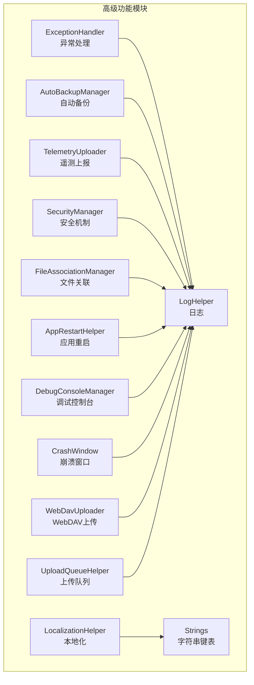

## 核心组件
- 异常处理与崩溃恢复：提供统一异常捕获、日志记录、执行策略控制与崩溃窗口展示
- 国际化与本地化：集中式文化切换、嵌入式资源管理、自定义文化支持
- 文件关联与IPC：.icstk 文件关联、IPC 事件与文件传递、现有实例接管
- 自动备份：按周期检查、备份创建、损坏文件保护、过期清理
- 遥测与日志：设备标识、敏感信息脱敏、Sentry 上报、日志轮转与并发安全
- 安全机制：密码与TOTP双因子、固定时间比较、对话框验证、UI无焦点模式兼容
- 云存储与上传：WebDAV 上传、目录自动创建、上传队列统一管理
- 应用重启：管理员/普通用户模式切换、UIA置顶模式重启
- 调试与诊断：独立调试控制台、日志输出、崩溃详情窗口

## 架构总览
高级功能模块围绕“统一入口 + 组件协作”的架构组织，关键交互如下：

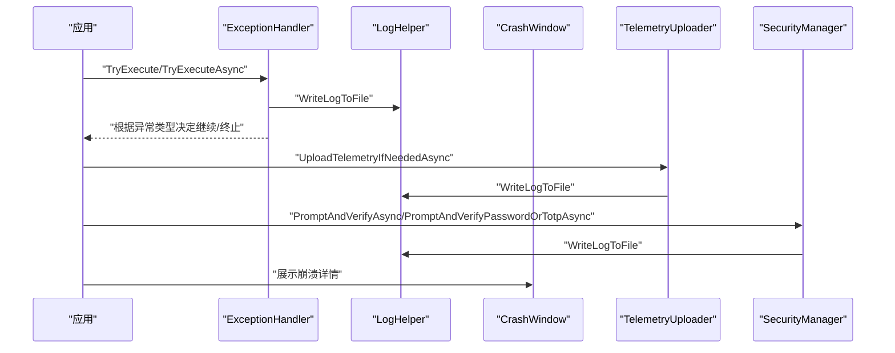

## 详细组件分析

### 异常处理与崩溃恢复
- 统一异常捕获：提供同步/异步执行包装，记录日志并依据异常类型决定是否继续执行
- 崩溃监控：结合日志与遥测，自动收集崩溃与运行日志（脱敏）
- 崩溃窗口：在 UI 层展示崩溃详情，支持复制与主题适配
- 自动重启：支持管理员/普通用户模式切换重启，以及 UIA 置顶模式重启

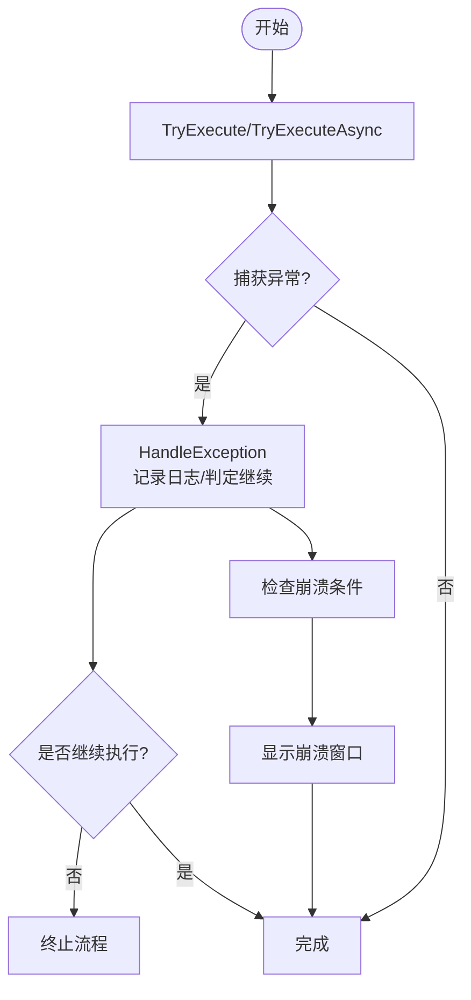

### 国际化与本地化系统
- 文化切换：支持标准文化与自定义文化（如 en-US、zh-ME），动态设置 UI 线程文化
- 资源管理：集中式字符串键表，按组查找；嵌入式资源与外部资源回退
- 字符串获取：通过 Strings 中转，支持多语言资源加载与缓存

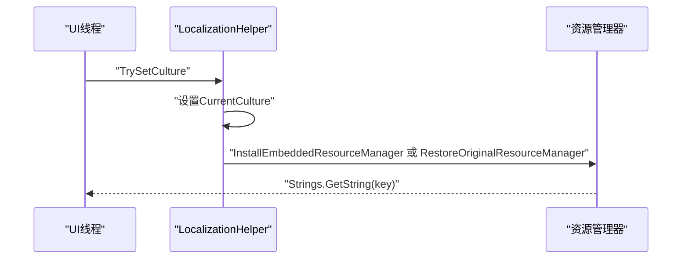

### 文件关联与IPC
- 文件关联：注册 .icstk 扩展名、默认图标、打开命令，刷新系统缓存
- IPC 通信：事件通知 + 临时文件传递，支持文件打开、白板模式切换、展开浮动栏、URI 命令
- 现有实例接管：通过 IPC 将外部请求转发至已运行实例

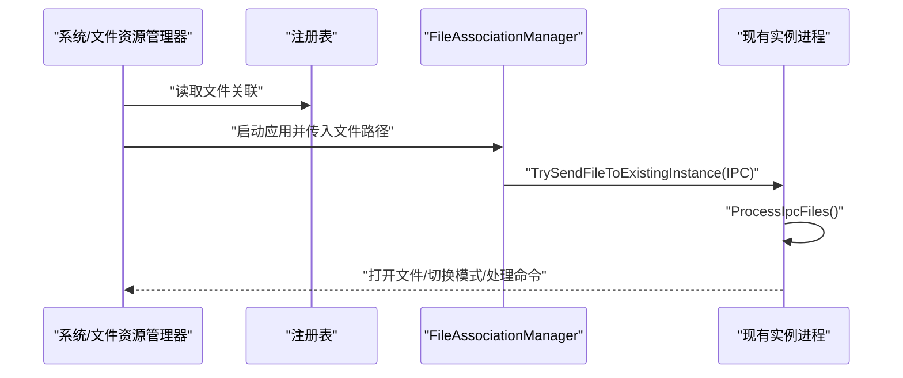

### 自动备份与恢复
- 条件判断：基于设置开关与间隔天数决定是否备份
- 备份创建：复制主配置到备份目录，更新最后备份时间
- 恢复机制：验证备份有效性，损坏文件另存，覆盖主配置
- 过期清理：按 30 天阈值清理旧备份文件

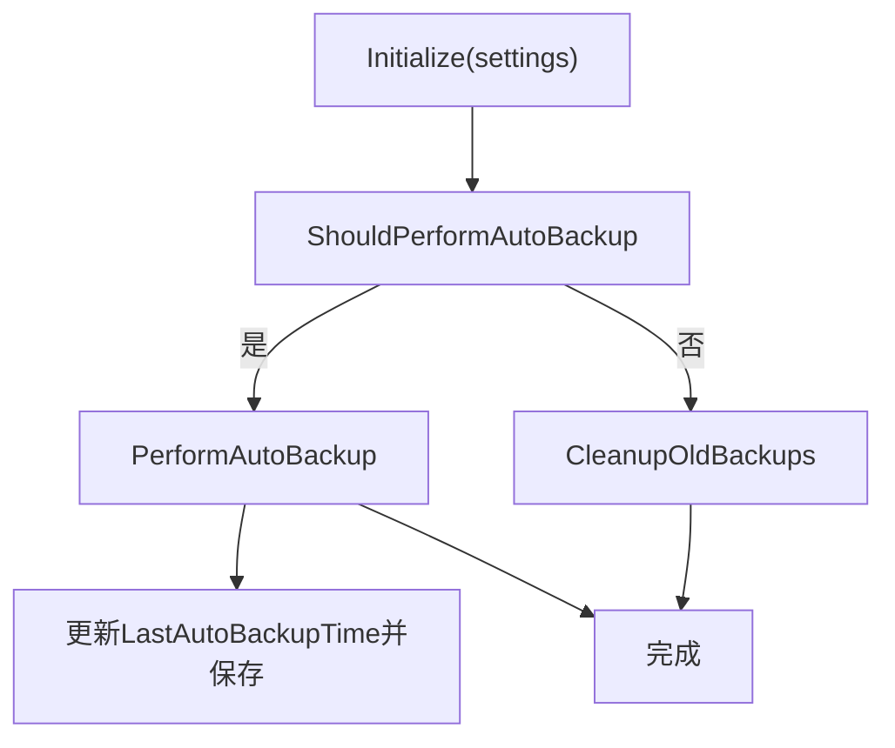

### 遥测与日志
- 遥测采集：按设置级别决定是否上报，Basic/Extended 区分日志附加
- 敏感信息脱敏：邮箱、电话、IP、路径、密钥、URL 参数等正则替换
- 上报通道：Sentry 事件上报，携带设备ID、版本、系统版本等标签
- 日志系统：按启动时间归档、并发互斥、大小限制清理、控制台输出

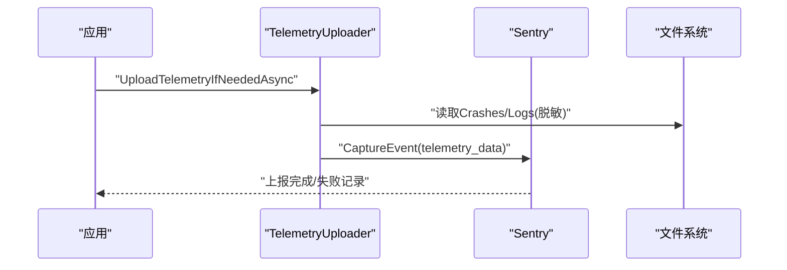

### 安全机制
- 密码安全：PBKDF2 派生、盐值随机生成、固定时间比较防时序攻击
- TOTP 双因子：Base32 密钥、30 秒步进窗口、容差 ±1 步
- 对话框验证：统一弹窗提示输入，支持密码或 TOTP，兼容无焦点模式
- 权限控制：基于设置项的多种场景（退出、进入设置、重置配置、名单变更）的访问控制

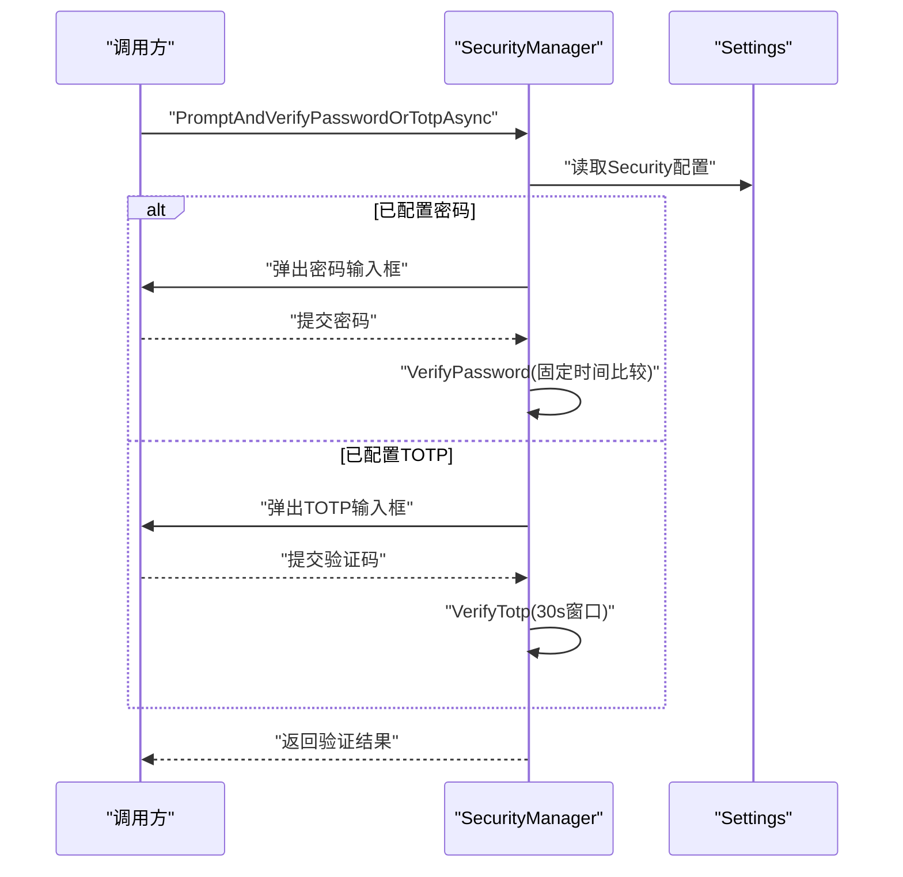

### 云存储与上传队列
- WebDAV 上传：自动检测目录缺失并逐级创建，支持取消令牌
- 上传队列：统一注册与初始化，确保各队列在应用生命周期内可用
- 设置集成：WebDavUrl/用户名/密码/根目录等配置项

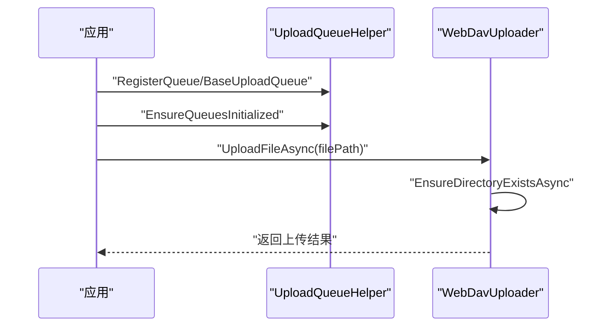

### 应用重启与调试
- 重启策略：管理员/普通用户模式切换、UIA 置顶模式重启、释放互斥体
- 调试控制台：分配/隐藏控制台、移除关闭菜单、UTF-8 输出、仅在可见时写入

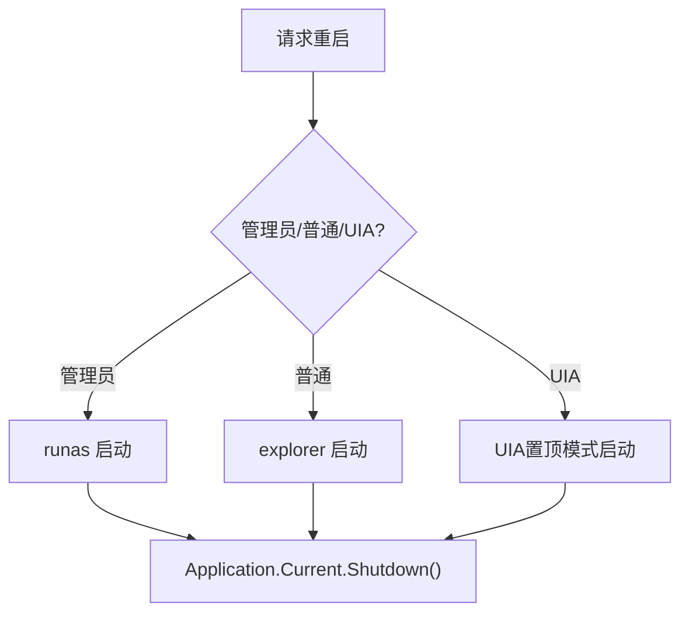

## 依赖关系分析
- 组件耦合：多数高级功能通过 LogHelper 统一日志输出，便于追踪与排障
- 外部依赖：Sentry 用于遥测上报；WebDav 客户端库用于云存储
- 关键接口：BaseUploadQueue 抽象上传队列，UploadQueueHelper 统一注册与初始化

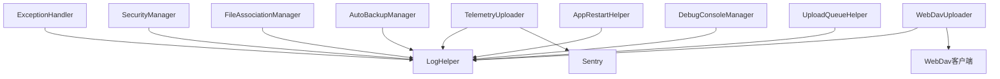

## 性能考量
- 并发安全：日志写入采用互斥标志位，避免递归写入导致死锁
- I/O 优化：WebDAV 上传失败时先尝试创建目录再重试，减少重复网络往返
- 资源管理：IPC 文件在使用后及时清理，避免磁盘占用
- UI 响应：崩溃窗口与对话框均在 UI 线程调度，保证交互一致性

## 故障排查指南
- 日志定位：启用按日期保存日志，查看 Logs/Log_{启动时间}.txt，关注 [Cleanup] 标记
- 遥测问题：确认 TelemetryUploadLevel 与隐私同意状态，检查设备ID有效性
- 文件关联：使用状态检查方法，必要时重新注册，注意权限与系统缓存刷新
- 备份恢复：确认备份目录存在与权限，验证备份文件有效性，注意损坏文件保护
- 安全验证：检查密码/TOTP 配置，确认固定时间比较逻辑未被误用
- 上传失败：核对 WebDav 设置，确认目录层级可创建，使用取消令牌中断长时间阻塞

## 结论
本模块通过统一的日志、安全与异常处理框架，结合本地化、文件关联、自动备份、遥测上报与云存储能力，构建了稳定、可观测、可维护的高级功能体系。建议在生产环境中：
- 明确遥测级别与隐私合规
- 定期清理日志与备份，控制磁盘占用
- 严格管理安全配置，定期轮换密钥与令牌
- 使用上传队列与IPC机制提升用户体验与可靠性

## 附录
- 高级配置要点
  - 遥测级别：None/Basic/Extended，需隐私同意
  - 日志策略：按日期保存、大小限制、并发互斥
  - 备份策略：周期性备份、过期清理、损坏保护
  - 安全策略：密码与TOTP双因子、固定时间比较、无焦点模式兼容
- 调试工具
  - 调试控制台：即时输出日志，UTF-8 编码，不可关闭
  - 崩溃详情窗口：复制崩溃信息，主题适配系统
- 最佳实践
  - 使用 TryExecute/TryExecuteAsync 包裹潜在异常代码
  - 上传前检查设置与网络状态，合理使用取消令牌
  - IPC 事件与文件清理需健壮处理异常与竞态
