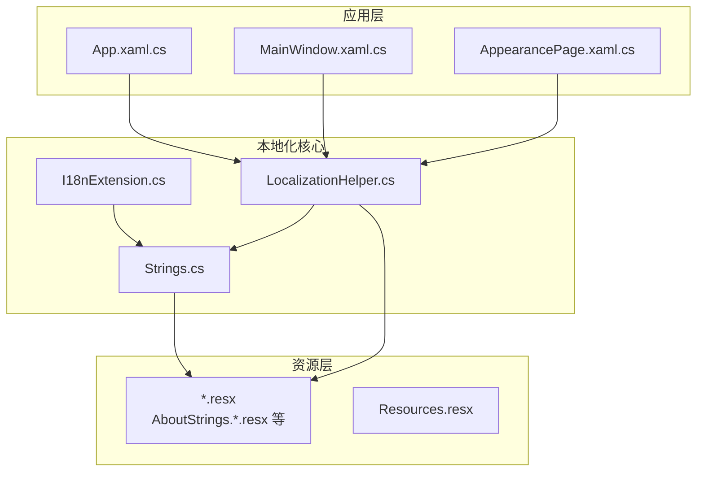
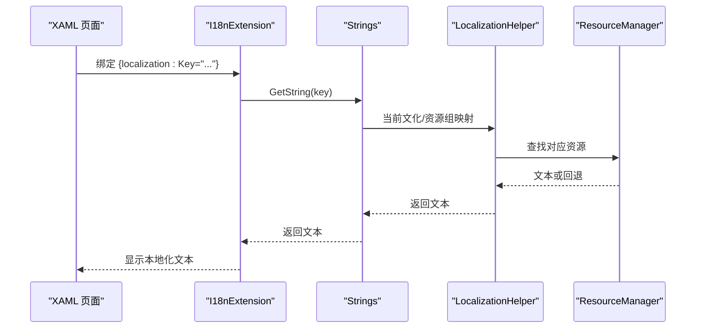
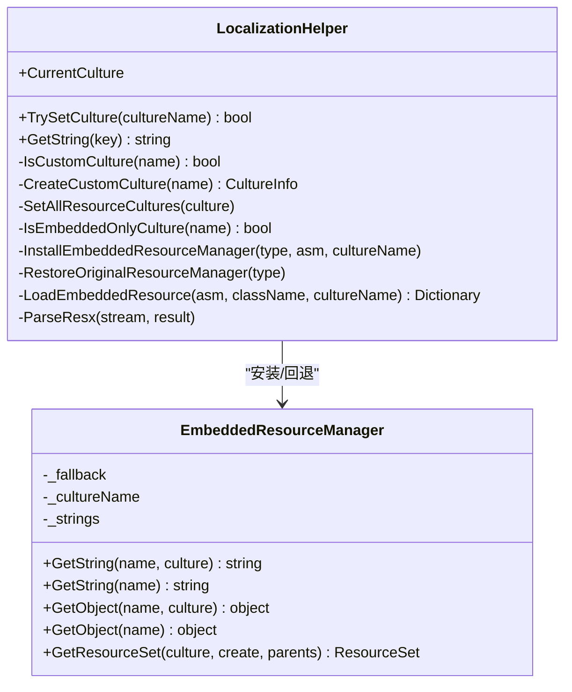
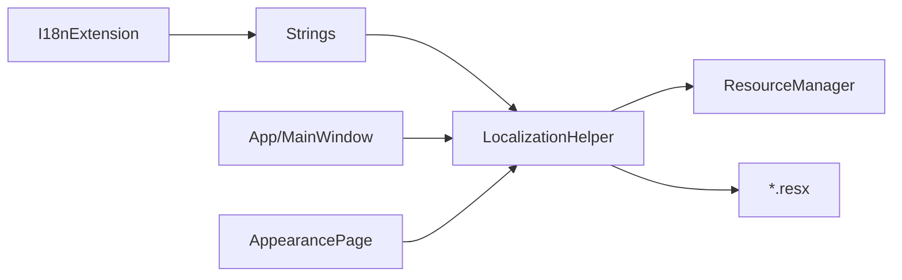

# 国际化与本地化

## 简介
本文件面向 InkCanvasForClass 的国际化与本地化系统，系统性梳理多语言支持架构、资源文件管理、动态语言切换、文本格式化与占位符处理、本地化助手实现机制（语言检测、资源加载与回退策略）、字符串资源组织与命名规范、XAML 中的本地化扩展 I18nExtension 的使用方式，并提供多语言开发最佳实践与语言包创建指南。

## 项目结构
InkCanvasForClass 的本地化体系主要由以下部分组成：
- 资源文件：按模块拆分的 .resx 文件，如 AboutStrings.*.resx、CommonStrings.*.resx 等，统一置于 Properties 目录。
- 中央字符串入口：Strings 类负责资源键到具体资源组的映射与查找。
- 本地化助手：LocalizationHelper 提供语言切换、文化设置、嵌入式资源管理器替换与回退逻辑。
- XAML 本地化扩展：I18nExtension 用于在 XAML 中以标记方式绑定本地化文本。
- 应用层集成：App 与 MainWindow 在启动与设置变更时调用本地化助手完成语言切换与资源刷新。

## 核心组件
- 本地化助手 LocalizationHelper
  - 提供当前文化 CurrentCulture 的设置与获取。
  - 支持标准文化与自定义文化（如 zh-ME）的创建与切换。
  - 动态替换各资源类的 ResourceManager，实现“嵌入式资源”与“外部资源”的切换。
  - 维护嵌入式资源缓存，解析 .resources 或 .resx 并回退至原始 ResourceManager。
- 中央字符串入口 Strings
  - 维护键到资源组与键的映射字典，提供统一的 GetString 接口。
  - 作为 I18nExtension 的查询入口。
- XAML 本地化扩展 I18nExtension
  - 在 XAML 中以 MarkupExtension 形式使用，提供 Key 属性。
  - ProvideValue 返回对应键的本地化文本，缺失时返回占位形式。
- 资源文件
  - 模块化 .resx 文件，包含多语言变体（如 zh-CN、en-US、zh-ME）。
  - Resources.resx 用于存放二进制资源引用（如音频文件）。

## 架构总览
本地化系统采用“中央键映射 + 资源组分离 + 动态资源管理器替换”的架构，实现：
- 键到资源组的集中映射，便于维护与查找。
- 运行时动态切换文化，支持嵌入式与外部资源的无缝回退。
- XAML 侧通过 I18nExtension 实现声明式本地化。

## 详细组件分析

### 本地化助手 LocalizationHelper
- 文化设置与线程上下文
  - CurrentCulture 属性同时设置 UI 文化与非 UI 文化，并同步 Strings.Culture。
- 自定义文化支持
  - IsCustomCulture 识别特定自定义文化名称（如 zh-ME）。
  - CreateCustomCulture 通过克隆标准文化并修改内部名称字段实现自定义文化对象。
- 资源管理器替换与回退
  - SetAllResourceCultures 遍历所有 Properties.*Strings 类，设置 Culture 并根据是否为嵌入式文化决定安装 EmbeddedResourceManager 或恢复原始 ResourceManager。
  - EmbeddedResourceManager 优先返回自定义文化字典中的值，否则回退到原始 ResourceManager。
- 嵌入式资源加载与缓存
  - LoadEmbeddedResource 依次尝试 .resources、.resx、磁盘上的 .resx，解析并缓存结果，提升后续访问性能。
- 关键点
  - 通过反射访问静态字段与属性，确保对所有资源类生效。
  - 对异常进行吞吐，保证切换过程的健壮性。

## 依赖关系分析
- 组件耦合
  - I18nExtension 依赖 Strings。
  - Strings 依赖 LocalizationHelper 的文化与资源管理能力。
  - App/MainWindow 依赖 LocalizationHelper 完成语言切换。
- 资源依赖
  - 所有模块化 .resx 文件作为 Strings 的数据源。
  - EmbeddedResourceManager 依赖原始 ResourceManager 进行回退。
- 外部依赖
  - System.Resources、System.Globalization、System.Reflection。

## 性能考量
- 嵌入式资源缓存
  - LocalizationHelper 对解析后的嵌入式资源进行缓存，避免重复解析与 IO。
- 字典查找
  - Strings 的键到资源组映射为 O(1) 查找，减少反射与资源管理器调用次数。
- 文化切换成本
  - 切换文化时需遍历并替换所有资源类的 ResourceManager，建议在设置页批量切换并提示用户。

[本节为通用指导，无需列出具体文件来源]

## 故障排查指南
- 切换语言后文本未更新
  - 检查是否调用了 LocalizationHelper.TrySetCulture 并设置了 CurrentCulture。
  - 确认 Strings.Culture 已随线程文化同步。
- XAML 中出现占位文本
  - 表示资源键缺失，检查 Strings.cs 中的键映射或对应 .resx 是否包含该键。
- 自定义文化（如 zh-ME）不生效
  - 确认 IsCustomCulture 与 CreateCustomCulture 的逻辑是否正确创建并设置文化对象。
- 嵌入式资源加载失败
  - 检查资源文件名与路径是否符合约定（类名.文化.资源），并确认缓存命中情况。

## 结论
InkCanvasForClass 的本地化系统通过模块化资源、集中键映射与动态资源管理器替换，实现了灵活且可扩展的多语言支持。结合 I18nExtension，开发者可在 XAML 中以声明式方式快速完成本地化，同时通过 AppearancePage 等设置界面实现动态语言切换。建议在新增模块时严格遵循命名规范与键映射规则，并在发布前进行全面的本地化回归测试。

[本节为总结性内容，无需列出具体文件来源]

## 附录

### 字符串资源组织与命名规范
- 资源组命名
  - 按功能模块命名，如 AboutStrings、CommonStrings、CanvasStrings 等。
- 资源键命名
  - 采用“模块_子项”或“模块_描述”的层级命名，例如 About_Title、Canvas_GroupTitle。
- 文化变体
  - 默认语言使用 .resx；其他语言使用 .语言代码.resx，如 .en-US.resx、.zh-ME.resx。
- 键映射
  - 在 Strings.cs 中维护键到资源组与键的映射，确保统一查询入口。