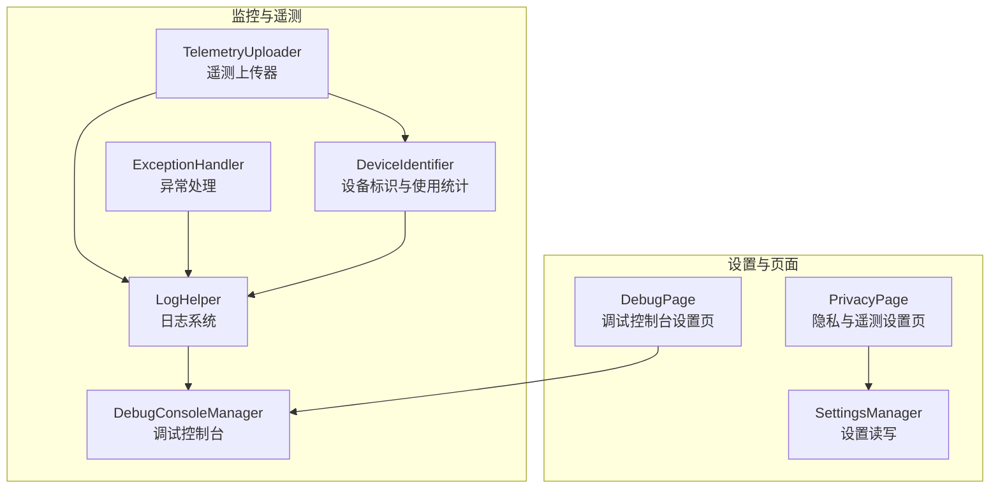
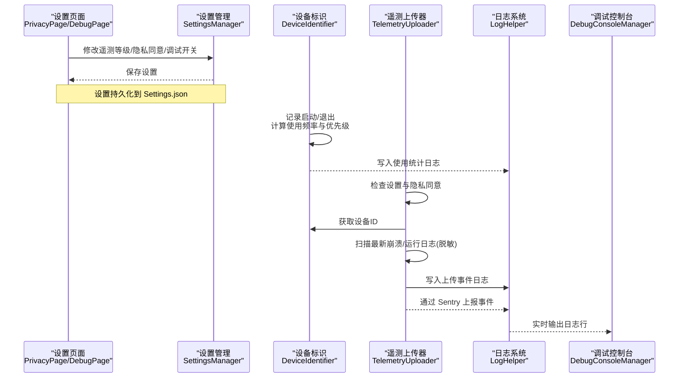
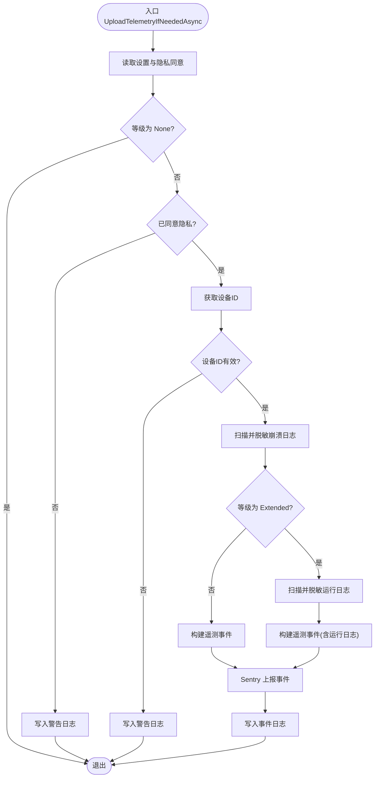
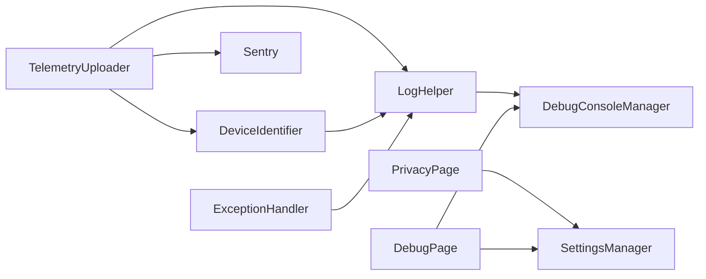

# 性能监控与遥测

## 简介
本文件面向 InkCanvasForClass 的性能监控与遥测体系，系统性阐述以下内容：
- 遥测数据采集机制：性能指标采集、用户行为跟踪、系统状态监控
- 遥测上传器实现：数据序列化、传输协议、错误处理
- 日志系统架构：日志级别、输出目标、轮转策略
- 调试控制台管理器：实时日志显示、命令交互、性能分析工具
- 监控最佳实践：关键指标定义、告警阈值设置、性能优化建议
- 具体监控配置与数据分析方法

## 项目结构
围绕监控与遥测的关键文件分布如下：
- 遥测与设备识别：Helpers 下的 TelemetryUploader、DeviceIdentifier
- 日志与调试：LogHelper、DebugConsoleManager、ExceptionHandler
- 设置与页面：PrivacyPage、DebugPage、SettingsManager
- 配置持久化：SettingsManager 对 Settings.json 的读写

## 核心组件
- 遥测上传器：负责在满足条件时收集并上报遥测事件，包含崩溃日志与运行日志（脱敏）。
- 设备标识与使用统计：生成设备ID、记录启动/退出、计算使用频率与更新优先级。
- 日志系统：统一写日志、支持按启动时间归档、轮转清理、并发安全。
- 调试控制台：动态分配/释放控制台窗口，屏蔽关闭菜单，实时输出日志。
- 异常处理：统一捕获与判定异常类型，决定是否继续执行。
- 设置与页面：提供隐私与遥测等级选择、调试控制台开关。

## 架构总览
遥测与日志的整体工作流如下：

## 组件详解

### 遥测上传器（TelemetryUploader）
职责与流程：
- 条件判断：读取设置中的遥测等级与隐私同意标志，若等级为“禁止”或未同意隐私，则终止。
- 设备ID校验：通过 DeviceIdentifier 获取设备ID，长度与格式不合法则终止。
- 数据采集：
  - 崩溃日志：扫描 Crashes 目录下最新崩溃日志，进行脱敏后作为附件上报。
  - 运行日志（扩展级）：扫描 Logs 目录下最新运行日志，进行脱敏后作为附件上报。
- 遥测数据封装：包含遥测等级、设备ID、更新通道、应用版本、系统版本、是否存在崩溃/运行日志等。
- 上报与记录：通过 Sentry 发送事件，并在本地日志中记录上传结果。

脱敏规则（正则）：
- 邮箱、手机号、IPv4、Windows 路径、UNC 路径、URL 参数、键值对形式密钥、JSON 字段值中的敏感字段均替换为占位符。

## 依赖关系分析
- TelemetryUploader 依赖 DeviceIdentifier 获取设备ID，依赖 LogHelper 写日志，依赖 Sentry 进行上报。
- DeviceIdentifier 依赖 LogHelper 写日志，依赖系统信息与注册表/WMI 查询硬件指纹。
- LogHelper 依赖 DebugConsoleManager 实时输出，依赖 SettingsManager 的写权限保护。
- DebugPage/PrivacyPage 依赖 SettingsManager 读写设置，间接影响 TelemetryUploader 的行为。
- ExceptionHandler 为全局异常兜底，保障日志与上传流程的稳定性。

## 性能考量
- 异步上传：遥测上传在后台任务中执行，避免阻塞主线程。
- 脱敏成本：正则替换在 IO 之后进行，整体开销可控；建议在日志量较大时关注 CPU 占用。
- 日志轮转：按启动时间归档可减少单文件体积；Logs 文件夹总大小超限时清空，降低磁盘压力。
- 控制台输出：仅在可见时写入，避免无意义 IO；屏蔽关闭菜单减少误操作。
- 设备统计：使用缓存与每周重置机制，降低频繁 IO；评分计算为纯内存运算。

[本节为通用性能讨论，无需列出具体文件来源]

## 故障排查指南
常见问题与定位方法：
- 遥测未上传
  - 检查隐私同意与遥测等级设置是否为“禁止”
  - 查看本地日志中是否有“未同意隐私说明”“设备ID无效”等警告
  - 确认崩溃/运行日志是否存在且可读
- 日志未输出到控制台
  - 确认调试控制台开关已开启
  - 检查控制台是否被意外关闭或隐藏
- 日志文件过大或无法写入
  - 检查 Logs 文件夹总大小是否超过阈值，确认是否已清理
  - 检查应用根目录写权限与磁盘空间
- 异常导致流程中断
  - 使用 ExceptionHandler 的统一处理能力，查看日志中异常堆栈
  - 对致命异常（如内存不足、访问违例）应避免继续执行

## 结论
该监控与遥测体系通过“设备标识+使用统计+日志+遥测上传”的组合，实现了对用户行为、系统状态与异常情况的可观测性。配合设置页面与调试控制台，既保证了用户体验，也提供了强大的运维与诊断能力。建议在生产环境中结合业务指标设定告警阈值，并持续优化日志与上传策略以平衡性能与可观测性。

[本节为总结性内容，无需列出具体文件来源]

## 附录

### 监控配置清单
- 遥测等级
  - 禁止（None）、基础（Basic）、扩展（Extended）
  - 基础级：仅上传崩溃日志（脱敏）
  - 扩展级：额外上传运行日志（脱敏）
- 隐私同意
  - 必须同意隐私条款方可上传
- 调试控制台
  - 可在设置页中开启/关闭
- 日志配置
  - 是否启用日志
  - 是否按日期归档
  - Logs 文件夹大小上限与清理策略