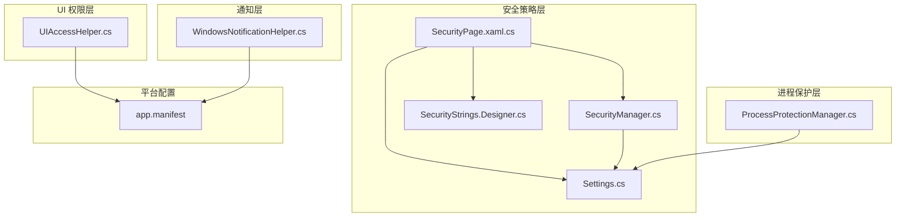
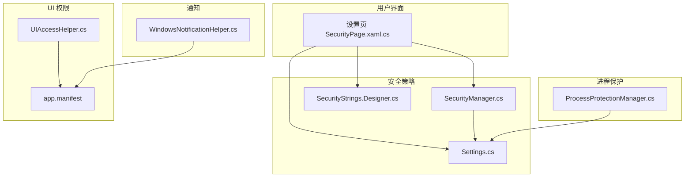
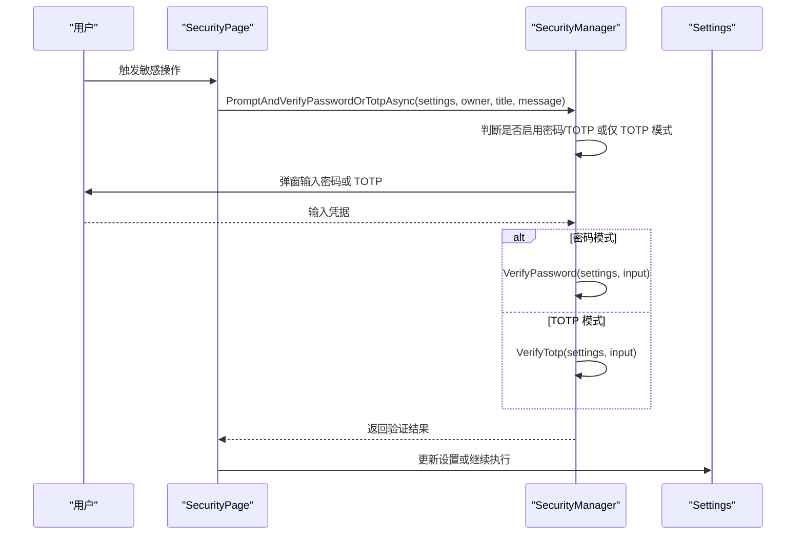
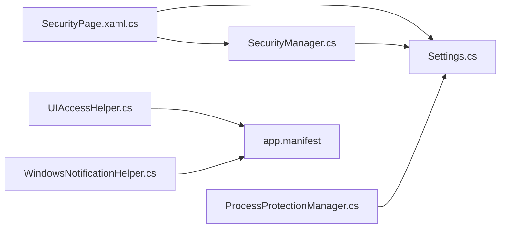

# 安全机制

## 简介
本文件系统化梳理 InkCanvasForClass 的安全机制，覆盖以下方面：
- 安全管理员：密码与一次性验证码（TOTP）的配置、验证与交互流程，最小权限与防时序攻击设计。
- 进程保护管理器：基于文件句柄与目录句柄的进程隔离与写入门控，降低被篡改风险。
- UIAccess 辅助程序：通过 Winlogon 令牌模拟与令牌信息设置，实现 UIAccess 权限的获取与安全上下文维护。
- Windows 通知助手：跨版本通知展示与隐私注意点。
- 安全最佳实践：最小权限、安全编码规范与常见威胁缓解。
- 安全配置示例与威胁分析。

## 项目结构
围绕安全相关的核心文件分布如下：
- 安全策略与交互：SecurityManager.cs、SecurityPage.xaml.cs、SecurityStrings.Designer.cs、Settings.cs
- 进程保护：ProcessProtectionManager.cs
- UIAccess 权限：UIAccessHelper.cs
- 通知：WindowsNotificationHelper.cs
- 清单与执行级别：app.manifest

## 核心组件
- 安全管理员（SecurityManager）
  - 密码与 TOTP 的配置、验证与交互，支持“仅 TOTP”模式与“密码或 TOTP”二选一。
  - 使用 PBKDF2-HMACSHA256（迭代次数可配置）派生密钥，固定时间比较哈希，抵御时序攻击。
  - 对敏感操作（如退出、进入设置、重置配置、修改/清空点名名单）进行条件拦截与二次确认。
- 进程保护管理器（ProcessProtectionManager）
  - 基于文件与目录句柄的“只读锁”，保护关键文件（含点名名单）与可执行/动态库/配置等。
  - 写入门控（write gate）与“降级释放-恢复”策略，避免长时间持有锁导致写入阻塞。
  - 支持按需重扫描与排除目录（如配置、保存、备份、日志、自动更新）。
- UIAccess 辅助程序（UIAccessHelper）
  - 通过 Winlogon 令牌模拟与令牌信息设置，为当前进程或新进程授予 UIAccess。
  - 支持以普通用户权限重启并携带 UIAccess，或以管理员权限重启并携带 UIAccess。
- Windows 通知助手（WindowsNotificationHelper）
  - 跨 Windows 版本的通知展示（Win7 气泡通知与现代 Windows 吐司）。
  - 注意：通知内容不应包含敏感信息，避免泄露至任务栏托盘或系统通知中心。

## 架构总览
下图展示了安全相关模块之间的交互关系与职责边界：

## 详细组件分析

### 安全管理员（SecurityManager）
- 功能要点
  - 密码与 TOTP 的启用/禁用、配置与验证。
  - 针对不同场景（退出、进入设置、重置配置、修改/清空点名名单）的二次确认策略。
  - 固定时序比较，防止侧信道攻击。
- 关键流程（密码或 TOTP 二次确认）

## 依赖关系分析
- 设置模型（Settings.cs）中的 Security 字段承载安全策略，被 SecurityManager 与 SecurityPage 读写。
- SecurityPage 作为 UI 入口，负责将用户操作映射为设置变更，并调用 SecurityManager 与 ProcessProtectionManager。
- UIAccessHelper 与 app.manifest 协同，前者在运行时授予 UIAccess，后者声明默认执行级别。
- WindowsNotificationHelper 与系统通知框架集成，注意隐私与信息最小化。

## 性能考量
- 密码与 TOTP 验证
  - PBKDF2 迭代次数较高，验证耗时与安全性成正比，建议在后台线程执行并提供进度反馈。
  - 固定时间比较避免分支预测攻击，但不影响主要性能瓶颈。
- 进程保护
  - 启用时递归扫描与打开句柄可能带来 IO 开销，建议在应用启动阶段一次性完成。
  - 写入门控与降级释放策略平衡了安全性与可用性，避免长时间阻塞。
- UIAccess
  - 令牌复制与权限调整为一次性操作，重启后生效，避免持续高权限带来的性能与安全风险。
- 通知
  - 吐司通知为轻量异步展示，注意避免频繁弹窗造成干扰。

[本节为通用指导，无需特定文件来源]

## 故障排查指南
- 密码/TOTP 无法验证
  - 检查设置中是否正确配置盐与哈希，或 TOTP 秘钥与启用状态。
  - 确认输入长度与格式（密码长度、TOTP 仅数字且 6 位）。
  - 查看日志输出（SecurityManager 内部使用日志辅助记录）。
- 进程保护导致写入失败
  - 确认写入路径是否在排除目录之外。
  - 使用 WithWriteAccess 包裹写入逻辑，避免长时间占用锁。
  - 检查写入门控超时日志，必要时延长超时或优化写入批量化。
- UIAccess 无法获取
  - 确认当前进程具备管理员权限（UIAccess 需要）。
  - 检查 Winlogon 令牌获取与模拟过程的日志，确认会话匹配与权限调整成功。
  - 确保命令行参数正确传递，避免单实例互斥导致新进程阻塞。
- 通知未显示
  - 检查系统版本与通知框架可用性，确认在旧系统上使用气泡通知路径。
  - 避免在通知中包含敏感信息，确保系统策略允许显示。

## 结论
InkCanvasForClass 的安全机制通过多层设计实现了对用户数据与系统资源的保护：
- 以密码与 TOTP 为核心的访问控制，结合固定时间比较与最小权限策略，有效降低认证环节的风险。
- 进程保护管理器通过文件/目录句柄锁定与写入门控，显著降低关键文件被篡改的概率。
- UIAccess 辅助程序在满足功能需求的前提下，严格遵循会话隔离与降权启动原则，确保 UI 权限的最小化使用。
- 通知助手兼顾兼容性与隐私，避免敏感信息外泄。

建议在后续版本中进一步完善：
- 将 PBKDF2 迭代次数与算法参数纳入可配置项，支持按硬件能力动态调整。
- 对进程保护的锁定范围与排除规则进行更细粒度的配置。
- 在 UIAccess 流程中增加更详细的错误回退与重试策略。

[本节为总结性内容，无需特定文件来源]

## 附录

### 安全配置示例（基于现有实现）
- 启用密码功能
  - 在设置页勾选“启用密码”，系统将提示设置新密码并持久化盐与哈希。
  - 可配置“退出时要求密码”“进入设置时要求密码”“重置配置时要求密码”“修改/清空点名名单时要求密码”等策略。
- 启用 TOTP 功能
  - 在设置页勾选“启用 TOTP”，系统自动生成密钥；可重新生成并要求输入当前密码或 TOTP 进行确认。
  - 可启用“仅 TOTP 模式”，此时仅允许 TOTP 验证。
- 启用进程保护
  - 在设置页勾选“进程保护”，系统将在后台启用文件/目录锁定；写入时自动采用门控与降级释放策略。
- UIAccess 权限
  - 以管理员权限运行后，可选择以 UIAccess 重启；或以普通用户权限重启并携带 UIAccess。
  - 清单文件默认声明为 asInvoker，UIAccess 通过运行时令牌设置实现。