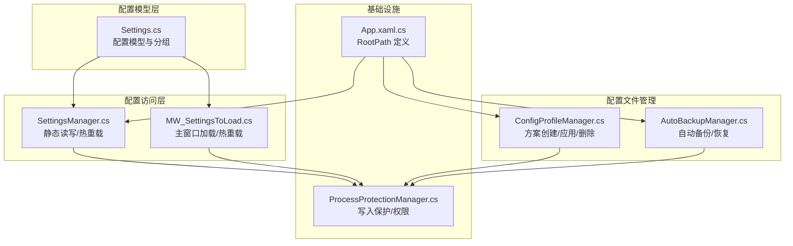
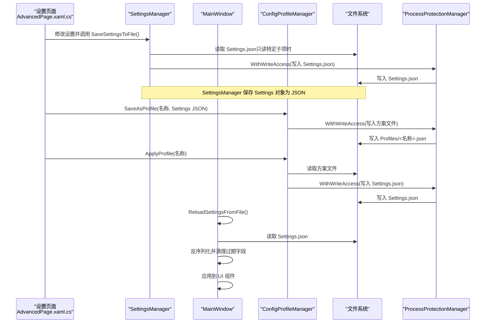
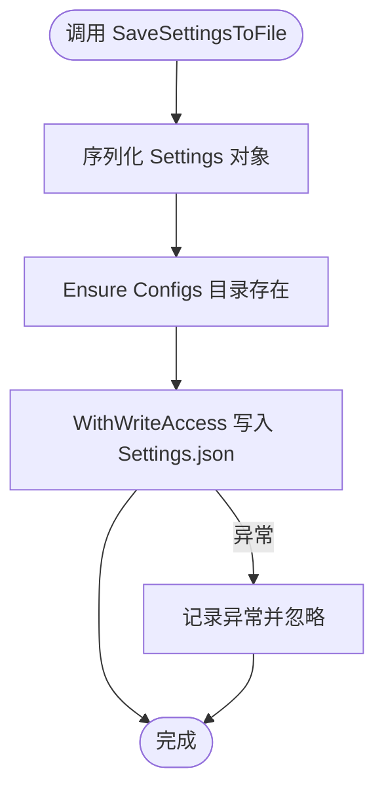
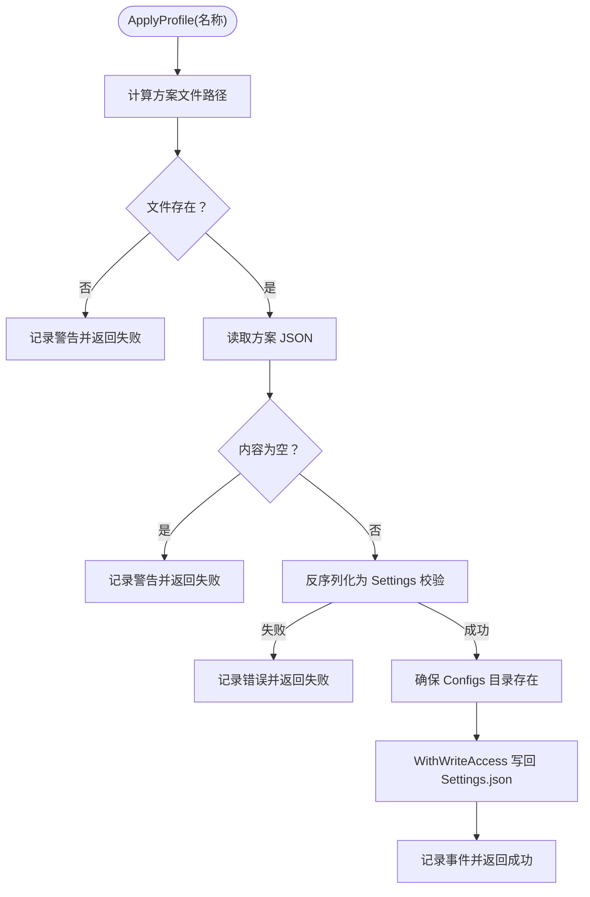
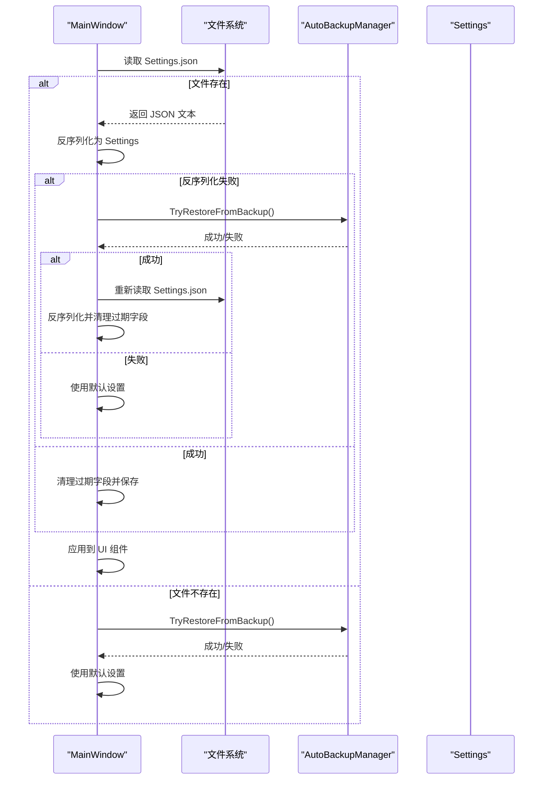
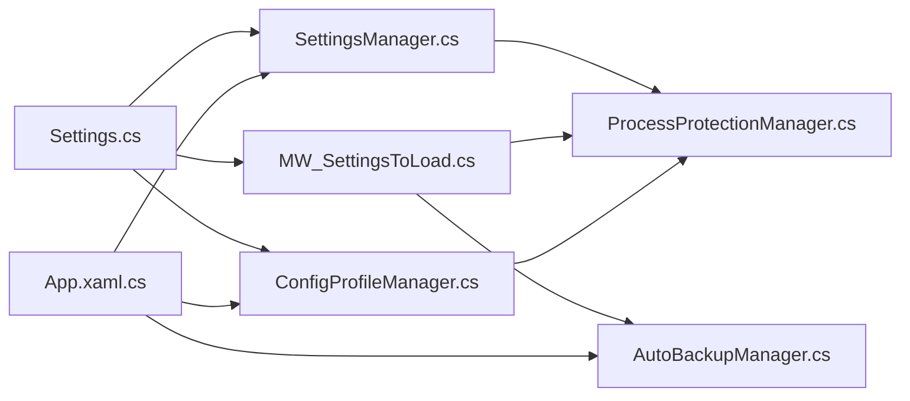
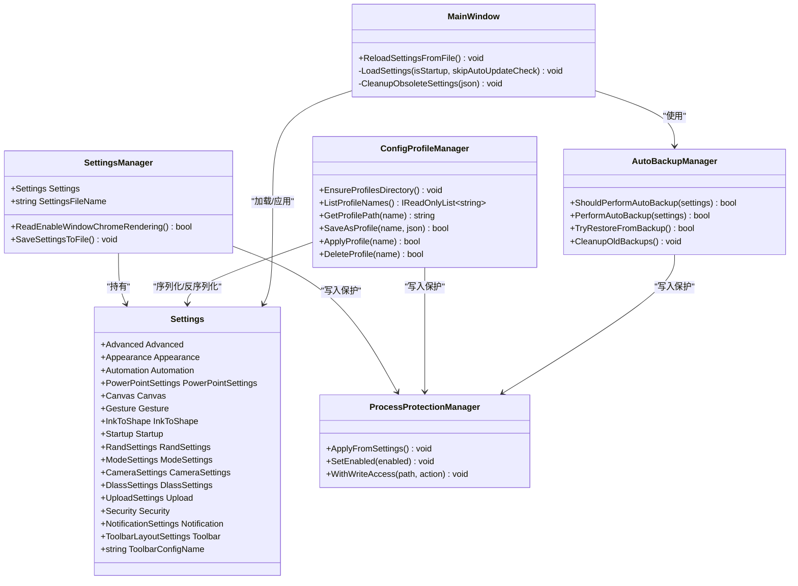

# 配置 API

## 简介
本文件系统化梳理 Ink Canvas 的配置 API，围绕 SettingsManager 与 ConfigProfileManager 的配置管理能力，完整覆盖以下主题：
- 配置项读取、写入、验证与持久化机制
- 配置文件结构规范（JSON Schema、字段约束、默认值）
- 配置文件管理（创建、复制、导入、导出）
- 配置分类（用户偏好、系统配置、临时状态）
- 配置验证规则与错误处理
- 完整使用示例（读取、更新、监听变更）
- 版本兼容与迁移策略
- 性能优化建议（懒加载、缓存、批量更新）

## 项目结构
配置相关的核心代码分布如下：
- 配置模型与分组：Resources/Settings.cs
- 配置读写与热重载：Windows/SettingsViews/helpers/SettingsManager.cs、MainWindow_cs/MW_SettingsToLoad.cs
- 配置文件管理（方案）：Helpers/ConfigProfileManager.cs
- 备份与恢复：Helpers/AutoBackupManager.cs
- 文件权限与写入保护：Helpers/ProcessProtectionManager.cs
- 应用入口与根路径：App.xaml.cs

## 核心组件
- SettingsManager：提供全局静态配置实例与持久化写入，支持从磁盘读取特定子项（如窗口渲染开关）与整体序列化保存。
- ConfigProfileManager：提供配置方案的创建、应用、删除与列举，支持将当前 Settings JSON 保存为独立方案文件，并可将方案内容写回主配置文件以触发热重载。
- Settings：配置模型，按功能域分组（如 startup、appearance、canvas、automation 等），每个分组包含若干字段及默认值。
- MainWindow.Settings 加载与热重载：负责从磁盘反序列化 Settings，进行过期字段清理与备份恢复兜底，最终将配置应用到 UI。
- AutoBackupManager：自动备份与恢复，保障配置文件损坏时的恢复能力。
- ProcessProtectionManager：写入保护与权限控制，确保在受保护模式下安全地进行文件/目录写入。

## 架构总览
配置 API 的典型工作流：
- 读取：SettingsManager 从磁盘读取 Settings.json 或读取特定子项；MainWindow 通过 LoadSettings 反序列化并应用。
- 写入：SettingsManager.SaveSettingsToFile 将 Settings 全量序列化并落盘；ConfigProfileManager.SaveAsProfile 将当前 Settings JSON 保存为方案文件。
- 应用：ConfigProfileManager.ApplyProfile 将方案内容写回 Settings.json，随后 MainWindow.ReloadSettingsFromFile 触发热重载。
- 验证与兜底：MainWindow 在加载失败时尝试从备份恢复，若仍失败则使用默认设置；CleanupObsoleteSettings 清理过期字段并保存。
- 安全写入：所有写入均通过 ProcessProtectionManager.WithWriteAccess 包裹，必要时临时释放锁以避免死锁。

## 详细组件分析

### SettingsManager 组件
- 职责
  - 提供全局 Settings 实例与文件名常量
  - 读取特定子项（如窗口渲染开关）
  - 将 Settings 全量序列化并写入磁盘
- 关键行为
  - 读取特定子项：解析 JSON 并返回布尔值，失败时回退到内存默认值
  - 写入：序列化 Settings，确保 Configs 目录存在，使用写入保护执行写入
- 错误处理
  - 异常捕获并记录，失败时不中断流程
- 使用场景
  - 快速读取单个开关项
  - 批量保存设置

### ConfigProfileManager 组件
- 职责
  - 确保 Profiles 目录存在
  - 列举方案名称（去扩展名，排序）
  - 保存为方案（将 Settings JSON 写入 Profiles/<名称>.json）
  - 应用方案（将方案内容写回 Settings.json，触发热重载）
  - 删除方案
- 关键行为
  - 名称安全化：去除非法字符，空名映射为默认名
  - 校验：应用方案前反序列化为 Settings 校验有效性
  - 写入保护：所有文件操作通过 WithWriteAccess 执行
- 使用场景
  - 用户保存当前配置为方案
  - 在多个预设之间切换
  - 导入/导出配置文件

### Settings 模型与 JSON 结构
- 分组与字段
  - advanced、appearance、automation、powerPointSettings、canvas、gesture、inkToShape、startup、randSettings、modeSettings、camera、dlass、upload、security、notification、toolbar 等
- 默认值
  - 每个字段在类构造函数中提供默认值，确保反序列化后具备合理初始状态
- 字段约束
  - 数值范围约束（如滑块范围、时间阈值）
  - 枚举类型（如 UpdateChannel、TelemetryUploadLevel）
  - 列表与嵌套对象（如自定义图标列表、通知时长等）
- JSON 映射
  - 使用 JsonProperty 标注字段名，确保与 Settings.json 的键一致

### MainWindow 配置加载与热重载
- 加载流程
  - 读取 Settings.json，反序列化为 Settings
  - 若失败，尝试从备份恢复；仍失败则使用默认设置
  - 清理过期字段并保存
  - 将配置应用到 UI（外观、画布、手势、PPT、自动化等）
- 热重载
  - ReloadSettingsFromFile 跳过自动更新检查，仅应用配置到界面

### 配置验证与错误处理
- 配置验证
  - 应用方案前反序列化为 Settings 校验有效性
  - CleanupObsoleteSettings 递归对比默认配置与用户配置，删除多余键
- 错误处理
  - 读取/写入异常捕获并记录日志
  - 备份恢复失败时回退到默认设置
  - 写入保护超时降级为直接执行写入

### 配置示例与使用方式
- 读取配置值
  - 通过 SettingsManager.Settings 直接访问分组与字段
  - 通过 SettingsManager.ReadEnableWindowChromeRendering 读取特定子项
- 更新设置项
  - 修改 SettingsManager.Settings 对应字段
  - 调用 SettingsManager.SaveSettingsToFile 持久化
- 监听配置变化
  - 在设置页面中绑定 UI 控件与 Settings 字段
  - 修改后立即保存并触发热重载（如 AdvancedPage 中的事件处理）

### 配置分类说明
- 用户偏好设置
  - appearance（外观）、gesture（手势）、randSettings（随机抽号）、toolbar（工具栏布局）
- 系统配置
  - startup（启动）、advanced（高级）、security（安全）、upload（上传）、dlass（第三方集成）
- 临时状态数据
  - canvas（画布状态相关）、notification（通知状态）、modeSettings（模式设置）

### 版本兼容与迁移策略
- 过期字段清理
  - CleanupObsoleteSettings 递归比较默认配置与用户配置，删除多余键并保存
- 备份恢复
  - AutoBackupManager 自动备份与恢复，防止配置损坏导致应用不可用
- 回退策略
  - 加载失败时使用默认设置，确保应用可用性

## 依赖关系分析
- 组件耦合
  - SettingsManager 依赖 Settings 模型与 App.RootPath
  - MainWindow 依赖 SettingsManager 与 AutoBackupManager
  - ConfigProfileManager 依赖 Settings 模型与 ProcessProtectionManager
  - ProcessProtectionManager 为所有写入提供统一保护
- 外部依赖
  - Newtonsoft.Json 用于序列化/反序列化
  - Windows 文件系统 API 用于目录与文件操作

## 性能考量
- 懒加载
  - 仅在需要时读取 Settings.json，避免频繁 IO
- 缓存策略
  - SettingsManager.Settings 作为内存缓存，减少重复反序列化
- 批量更新
  - UI 修改后一次性保存，避免多次写入
- 写入保护
  - 使用 WithWriteAccess 统一写入，必要时临时释放锁以避免死锁

## 故障排查指南
- 配置文件读取失败
  - 检查文件是否存在与权限
  - 查看日志中 AutoBackupManager 的恢复记录
- 配置文件损坏
  - 使用 AutoBackupManager.TryRestoreFromBackup 恢复
  - 如无备份，应用将回退到默认设置
- 写入失败
  - 检查 ProcessProtectionManager 状态与写入保护超时日志
  - 确认目录与文件权限

## 结论
本配置 API 通过 SettingsManager 与 ConfigProfileManager 提供了完善的配置读写、验证与持久化能力，并结合 MainWindow 的热重载与 AutoBackupManager 的备份恢复机制，确保配置变更的安全与稳定。通过合理的分组、默认值与字段约束，配合写入保护与错误兜底，满足复杂场景下的配置管理需求。

## 附录
- 配置文件路径
  - 主配置：Configs/Settings.json
  - 方案目录：Configs/Profiles/
  - 备份目录：Backups/
- 关键类关系图

图表来源
