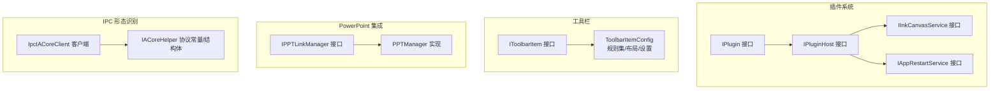
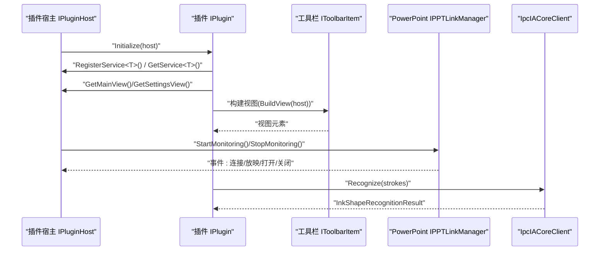
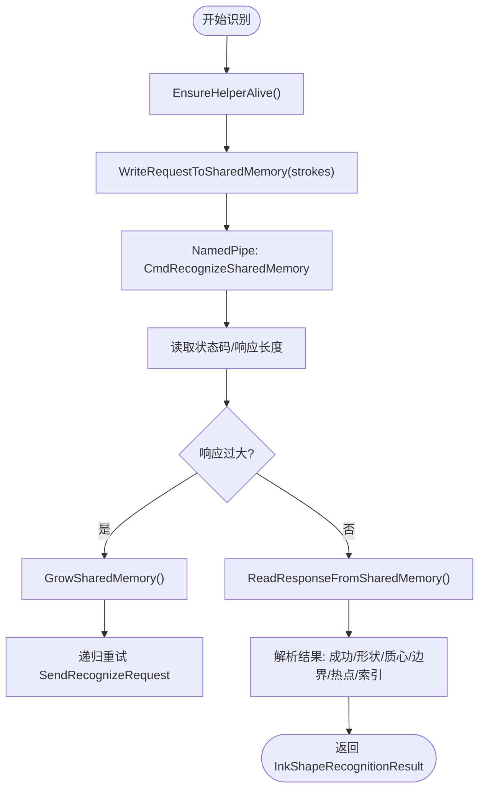
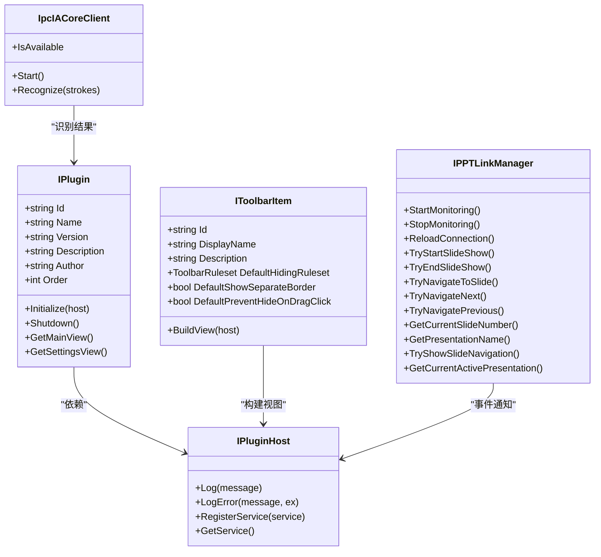

# API 参考文档

## 简介
本文件为 InkCanvasForClass 的 API 参考文档，覆盖以下主题：
- 插件系统 API：IPlugin 接口、插件宿主 IPluginHost、服务注册与生命周期
- 工具栏 API：IToolbarItem 接口与工具栏项配置模型
- PowerPoint 集成 API：IPPTLinkManager 接口与 PPTManager 实现
- IPC 通信协议：IpcIACoreClient 与 IACoreHelper 协议常量及消息格式
- 配置 API：工具栏布局与隐藏规则、组件设置键位
- 使用示例、参数组合与异常处理建议

## 项目结构
围绕“插件”“工具栏”“PowerPoint 集成”“IPC 形态识别”四个维度组织 API。



## 核心组件
- 插件接口 IPlugin：定义插件标识、元数据、初始化与视图导出能力
- 插件宿主 IPluginHost：提供日志、服务注册与获取、插件生命周期管理
- 工具栏接口 IToolbarItem：定义工具栏项的标识、显示名、描述、默认隐藏规则、视图构建
- PowerPoint 集成接口 IPPTLinkManager：统一连接、事件、放映控制与导航
- IPC 形态识别客户端 IpcIACoreClient：通过命名管道与共享内存进行识别请求/响应

## 架构总览
下图展示插件、工具栏、PowerPoint 集成与 IPC 的交互关系。



## 详细组件分析

### 插件 API（IPlugin 与 IPluginHost）
- IPlugin
  - 关键属性：标识 Id、名称 Name、版本 Version、描述 Description、作者 Author、排序 Order
  - 关键方法：Initialize(host)、Shutdown()、GetMainView()、GetSettingsView()
  - 用途：声明插件元信息与生命周期钩子，导出主视图与设置视图
- IPluginHost
  - 日志：Log(message)、LogError(message, ex=null)
  - 服务：RegisterService&lt;T&gt;(service)、GetService&lt;T&gt;()
  - 作用：为插件提供运行时上下文与服务容器

使用示例（步骤说明）
- 初始化：插件在 Initialize(host) 中通过 host.RegisterService 注册自定义服务，随后通过 host.GetService 获取宿主服务
- 生命周期：应用退出时调用 Shutdown，释放资源
- 视图导出：GetMainView 返回主面板控件，GetSettingsView 返回设置面板控件

异常处理建议
- Initialize 中捕获宿主服务注册失败，记录日志并优雅降级
- Shutdown 中避免重复释放与 COM 对象释放异常

### 插件宿主服务 API（IInkCanvasService 与 IAppRestartService）
- IInkCanvasService
  - OpenWhiteboard()：打开画板
  - CloseWhiteboard()：关闭画板
  - OpenWhiteboardAsync(delayMilliseconds=0)：异步打开画板，支持延迟
- IAppRestartService
  - IsRunningAsAdmin：是否以管理员权限运行
  - RestartApp(asAdmin)/RestartWithCurrentPrivileges()
  - RestartAsAdmin()/RestartAsNormal()
  - SwitchToUIATopMostAndRestart()/SwitchToNormalTopMostAndRestart()

使用示例（步骤说明）
- 通过 IPluginHost.GetService&lt;IInkCanvasService&gt;() 获取画板服务，按需调用打开/关闭
- 通过 IAppRestartService 切换权限或重启应用，适用于需要提升权限的场景

异常处理建议
- 异步打开失败时重试或回退到同步打开
- 权限切换失败时提示用户并记录错误

### 工具栏 API（IToolbarItem 与 ToolbarItemConfig）
- IToolbarItem
  - 标识与显示：Id、DisplayName、Description
  - 默认行为：DefaultHidingRuleset、DefaultShowSeparateBorder、DefaultPreventHideOnDragClick
  - 视图构建：BuildView(host) 返回 FrameworkElement
- ToolbarItemConfig
  - 规则模型：ToolbarRule、ToolbarRuleGroup、ToolbarRuleset
  - 内置规则：AlwaysShow、AnnotationOnly、PptOnly、PptAnnotationOnly、WithHideOnCollapsed、WithPreventHideOnCollapsed
  - 布局与设置：ToolbarComponentEntry（含 Settings 字典）、ToolbarLayoutSettings
  - 设置键位：min/max/fixed 宽高、字号、图标尺寸、对齐与边距、透明度、样式开关、显示模式等

使用示例（步骤说明）
- 实现 IToolbarItem：在 BuildView 中返回自定义控件，设置 Id 与 DisplayName
- 配置隐藏规则：通过 ToolbarRuleset 构建条件组，结合逻辑模式 Or/And 控制显示
- 布局设置：在 ToolbarComponentEntry.Settings 中写入键值，读取时使用 GetSettingXxx 辅助方法

异常处理建议
- 规则解析失败时回退到 AlwaysShow
- 设置键值类型不匹配时进行安全转换或使用默认值

### PowerPoint 集成 API（IPPTLinkManager 与 PPTManager）
- IPPTLinkManager
  - 事件：SlideShowBegin/NextSlide/End、PresentationOpen/Close、PPTConnectionChanged、SlideShowStateChanged
  - 属性：IsConnected、IsInSlideShow、IsSupportWPS、SkipAnimationsWhenNavigating、SlidesCount
  - 方法：StartMonitoring()/StopMonitoring()/ReloadConnection()
  - 导航与控制：TryStartSlideShow()/TryEndSlideShow()、TryNavigateToSlide/Next/Previous
  - 查询：GetCurrentSlideNumber()/GetPresentationName()/TryShowSlideNavigation()/GetCurrentActivePresentation()

- PPTManager（实现）
  - 连接管理：定时器轮询、TryConnectToPowerPoint/TryConnectToWPS、ConnectToPPT/DisconnectFromPPT
  - 状态维护：缓存 IsConnected/IsInSlideShow，事件派发
  - COM 对象安全释放：SafeReleaseComObject，避免泄漏
  - WPS 支持：可选启用，进程检测与状态同步

使用示例（步骤说明）
- 订阅事件：在 StartMonitoring 后订阅所需事件，处理放映开始/翻页/结束
- 导航控制：调用 TryNavigateNext/Previous 或 TryNavigateToSlide
- 连接重建：出现异常时调用 ReloadConnection，触发重新连接与事件刷新

异常处理建议
- COM 异常捕获并断开连接，避免悬挂句柄
- 连接失败时回退到空状态并触发 PPTConnectionChanged(false)

```mermaid
sequenceDiagram
participant App as "应用"
participant Link as "IPPTLinkManager"
participant Impl as "PPTManager"
participant PP as "PowerPoint/WPS"
App->>Link : "StartMonitoring()"
Link->>Impl : "启动定时器/连接检查"
Impl->>PP : "TryConnectToPowerPoint()/TryConnectToWPS()"
PP-->>Impl : "返回 Application"
Impl->>Impl : "ConnectToPPT()<br/>注册事件"
Impl-->>Link : "PPTConnectionChanged(true)"
PP-->>Impl : "SlideShowBegin/NextSlide/End"
Impl-->>Link : "派发事件"
App->>Link : "TryNavigateNext()"
Link->>PP : "执行导航"
PP-->>Link : "状态变更"
Link-->>App : "SlideShowStateChanged"
```

### IPC 通信协议（IpcIACoreClient 与 IACoreHelper 协议）
- IpcIACoreClient
  - 单例：Instance，懒加载启动辅助进程 InkCanvas.IACoreHelper.exe
  - 命名管道：PipeNameFormat，客户端连接超时 IpcTimeoutMs
  - 共享内存：SharedMemoryNameFormat，头部固定大小，魔数、版本、长度、状态
  - 请求流程：EnsureHelperAlive -> WriteRequestToSharedMemory -> NamedPipe 发送命令 -> 读取响应
  - 错误处理：响应过大自动扩容，异常时 KillHelper 并释放共享内存

- IACoreHelper 协议常量与结构
  - 常量：Pipe 名、共享内存名、协议版本、超时、魔数、命令码、状态码
  - 结构体：StylusPointDto、StrokeDto、RecognizeRequest、RecognizeResponse

消息格式（共享内存 + 命名管道）
- 请求头（共享内存前 24 字节）：魔数、版本、请求长度、响应偏移、响应长度、状态
- 请求体（共享内存）：Stroke 数量 + 每个笔画的点数量 + X/Y/Pressure 浮点序列
- 命名管道命令：CmdRecognizeSharedMemory（0x02），随后读取状态码与响应长度
- 响应体（共享内存）：Success、ShapeName、质心、宽高、热点点集、选中笔画索引数组



## 依赖关系分析
- 插件依赖 IPluginHost 提供的服务与日志能力
- 工具栏项依赖 IToolbarHost（接口位于 ToolbarHost.cs）构建视图
- PowerPoint 集成通过 IPPTLinkManager 抽象，PPTManager 提供具体实现
- IPC 识别由 IpcIACoreClient 与 IACoreHelper 协议配合完成



## 性能考量
- IPC 识别
  - 共享内存容量按需扩容，避免频繁分配
  - 请求/响应采用二进制流，减少序列化开销
  - 超时控制与异常恢复，防止阻塞
- PowerPoint 集成
  - 定时器分层检查（连接/放映/WPS），降低 CPU 占用
  - COM 对象及时释放，避免句柄泄漏
- 工具栏配置
  - 规则集与布局采用 JSON 序列化，建议缓存解析结果

## 故障排查指南
- 插件无法加载
  - 检查 IPluginHost.GetService 是否返回预期服务
  - 确认 Initialize/Shutdown 调用顺序正确
- IPC 识别失败
  - 确认辅助进程可执行文件存在，Start() 返回 true
  - 捕获异常后 KillHelper 并释放共享内存，等待自动重启
- PowerPoint 无响应
  - 捕获 COM 异常并断开连接，触发 PPTConnectionChanged(false)
  - 使用 ReloadConnection 重建连接
- 工具栏项不显示
  - 校验 ToolbarRuleset 逻辑与条件，必要时回退到 AlwaysShow

## 结论
本文档系统性梳理了 InkCanvasForClass 的插件、工具栏、PowerPoint 集成与 IPC 形态识别 API，提供了接口定义、使用示例与异常处理建议。开发者可据此快速集成插件、定制工具栏、接入 PowerPoint 并利用 IPC 进行高效形态识别。

## 附录
- 配置 API 参考（工具栏）
  - 隐藏规则：AlwaysShow、AnnotationOnly、PptOnly、PptAnnotationOnly、WithHideOnCollapsed、WithPreventHideOnCollapsed
  - 布局设置键位：minWidth/maxWidth/fixedWidth、minHeight/maxHeight/fixedHeight、fontSize、iconSize、HorizontalAlignment、VerticalAlignment、marginLeft/top/right/bottom、paddingLeft/top/right/bottom、opacity、useRedStyle、displayMode
  - 组件设置读取：GetSettingDouble/GetSettingString/GetSettingBool/SetSetting

章节来源
