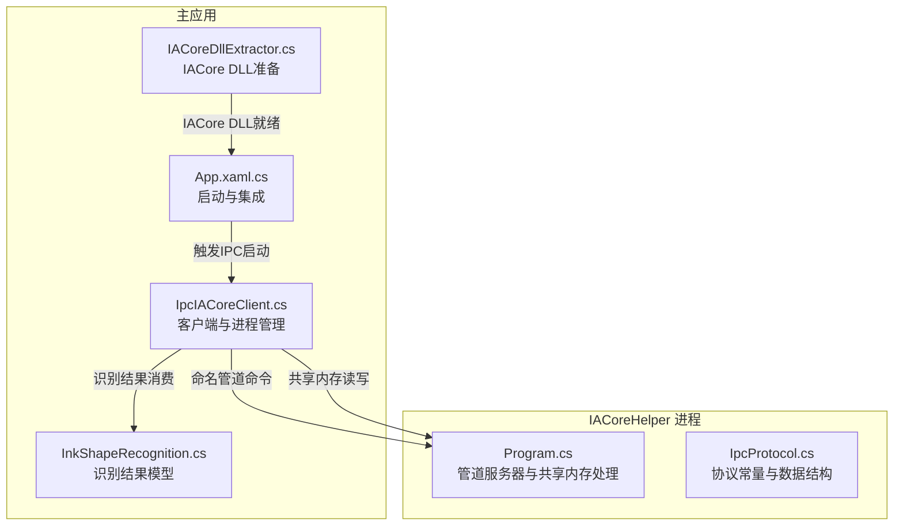
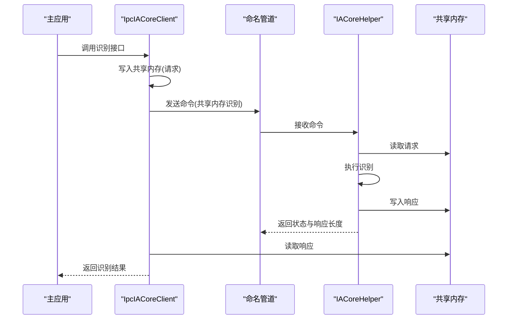
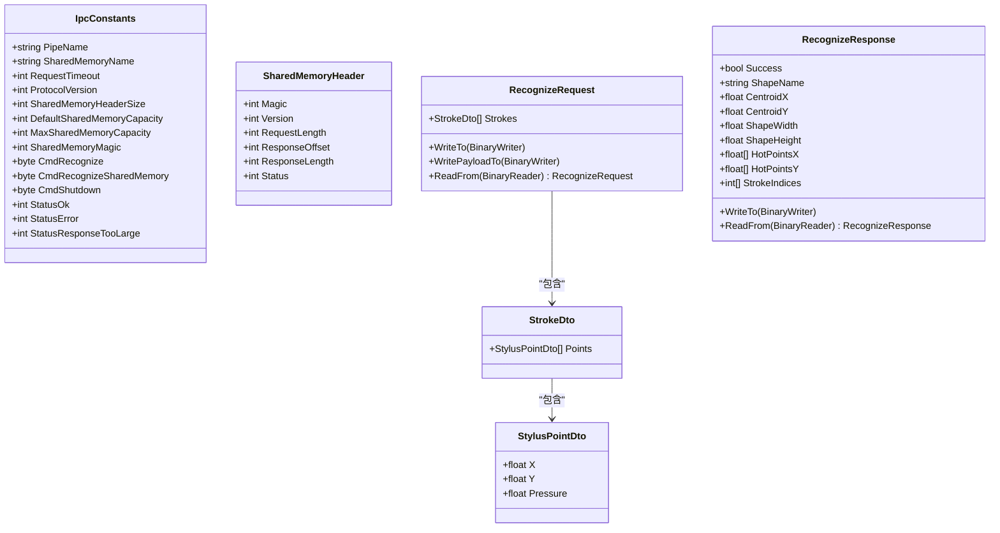
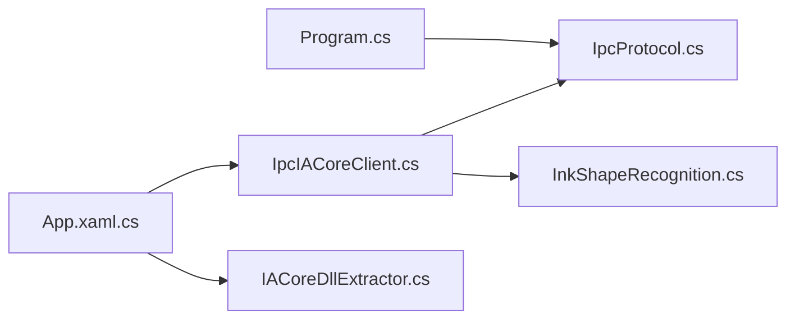

# IPC 通信 API

## 简介
本文件系统化梳理了 InkCanvas 项目中的 IPC 通信 API，重点覆盖 IACore 辅助程序的通信协议规范、消息格式与数据类型编码、协议版本管理、消息处理机制、客户端实现与错误重连策略、安全机制说明、通信示例、性能与并发控制、以及故障排除指南。目标是帮助开发者快速理解并正确使用 IPC 通道完成手写笔迹形状识别的跨进程通信。

## 项目结构
IPC 通信涉及三个关键位置：
- 客户端侧：位于主应用的 Helpers 目录，负责启动辅助进程、命名管道通信、共享内存读写与结果解析。
- 协议与数据模型：位于 IACoreHelper 工程，定义常量、共享内存头布局、请求/响应数据结构与序列化/反序列化。
- 辅助进程：独立可执行程序，监听命名管道命令，处理识别请求，并通过共享内存回传结果。

## 核心组件
- IpcProtocol：定义协议常量、共享内存头字段偏移、请求/响应数据结构及二进制编解码。
- Program：IACoreHelper 主程序，作为管道服务器与共享内存写入者，处理识别请求并回写结果。
- IpcIACoreClient：主应用侧客户端，负责进程生命周期、命名管道通信、共享内存读写与结果解析。
- InkShapeRecognitionResult：统一的识别结果抽象，供上层消费。
- IACoreDllExtractor 与 App：负责 IACore DLL 准备与 IPC 启动时机。

## 架构总览
IPC 采用“命名管道 + 共享内存”的混合方式：
- 命名管道用于轻量命令与状态交换（如触发共享内存识别、关闭指令）。
- 共享内存用于大体量数据（笔迹点集）的高效传递与结果回传，配合固定大小的共享内存头描述请求/响应边界与状态。

## 详细组件分析

### IpcProtocol 协议规范
- 协议常量
  - 管道名称模板与共享内存名称模板
  - 请求超时、协议版本、共享内存头大小、默认/最大容量、魔数
  - 命令码：识别、共享内存识别、关闭
  - 状态码：成功、错误、响应过大
- 共享内存头字段偏移
  - 魔数、版本、请求长度、响应偏移、响应长度、状态
- 数据结构
  - StylusPointDto：单点坐标与压力
  - StrokeDto：一组点
  - RecognizeRequest：笔迹集合（数组）
  - RecognizeResponse：识别结果（布尔、形状名、质心、尺寸、热点点集、参与笔迹索引）

## 依赖关系分析
- IpcIACoreClient 依赖 IpcProtocol 的常量与数据结构定义，用于构建请求与解析响应。
- IpcProtocol 与 Program 共同定义共享内存头布局与读写协议，二者必须保持一致。
- App 与 IACoreDllExtractor 负责 IPC 启动前置条件（DLL 就绪与进程可用）。

## 性能考量
- 消息队列与并发
  - 当前实现为单连接单请求模型，客户端通过锁保证并发安全，避免多线程同时写共享内存造成竞争。
- 缓冲区管理
  - 共享内存容量按需指数增长，避免频繁扩容；默认容量与最大容量限制防止过度占用。
  - 请求长度预估采用精确计算，预留最小响应空间，减少二次扩容概率。
- I/O 与序列化
  - 使用二进制读写器进行紧凑编码，减少序列化开销；共享内存头仅包含必要字段，降低同步成本。
- 超时与健壮性
  - 命名管道连接与探测均设置超时，提升启动鲁棒性；异常捕获与资源释放确保进程稳定。

## 故障排除指南
- 连接问题
  - 管道不可用：检查辅助进程是否启动、管道名称是否匹配当前进程 ID；客户端提供探测与等待逻辑。
  - 进程提前退出：注册退出事件并释放共享内存，触发自动重试。
- 消息丢失与响应过大
  - 若服务端返回“响应过大”，客户端会自动扩容共享内存并重试；若仍失败，检查请求规模与最大容量限制。
- 通信中断恢复
  - 客户端在异常时会杀死辅助进程并释放共享内存，随后重新启动并重建共享内存。
- DLL 与环境
  - 确保 IACore DLL 已释放到应用目录，否则识别功能不可用；应用启动阶段会尝试提取并记录日志。

## 结论
该 IPC 通信方案通过“命名管道 + 共享内存”实现了高吞吐、低拷贝的手写识别数据传输。协议与实现严格分离，客户端与服务端职责清晰，具备良好的扩展性与稳定性。建议在生产环境中持续监控共享内存扩容频率与管道连接成功率，以进一步优化性能与可靠性。

## 附录

### 通信示例（步骤说明）
- 建立连接
  - 确认 IACore DLL 就绪，应用启动时自动提取
  - 客户端启动辅助进程并等待命名管道可用
- 发送与接收消息
  - 客户端将笔迹数据写入共享内存，发送共享内存识别命令
  - 服务端读取请求并执行识别，写入响应到共享内存尾部
  - 客户端读取响应并解析为统一结果模型
- 异步与双向通信
  - 当前实现为同步调用；如需异步，可在上层封装异步接口并在客户端内部维持独立的共享内存代号与锁
- 错误处理
  - 捕获异常并重试；若多次失败，记录日志并提示用户