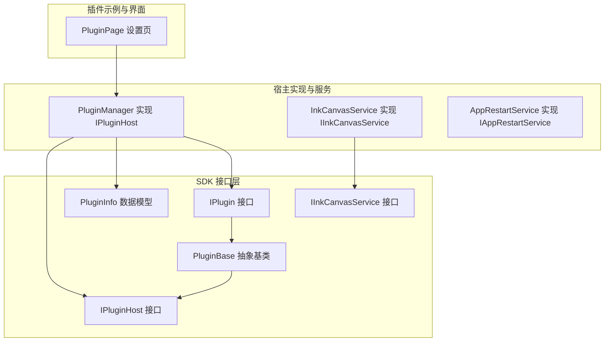
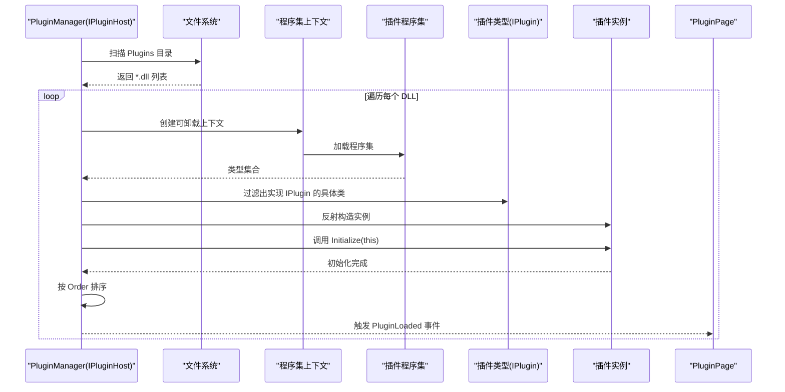
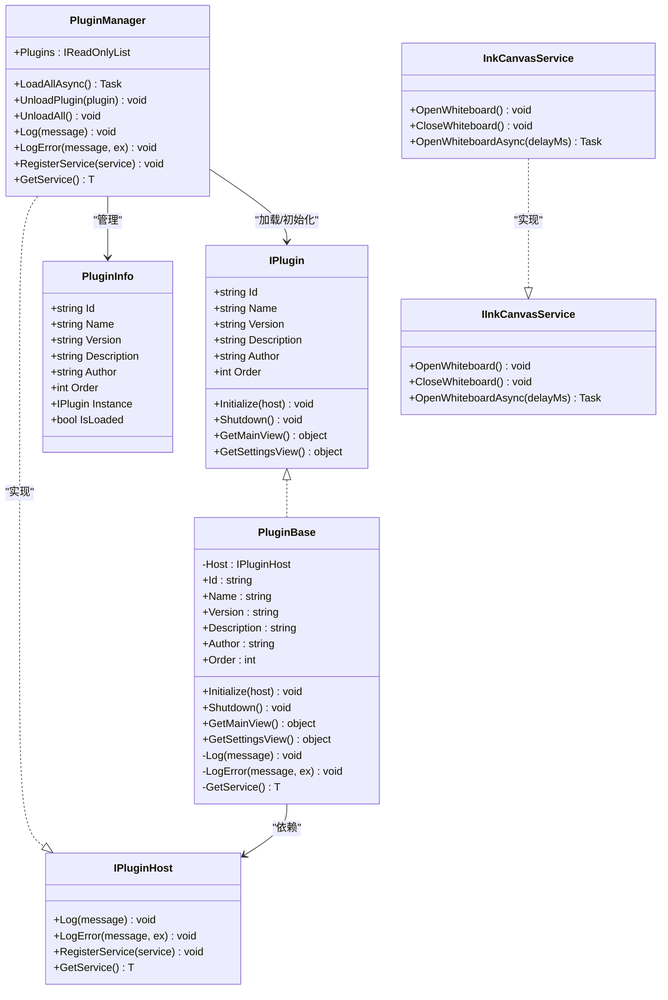
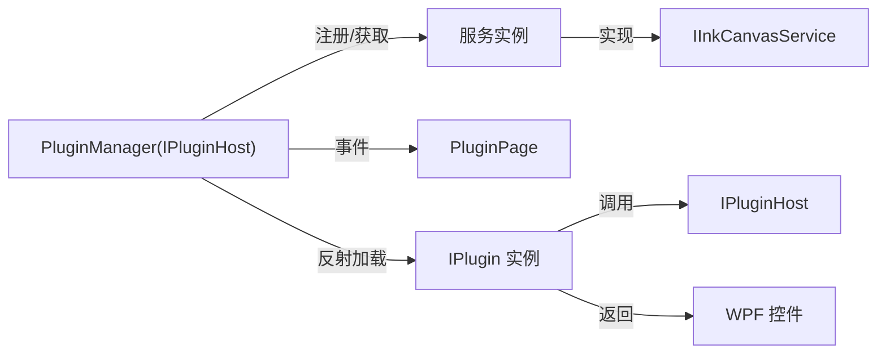

# 插件 API

## 简介
本文件系统性地记录 Ink Canvas 插件 API 的设计与使用方式，覆盖 IPlugin 接口、IPluginHost 宿主接口、PluginBase 基类、插件生命周期、加载与卸载流程、服务注册与发现、以及插件配置与错误处理等。目标是帮助开发者快速理解并正确实现一个可运行的插件。

## 项目结构
插件 API 位于独立的 SDK 工程中，插件管理器与具体插件实现位于 Ink Canvas 主工程的 Plugins 目录下，并通过设置页面进行展示与管理。

## 核心组件
- IPlugin：定义插件的标识信息与生命周期方法，包括 Initialize、Shutdown、GetMainView、GetSettingsView。
- IPluginHost：定义宿主向插件暴露的能力，如日志、异常日志、服务注册与获取。
- PluginBase：提供 IPlugin 的默认实现骨架（空实现），并封装对宿主能力的访问与转发。
- PluginInfo：承载已加载插件的元数据与实例状态。
- PluginManager：插件加载器与宿主实现，负责扫描目录、反射加载、排序、初始化、卸载与事件发布。
- IInkCanvasService：面向画板的宿主服务接口，供插件调用以控制 UI 模式切换。
- InkCanvasService：IInkCanvasService 的具体实现，桥接插件调用与主窗口操作。
- AppRestartService：应用重启相关服务（由宿主注册为服务）。
- PluginPage：设置页中展示已加载插件列表的 UI。

## 架构总览
插件系统采用“接口定义 + 宿主实现 + 反射加载 + 生命周期管理”的架构。插件通过 IPlugin 暴露自身元数据与行为；宿主通过 PluginManager 提供统一的加载、初始化、服务注册与日志能力；插件通过 IPluginHost 访问宿主服务或自定义服务；最终在设置页中呈现已加载插件信息。

## 详细组件分析

### IPlugin 接口与字段语义
- 字段与职责
  - Id：插件唯一标识，用于去重、卸载定位与日志输出。
  - Name：插件显示名称，用于 UI 展示与用户识别。
  - Version：插件版本号，便于追踪与兼容性判断。
  - Description：简要描述，用于 UI 说明。
  - Author：作者信息，便于溯源与支持。
  - Order：加载顺序权重，数值越小越先加载；用于表达依赖顺序。
- 生命周期方法
  - Initialize(host)：宿主传入 IPluginHost，执行一次性初始化逻辑（注册服务、订阅事件、读取配置等）。
  - Shutdown()：释放资源、取消订阅、关闭句柄等清理工作。
  - GetMainView()：返回插件主视图对象（通常为 WPF 控件），用于嵌入到主界面。
  - GetSettingsView()：返回插件设置视图对象，用于嵌入设置页。

### IPluginHost 接口能力
- 日志能力
  - Log(message)：输出普通日志。
  - LogError(message, ex)：输出错误日志，可选携带异常。
- 服务管理
  - RegisterService&lt;T&gt;(service)：注册一个服务实例，供插件通过 GetService&lt;T&gt;() 获取。
  - GetService&lt;T&gt;()：从宿主获取已注册的服务实例，泛型约束保证非空引用。

### PluginBase 基类
- 继承要求
  - 必须实现 IPlugin 的所有抽象字段与方法。
- 默认行为
  - Initialize(host)：保存宿主引用，默认不执行其他逻辑。
  - Shutdown()：默认空实现。
  - GetMainView()/GetSettingsView()：默认返回 null。
- 辅助方法
  - Log(message)/LogError(message, ex)：委托给宿主输出日志。
  - GetService&lt;T&gt;()：委托给宿主获取服务。
- 使用建议
  - 在 Initialize 中注册服务或订阅事件。
  - 在 Shutdown 中释放资源与取消订阅。
  - 如需 UI，重写 GetMainView/GetSettingsView 并返回 WPF 控件。

### PluginManager（宿主实现）
- 职责
  - 扫描 Plugins 目录下的 *.dll 文件，按层级遍历子目录。
  - 使用可卸载的 AssemblyLoadContext 动态加载程序集。
  - 反射筛选实现 IPlugin 的具体类，构造实例并调用 Initialize(this)。
  - 按 Order 升序排序，触发 PluginLoaded 事件。
  - 支持卸载单个插件（调用 Shutdown，移除记录，卸载上下文）与全部卸载。
  - 提供日志与错误日志输出，以及服务注册与获取。
- 关键事件
  - PluginLoaded：插件加载成功时触发。
  - PluginUnloaded：插件卸载时触发。
  - LogMessage：日志输出事件，供 UI 或外部监听。

### 插件视图与设置页
- PluginPage：展示已加载插件的名称、版本、描述与作者信息，统计数量并处理加载异常消息。
- 插件视图返回值规范
  - GetMainView()/GetSettingsView() 应返回 WPF 控件对象，以便宿主将其加入到合适的容器中。

### 服务接口与实现
- IInkCanvasService：提供打开/关闭白板（同步与异步）的能力。
- InkCanvasService：基于 MainWindow 的 Dispatcher 将 UI 操作切换到 UI 线程，确保线程安全。
- AppRestartService：提供应用重启与权限切换的辅助能力（作为示例服务注册到宿主）。

### 类关系图（代码级）

## 依赖关系分析
- 插件到宿主：插件通过 IPluginHost 访问日志与服务；插件实例由 PluginManager 反射加载并注入宿主。
- 服务到插件：插件通过 GetService&lt;T&gt;() 获取宿主注册的服务（例如 IInkCanvasService）。
- UI 到插件：PluginPage 仅展示已加载插件信息，不直接与插件交互；插件视图由插件自行提供并交由宿主渲染。

## 性能考虑
- 程序集加载与卸载
  - 使用可卸载的 AssemblyLoadContext，便于在卸载时回收内存与资源。
- I/O 与扫描
  - 递归扫描 Plugins 目录可能带来 I/O 开销，建议将插件分目录组织并限制层级深度。
- UI 线程调度
  - 对 UI 操作应通过 Dispatcher.Invoke 或异步方法，避免跨线程异常。
- 排序与事件
  - 按 Order 排序与事件派发应在主线程或确保线程安全的上下文中进行。

## 故障排查指南
- 插件未加载
  - 检查 Plugins 目录是否存在且包含 *.dll；确认插件类型实现 IPlugin 且非抽象。
  - 查看宿主日志与错误日志，定位加载失败原因。
- 初始化失败
  - 捕获 Initialize 中的异常，确保在失败时清理已分配资源并记录错误。
- 卸载失败
  - 确保 Shutdown 正确释放资源；若卸载后仍出现内存占用，检查是否仍有外部引用。
- UI 不更新
  - 确认 PluginPage 的加载逻辑与事件订阅；检查 PluginLoaded/PluginUnloaded 是否被触发。
- 服务不可用
  - 确认服务已在宿主中注册；插件端通过 GetService&lt;T&gt;() 获取时注意空值判断。

## 结论
该插件 API 通过清晰的接口与宿主实现，提供了稳定的加载、初始化、服务化与卸载机制。开发者只需实现 IPlugin 并遵循生命周期约定，即可与宿主无缝协作。建议在实际开发中重视日志、错误处理与服务注册，确保插件的健壮性与可维护性。

## 附录

### 插件开发步骤与最佳实践
- 实现 IPlugin
  - 明确 Id、Name、Version、Description、Author、Order 的取值与约束。
  - 在 Initialize 中完成服务注册、事件订阅与配置读取。
  - 在 Shutdown 中释放资源与取消订阅。
  - 若需要 UI，重写 GetMainView/GetSettingsView 返回 WPF 控件。
- 使用 PluginBase
  - 继承 PluginBase，复用日志与服务访问方法，减少样板代码。
- 与宿主通信
  - 通过 IPluginHost.Log/LogError 输出日志。
  - 通过 RegisterService&lt;T&gt;/GetService&lt;T&gt; 管理与获取服务。
- 服务示例
  - 参考 IInkCanvasService 与 InkCanvasService 的实现模式，确保 UI 操作在 UI 线程执行。
- 错误处理
  - 在 Initialize/Shutdown 中捕获异常并记录，必要时回滚状态。
- 配置与展示
  - 插件信息在设置页 PluginPage 中展示，确保字段完整且可读。

### 插件加载顺序与依赖
- 加载顺序
  - PluginManager 会扫描目录并收集所有实现 IPlugin 的类型，随后按 Order 升序排序。
- 依赖关系
  - Order 数值越小优先加载；插件内部可通过服务依赖实现功能耦合。
- 卸载顺序
  - 卸载时先调用 Shutdown，再移除记录并卸载程序集上下文。

### 插件配置文件与验证规则
- 配置文件位置
  - 插件程序集位于宿主应用根目录的 Plugins 子目录中，支持顶层与子目录结构。
- 文件格式
  - 插件必须为 .NET 程序集（.dll），且包含至少一个实现 IPlugin 的具体类。
- 元数据字段
  - Id、Name、Version、Description、Author、Order 必须有效且可读。
- 验证要点
  - 程序集可加载、类型可实例化、实现 IPlugin、Initialize 成功。
  - 卸载时确保 Shutdown 正常执行，避免资源泄漏。

章节来源
