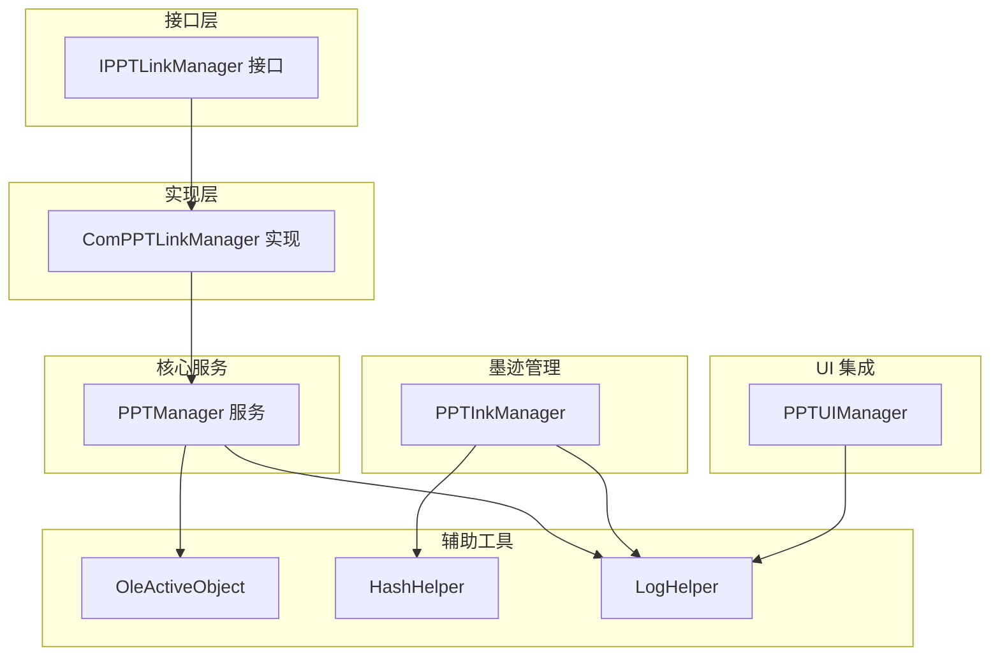
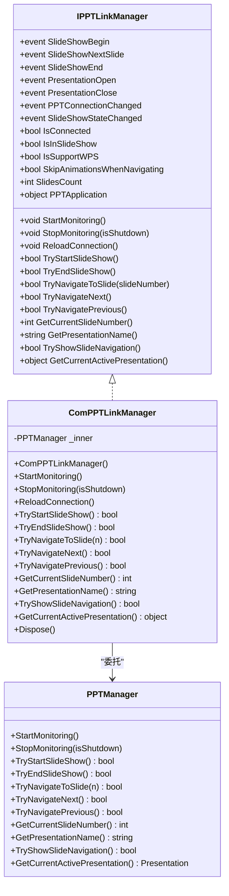
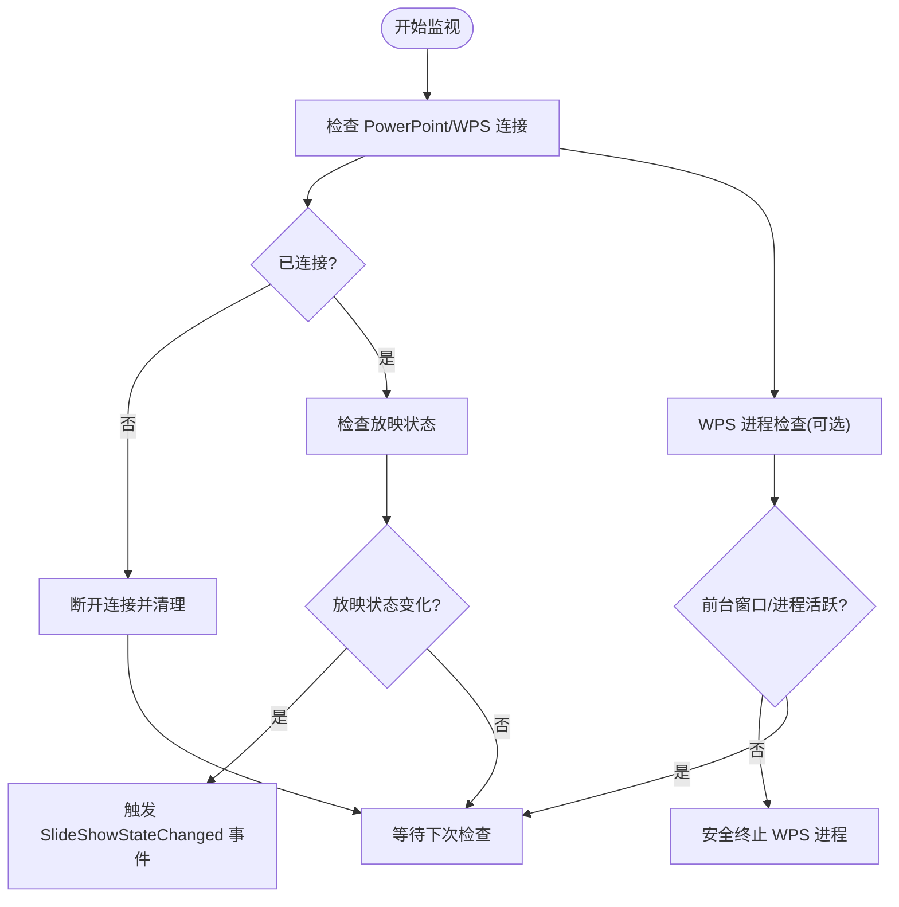
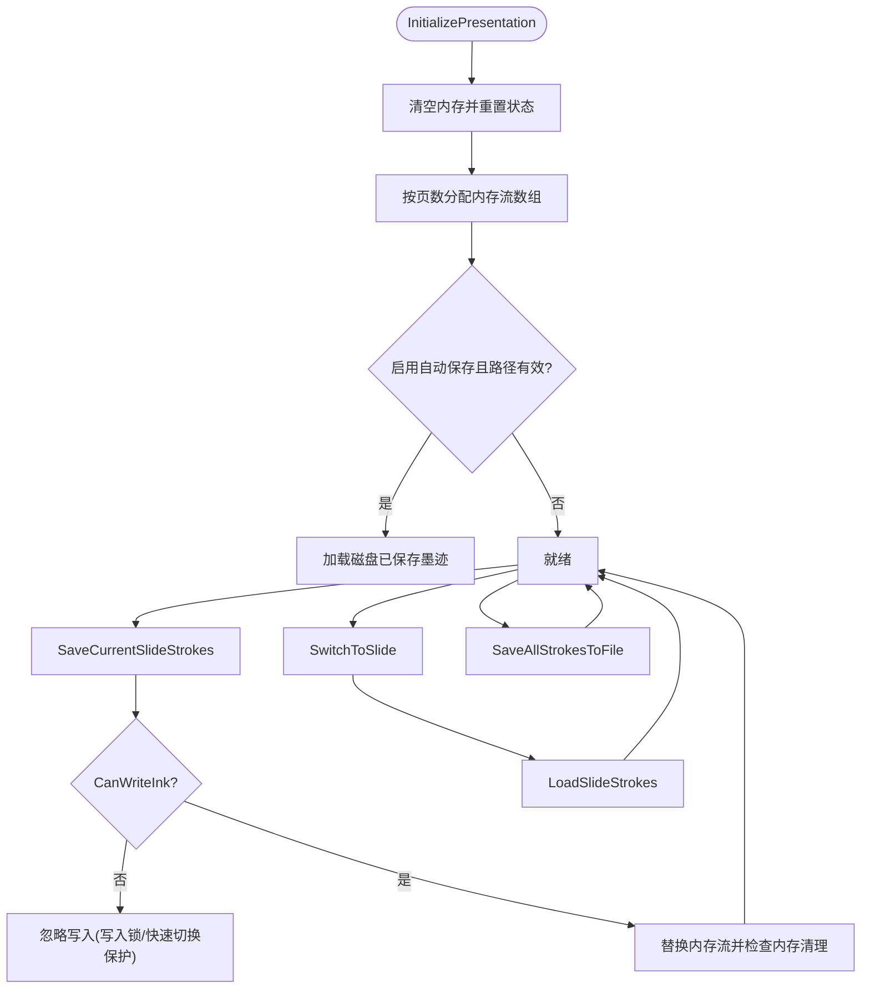
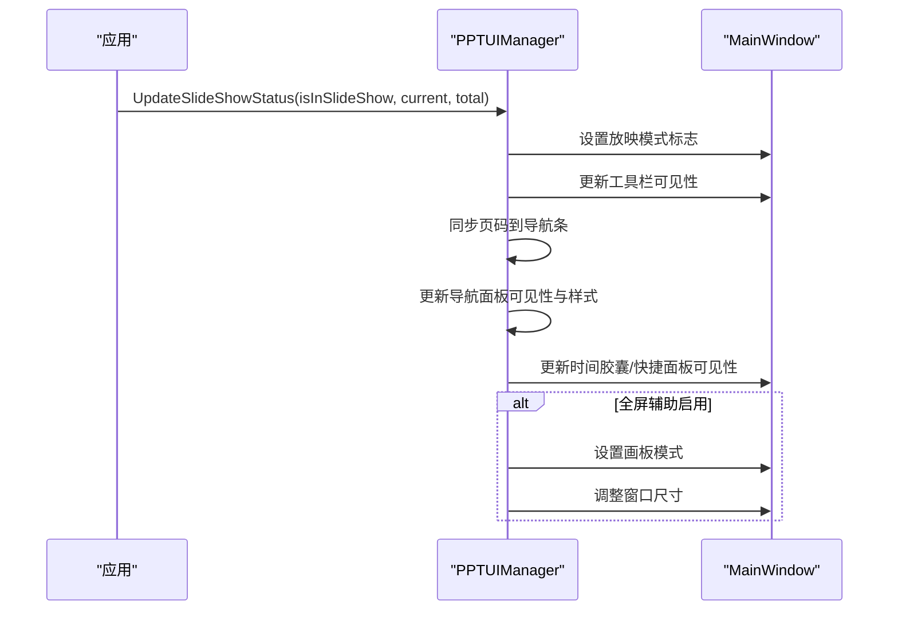
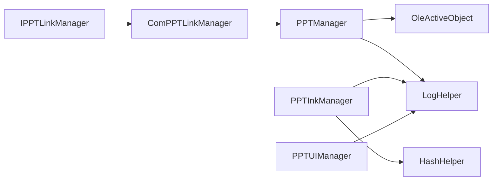

# PowerPoint 集成 API

## 简介
本文件系统化梳理 PowerPoint 集成 API 的设计与实现，围绕以下目标展开：
- IPPTLinkManager 接口：定义 PowerPoint 连接管理、幻灯片导航控制与墨迹同步接口契约。
- PPTInkManager：负责按幻灯片维度的墨迹数据接收、转换、持久化与内存管理。
- PPTManager：统一管理 PowerPoint/WPS 的连接、事件监听、放映状态跟踪与进程管理。
- PPTUIManager：负责与 UI 主窗口的集成，动态更新按钮、导航面板与全屏模式。
- COM 封装：通过 ComPPTLinkManager 实现 IPPTLinkManager 的具体 COM 实现。

文档提供方法规范、数据流、错误处理策略、断连恢复机制与性能优化建议，并给出端到端集成示例步骤。

## 项目结构
本集成模块位于 Ink Canvas\Helpers 目录，采用“接口 + 实现 + 辅助工具”的分层组织方式：
- 接口层：IPPTLinkManager 定义对外契约。
- 实现层：ComPPTLinkManager 适配 PPTManager，提供 COM 化的事件与方法。
- 核心服务：PPTManager 提供连接、事件、放映控制、WPS 进程管理。
- 墨迹管理：PPTInkManager 提供按页墨迹的内存/磁盘存取、自动保存、内存清理。
- UI 集成：PPTUIManager 负责按钮显隐、页码同步、导航面板布局与全屏模式切换。
- 辅助工具：OleActiveObject、HashHelper、LogHelper 提供 COM 对象获取、标识生成与日志能力。



## 核心组件
- IPPTLinkManager：定义连接状态、放映状态、导航控制与查询方法的事件与属性契约。
- ComPPTLinkManager：面向 IPPTLinkManager 的具体实现，桥接 PPTManager 的事件与方法。
- PPTManager：统一管理 PowerPoint/WPS 的连接、事件、放映状态、进程生命周期与 COM 对象释放。
- PPTInkManager：按页维护墨迹集合，提供内存流管理、自动保存/加载、快速切换保护与内存清理。
- PPTUIManager：在放映模式下动态更新按钮、页码与导航面板，支持全屏模式切换与透明度配置。
- 辅助工具：OleActiveObject 提供 .NET Core/5+ 下的 GetActiveObject 等效；HashHelper 生成演示文稿标识；LogHelper 提供线程安全日志。

## 架构总览
PowerPoint 集成采用“事件驱动 + COM 对象桥接 + UI 同步”的架构：
- 事件驱动：PPTManager 注册 PowerPoint/WPS 事件，触发连接、放映、关闭等事件。
- COM 对象桥接：ComPPTLinkManager 将 PPTManager 的事件与方法暴露为 IPPTLinkManager。
- UI 同步：PPTUIManager 在 Dispatcher 上异步更新按钮、页码与面板布局。
- 墨迹同步：PPTInkManager 与 PPTManager 协作，按页保存/加载墨迹，支持自动保存与内存清理。

```mermaid
sequenceDiagram
participant App as "应用"
participant Link as "ComPPTLinkManager"
participant PPT as "PPTManager"
participant UI as "PPTUIManager"
App->>Link : StartMonitoring()
Link->>PPT : StartMonitoring()
PPT->>PPT : 定时器检查连接/放映状态
PPT-->>Link : 触发事件(放映开始/结束/打开/关闭/状态变更)
Link-->>App : 投递事件
App->>UI : UpdateSlideShowStatus(...)
UI->>UI : 更新按钮/页码/面板可见性
```

## 详细组件分析

### IPPTLinkManager 接口规范
- 事件
  - 幻灯片放映：SlideShowBegin、SlideShowNextSlide、SlideShowEnd
  - 演示文稿：PresentationOpen、PresentationClose
  - 连接与状态：PPTConnectionChanged、SlideShowStateChanged
- 属性
  - IsConnected、IsInSlideShow、IsSupportWPS、SkipAnimationsWhenNavigating、SlidesCount、PPTApplication
- 方法
  - 生命周期：StartMonitoring、StopMonitoring、ReloadConnection
  - 放映控制：TryStartSlideShow、TryEndSlideShow
  - 导航控制：TryNavigateToSlide、TryNavigateNext、TryNavigatePrevious
  - 查询：GetCurrentSlideNumber、GetPresentationName、TryShowSlideNavigation、GetCurrentActivePresentation

### ComPPTLinkManager 实现
- 适配器职责：将 PPTManager 的事件与属性映射到 IPPTLinkManager。
- 生命周期：StartMonitoring/StopMonitoring/ReloadConnection 直接委托给 PPTManager。
- 导航与放映：TryStartSlideShow/TryEndSlideShow/TryNavigateToSlide/TryNavigateNext/TryNavigatePrevious 委托实现。
- 查询：GetCurrentSlideNumber/GetPresentationName/TryShowSlideNavigation/GetCurrentActivePresentation 委托实现。



### PPTManager：连接、事件与进程管理
- 连接管理
  - 通过 OleActiveObject 获取 PowerPoint/WPS ActiveObject，注册 PresentationOpen/Close、SlideShowBegin/NextSlide/End 事件。
  - 定时器周期性检查连接与放映状态，支持 WPS 进程检测与安全终止。
- 放映状态跟踪
  - 通过 SlideShowWindows/View 获取当前放映状态，缓存 IsInSlideShow。
- 导航与放映控制
  - TryStartSlideShow/TryEndSlideShow/TryNavigateToSlide/TryNavigateNext/TryNavigatePrevious 基于 COM 对象 View/SlideShowWindows/Sildes 等进行操作。
- 进程管理（WPS）
  - 记录 WPS 进程，多策略检测前台窗口与任务栏窗口，多重验证后安全释放 COM 对象并终止进程。
- COM 对象释放
  - 断连时通过 ReleaseComObject 逐步释放 SlideShowWindow/Presentation/Application，强制 GC 并重启连接检查。



### PPTInkManager：墨迹处理机制
- 数据模型
  - 按页内存流：MemoryStream 数组，索引对应幻灯片编号，容量随演示文稿页数动态调整。
  - CurrentStrokes：当前画布的 StrokeCollection。
  - 自动保存：启用时在 AutoSaveLocation 下按演示文稿 ID 创建目录，保存 .icstk 文件与 Position 文件。
- 关键机制
  - 墨迹写入锁：LockInkForSlide + CanWriteInk，防止翻页时并发写入。
  - 快速切换保护：短时间内重复切换同一页时忽略写入，提升稳定性。
  - 内存清理：总内存超限时清理非当前/最近切换页的内存流，定期清理策略。
  - 自动保存/加载：SaveAllStrokesToFile/LoadSavedStrokes，支持磁盘持久化与恢复。
- 线程安全：所有公开方法使用锁对象，避免并发问题。



### PPTUIManager：界面集成规范
- 连接状态 UI：UpdateConnectionStatus 控制 PowerPoint 控件可见性与放映模式标志。
- 放映状态 UI：UpdateSlideShowStatus 在放映模式下显示导航面板、更新页码、全屏模式切换与动画。
- 导航面板：UpdateNavigationPanelsVisibility 根据显示选项与设置决定面板显隐与动画；UpdateNavigationButtonStyles 应用主题与透明度。
- 页码同步：SetPageNumberOnAllBars 同步左右侧与底部导航条页码，兼容旧绑定控件。
- 浮动栏与边距：SetFloatingBarOpacity/SetMainPanelMargin 支持动态调整 UI 呈现。



### PowerPoint COM 对象封装
- 获取 ActiveObject：OleActiveObject 通过 OLE API 获取 PowerPoint/kwpp 的 COM 对象。
- 事件注册与注销：在 Dispatcher 上注册/注销事件，避免线程上下文问题。
- 安全释放：SafeReleaseComObject 逐级释放 SlideShowWindow/Presentation/Application，配合 GC 与 FinalRelease。

## 依赖关系分析
- 接口与实现
  - IPPTLinkManager 与 ComPPTLinkManager 之间为实现关系；ComPPTLinkManager 依赖 PPTManager。
- 服务与工具
  - PPTManager 依赖 OleActiveObject 获取 COM 对象，依赖 LogHelper 记录日志。
  - PPTInkManager 依赖 HashHelper 生成演示文稿标识，依赖 LogHelper 记录日志。
  - PPTUIManager 依赖 MainWindow 的 Dispatcher 与 UI 组件。
- 外部依赖
  - Microsoft.Office.Interop.PowerPoint 用于 COM 操作。
  - Windows API 用于 WPS 窗口检测与进程管理。



## 性能考虑
- 连接检查频率控制：定时器按不同间隔检查连接/放映/WPS，避免频繁 COM 访问。
- 内存管理：PPTInkManager 限制内存上限并定期清理非活跃页，降低内存峰值。
- 快速切换保护：防止短时间内重复切换导致的写入抖动。
- UI 更新异步化：PPTUIManager 使用 Dispatcher.InvokeAsync，避免阻塞 UI 线程。
- COM 对象释放：断连时逐步释放并强制 GC，减少资源泄漏风险。

## 故障排查指南
- 连接失败
  - 现象：IsConnected 为 false，事件不触发。
  - 排查：确认 PowerPoint/WPS 是否运行，OleActiveObject 是否能获取 COM 对象；查看日志中连接检查异常。
- 放映状态异常
  - 现象：IsInSlideShow 缓存与实际不一致。
  - 排查：检查 SlideShowWindows/View 获取流程，关注 COM 异常 HR 值；必要时调用 ReloadConnection。
- 导航失败
  - 现象：TryNavigateToSlide/TryNavigateNext/TryNavigatePrevious 返回 false。
  - 排查：确认当前处于放映状态且 COM 对象有效；查看日志中的 HRESULT 并按需断连。
- WPS 进程未退出
  - 现象：前台窗口消失但进程仍在。
  - 排查：检查多重验证逻辑与安全终止流程；必要时强制结束进程并清理 COM 对象。
- 墨迹丢失或内存溢出
  - 现象：切换页面墨迹丢失或内存增长过快。
  - 排查：检查写入锁与快速切换保护是否生效；确认内存清理策略是否触发；检查自动保存路径权限。

## 结论
本集成方案通过清晰的接口契约与稳健的 COM 封装，实现了 PowerPoint/WPS 的连接管理、放映状态跟踪、导航控制与 UI 同步。PPTInkManager 提供了可靠的墨迹按页持久化与内存管理机制，结合日志与断连恢复策略，满足教学与演示场景的高可靠性需求。建议在生产环境中：
- 启用自动保存并配置合适的 AutoSaveLocation。
- 合理设置 SkipAnimationsWhenNavigating 以提升导航流畅度。
- 监控日志输出，及时发现并处理 COM 异常与内存压力。

## 附录

### 集成示例步骤（端到端）
- 建立连接
  - 实例化 ComPPTLinkManager，调用 StartMonitoring 开始监控。
  - 订阅 PPTConnectionChanged 与 SlideShowStateChanged 事件，处理连接与放映状态变化。
- 同步演示内容
  - 在放映开始时，调用 GetCurrentSlideNumber 与 SlidesCount 同步 UI 页码。
  - 使用 TryShowSlideNavigation 显示放映导航（如支持）。
- 处理演示事件
  - 在 SlideShowBegin/NextSlide/End 事件中更新 UI 与墨迹状态。
  - 在 PresentationOpen/Close 中清理或初始化墨迹管理器。
- 墨迹同步
  - 页面切换时调用 SwitchToSlide 获取该页墨迹集合。
  - 页面写入时调用 SaveCurrentSlideStrokes，必要时 ForceSaveSlideStrokes 强制保存。
  - 放映结束前调用 SaveAllStrokesToFile，确保持久化。

章节来源
