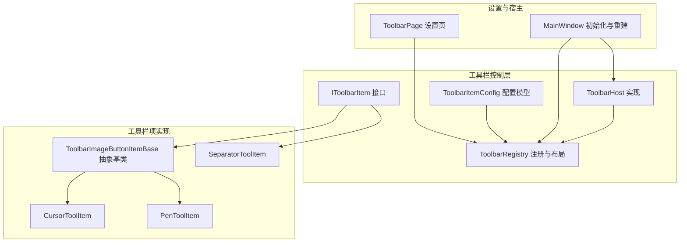
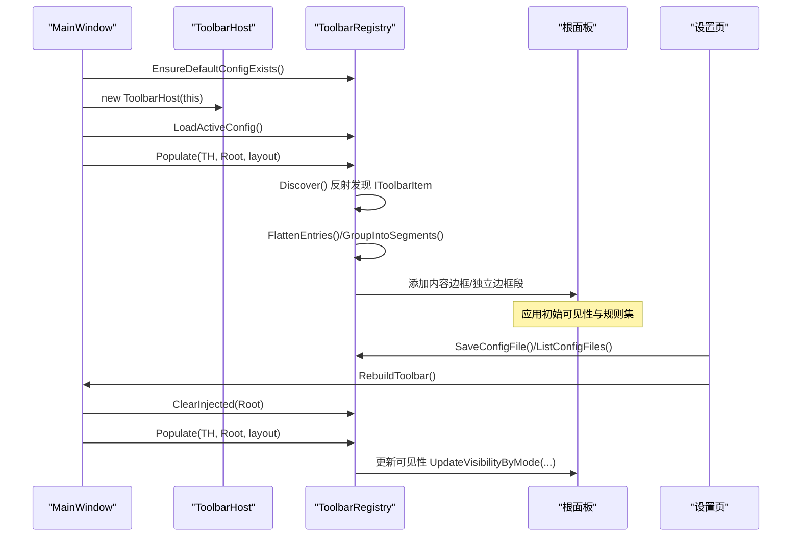
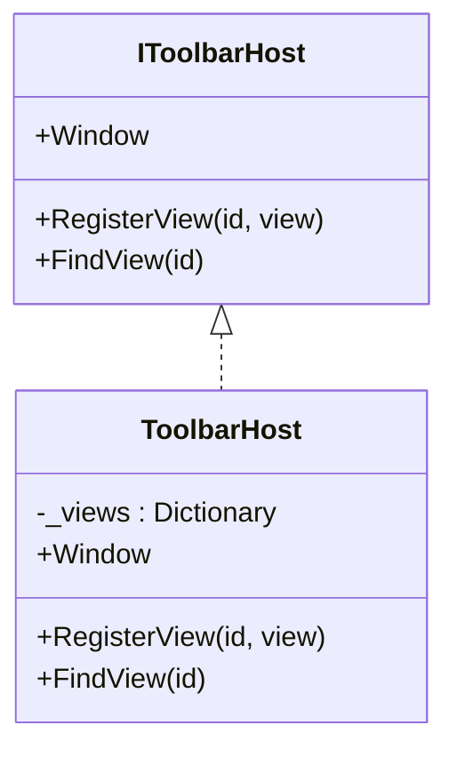
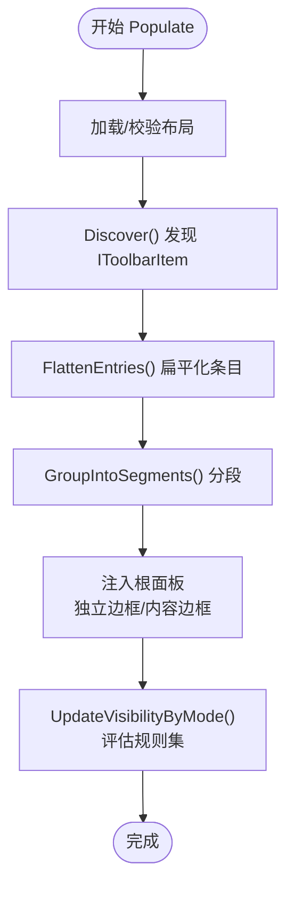
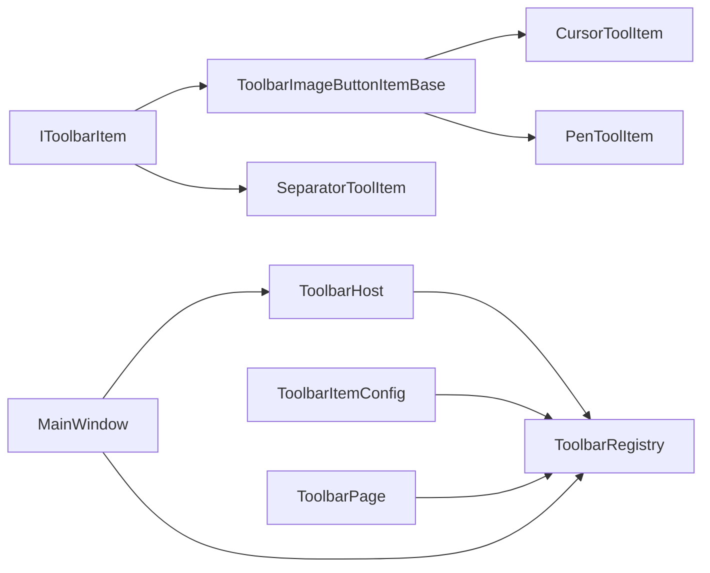

# 工具栏 API

## 简介
本文件系统性地梳理并说明工具栏 API 的设计与实现，覆盖以下主题：
- IToolbarItem 接口的设计规范：属性定义、事件处理机制、状态管理方法
- ToolbarHost 类的工具栏构建流程、布局算法与交互逻辑
- ToolbarRegistry 的工具栏项注册机制、配置管理与动态加载
- IToolbarHost 接口的服务能力：工具栏项的添加、移除与排序
- 工具栏自定义指南：如何创建自定义工具栏项、配置布局与处理用户交互
- 工具栏配置文件格式、序列化机制与持久化策略
- 工具栏扩展最佳实践与性能优化建议

## 项目结构
工具栏相关代码主要位于 Ink Canvas/Controls/Toolbar 及其子目录，配合设置页与主窗口初始化流程协同工作。

## 核心组件
- IToolbarItem：工具栏项契约，定义唯一标识、显示名、描述、默认隐藏规则、是否带分隔边框、拖拽点击时是否阻止隐藏、以及构建视图的方法。
- IToolbarHost：工具栏与宿主（主窗口）之间的桥接接口，提供对主窗口的访问与视图注册/查找能力。
- ToolbarHost：IToolbarHost 的实现，持有主窗口引用，并维护一个字典用于登记/查找视图。
- ToolbarRegistry：工具栏项注册、发现、布局装配、可见性评估与配置文件读写的核心类。
- ToolbarItemConfig：规则集、规则组、规则、组件条目、布局设置等配置模型与序列化定义。
- ToolbarImageButtonItemBase：基于图像按钮的工具栏项抽象基类，统一处理图标、标签、点击事件与构建流程。
- 具体工具栏项：如 CursorToolItem、PenToolItem、SeparatorToolItem 等，体现不同功能与交互。
- ToolbarPage：工具栏配置设置页，负责配置文件的增删改查、布局编辑、规则集编辑与实时重建。
- MainWindow 初始化与重建：负责加载默认配置、构建工具栏、更新可见性与高亮状态。

## 架构总览
工具栏 API 的运行时流程如下：
- 主窗口初始化时，创建 ToolbarHost 并加载当前配置，调用 ToolbarRegistry.Populate 将工具栏项注入到根面板。
- ToolbarRegistry 通过反射发现所有 IToolbarItem 实现，构建视图并应用规则集决定初始可见性。
- 用户在设置页修改布局、规则集或配置文件后，触发保存与重建，主窗口调用 RebuildToolbar 重新装配。
- ToolbarRegistry 负责根据上下文（标注模式、PPT 模式、用户折叠状态）动态评估规则集并更新可见性。

## 详细组件分析

### IToolbarItem 接口设计规范
- 属性定义
  - Id：工具栏项唯一标识，用于映射到具体实现与配置。
  - DisplayName/Description：显示名称与描述，用于 UI 呈现与帮助信息。
  - DefaultHidingRuleset：默认隐藏规则集，可由具体项覆盖。
  - DefaultShowSeparateBorder/DefaultPreventHideOnDragClick：默认是否使用独立边框与拖拽点击时是否阻止隐藏。
- 视图构建
  - BuildView(host)：接收 IToolbarHost，返回 WPF FrameworkElement 视图；通常在此处绑定事件与资源。
- 事件处理机制
  - 通过 ToolbarImageButtonItemBase 统一绑定 ButtonMouseUp 事件，派发到子类的 OnClick 方法。
  - 子类可在 AfterBuild 中附加额外的宿主回调（如将视图挂接到主窗口特定控件）。
- 状态管理方法
  - 默认规则集可通过 WithHideOnCollapsed/WithPreventHideOnCollapsed 进行组合，影响可见性评估。

### ToolbarHost 与 IToolbarHost 服务
- IToolbarHost 提供的能力
  - Window：访问主窗口实例，便于工具栏项与主窗口交互。
  - RegisterView(id, view)/FindView(id)：登记与查找视图，支持跨组件查找与联动。
- ToolbarHost 实现要点
  - 使用字典维护 id 到视图的映射，避免空值与空字符串键。
  - 为插件提供粗粒度访问（后续阶段会逐步收窄接口）。

### ToolbarRegistry：注册、布局与可见性
- 注册与发现
  - Discover() 通过反射扫描程序集中的 IToolbarItem 实现，实例化并缓存。
- 配置文件系统
  - 支持列出、加载、保存、删除配置文件；自动备份与回滚；默认配置首次启动生成。
- 布局装配
  - Populate() 接收布局设置，清理旧注入元素，将条目扁平化为显示项，分段组装为内容边框或独立边框。
  - 分段算法：遇到独立边框标记则单独成段，否则将连续项放入同一水平 StackPanel。
- 可见性评估
  - UpdateVisibilityByMode() 根据标注模式、PPT 模式与用户折叠状态评估规则集，递归更新可见性。
  - 规则集求值：支持 And/Or、反转、空组处理与状态标记。

### IToolbarHost 服务能力说明（添加/移除/排序）
- 添加：在设置页中拖拽 IToolbarItem 或直接添加 ToolbarComponentEntry，写入布局并保存配置，随后重建工具栏。
- 移除：从 AddedComponents 或组内子项中移除 ToolbarComponentEntry，保存并重建。
- 排序：支持在 AddedComponents 与组内子项中进行拖拽排序，保存后重建。
- 规则集：可为每个条目配置规则组与规则，控制显示/隐藏逻辑。

### 工具栏自定义实现指南
- 创建自定义工具栏项
  - 新建类实现 IToolbarItem 或继承 ToolbarImageButtonItemBase，设置 Id、DisplayName、DefaultHidingRuleset、OnClick 与 AfterBuild。
  - 示例：CursorToolItem、PenToolItem、SeparatorToolItem。
- 配置工具栏布局
  - 在设置页中选择可用项并拖拽到“已添加组件”，设置分隔边框、规则集与组件设置（宽高、字号、透明度、对齐等）。
- 处理用户交互事件
  - 在 OnClick 中调用 host.Window 的相应方法，AfterBuild 中将视图挂接到主窗口控件。

### 工具栏配置文件格式、序列化与持久化
- 文件位置与命名
  - 配置目录：应用根路径下的 Configs/ToolbarConfigs
  - 文件名：任意合法文件名（.json），默认文件名为 default
- 数据模型
  - ToolbarLayoutSettings：包含 components 列表
  - ToolbarComponentEntry：包含 id、instanceId、hidingRule、hidingRuleset、showSeparateBorder、preventHideOnDragClick、settings、children
  - ToolbarRuleset/ToolbarRuleGroup/ToolbarRule：支持 And/Or、反转、启用状态与条件集合
- 序列化与反序列化
  - 使用 Newtonsoft.Json 进行序列化与反序列化
- 持久化策略
  - 保存前先复制主文件为备份，异常时可回滚
  - 支持删除与重置为默认布局

### 主窗口集成与可见性更新
- 初始化
  - EnsureDefaultConfigExists()、new ToolbarHost(this)、LoadActiveConfig()、Populate()、UpdateToolbarComponentVisibility()
- 重建
  - ClearInjected() 清理旧注入元素，重新 Populate 并刷新高亮与颜色
- 可见性
  - UpdateVisibilityByMode() 根据标注模式、PPT 模式与用户折叠状态评估规则集

## 依赖关系分析
- 组件耦合
  - IToolbarItem 与 ToolbarImageButtonItemBase 之间为继承关系，统一了按钮型工具栏项的构建与事件处理。
  - ToolbarRegistry 依赖 IToolbarItem 发现与装配，依赖 ToolbarItemConfig 进行规则集与布局解析。
  - ToolbarPage 作为配置入口，依赖 ToolbarRegistry 进行文件管理与布局保存。
  - MainWindow 作为宿主，依赖 ToolbarRegistry 进行装配与可见性更新。
- 外部依赖
  - Newtonsoft.Json 用于配置文件的序列化与反序列化
  - WPF 控件体系用于视图构建与布局

## 性能考虑
- 反射发现成本
  - Discover() 在首次调用时进行一次反射扫描并缓存结果，避免重复开销。
- 规则集求值
  - 规则集评估采用短路逻辑（And/Or），减少不必要的判断；空组与空规则直接计算结果。
- 可见性更新
  - UpdateVisibilityByMode() 递归遍历注入的元素，建议保持注入元素数量合理，避免过深的嵌套。
- 配置文件 IO
  - 保存前先备份，失败时回滚；建议在批量修改后一次性保存，减少 IO 次数。
- 视图注册
  - ToolbarHost 使用字典存储视图，查找复杂度为 O(1)，但需避免重复注册与空键。

[本节为通用指导，不直接分析具体文件]

## 故障排查指南
- 工具栏项未显示
  - 检查 DefaultHidingRuleset 是否导致被隐藏；在设置页中调整规则集或禁用规则。
  - 确认 Populate() 是否成功注入，日志中应包含“Populate 完成”等信息。
- 配置文件加载失败
  - 查看日志中“配置文件不存在/损坏/备份恢复”等提示；确认文件存在且 JSON 结构有效。
- 规则集不生效
  - 确认规则集 Mode、IsReversed、Groups/Rules 是否正确；检查条件 Id 是否与上下文一致。
- 重建工具栏后视图错乱
  - 确保在设置页保存后再重建；检查 ClearInjected() 是否清理了旧元素。

## 结论
工具栏 API 通过清晰的接口与模块化设计，实现了工具栏项的可插拔、布局的可配置与可见性的可编程控制。借助 ToolbarRegistry 的规则集与配置文件系统，用户可以灵活定制工具栏外观与行为；通过 ToolbarHost 与 ToolbarPage，开发者可以便捷地扩展新工具栏项并集成到主窗口。建议在扩展新工具栏项时遵循现有基类与规则集约定，确保一致的用户体验与可维护性。

[本节为总结性内容，不直接分析具体文件]

## 附录
- 开发规范参考：浮动工具栏开发规范与按钮类型列表

章节来源
