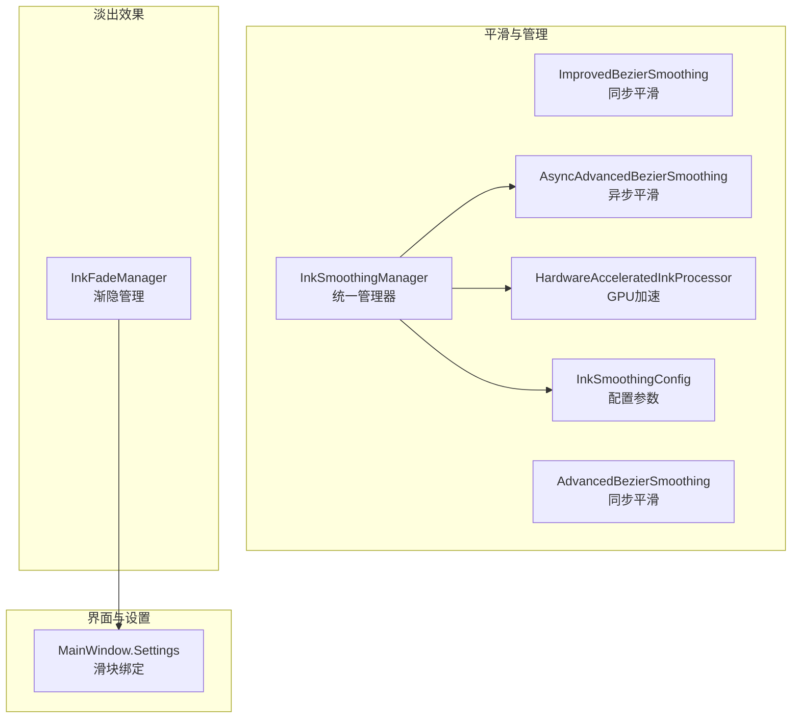
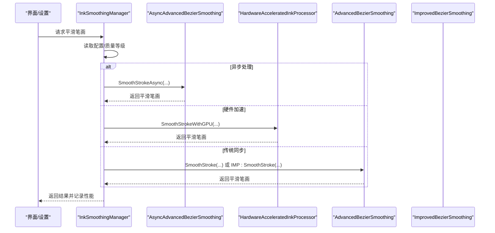
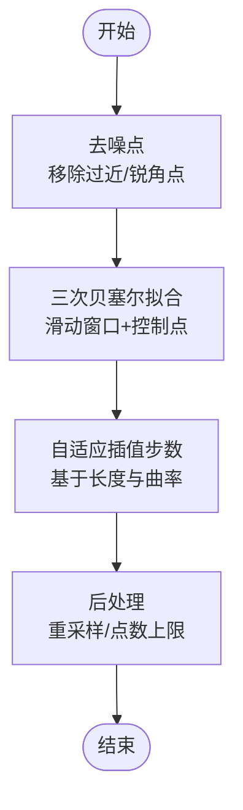
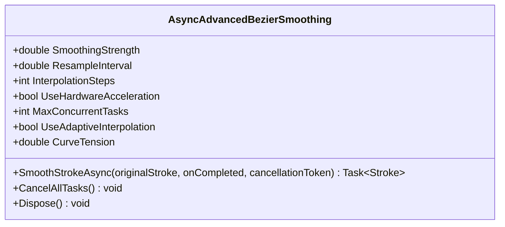
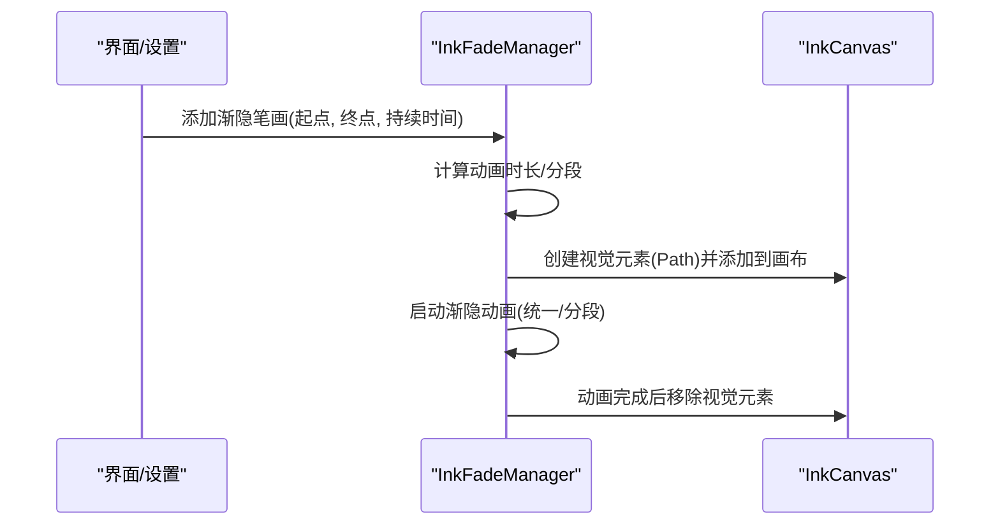
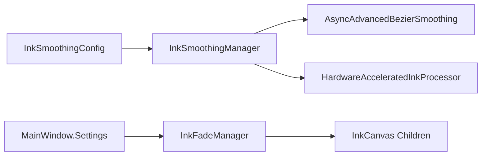

# 笔刷效果调节

## 简介
本技术文档围绕 InkCanvasForClass 的笔刷效果调节系统，系统性解析以下内容：
- 笔刷平滑算法实现：ImprovedBezierSmoothing 与 AdvancedBezierSmoothing 的算法差异与性能特点
- 笔刷淡出效果机制：InkFadeManager 的工作原理与视觉控制
- 笔刷配置参数管理：InkSmoothingConfig 的配置项与调优策略
- 实时预览与性能优化：GPU 加速、内存管理与异步处理
- 自定义与扩展：效果参数动态调整与用户界面交互

## 项目结构
笔刷效果调节相关代码主要集中在 Helpers 目录与 MainWindow 的设置逻辑中：
- 平滑算法与管理：ImprovedBezierSmoothing、AdvancedBezierSmoothing、InkSmoothingManager、HardwareAcceleratedInkProcessor、InkSmoothingConfig
- 淡出效果：InkFadeManager
- 用户界面与设置：MainWindow 设置页与滑块绑定

## 核心组件
- ImprovedBezierSmoothing：面向同步场景的改进三次贝塞尔曲线平滑，包含去噪、自适应插值、重采样与后处理
- AdvancedBezierSmoothing：同步版本的三次贝塞尔曲线平滑，提供更保守的窗口与插值策略
- AsyncAdvancedBezierSmoothing：异步硬件加速平滑，支持并发任务、自适应插值、向量化指数平滑与并行贝塞尔拟合
- HardwareAcceleratedInkProcessor：基于 WPF GPU 的路径几何平滑与并行贝塞尔插值
- InkSmoothingManager：统一调度器，根据配置选择异步/硬件加速/传统同步路径，并记录性能
- InkSmoothingConfig：平滑配置参数与质量等级映射，支持从设置加载与保存
- InkFadeManager：笔迹渐隐管理，按笔迹起点终点创建视觉元素并执行分段/统一动画

## 架构总览
统一由 InkSmoothingManager 决策平滑路径，依据 InkSmoothingConfig 的质量与硬件能力选择：
- 异步模式：AsyncAdvancedBezierSmoothing
- 硬件加速：HardwareAcceleratedInkProcessor
- 传统同步：AdvancedBezierSmoothing 或 ImprovedBezierSmoothing

笔刷淡出由 InkFadeManager 基于 MainWindow 设置的滑块参数驱动，实现渐隐时间与速度倍率控制。

## 详细组件分析

### ImprovedBezierSmoothing（同步平滑）
- 预处理：去噪点（基于前后点夹角与距离阈值）
- 曲线拟合：三次贝塞尔滑动窗口，自适应插值步数与曲率
- 后处理：重采样与点数上限控制
- 压力插值：沿曲线插值压感，保证视觉一致性

### AdvancedBezierSmoothing（同步平滑）
- 提供传统三次贝塞尔平滑，窗口大小与步长随点数动态调整
- 点数膨胀阈值保护：超过一定倍数则回退原笔画
- 适合低开销、稳定性的场景

### AsyncAdvancedBezierSmoothing（异步硬件加速平滑）
- 异步处理：信号量控制并发，取消令牌支持取消
- 参数：平滑强度、重采样间隔、插值步数、曲线张力、自适应插值、硬件加速开关
- 优化：向量化指数平滑、并行贝塞尔拟合、宽松的点数限制与重采样策略
- 取消与释放：支持取消全部任务与资源释放

### HardwareAcceleratedInkProcessor（GPU加速）
- 使用 PathGeometry 与 RenderTargetBitmap 进行硬件加速的曲线拟合
- 并行贝塞尔插值，优化三次贝塞尔计算
- 压感插值保持原笔画压感特征

### InkSmoothingManager（统一管理器）
- 根据配置选择异步/硬件加速/传统路径
- 性能监控：记录处理时间并提供统计
- 推荐配置：根据 CPU 核心数与硬件能力自动推荐质量等级与并发数

### InkSmoothingConfig（配置参数）
- 基本平滑参数：强度、重采样间隔、插值步数
- 贝塞尔参数：自适应插值、曲线张力、曲率阈值
- 性能参数：硬件加速、异步处理、并发任务数、点数上限
- 质量等级：性能优先、平衡、质量优先，映射到具体参数
- 设置加载/保存：从 MainWindow.Settings.Canvas 加载与保存

### InkFadeManager（笔刷淡出）
- 添加渐隐：记录起点/终点、创建视觉元素（Path），加入画布
- 渐隐动画：高亮笔采用统一渐隐+轻微缩放，普通笔采用分段渐隐
- 分段策略：按长度与点密度计算分段数，使用 Apple 风格延迟曲线
- 控制参数：渐隐时间、速度倍率、动画时长，支持运行时更新

## 依赖关系分析
- InkSmoothingManager 依赖 InkSmoothingConfig、AsyncAdvancedBezierSmoothing、HardwareAcceleratedInkProcessor
- AsyncAdvancedBezierSmoothing 依赖 InkSmoothingConfig 的参数
- InkFadeManager 依赖 MainWindow 设置（滑块）并操作 InkCanvas 子元素
- UI 层通过 MainWindow.Settings 与 InkFadeManager/InkSmoothingManager 交互

## 性能考量
- 异步与并发：AsyncAdvancedBezierSmoothing 使用信号量限制并发，避免过度占用 CPU
- 硬件加速：HardwareAcceleratedInkProcessor 利用 WPF GPU 渲染能力，提升曲线拟合效率
- 自适应插值：根据曲线长度与曲率动态调整插值步数，兼顾质量与性能
- 重采样与点数上限：防止点数爆炸，控制内存与绘制成本
- 性能监控：InkSmoothingManager 记录处理时间，便于调优与诊断

## 故障排查指南
- 平滑失败回退：当异步/硬件加速失败或取消时，回退到原始笔画
- 渐隐异常：捕获异常并清理视觉元素，避免残留
- 配置校验：InkSmoothingConfig.Validate 提供参数范围校验
- 性能统计：通过 InkSmoothingManager.GetPerformanceStats 查看平均/最大处理时间与样本数

## 结论
该笔刷效果调节系统通过统一管理器与多种平滑策略，结合硬件加速与异步处理，在保证视觉质量的同时兼顾性能与稳定性。InkFadeManager 提供了自然的笔迹渐隐体验，并通过 UI 滑块实现参数的实时调整。InkSmoothingConfig 的质量等级与参数映射使得不同硬件环境下的用户都能获得合适的体验。

## 附录
- 用户界面交互要点
  - 激光笔渐隐时间：滑块值乘以 1000 毫秒写入 Settings.Canvas.InkFadeTime，InkFadeManager.UpdateFadeTime 实时生效
  - 渐隐速度倍率：滑块值写入 Settings.Canvas.InkFadeSpeedMultiplier，InkFadeManager.UpdateFadeSpeedMultiplier 实时生效
  - 平滑质量与硬件：InkSmoothingManager.GetRecommendedConfig 与 ApplyRecommendedSettings 根据系统能力自动推荐

章节来源
