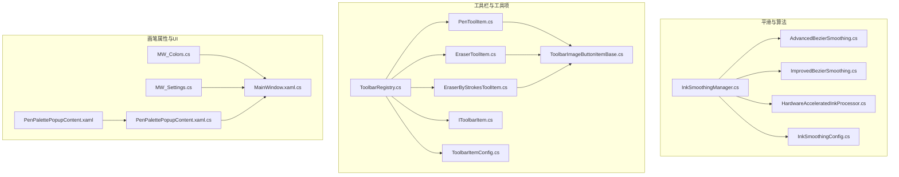
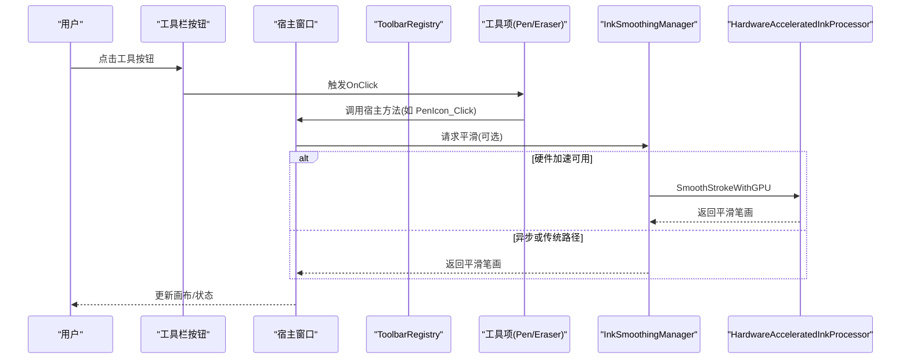
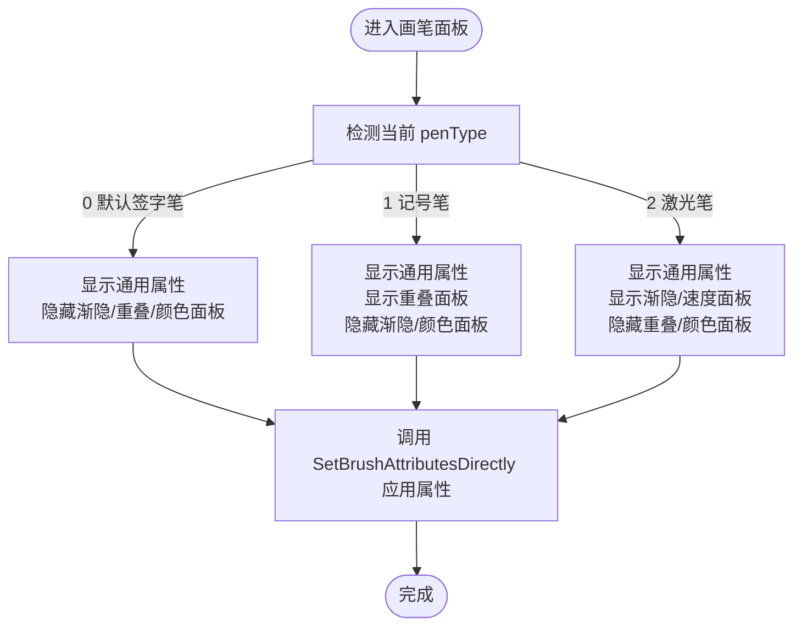
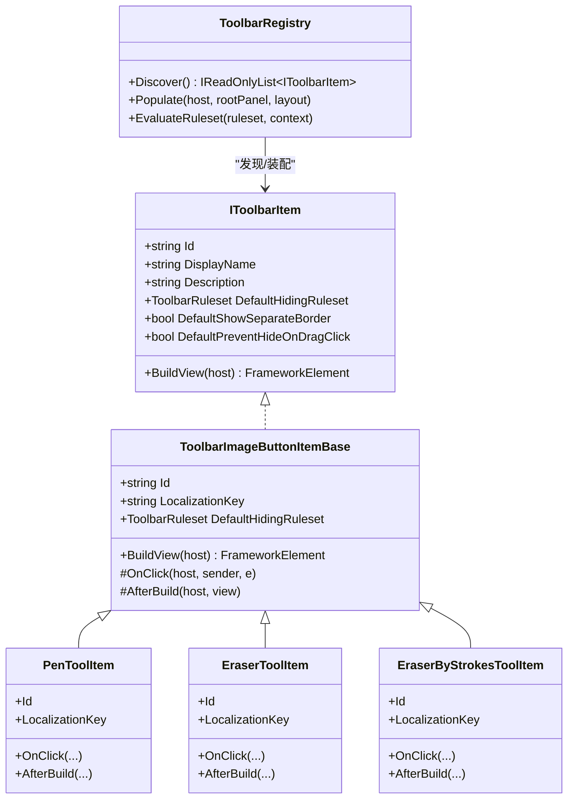
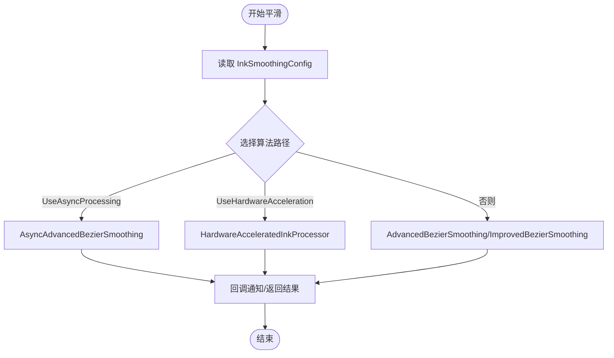
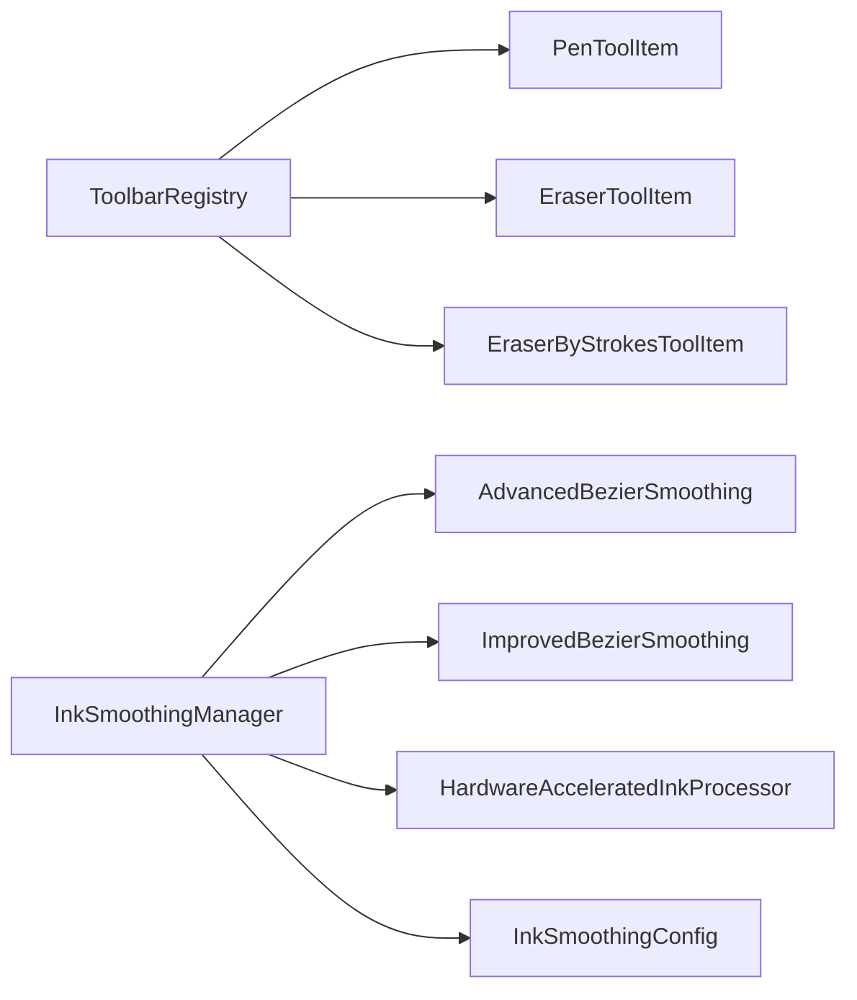

# 笔刷类型管理

## 简介
本文件面向 InkCanvasForClass 的笔刷类型管理系统，系统性梳理以下内容：
- 笔刷类型分类与特性：普通笔刷、记号笔、激光笔、荧光笔等的实现差异与适用场景
- 工具项注册与管理机制：PenToolItem、EraserToolItem 等工具项的实现原理与生命周期
- 笔刷形状与样式配置：笔尖形状、边缘效果与纹理应用的可配置项
- 平滑算法实现：InkSmoothingManager 的工作原理、配置参数与性能策略
- UI 交互设计：工具栏按钮状态管理与用户操作反馈

## 项目结构
围绕“笔刷类型管理”的关键目录与文件如下：
- 平滑与算法：Helpers 下的 InkSmoothingManager、InkSmoothingConfig、AdvancedBezierSmoothing、ImprovedBezierSmoothing、HardwareAcceleratedInkProcessor
- 工具栏与工具项：Controls/Toolbar/Items 下的 PenToolItem、EraserToolItem、EraserByStrokesToolItem、ToolbarImageButtonItemBase、ToolbarRegistry、IToolbarItem、ToolbarItemConfig
- 画笔属性与UI：MainWindow_cs 下的 MW_Colors、MW_Settings、MainWindow.xaml.cs；Controls/Popups 下的 PenPalettePopupContent.xaml 与 .cs

## 核心组件
- 平滑管理器 InkSmoothingManager：统一调度异步平滑、硬件加速与传统算法，提供配置更新、性能监控与任务取消
- 平滑配置 InkSmoothingConfig：定义平滑强度、重采样间隔、插值步数、自适应插值、曲线张力、并发任务数、质量等级等参数
- 平滑算法实现：
  - AsyncAdvancedBezierSmoothing：异步高级三次贝塞尔平滑，支持并发与硬件加速路径
  - ImprovedBezierSmoothing：改进的三次贝塞尔平滑，含去噪、自适应插值与重采样
  - HardwareAcceleratedInkProcessor：基于 WPF GPU 的路径几何平滑与并行贝塞尔插值
- 工具项与注册：
  - PenToolItem、EraserToolItem、EraserByStrokesToolItem：内置工具项，绑定宿主窗口事件
  - ToolbarImageButtonItemBase：工具项基类，负责构建 UI 按钮与事件绑定
  - ToolbarRegistry：发现、装配与布局工具项，支持规则集评估与可见性控制
  - IToolbarItem：工具项接口契约
  - ToolbarItemConfig：工具项规则集配置（AlwaysShow、AnnotationOnly、PptOnly、PptAnnotationOnly）

## 架构总览
下图展示笔刷类型管理的高层交互：工具项通过 ToolbarRegistry 注册与布局，点击事件委托给宿主窗口；平滑处理由 InkSmoothingManager 统一协调，依据配置选择算法路径。

## 详细组件分析

### 笔刷类型与样式配置
- 类型与切换
  - 默认签字笔：penType=0，椭圆形笔尖，非荧光笔，关闭墨水渐隐
  - 记号笔（荧光笔）：penType=1，矩形笔尖，可配置重叠开关，宽度与高度按设置应用
  - 激光笔：penType=2，椭圆形笔尖，启用墨水渐隐，适合高对比度演示
- 颜色与属性
  - 通过 SetBrushAttributesDirectly 直接应用颜色、宽度、高度至当前绘图属性与默认属性
  - 不同笔型分别持久化 InkWidth/HighlighterWidth/LaserPenWidth 与 Alpha
- UI 面板与可见性
  - PenPalettePopupContent 根据当前 penType 动态显示/隐藏面板（通用属性、渐隐、重叠、颜色面板）
  - 颜色按钮事件映射到 MW_Colors 中的对应处理函数，更新 penType 并刷新 UI 状态

### 工具项注册与管理机制
- 工具项接口与基类
  - IToolbarItem：定义 Id、DisplayName、Description、默认隐藏规则、视图构建
  - ToolbarImageButtonItemBase：实现通用按钮构建、图标/标签资源绑定、点击事件转发
- 内置工具项
  - PenToolItem：绑定到宿主窗口的 PenIcon_Click 与 AttachPenIconView
  - EraserToolItem：绑定到 EraserIcon_Click 与 AttachEraserIcon
  - EraserByStrokesToolItem：绑定到 EraserIconByStrokes_Click 与 AttachEraserByStrokesIcon
- 注册与布局
  - ToolbarRegistry.Discover：反射扫描 IToolbarItem 实现并实例化
  - ToolbarRegistry.Populate：根据布局配置装配工具项，应用规则集与可见性
  - ToolbarItemConfig：提供 AlwaysShow、AnnotationOnly、PptOnly、PptAnnotationOnly 等规则集工厂方法

### 平滑算法实现与配置
- InkSmoothingManager
  - 统一入口：SmoothStrokeAsync/SmoothStroke，根据配置选择异步、硬件加速或传统路径
  - 性能监控：记录处理耗时，提供统计字符串
  - 推荐配置：根据 CPU 核心数与硬件加速能力自动推荐质量等级与并发数
  - 资源管理：CancelAllTasks、Dispose
- InkSmoothingConfig
  - 参数：平滑强度、重采样间隔、插值步数、自适应插值、曲线张力、并发任务数、质量等级
  - 质量映射：Performance/Balanced/Quality 对应不同的参数组合
  - 校验与摘要：Validate、GetSummary
- 算法实现
  - AsyncAdvancedBezierSmoothing：异步高级三次贝塞尔，支持并发信号量、取消令牌、自适应插值与重采样
  - ImprovedBezierSmoothing：改进三次贝塞尔，含去噪、异常点剔除、自适应插值与重采样
  - HardwareAcceleratedInkProcessor：基于 PathGeometry 的 GPU 加速路径平滑与并行贝塞尔插值

### UI 交互设计与状态管理
- 工具栏按钮状态
  - ToolbarRegistry.EvaluateRuleset 根据上下文（注释模式、PPT 模式、是否折叠）评估规则集，决定显示/隐藏
  - ToolbarItemConfig 提供常用规则集工厂方法，便于工具项声明默认隐藏策略
- 用户操作反馈
  - PenPalettePopupContent 根据 penType 动态切换面板，提供即时视觉反馈
  - MW_Colors 中的颜色按钮事件更新 penType 并刷新 UI 状态，确保用户操作有明确响应

## 依赖关系分析
- 组件耦合
  - 工具项依赖 ToolbarImageButtonItemBase 与 IToolbarItem 接口，通过 ToolbarRegistry 统一装配
  - 平滑管理器依赖多种算法实现与配置，形成“策略+配置”模式
- 外部依赖
  - WPF Ink 与 Rendering（RenderTargetBitmap、PathGeometry）用于硬件加速路径
  - Dispatcher 与并发原语（SemaphoreSlim、CancellationTokenSource）用于异步与线程安全

## 性能考量
- 硬件加速优先：当 RenderCapability.Tier 达到要求时优先使用 GPU 路径
- 异步与并发：AsyncAdvancedBezierSmoothing 使用信号量限制并发，避免过度占用 CPU/GPU
- 自适应插值：根据曲线长度与曲率动态调整插值步数，兼顾质量与性能
- 重采样策略：在点数过多时进行重采样，防止输出膨胀导致性能下降
- 推荐配置：根据 CPU 核心数与硬件能力自动选择质量等级与并发数

## 故障排查指南
- 平滑失败或超时
  - 检查 InkSmoothingManager 的异常捕获与日志输出，确认是否因取消或异常回退到原始笔画
  - 调整 InkSmoothingConfig 的并发数与质量等级，避免系统资源不足
- 硬件加速不可用
  - 使用 IsHardwareAccelerationSupported 检测，回退到异步或传统路径
- 工具项不显示
  - 检查 ToolbarRegistry.EvaluateRuleset 的上下文（注释模式/PPT 模式/折叠状态），确认规则集匹配
- 笔刷样式异常
  - 核对 MW_Colors 中的 penType 切换逻辑与 MainWindow.xaml.cs 的 SetBrushAttributesDirectly 应用顺序

## 结论
本系统通过“工具项注册 + 平滑算法策略 + 配置驱动”的架构，实现了对多类型笔刷的统一管理与高效渲染。工具项以声明式规则控制可见性，平滑模块以配置与硬件能力自适应选择最优路径，配合 UI 面板提供直观的状态反馈。该设计在保证易用性的同时，兼顾了性能与扩展性。

## 附录
- 关键流程参考
