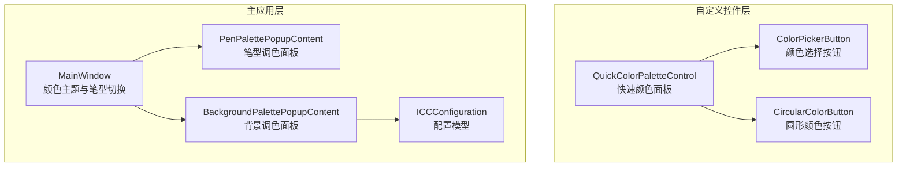
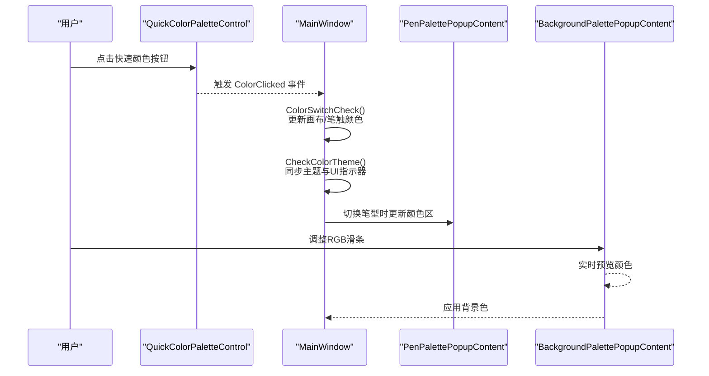
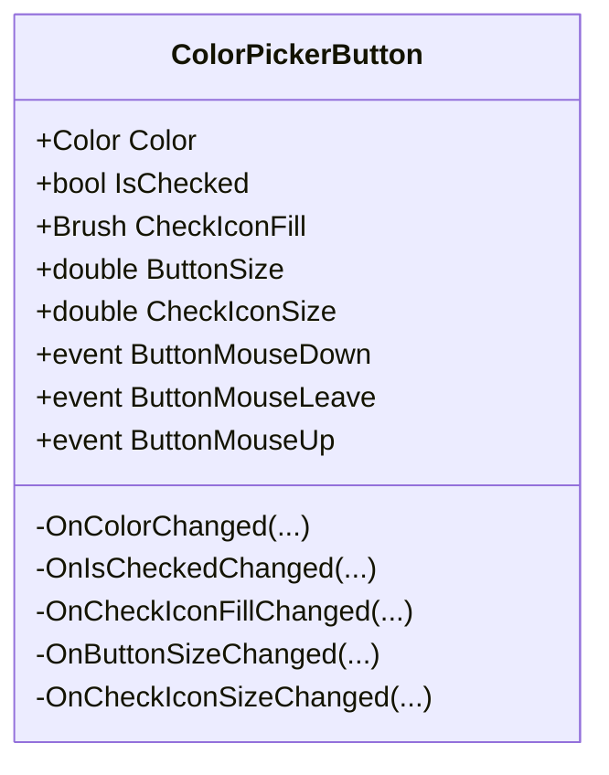
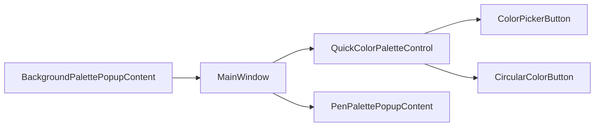

# 颜色选择器

## 简介
本文件围绕 InkCanvasForClass 的颜色选择器功能进行系统化技术文档编写，重点覆盖以下方面：
- 颜色选择器的 UI 组件结构：ColorPickerButton、CircularColorButton、QuickColorPaletteControl 等控件的职责、属性与交互。
- 快速调色板与颜色历史/最近使用颜色管理：快速颜色面板的布局与选中状态同步。
- 自定义颜色输入与预览：背景调色板中的 RGB 输入与实时预览。
- 颜色主题与笔刷类型联动：签字笔、荧光笔、激光笔三类笔型的颜色应用与主题切换。
- ICC 配置与色彩空间：资源层的 ICC 配置模型及其对界面元素的影响范围。

## 项目结构
颜色选择器相关的核心文件分布于两个子项目：
- InkCanvas.Controls：自定义控件层，包含 ColorPickerButton、CircularColorButton、QuickColorPaletteControl 等。
- Ink Canvas：主应用层，包含颜色主题与笔型切换逻辑、弹出面板集成等。

## 核心组件
- ColorPickerButton：用于快速颜色面板中的方形颜色按钮，支持颜色填充、选中勾选图标、尺寸与勾选图标的大小控制。
- CircularColorButton：用于更丰富的颜色展示（如背景调色），支持圆形裁剪、透明棋盘格底纹、不透明度叠加层与选中状态。
- QuickColorPaletteControl：快速颜色面板容器，支持两行/单排两种显示模式，并提供颜色点击事件与“最近使用”状态同步。
- PenPalettePopupContent：笔型调色面板，承载签字笔/荧光笔/激光笔三类笔的颜色选择区域。
- BackgroundPalettePopupContent：背景调色面板，提供 RGB 滑条与实时预览。
- ICCConfiguration：界面元素外观与行为的配置模型（如浮动栏、圆角、吸附区域等），为颜色 UI 提供统一风格约束。

## 架构总览
颜色选择器在应用中的位置与交互流程如下：

## 详细组件分析

### ColorPickerButton 组件
- 功能定位：快速颜色面板中的方形颜色按钮，支持选中态勾选图标、颜色填充、尺寸与勾选图标尺寸控制。
- 关键依赖属性：
  - Color：颜色填充
  - IsChecked：选中状态
  - CheckIconFill：勾选图标填充色
  - ButtonSize、CheckIconSize：按钮与勾选图标的尺寸
- 事件：
  - ButtonMouseDown、ButtonMouseLeave、ButtonMouseUp：鼠标交互事件
- 设计要点：
  - 通过依赖属性驱动 UI 更新，避免直接操作视觉树。
  - 勾选图标可见性与填充色在属性变更时自动同步。

## 依赖关系分析
- QuickColorPaletteControl 依赖 ColorPickerButton 与 CircularColorButton 进行颜色展示与交互。
- MainWindow 作为颜色中枢，负责：
  - 颜色切换检查与画笔属性历史提交
  - 主题与笔型联动，同步 UI 指示器
  - 将颜色应用到 InkCanvas 默认绘制属性
- 背景调色面板与笔型调色面板分别通过事件与方法与主窗口交互。

## 性能考量
- 依赖属性驱动的 UI 更新避免了频繁的视觉树操作，建议在大量颜色切换场景下保持此模式。
- CircularColorButton 的圆形裁剪与透明棋盘格渲染使用高质量位图缩放，注意在高频预览场景下的 GPU 开销。
- 快速颜色面板的两行/单排切换通过 Panel 可见性切换实现，避免重建控件树，性能开销较低。

## 故障排查指南
- 颜色不生效：
  - 检查 ColorSwitchCheck() 是否被调用，确认当前模式与笔型设置。
  - 确认 inkCanvas.DefaultDrawingAttributes.Color 已更新。
- 快速颜色面板不显示：
  - 检查 DisplayMode 属性与 ApplyDisplayMode() 调用时机。
  - 确认面板容器可见性已设置为 Visible。
- 选中状态不同步：
  - 使用 SetCheckedByColor() 并传入合理容差，避免颜色匹配失败。
  - 调用 ClearAllChecked() 清理旧状态后再设置新选中。
- 背景颜色预览异常：
  - 确认 RGB 滑条值范围与文本块绑定一致。
  - 检查应用按钮事件是否正确触发背景色设置。

## 结论
本颜色选择器体系以自定义控件为核心，结合快速颜色面板、背景调色面板与主窗口的颜色中枢逻辑，实现了从快速选择到自定义输入的完整闭环。通过依赖属性与事件驱动，UI 与业务逻辑解耦良好；通过笔型与主题联动，颜色体系在不同场景下保持一致。建议后续在资源层引入 ICC 配置文件加载与色彩空间校准服务，进一步提升颜色准确性与跨设备一致性。

## 附录
- 颜色空间转换与 ICC 校准建议：
  - 新增 ICCProfileLoader 服务，负责加载 ICC 配置文件并建立色彩空间映射。
  - 在颜色应用前，将 RGB 转换至目标设备色彩空间，再写入画布属性。
  - 提供颜色准确性验证与回退策略，确保在无 ICC 文件时仍能提供可用颜色。