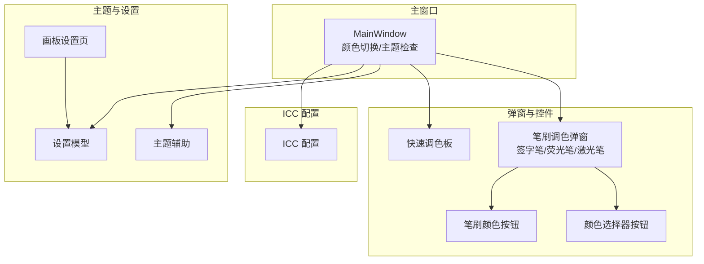
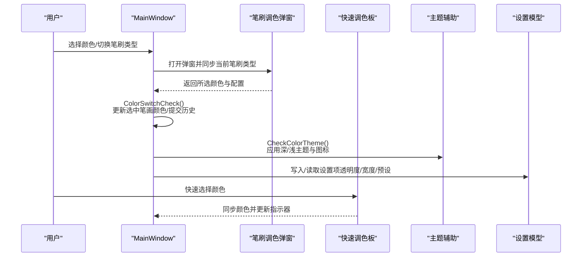
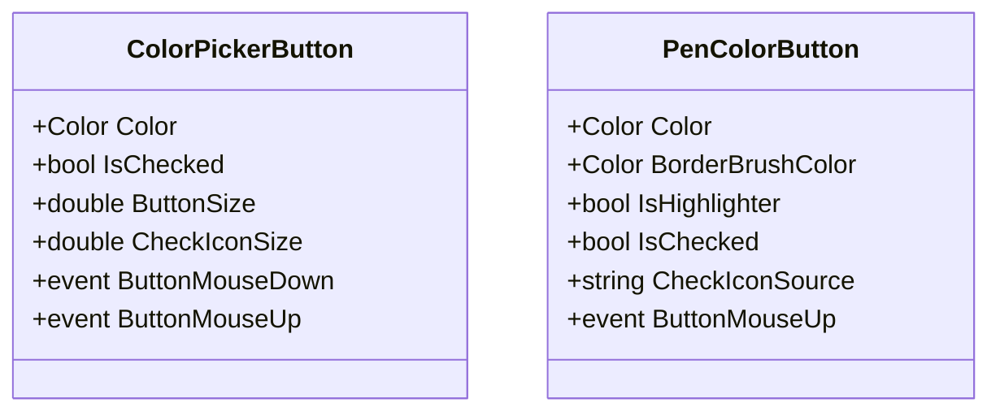
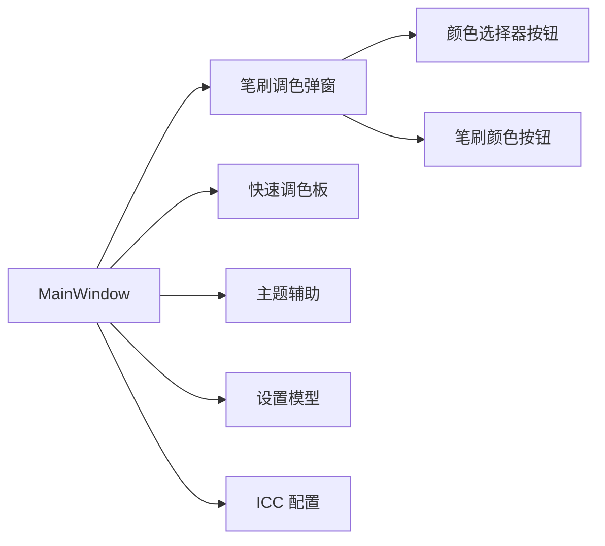

# 颜色笔刷管理系统

## 简介
本文件面向 InkCanvasForClass 的“颜色笔刷管理系统”，系统性梳理颜色选择器、笔刷类型与配置、尺寸/透明度/效果调节、主题系统、笔刷预设与导入导出、以及颜色空间与 ICC 色彩管理最佳实践。文档通过代码级分析与可视化图示，帮助开发者与使用者快速理解并高效使用该系统。

## 项目结构
围绕颜色与笔刷管理的关键模块分布如下：
- 主窗口与颜色主题控制：MainWindow 的颜色切换与主题检查逻辑
- 笔刷调色弹窗：多笔刷类型（签字笔/荧光笔/激光笔）的统一入口
- 快速调色板：便捷颜色选择与同步
- 自定义颜色按钮：颜色选择器与笔刷颜色按钮的通用控件
- 主题辅助：系统/用户偏好的主题检测与应用
- 设置与预设：画板设置、笔刷自动恢复、预设导入导出
- ICC 配置：浮动栏与界面元素的视觉与交互配置

## 核心组件
- 颜色切换与主题检查：负责颜色变更、透明背景处理、选中笔画颜色同步、提交历史记录、工具模式切换、主题切换与 UI 同步
- 笔刷类型与配置：签字笔、荧光笔、激光笔三类笔刷的属性差异与 UI 显示控制
- 颜色选择器与按钮：通用颜色选择器与笔刷颜色按钮控件，支持选中态与高亮笔刷透明度
- 快速调色板：按颜色相似度匹配与选中状态同步
- 主题系统：系统主题检测与应用，深浅主题切换与图标/文案同步
- 设置与预设：画板设置项、笔刷自动恢复、预设导入导出
- ICC 配置：浮动栏与界面元素的圆角、吸附、半透明等视觉与交互配置

## 架构总览
颜色笔刷管理由“主窗口协调 + 弹窗配置 + 控件渲染 + 主题与设置支撑”构成。主窗口负责颜色与主题的全局状态，弹窗提供多笔刷类型配置入口，控件负责颜色选择与展示，主题与设置提供系统化配置与持久化。

## 详细组件分析

### 颜色选择器与按钮控件
- 颜色选择器按钮（ColorPickerButton）：支持颜色、选中态、图标尺寸等依赖属性，事件驱动点击交互
- 笔刷颜色按钮（PenColorButton）：支持颜色、边框颜色、是否高亮笔刷、选中态与图标资源，用于弹窗与快速调色板

## 依赖关系分析
- 主窗口依赖弹窗与控件进行颜色与配置交互
- 主题辅助为颜色主题检查提供系统主题检测能力
- 设置模型贯穿弹窗、页面与主窗口，作为数据源与持久化介质
- ICC 配置为界面元素提供统一的视觉与交互规范

## 性能考量
- 颜色切换与主题检查涉及大量 UI 元素更新，应避免在高频事件中重复计算
- 快速调色板的颜色匹配采用简单容差比较，建议在批量匹配时减少不必要的 UI 刷新
- 笔刷自动恢复计时器需谨慎管理生命周期，防止内存泄漏与重复启动

## 故障排查指南
- 颜色主题不生效：检查主题辅助是否正确应用，确认系统主题注册表读取权限
- 颜色历史未提交：确认是否存在绘制属性历史，检查提交流程与异常捕获
- 预设未恢复：检查画笔自动恢复开关与计时器状态，确认设置模型写入是否成功

## 结论
颜色笔刷管理系统通过主窗口协调、弹窗配置、控件渲染与主题设置的协同，实现了签字笔、荧光笔与激光笔的差异化配置与统一管理。配合 ICC 配置与色彩管理建议，可在不同设备与主题下保持一致的视觉体验。预设与自动恢复机制进一步提升了易用性与效率。

## 附录
- 关键设置项参考：激光笔宽度/透明度、笔刷自动恢复延迟与次数、自动恢复颜色与宽度/透明度
- 最佳实践：统一使用 Color 对象、合理设置容差、在需要时结合 ICC 校准