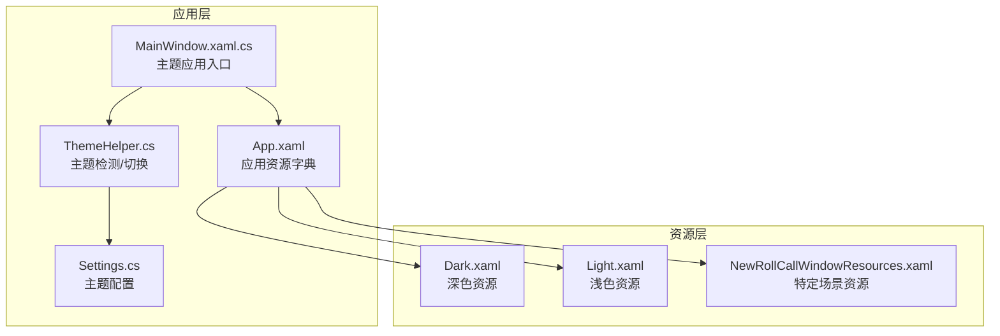
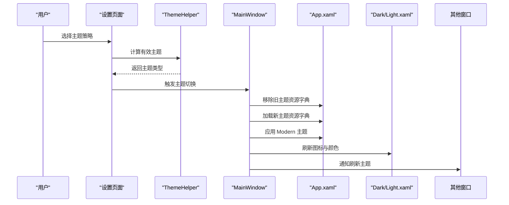
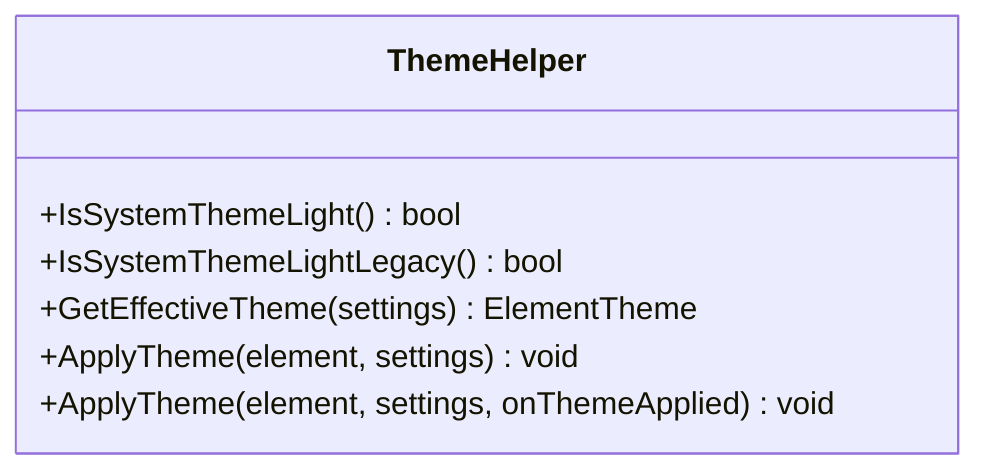
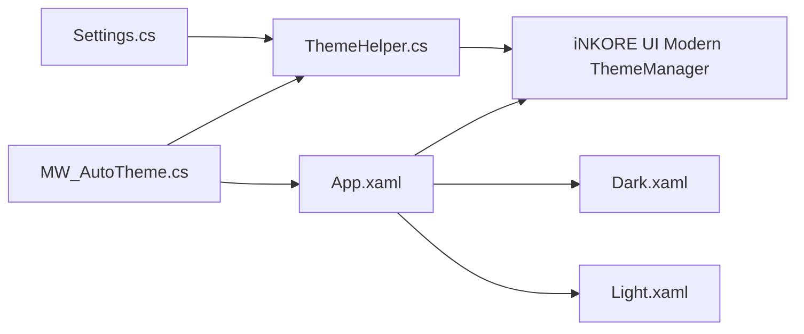

# 主题色彩系统

## 简介
本文件系统性梳理 InkCanvasForClass 的主题色彩系统，覆盖深色与浅色主题的实现机制、样式资源组织、主题切换逻辑、ThemeHelper 的主题管理能力、颜色变量体系、资源字典合并与优先级、以及自定义主题开发指南与兼容性保障。目标是帮助开发者快速理解并扩展主题系统，确保跨窗口、跨控件的一致性与可维护性。

## 项目结构
主题系统主要分布在以下位置：
- 应用级资源与主题入口：App.xaml
- 主题资源字典：Dark.xaml、Light.xaml
- 主题管理器：ThemeHelper.cs
- 自动主题切换与资源加载：MW_AutoTheme.cs
- 设置与主题配置：Settings.cs
- 其他窗口主题应用示例：MainWindow.xaml.cs、MainWindowSettingsHelper.cs
- 特定场景主题资源：NewRollCallWindowResources.xaml

## 核心组件
- ThemeHelper：提供系统主题检测、有效主题计算、主题应用与回调通知。
- 资源字典（Dark/Light）：集中定义各控件与窗口的颜色、画刷、图标等资源键。
- App.xaml：应用级资源字典合并，引入 iNKORE UI Modern 主题资源与图标资源字典。
- MW_AutoTheme：负责移除旧主题资源、加载新主题资源、应用 Modern 主题、刷新图标与高亮颜色、通知其他窗口刷新主题。
- Settings：主题配置项（Appearance.Theme）决定用户选择的主题策略。

## 架构总览
主题系统采用“配置驱动 + 资源字典 + 现代化主题管理”的三层架构：
- 配置层：Settings.Appearance.Theme 决定主题策略（浅色/深色/跟随系统）。
- 资源层：Dark/Light 资源字典按需合并到应用资源字典，提供颜色与图标资源。
- 管理层：ThemeHelper 与 MW_AutoTheme 协作，完成主题检测、切换与资源刷新。

## 详细组件分析

### ThemeHelper 主题管理器
- 功能职责
  - 系统主题检测：读取注册表判断系统浅色/深色偏好，兼容新旧键值。
  - 有效主题计算：根据 Settings.Appearance.Theme 返回浅色、深色或跟随系统。
  - 主题应用：调用 iNKORE UI Modern 的 ThemeManager.SetRequestedTheme 应用到指定元素。
  - 回调通知：可选回调返回当前主题字符串，便于记录日志或联动 UI。

- 关键行为
  - 注册表访问：通过 CurrentUser 下 Themes\Personalize 键读取主题偏好。
  - 异常处理：捕获异常并写入日志，避免影响主线程。
  - 与 Modern 主题集成：统一使用 ElementTheme.Light/Dark 与 SetRequestedTheme。

## 依赖关系分析
- ThemeHelper 依赖 Settings 与 iNKORE UI Modern ThemeManager。
- MW_AutoTheme 依赖 App.xaml 的资源字典合并机制与 ThemeHelper。
- App.xaml 依赖 Modern 主题资源与图标资源字典。
- 各窗口通过 ThemeHelper 或 MW_AutoTheme 的通知机制刷新主题。

## 性能考量
- 资源字典切换
  - 采用异步加载图像资源字典，避免阻塞 UI 线程。
- 主题应用
  - 仅在必要时移除旧字典并添加新字典，减少资源抖动。
- 日志与异常
  - 主题应用失败时写入日志，不影响主线程稳定性。

[本节为通用建议，无需具体文件引用]

## 故障排查指南
- 症状：主题切换无效
  - 检查 Settings.Appearance.Theme 是否正确保存。
  - 确认 App.xaml 是否成功合并新主题资源字典。
  - 查看 ThemeHelper.ApplyTheme 的异常日志。
- 症状：图标颜色不匹配
  - 确认资源字典中是否存在对应键名（浅色/深色图标路径）。
  - 检查 MW_AutoTheme 是否调用了刷新图标方法。
- 症状：系统主题跟随异常
  - 检查注册表键值读取是否成功。
  - 确认 IsSystemThemeLightLegacy 与 IsSystemThemeLight 的兼容逻辑。

## 结论
InkCanvasForClass 的主题系统通过配置驱动、资源字典与现代化主题管理相结合，实现了稳定、可扩展的主题切换与资源应用。深色与浅色资源字典遵循统一命名约定，配合 MW_AutoTheme 的资源刷新与通知机制，确保跨窗口一致性。ThemeHelper 提供了可靠的系统主题检测与应用能力，支持回退与日志记录，满足生产环境的稳定性要求。

[本节为总结，无需具体文件引用]

## 附录

### 自定义主题开发指南
- 新建主题资源
  - 在 Resources/Styles 下新增 MyTheme.xaml，定义与现有键名一致的颜色与图标资源。
  - 保持键名与现有资源一致，以便无缝替换。
- 注册主题
  - 在 App.xaml 的 MergedDictionaries 中添加新主题资源字典。
  - 在 Settings.Appearance.Theme 中新增策略值（如 3=自定义）。
- 应用主题
  - 在 MW_AutoTheme.SetTheme 中添加新策略分支，加载对应资源字典。
  - 调用 ThemeManager.SetRequestedTheme 应用 Modern 主题。
- 打包发布
  - 将新主题资源与图标资源一并打包到安装包。
  - 在设置页面提供主题选择项，映射到 Settings.Appearance.Theme。

[本节为通用指南，无需具体文件引用]