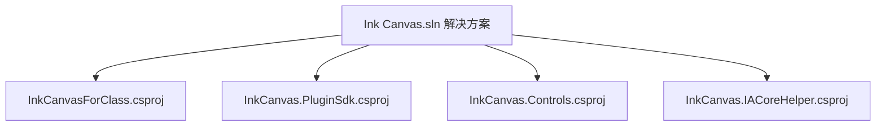
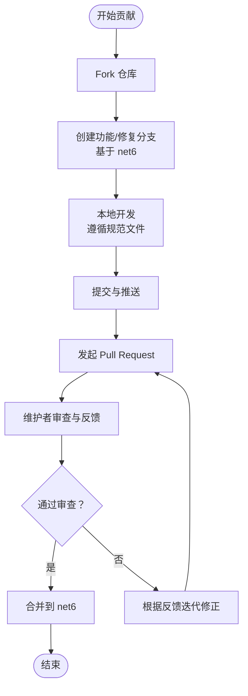
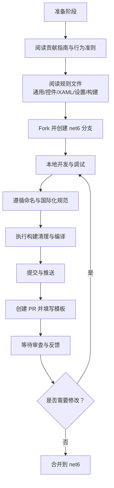
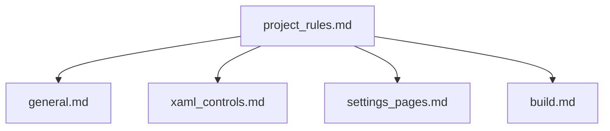

# 贡献指南与社区

## 简介
本指南面向希望参与 InkCanvasForClass 社区版（Community Edition）建设的贡献者，覆盖从 Fork 项目、分支策略、提交与 PR 流程，到行为准则、参与规范、不同类型贡献方式、治理结构与决策流程、社区资源与支持渠道、新贡献者入门、路线图与未来规划，以及贡献者认可与庆祝机制。目标是帮助你高效、安全地参与项目，共同打造更好的教学书写体验。

## 项目结构
InkCanvasForClass 采用多项目解决方案组织，核心工程与插件 SDK、控件库、IACore 辅助工具分别位于独立的 csproj 工程中，并通过统一的解决方案文件进行编译与集成。开发规范与规则集中在 rules 目录，涵盖通用开发、XAML 控件使用、设置页面开发、构建流程等。

## 核心组件
- 代码贡献与分支策略
  - 提交代码需合并到 net6 分支，以确保 net6 版本始终领先于 main。
- 行为准则与参与规范
  - 遵循 Contributor Covenant 行为准则，尊重多样性与包容性，鼓励建设性反馈与积极互动。
- 贡献类型与认可
  - 代码、文档、设计、测试、教程、视频、基础设施、财务支持等多种贡献形式均被认可与记录。
- 社区资源与支持
  - Discord、QQ、论坛等渠道用于交流与问题求助。
- 治理与决策
  - 维护者负责维护、文档、设计与代码贡献的协调推进。
- 路线图与规划
  - 项目包含 TODO 列表与更新日志，体现阶段性目标与功能演进。

## 架构总览
社区贡献流程围绕“Fork → 分支 → 提交 → PR → 审查 → 合并”展开，结合行为准则与规范文件，确保贡献质量与社区健康。

## 详细组件分析

### 代码贡献流程与规范
- Fork 与分支
  - Fork 仓库后，基于 net6 分支创建你的功能或修复分支，确保后续 PR 面向 net6。
- 提交与 PR
  - 提交前遵循构建与代码规范，确保通过本地构建与测试。
  - PR 描述清晰说明变更动机、影响范围与验证结果。
- 规范遵循
  - 通用开发规范、XAML 控件使用规范、设置页面开发规范、构建规范等文件提供了具体约束与最佳实践。

### 行为准则与参与规范
- 核心承诺与标准
  - 促进开放、欢迎、多元、包容与健康的社区氛围；禁止骚扰、歧视与攻击性言论。
- 执行与范围
  - 社区领导者负责澄清与执行标准，适用于社区空间与官方代表场景。
- 报告与处置
  - 可通过指定渠道报告不当行为，社区将及时、公正处理并保护举报人隐私。
- 影响等级与后果
  - 从纠正到警告、临时封禁直至永久封禁，依据违规影响与严重程度决定。

### 社区资源与支持渠道
- 讨论与交流
  - Discord 服务器、QQ 群组、论坛板块用于日常讨论、问题求助与经验分享。
- 使用与免责声明
  - 使用与分发前请了解开源协议与免责声明，Beta 版风险自担。
- FAQ 与常见问题
  - 包含图标显示、PPT 播放、启动失败等常见问题的指引与解决思路。

### 不同类型的贡献方式
- 代码贡献
  - 遵循通用与 XAML 控件规范，关注命名、国际化与设置页面开发流程。
- 文档改进
  - 保持与 i18n 资源一致，避免硬编码文本；完善 README、FAQ 与规则文档。
- 翻译工作
  - 通过 i18n 资源键统一管理多语言文本，确保一致性与可维护性。
- 测试反馈
  - 关注设置项与交互细节，提供跨系统与设备的兼容性反馈。
- 其他贡献
  - 基础设施、教程、视频、设计、想法与规划等均被认可与记录。

### 治理结构与决策流程
- 维护者职责
  - 负责维护、文档、设计与代码贡献的协调推进，保障项目质量与方向。
- 决策流程
  - 通过社区讨论与维护者评估形成决策，重大变更遵循公开透明原则。
- 版本发布与规划
  - 项目包含 TODO 列表与更新日志，反映阶段性目标与功能演进。

### 社区庆祝与贡献者认可
- 贡献者名单
  - 通过 All Contributors 列表展示各类贡献，营造认可与激励氛围。
- 成就与里程碑
  - 项目主页展示星标、分支、许可证等统计信息，体现社区活跃度。

### 新贡献者入门指导
- 开发环境搭建
  - 使用 VS 或 .NET CLI，确保 .NET Runtime 6+ 已安装；可使用 devcontainer 配置一键还原依赖。
- 第一个 PR
  - 从简单问题或文档改进入手，遵循规范文件与提交流程，耐心等待审查与反馈。
- 导师制度
  - 可通过社区渠道寻找经验丰富的维护者或贡献者进行指导与答疑。

### 项目路线图与未来规划
- 预备 2.0 版本开发
- CI 联动插件
- 更新日志与 TODO 列表
  - 通过更新日志与 TODO 列表了解近期重点与未来方向。

## 依赖关系分析
- 规则文件之间的依赖
  - project_rules.md 作为索引，引导到 general、xaml_controls、settings_pages、build 等具体规范。
- 规范对开发的影响
  - 通用规范约束命名与国际化；XAML 控件规范约束 UI 组件使用；设置页面规范约束配置项与交互；构建规范约束编译流程。

## 性能考虑
- 构建稳定性
  - 严格遵循构建流程，清理 bin/obj 与终止相关进程，减少编译缓存干扰。
- 交互性能
  - 关注墨迹渐隐、平滑算法与多指触控等性能热点，避免引入卡顿与延迟。
- 资源与国际化
  - 使用 i18n 资源避免硬编码文本，降低维护成本与潜在错误。

## 故障排查指南
- 常见问题定位
  - 图标显示为方框：安装 Segoe MDL2 字体。
  - PPT 播放闪退：激活 Microsoft Office。
  - 无法切换到 PPT 模式：检查保护模式、COM 组件与权限一致性。
  - 启动失败：确认 .NET Runtime 6+ 与 Microsoft Office 安装。
- 反馈与求助
  - 在论坛板块遵守管理规则提问，或通过社区渠道寻求帮助。

## 结论
通过遵循本指南，你可以高效、合规地参与 InkCanvasForClass 社区版的建设。请始终以尊重与包容为基础，严格遵循规范文件，积极贡献各类资源，共同推动项目向着更稳定、更易用、更具教学价值的方向发展。

## 附录
- 贡献清单与认可
  - 贡献者列表与贡献类型可在 README 与 All Contributors 配置中查看。
- 规则索引
  - project_rules.md 提供各规范文件的快速导航。

章节来源
