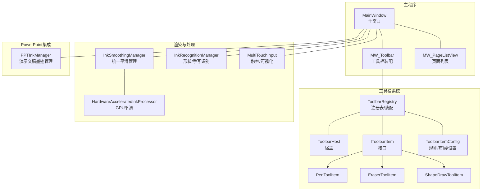
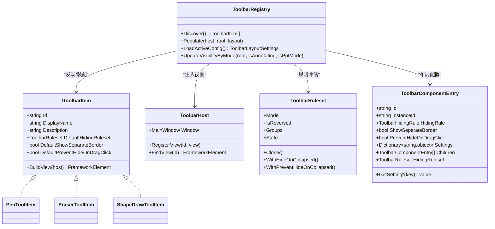
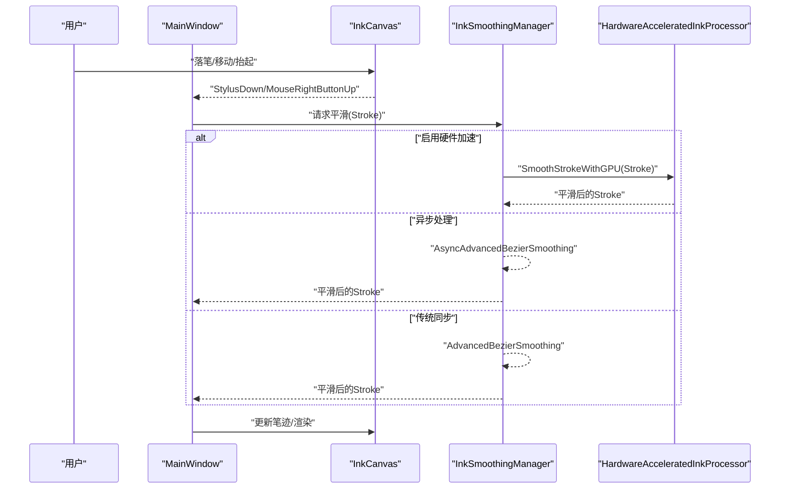
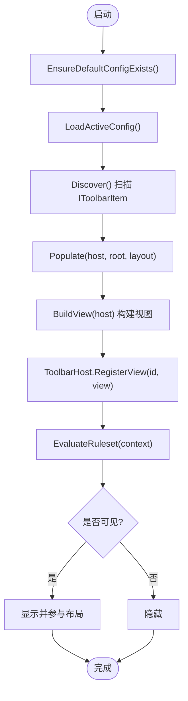
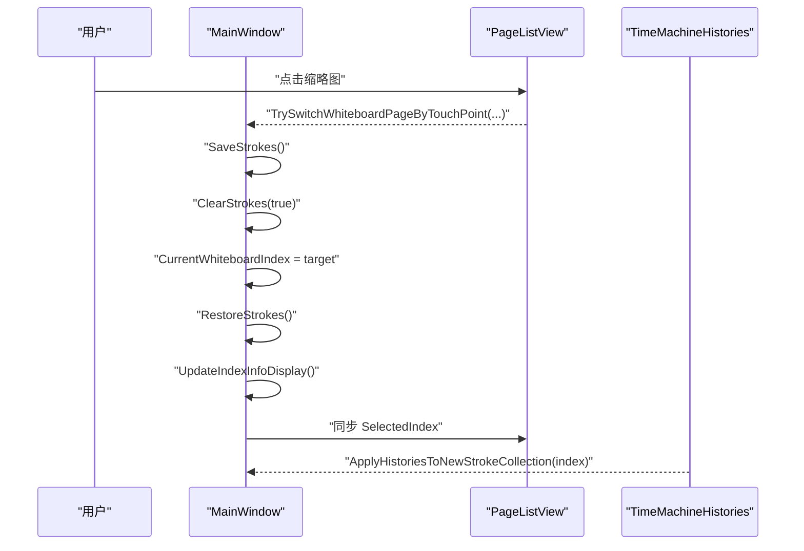
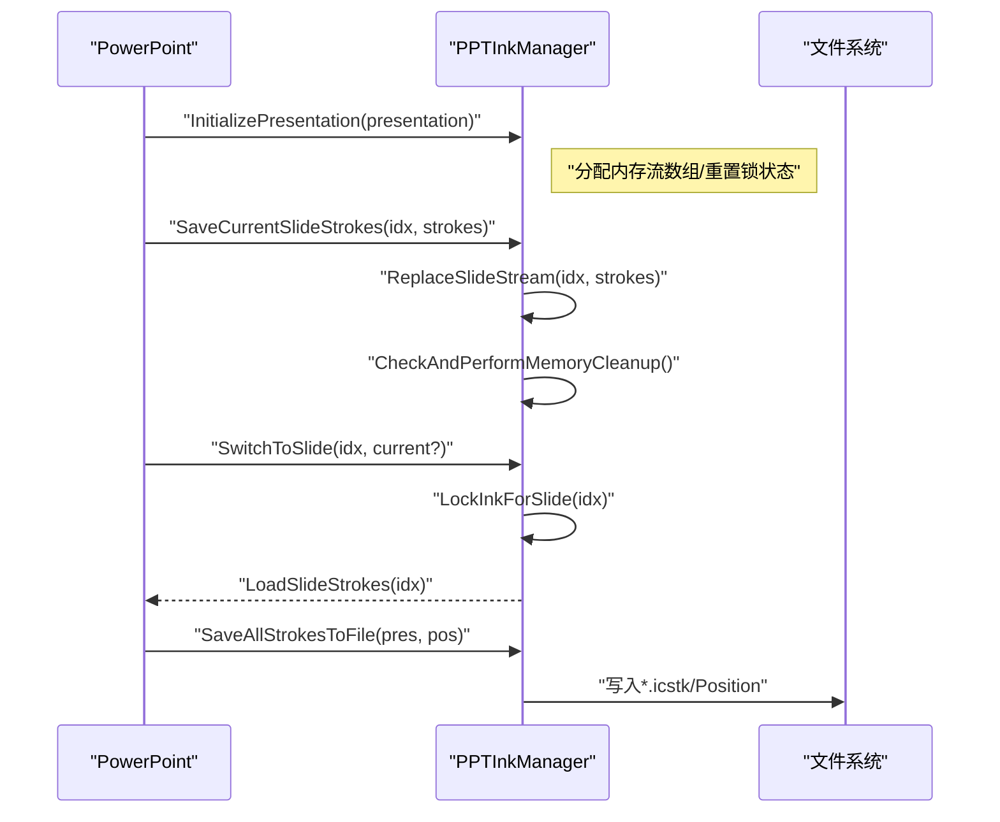
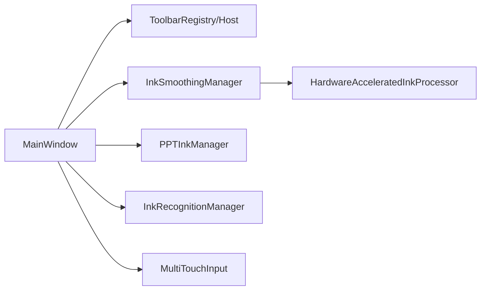

# 核心功能模块

## 简介
本文件面向 InkCanvasForClass 的核心功能模块，围绕以下主题展开：白板书写系统的工作原理、笔迹渲染技术与实时交互机制；工具栏系统的架构设计（可配置项、拖拽排序、自定义扩展）；页面管理（多页面、切换、属性）；颜色与笔刷管理（颜色选择器、笔刷预设、自定义笔刷）；PowerPoint 集成（演示模式、幻灯片导航同步、墨迹传输）；手势识别、形状绘制与擦除功能。文档提供流程图、时序图与类图帮助理解，并给出使用示例、配置要点与性能优化建议。

## 项目结构
- 主窗口与核心逻辑集中在 MainWindow 及其部分分部文件（如 MW_Toolbar、MW_PageListView 等）
- 工具栏系统位于 Controls/Toolbar，采用注册表 + 配置文件 + 运行时装配的方式
- 墨迹处理与渲染涉及 Helpers 下的平滑、识别、多点触控等模块
- PowerPoint 集成通过 PPTInkManager 管理每页墨迹的内存与持久化

## 核心组件
- 工具栏系统：通过 ToolbarRegistry 发现 IToolbarItem 实现，按配置文件装配到 ToolbarHost，支持规则驱动的可见性控制与可扩展的自定义项
- 页面管理：维护多 Canvas 页面，提供缩略图列表、触摸/鼠标切换、保存/恢复笔迹
- 墨迹平滑与渲染：InkSmoothingManager 统一调度异步/硬件加速/传统三种路径；HardwareAcceleratedInkProcessor 使用 GPU 进行贝塞尔曲线平滑；MultiTouchInput 提供触控可视化
- PowerPoint 集成：PPTInkManager 管理每页墨迹内存、自动保存/加载、切换保护与内存清理
- 形状识别与手写识别：InkRecognitionManager 抽象 WinRT/IACore 识别路径，支持形状识别与手写美化

## 架构总览
工具栏系统采用“发现-装配-规则评估”的三层架构：
- 发现层：扫描程序集，实例化 IToolbarItem 实现
- 装配层：根据配置文件（JSON）将条目构建为视图并注入 ToolbarHost
- 规则层：按上下文（注释模式、PPT模式、用户折叠）动态决定可见性

## 详细组件分析

### 白板书写系统与笔迹渲染
- 输入事件与笔迹采集：MainWindow 注册 StylusDown/MouseRightButtonUp 等事件，结合 InkCanvas 的 EditingMode 控制书写/擦除/选择
- 平滑与渲染：InkSmoothingManager 根据设置选择异步/硬件加速/传统路径；HardwareAcceleratedInkProcessor 使用 RenderTargetBitmap + PathGeometry 进行 GPU 加速平滑；MultiTouchInput 提供 StrokeVisual 与 VisualCanvas，按压感绘制线段
- 性能监控：InkSmoothingManager 内置性能监视器，记录处理耗时并提供统计

### 工具栏系统：可配置、可扩展、可排序
- 发现与装配：ToolbarRegistry.Discover 扫描 IToolbarItem 实现，Populate 按布局配置构建视图并注入 ToolbarHost
- 规则与可见性：ToolbarRuleset/Group/Rule 支持 And/Or/反转组合，结合上下文（注释/PPT/折叠）动态隐藏/显示
- 自定义扩展：IToolbarItem 接口定义了 BuildView(host)；内置 Pen/Erase/ShapeDraw 等条目通过 ToolbarImageButtonItemBase 便捷实现
- 配置文件：支持 default.json 与多套布局 JSON，含组件设置（宽高、对齐、边距、透明度、样式等）

### 页面管理：多页面、切换与属性
- 页面容器：MainWindow 维护 whiteboardPages 列表，每页一个 Canvas；ShowPage 切换当前 Canvas
- 缩略图列表：RefreshBlackBoardSidePageListView 生成历史与当前页的缩略图；TrySwitchWhiteboardPageByTouchPoint 支持触摸命中测试与切换
- 保存/恢复：切换前 SaveStrokes，切换后 RestoreStrokes，保持每页独立笔迹

### 颜色与笔刷管理：选择器、预设与自定义
- 笔刷弹层：PenPalette/BoardPenPalette 提供笔型、笔尖模式、压感叠加、激光笔淡入淡出、透明度/宽度等
- 颜色主题：支持主题切换按钮，快速在默认/高亮/激光笔颜色间切换
- 快速调色板：QuickColorPaletteControl 通过 ToolbarHost 查找并联动当前笔刷颜色

### PowerPoint 集成：演示模式、导航同步与墨迹传输
- 演示文稿初始化：InitializePresentation 分配内存流数组，按幻灯片数量扩容
- 墨迹保存/加载：SaveCurrentSlideStrokes/LoadSlideStrokes/SwitchToSlide；支持强制保存与自动保存
- 切换保护：LockInkForSlide/CanWriteInk 防止翻页冲突；快速切换保护避免抖动
- 内存管理：CheckAndPerformMemoryCleanup/CleanupInactiveSlideStrokes 控制内存上限
- 自动保存：SaveAllStrokesToFile/LoadSavedStrokes 支持磁盘持久化与位置记录

### 手势识别、形状绘制与擦除
- 手势识别：InkRecognitionManager 抽象 WinRT/IACore 路径，提供形状识别与手写美化
- 形状绘制：ShapeDrawToolItem 将点击事件转发至 MainWindow 的图形绘制入口，配合 ShapeDraw 弹层
- 擦除：EraserToolItem 将点击事件转发至 MainWindow 的擦除入口，支持整页/按笔迹擦除

## 依赖关系分析
- 组件耦合
  - MainWindow 依赖 ToolbarHost/Registry 进行工具栏装配与可见性控制
  - InkSmoothingManager 依赖 HardwareAcceleratedInkProcessor 或传统平滑算法
  - PPTInkManager 依赖内存流与文件系统，受自动保存配置影响
- 规则与配置
  - ToolbarRuleset/ComponentEntry 决定条目的可见性与布局
  - InkSmoothingConfig 决定平滑策略与并发任务数
- 外部依赖
  - Windows Ink/WinRT API 用于形状识别与手写识别
  - PowerPoint Interop 用于演示文稿控制

## 性能考量
- 墨迹平滑
  - 推荐配置：四核以上且支持硬件加速时启用高质量与并发任务；低性能设备降级为高性能模式
  - 异步处理：避免阻塞 UI 线程；超时保护与取消令牌
- 渲染与缓存
  - 使用 RenderTargetBitmap + DrawingVisual + BitmapCache 提升 GPU 渲染效率
  - StrokeVisual 分批提交，减少频繁创建视觉对象
- 内存管理
  - PPTInkManager 设定 100MB 内存上限，定期清理不活跃页
  - 内存流数组按幻灯片数量扩容，避免越界
- 触控与交互
  - MultiTouchInput 对压感进行线性映射，兼顾观感一致性
  - 页面切换加入快速切换保护，避免频繁 IO

## 故障排查指南
- 工具栏不显示/错位
  - 检查配置文件是否存在与可读；确认 ToolbarRegistry.LoadActiveConfig 返回有效布局
  - 使用 UpdateVisibilityByMode 检查上下文（注释/PPT/折叠）是否导致隐藏
- 平滑失败或卡顿
  - 检查 InkSmoothingConfig 设置；确认硬件加速可用性
  - 查看性能统计与日志，定位耗时瓶颈
- PowerPoint 墨迹丢失/错乱
  - 确认 LockInkForSlide/CanWriteInk 期间未进行跨页写入
  - 检查自动保存路径权限与磁盘空间
- 触控绘制异常
  - 检查 MultiTouchInput 的压感映射与 StrokeVisual 提交阈值
  - 确保 VisualCanvas 的缓存与渲染选项正确

## 结论
InkCanvasForClass 的核心功能以模块化与可配置为核心设计原则：工具栏系统通过规则与配置实现灵活可见性；页面管理保障多页场景下的稳定切换；渲染与平滑结合硬件加速与异步处理提升性能；PowerPoint 集成提供可靠的墨迹持久化与切换保护；手势识别与形状绘制完善书写体验。建议在部署时根据设备性能调整平滑策略与并发任务数，并为工具栏与页面管理提供完善的配置文件与回退机制。

## 附录
- 使用示例（步骤化）
  - 工具栏自定义：实现 IToolbarItem，提供 Id/DisplayName/Description/BuildView；通过配置文件将条目加入布局
  - 页面切换：在 PageListView 点击缩略图，触发 TrySwitchWhiteboardPageByTouchPoint 完成保存/切换/恢复
  - PowerPoint 墨迹：初始化演示文稿后，按页调用 SaveCurrentSlideStrokes；放映结束调用 SaveAllStrokesToFile
  - 平滑优化：在设置中启用硬件加速与异步平滑，或根据设备性能选择推荐配置
- 配置选项
  - 工具栏：组件设置（宽高/对齐/边距/透明度/样式）、规则（And/Or/反转）、分组与独立边框
  - 平滑：质量等级、插值步数、重采样间隔、并发任务数、是否启用硬件加速
  - PPT：自动保存开关、保存路径、最大幻灯片数、内存上限
- 性能优化建议
  - 优先启用硬件加速与异步处理
  - 合理设置并发任务数，避免 CPU/GPU 过载
  - 定期清理不活跃页面的内存缓存
  - 使用 StrokeVisual 的批量提交阈值减少视觉对象创建
