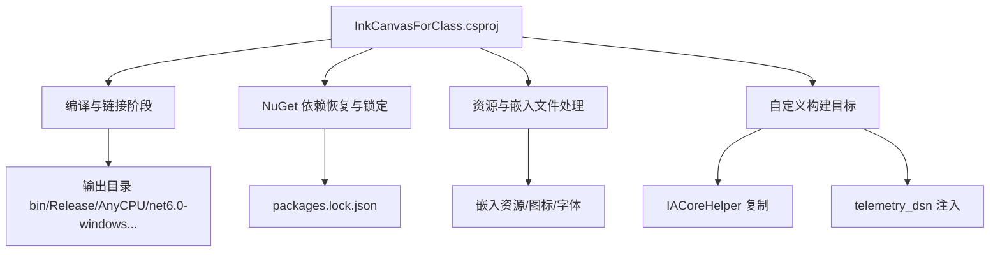
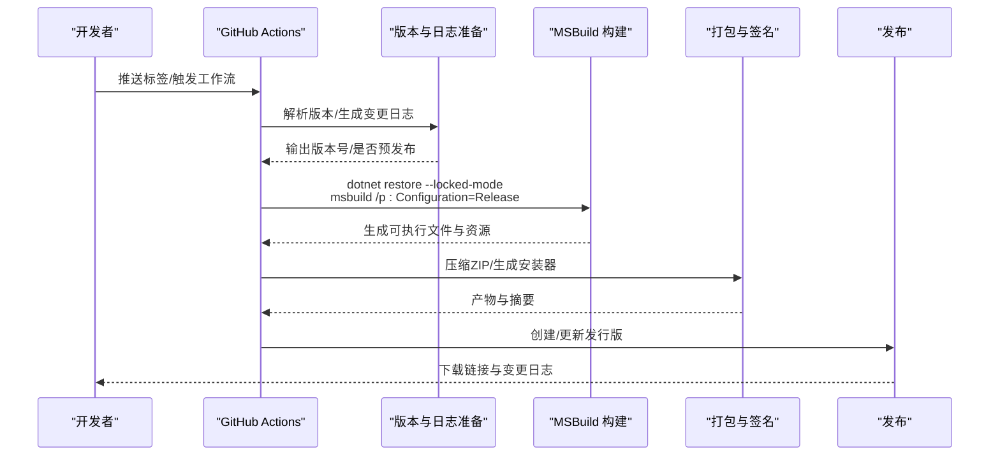
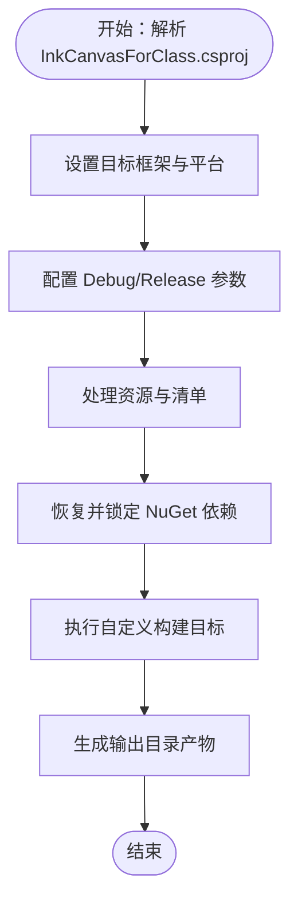
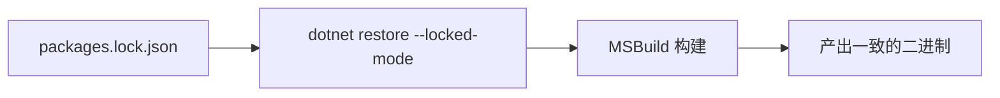
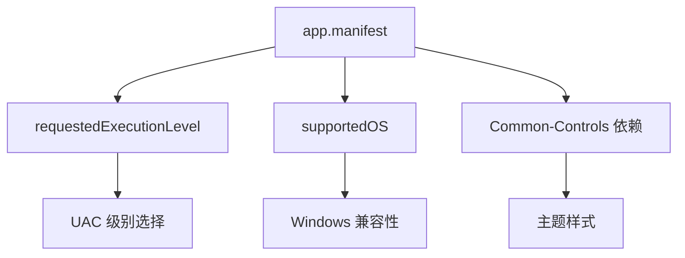
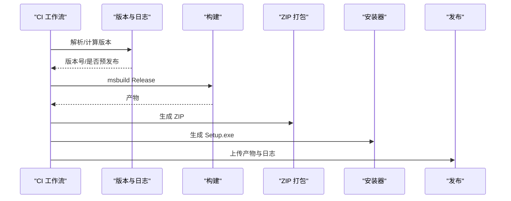
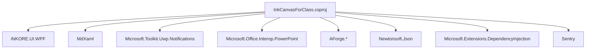

# 构建与发布

## 简介
本文件面向 InkCanvasForClass 的构建与发布，聚焦以下主题：
- MSBuild 构建配置：项目文件结构、编译参数、输出目录与平台目标
- 依赖管理策略：NuGet 包管理、packages.lock.json 锁定机制与版本固定
- 应用程序清单 app.manifest：UAC 权限、兼容性与图标资源引用
- 发布流程：版本号管理、产物打包与发布渠道
- CI/CD 工作流：自动化构建、测试与发布部署
- 常见构建问题与解决方案

## 项目结构
InkCanvasForClass 为 WPF/WPF 桌面应用，采用 .NET 6 目标框架，并通过 MSBuild 进行构建。项目文件中定义了多平台目标（win-x86/win-x64/win-arm64）、调试与发布配置、资源嵌入与外部依赖、以及自定义构建目标（如 IACore 辅助程序复制、遥测 DSN 注入）。

## 核心组件
- 项目文件（MSBuild）：定义目标框架、平台、调试符号、输出类型、资源与依赖、COM 引用、自定义目标等
- 应用程序清单（app.manifest）：声明 UAC 请求级别、兼容性 OS 支持、公共控件主题依赖
- 依赖锁定（packages.lock.json）：固定 NuGet 包版本，确保可重复构建
- CI/CD 工作流：PR 检查、预发布与变更日志生成、构建与打包、发布

## 架构总览
下图展示从源码到发布产物的关键步骤：CI 触发 → 版本与变更日志准备 → MSBuild 构建 → 产物打包 → 发布渠道。

## 详细组件分析

### MSBuild 构建配置
- 目标框架与平台
  - 目标框架：net6.0-windows10.0.19041.0
  - 平台标识：win-x86;win-x64;win-arm64
  - 平台目标：AnyCPU/x86/x64/ARM64（不同平台配置差异）
- 编译参数与输出
  - 输出类型：WinExe
  - 调试符号：Debug 使用 embedded；Release 使用 embedded/pdbonly（按平台）
  - 输出目录：bin\$(Configuration)\$(Platform)\，并带有 TFM 子目录
  - 高 DPI：Per Monitor V2
- 资源与图标
  - 应用图标：Resources\icc.ico
  - 清单文件：app.manifest
  - 嵌入资源：IACore DLL、音效、字体、图标集等
- 自定义目标
  - CopyIACoreHelper：构建后复制 IACoreHelper 可执行文件至输出目录
  - GenerateTelemetryDsn/CleanTelemetryDsn：根据环境变量注入/清理遥测 DSN 文件
- 项目引用与 COM 引用
  - 项目引用：InkCanvas.PluginSdk、InkCanvas.Controls、InkCanvas.IACoreHelper（非随本项目输出）
  - COM 引用：Wsh、stdole（运行时类型不同分支处理）

### 依赖管理策略与版本锁定
- NuGet 包管理
  - 通过 packages.lock.json 固定版本，确保跨环境一致
  - 项目文件中声明直接依赖（如 Newtonsoft.Json、Microsoft.Extensions.DependencyInjection、AForge.* 系列、Sentry 等）
- 锁定机制
  - CI 中使用 dotnet restore --locked-mode，强制使用锁定文件
  - 本地开发建议使用锁定模式以避免漂移
- 传递依赖
  - packages.lock.json 展示了 transitive 依赖树，有助于审计与排障

### 应用程序清单 app.manifest
- UAC 权限
  - 默认请求级别为 asInvoker，不提升权限；可根据需要调整
  - uiAccess=false，避免 UIAccess 场景
- 兼容性
  - supportedOS 节点已注释，未显式声明支持的 Windows 版本
- 公共控件主题
  - 依赖 Microsoft.Windows.Common-Controls v6，确保主题样式生效

### 发布流程
- 版本号管理
  - 语义化版本（主.次.修订.构建），CI 根据标签或交互输入计算新版本
  - 预发布：当构建号非 0 时视为预发布
- 产物打包
  - ZIP：包含完整运行时产物
  - 安装器：使用 Inno Setup 脚本生成 Setup.exe
- 发布渠道
  - GitHub Releases：上传 ZIP 与安装器，并附带变更日志
  - 分类归档：Release/Beta 目录区分正式与预发布

### CI/CD 工作流配置示例
- PR Check（prcheck.yml）
  - 触发条件：PR 打开/同步，忽略 Markdown 变更
  - 步骤：安装 MSBuild/dotnet → 恢复依赖（锁定模式）→ 构建 Debug → 上传产物工件
- .NET Build & Package（dotnet-desktop.yml）
  - 触发条件：推送到 net6 分支或手动触发
  - 步骤：安装工具 → 恢复依赖（锁定模式）→ 构建 Debug → 上传工件
- 预发布与变更日志（prerelease.yml）
  - 触发条件：推送标签或手动触发
  - 步骤：版本解析/计算 → 生成变更日志 → 构建 Release → 产物打包 → 上传工件 → 创建/更新发行版

## 依赖分析
- 直接依赖（节选）
  - UI 与现代化控件：iNKORE.UI.WPF、iNKORE.UI.WPF.Modern
  - 文档渲染：MdXaml
  - 通知：Microsoft.Toolkit.Uwp.Notifications
  - 办公集成：Microsoft.Office.Interop.PowerPoint、MicrosoftOfficeCore
  - 摄像头/视频：AForge.Video、AForge.Video.DirectShow、AForge.Imaging、AForge.Math
  - JSON：Newtonsoft.Json
  - 依赖注入：Microsoft.Extensions.DependencyInjection
  - 错误上报：Sentry
- 间接依赖
  - 通过 packages.lock.json 可见各包的 transitive 依赖链，便于审计与回滚

## 性能考虑
- 构建并发与缓存
  - 使用多工具任务与最大 CPU 数量参数提升并行度
  - dotnet cache 与 packages.lock.json 缓解依赖恢复时间
- 资源与体积
  - 嵌入 IACore 与大量图标/字体资源会增大体积，建议在发布前评估必要性
- 调试符号
  - Release 使用嵌入或 pdbname，减少符号文件体积；Debug 使用 full/pdbonly 以平衡调试与体积

## 故障排查指南
- 依赖恢复失败
  - 确认使用 --locked-mode，且网络可达 nuget 源
  - 检查 packages.lock.json 是否与项目文件一致
- 平台目标不匹配
  - 确认 Platform 与 RuntimeIdentifiers 设置一致，避免运行时缺失
- UAC 提升导致行为异常
  - 若需管理员权限，修改 app.manifest 的 requestedExecutionLevel
- COM 组件冲突
  - PowerPoint 与 WPS Office 冲突可能导致 PPT 模式不可用，按 README 的建议修复
- 遥测 DSN 注入
  - 本地构建可通过环境变量注入 DSN；CI 中通过 secrets 注入

## 结论
本项目通过明确的 MSBuild 配置、严格的依赖锁定与完善的 CI/CD 流程，实现了可重复、可追溯的构建与发布。建议在团队内统一遵循锁定模式与平台目标策略，并在发布前核对清单与资源占用，以确保交付质量与一致性。

## 附录

### 常用构建命令与参数
- 本地构建（示例）
  - dotnet restore "Ink Canvas.sln" --locked-mode
  - msbuild /p:platform="AnyCPU" /p:configuration="Release" "Ink Canvas/InkCanvasForClass.csproj" /m /p:UseMultiToolTask=true /p:EnforceProcessCountAcrossBuilds=true -maxcpucount
- CI 中使用
  - 在工作流中调用上述命令，结合 secrets 与环境变量完成注入与打包

章节来源
