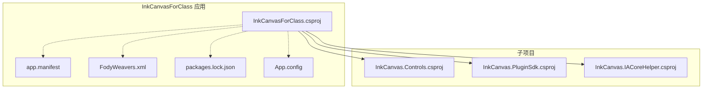
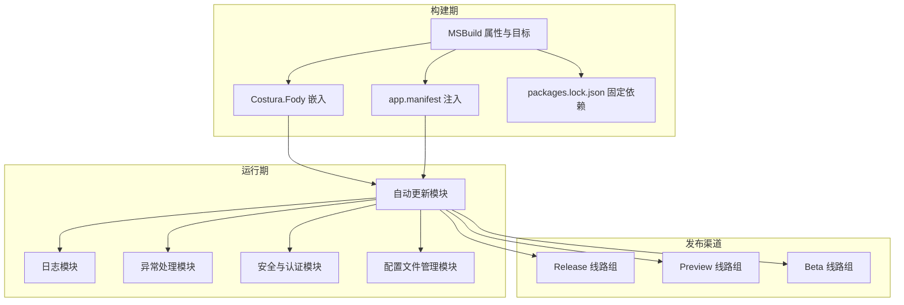
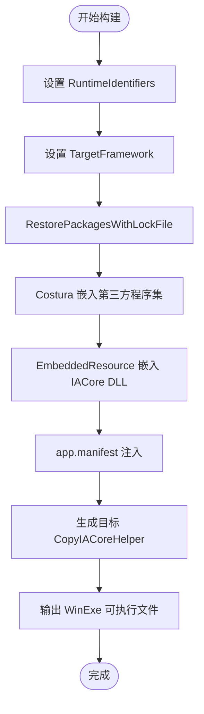
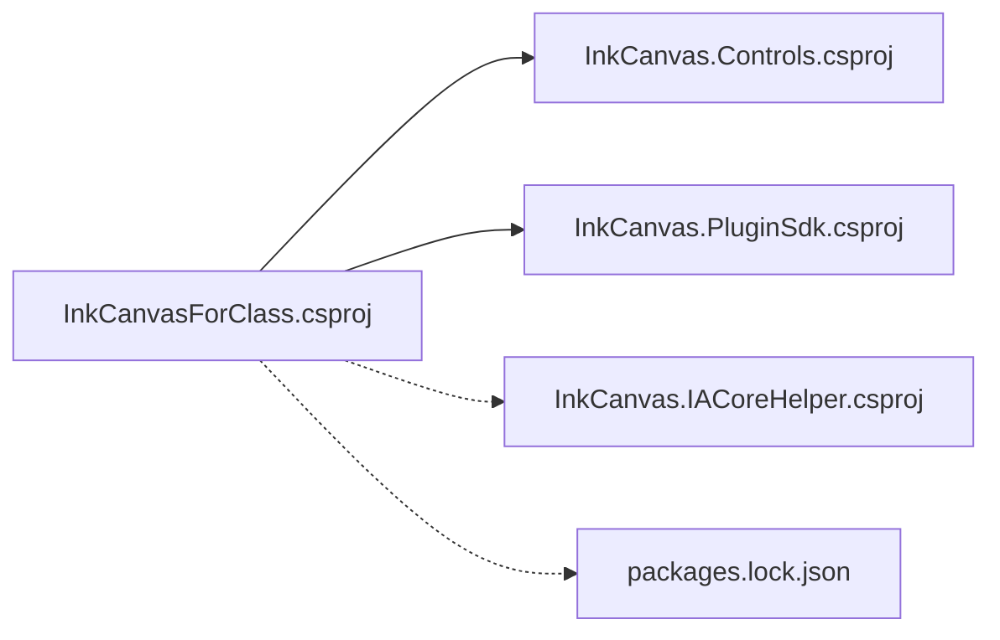

# 部署与运维

## 简介
本文件面向 InkCanvasForClass 的部署与运维团队，提供从构建配置、发布流程、安装包制作、依赖管理、版本控制与发布渠道、自动更新机制、日志与监控、安全加固到故障排除与运维工具的完整实践指南。文档严格基于仓库中的实际源码与配置文件进行分析与总结，确保可落地、可复现。

## 项目结构
InkCanvasForClass 是一个基于 .NET 6 的 WPF 应用，采用多项目组合与打包策略，核心工程位于 Ink Canvas/InkCanvasForClass.csproj，配套资源、控件库与辅助模块分别位于 InkCanvas.Controls、InkCanvas.PluginSdk、InkCanvas.IACoreHelper 等子项目中。项目通过 Costura.Fody 实现嵌入式打包，减少外部依赖暴露；通过 app.manifest 控制 UAC 与兼容性；通过 packages.lock.json 固定依赖版本，确保可重复构建。

## 核心组件
- 构建与打包
  - 多目标平台：win-x86、win-x64、win-arm64
  - 平台标识与输出类型：WinExe
  - 依赖锁定：RestorePackagesWithLockFile=true
  - 打包策略：Costura.Fody 嵌入第三方程序集，IACore 系列 DLL 通过 EmbeddedResource 嵌入
  - 清单与清单注入：app.manifest 注入，生成阶段 CopyIACoreHelper 目标复制 IACoreHelper 可执行文件
- 自动更新
  - 多通道与多线路组：Release/Preview/Beta 三通道，每通道含多个下载线路
  - 测速与优选：并发 HEAD 请求测速，缓存 15 分钟，优先 inkeys 线路
  - 下载与覆盖：按文件白名单覆盖，支持 x64 后缀拼接
- 日志与异常
  - 日志：统一写入 Log.txt 或按启动时间归档，支持大小上限清理
  - 异常：集中处理与分级记录，区分可继续执行与致命异常
- 安全与配置
  - 密码与TOTP：PBKDF2 派生与固定时间比较，TOTP 6 位动态口令
  - 配置文件：多配置文件保存、切换与热重载支持
- 运行时与兼容性
  - .NET 6 目标框架，Windows 10 最低版本约束
  - UAC 策略：asInvoker，禁用虚拟化以提升兼容性
  - 传统运行时兼容：App.config 启用 Legacy V2 激活策略

## 架构总览
下图展示了应用的部署与运维相关架构：构建期（MSBuild + Costura + 清单注入）、运行期（自动更新、日志、异常、安全与配置管理）以及发布渠道（多线路组）。

## 详细组件分析

### 构建与发布配置（MSBuild 与打包）
- 多平台与目标框架
  - RuntimeIdentifiers 指定 win-x86/win-x64/win-arm64
  - TargetFramework 为 net6.0-windows10.0.19041.0
  - UseWPF/UseWindowsForms 启用
- 打包与嵌入
  - Costura.Fody 嵌入第三方程序集，排除 IACore/IALoader/IAWinFX
  - IACore 系列 DLL 通过 EmbeddedResource 嵌入
  - 生成阶段 CopyIACoreHelper 目标复制 IACoreHelper 输出至运行目录
- 依赖锁定与版本
  - RestorePackagesWithLockFile=true
  - packages.lock.json 固定依赖版本，避免漂移
- 清单与 UAC
  - app.manifest 设置 requestedExecutionLevel 为 asInvoker，禁用虚拟化
  - Common-Controls 依赖声明
- 传统运行时兼容
  - App.config 启用 Legacy V2 激活策略，兼容旧版 .NET Framework 运行时

## 依赖关系分析
- 项目间依赖
  - InkCanvasForClass.csproj 依赖 InkCanvas.Controls 与 InkCanvas.PluginSdk
  - IACoreHelper 作为独立项目，构建后复制到运行目录
- 第三方依赖
  - WPF/WinUI、通知、PowerPoint 互操作、JSON、依赖注入、摄像头与视频处理、WebDAV 客户端、Sentry 崩溃上报等
- 依赖锁定
  - packages.lock.json 固定版本，避免构建漂移

## 性能考量
- 自动更新测速缓存：15 分钟 TTL，降低频繁测速开销
- 并发测速：多线路组并发 HEAD 请求，缩短选择时间
- 嵌入式打包：减少外部依赖查找与加载开销
- 日志轮转：按大小清理，避免磁盘膨胀影响 IO
- UAC 策略：asInvoker 禁用虚拟化，减少权限切换与兼容性问题

[本节为通用指导，无需特定文件引用]

## 故障排除指南
- 启动失败
  - 检查 .NET 6 运行时是否安装
  - 若缺失，安装 .NET 6.0 或更高版本
- PowerPoint 模式切换异常
  - 确认 Office 已激活
  - 确保 PowerPoint 与应用在同一权限级别运行
- 图标显示异常（Windows 10 以下）
  - 安装 Segoe MDL2 字体
- 自动更新失败
  - 检查网络连通性与代理
  - 查看日志文件定位具体错误
- 配置文件损坏
  - 使用多配置文件功能恢复或删除后重建

## 结论
InkCanvasForClass 的部署与运维围绕“可重复构建、可观察、可回滚、可审计”展开：通过 MSBuild 与 Costura 实现稳定打包；通过多线路组与测速缓存保障更新可靠性；通过日志与异常处理实现可观测性；通过密码与 TOTP 提升安全性；通过多配置文件与热重载实现可运维性。结合本文提供的流程与最佳实践，可高效完成从构建到发布的全流程自动化与标准化运维。

[本节为总结，无需特定文件引用]

## 附录

### A. 构建与发布流程（步骤级）
- 准备
  - 确保 .NET 6 SDK、MSBuild、Git 工具链就绪
  - 确认 packages.lock.json 与 Fody/Costura 配置
- 构建
  - 恢复依赖：dotnet restore --locked-mode
  - 构建：dotnet build -c Release -r win-x64 --self-contained true -p:IncludeNativeLibrariesForSelfExtract=true
  - 生成安装包：使用 Inno Setup 或 WiX 等工具打包（依据项目需求）
- 发布
  - 上传版本文件与更新日志至发布渠道
  - 更新版本检测文件与下载地址