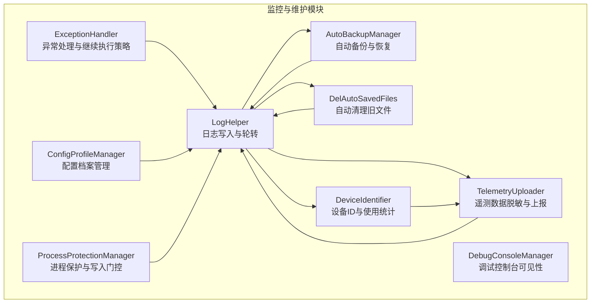
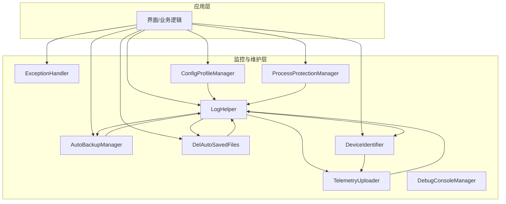
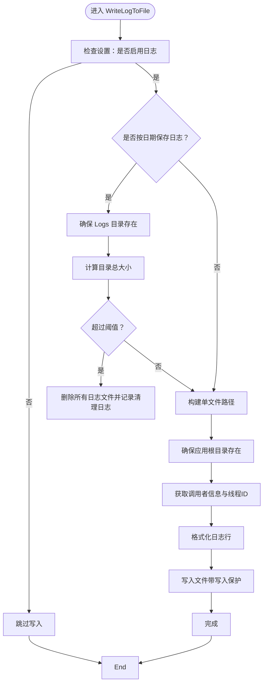
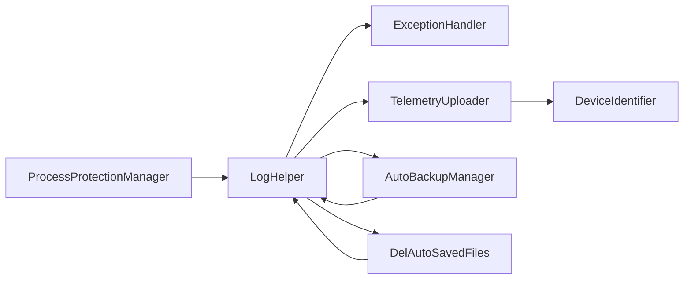

# 监控与维护

## 简介
本文件面向 InkCanvasForClass 的监控与维护场景，围绕日志体系、性能监控、遥测采集、异常与告警、维护工具与脚本、监控仪表板与关键指标、维护计划与执行流程等方面，提供系统化说明与实操建议。文档严格基于仓库现有实现进行分析与总结，帮助维护人员快速定位问题、制定策略并持续改进系统稳定性与可观测性。

## 项目结构
InkCanvasForClass 的监控与维护相关能力主要集中在 Helpers 子目录中，涵盖日志、异常处理、遥测、备份、清理、调试控制台、配置档案、设备与使用统计、进程保护等模块。这些模块共同构成应用的可观测性与可维护性基础。

**图示来源**

## 核心组件
- 日志与轮转：统一日志入口，支持按启动时间归档、大小限制清理、线程安全写入、调用者信息与时间戳记录。
- 异常处理：集中异常捕获、上下文记录、是否继续执行的策略判断。
- 遥测与脱敏：基于 Sentry 的遥测事件上报，包含设备ID、版本、渠道、崩溃/运行日志脱敏附件。
- 自动备份与恢复：按周期自动备份配置，支持从最新备份恢复，清理过期备份。
- 自动清理：按天数阈值清理特定扩展名与关键文件，递归删除空目录。
- 调试控制台：可显隐调试控制台，避免误关导致进程退出。
- 配置档案：多配置文件保存、切换与热重载支持。
- 设备ID与使用统计：设备唯一标识生成与持久化，使用频率与更新优先级计算。
- 进程保护：对关键目录与文件加锁，写入时临时释放并恢复，写入门控与降级策略。

## 架构总览
下图展示监控与维护各模块之间的交互关系与数据流向，强调日志作为中枢的作用，以及遥测、备份、清理、统计等模块如何围绕日志与配置协同工作。

**图示来源**

## 详细组件分析

### 日志收集与分析机制
- 日志级别与内容
  - 支持 Info、Trace、Error、Event、Warning 等级别，日志行包含时间戳、线程ID、级别、调用者信息。
  - 异常日志包含类型、消息、堆栈，以及内层异常信息。
- 日志文件管理
  - 单文件模式：写入应用根目录下的固定文件。
  - 按启动时间归档：开启按日期保存时，日志写入 Logs/Log_{AppStartTime}.txt，并在目录超过大小阈值时清空。
- 日志轮转策略
  - 通过检查 Logs 目录总大小（阈值为固定值）来触发清理，删除全部文件并追加清理记录。
- 线程安全与递归防护
  - 写入过程采用原子标记防止递归写入，避免死循环。
- 调试输出
  - 日志同时写入调试控制台，便于开发与诊断。

**图示来源**

## 依赖关系分析
- 模块耦合
  - 日志模块是中枢，被异常、遥测、备份、清理、统计等模块广泛依赖。
  - 遥测依赖设备ID模块与日志模块。
  - 备份与清理依赖日志模块与进程保护模块。
- 外部依赖
  - 遥测通过 Sentry SDK 上报。
  - 进程保护依赖系统文件句柄与共享句柄。
- 循环依赖
  - 未发现直接循环依赖；日志为单向依赖中心。

**图示来源**

## 性能考虑
- 日志写入
  - 采用线程安全标记与写入保护，避免阻塞主线程；建议在高频路径减少日志粒度。
- 遥测上传
  - 异步执行，失败时记录警告；建议在弱网环境下降低上传频率。
- 备份与清理
  - 大文件复制与目录遍历可能阻塞，建议在空闲时段执行或分批处理。
- 进程保护
  - 锁定大量文件与目录会增加系统开销，建议仅对关键路径启用。

## 故障排查指南
- 日志无法写入
  - 检查日志开关与路径权限，确认进程保护未阻塞写入。
- 日志丢失或被覆盖
  - 确认是否启用按日期保存与轮转阈值，核对 Logs 目录清理记录。
- 遥测未上报
  - 检查隐私同意、设备ID有效性、网络连通性与 Sentry 配置。
- 备份失败
  - 检查配置文件是否存在、备份目录权限、上次备份时间更新。
- 清理未生效
  - 检查天数阈值与扩展名匹配规则，确认空目录递归删除逻辑。
- 调试控制台不可见
  - 确认控制台已显示且未被误关闭，必要时重新显示。
- 进程保护冲突
  - 检查写入门控超时与降级执行日志，确认受保护目录范围。

## 结论
InkCanvasForClass 的监控与维护体系以日志为核心，辅以异常处理、遥测、备份、清理、调试控制台、配置档案、设备与使用统计、进程保护等模块，形成了较为完整的可观测性与可维护性闭环。建议在现有基础上完善性能埋点、建立仪表板与告警规则，并制定标准化的维护计划与应急流程，持续提升系统的稳定性与可运维水平。

## 附录
- 关键实现参考路径