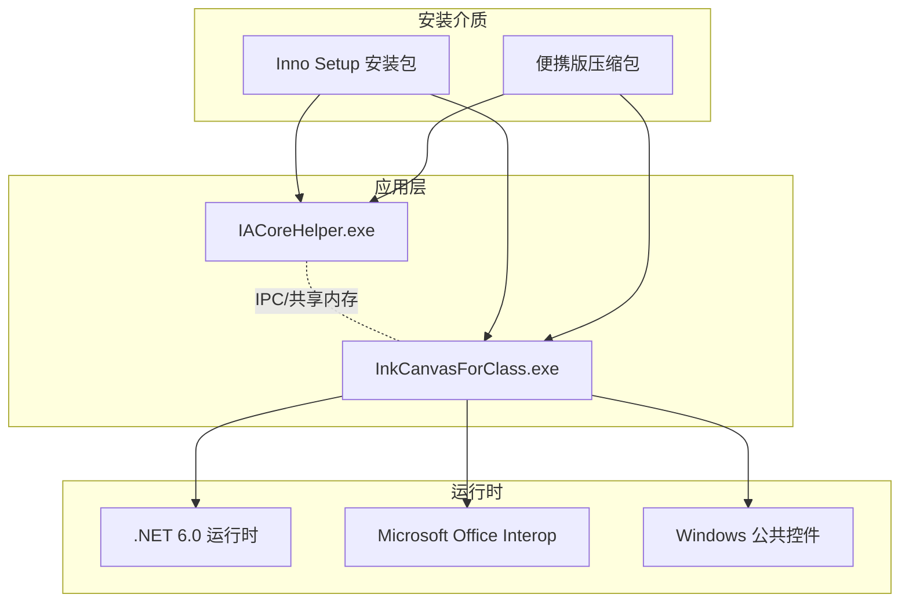
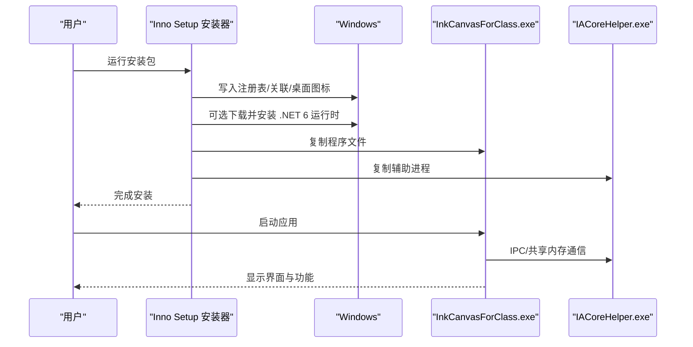
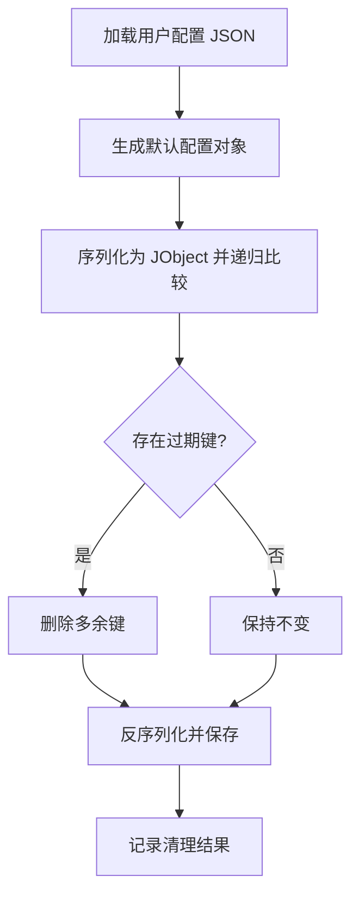
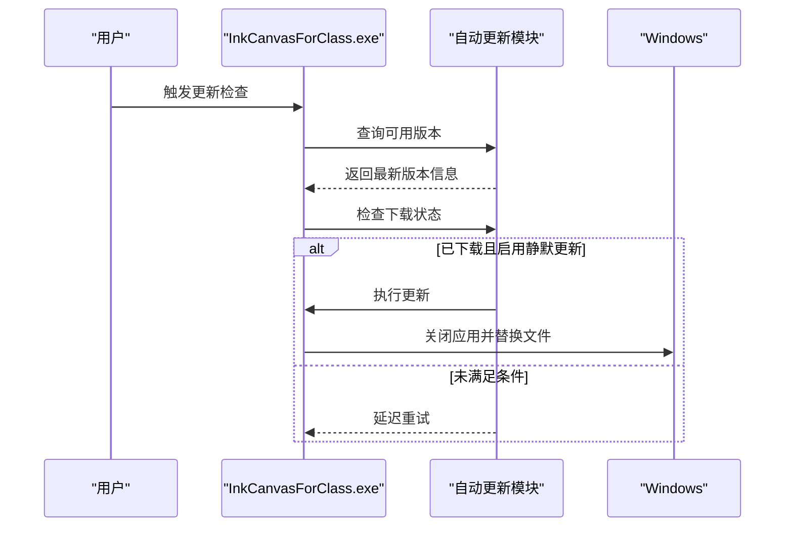
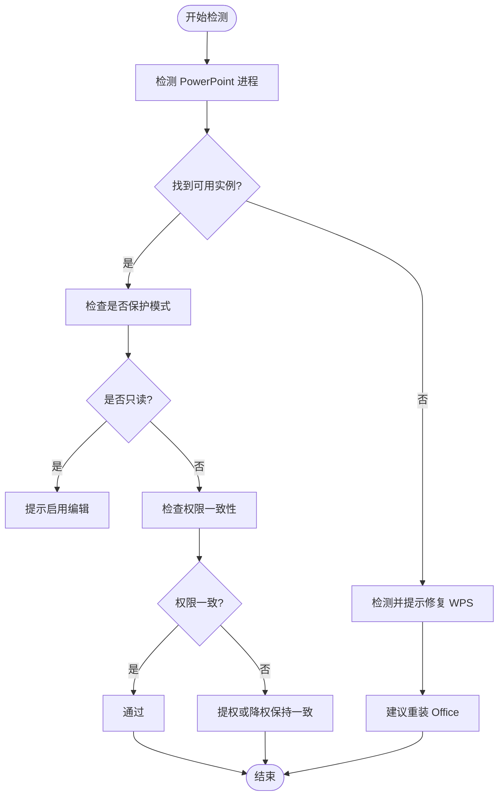
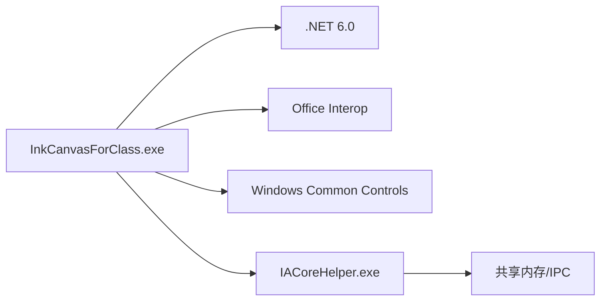

# 系统部署

## 简介
本文件面向系统管理员与部署工程师，提供 InkCanvasForClass 的系统部署指南。内容涵盖系统要求与前置条件、安装包制作流程、配置文件管理、部署策略（静默安装、升级安装、卸载处理）、系统兼容性检查方法（Office Interop 组件检测、PowerPoint 集成验证、权限检查）、部署脚本示例与批量部署方案，以及常见问题与解决方案。

## 项目结构
InkCanvasForClass 是基于 .NET 6 的 WPF 应用，采用多项目组合与打包策略：
- 主应用项目：InkCanvasForClass.csproj
- 插件 SDK：InkCanvas.PluginSdk.csproj
- 控件库：InkCanvas.Controls.csproj
- IACore 辅助进程：InkCanvas.IACoreHelper.csproj
- 构建与安装：Inno Setup 脚本 InkCanvasForClass CE.iss
- 运行时清单与配置：app.manifest、App.config、packages.lock.json、FodyWeavers.xml

## 核心组件
- 应用程序主体：InkCanvasForClass.exe，负责主界面、工具栏、PPT 集成、自动更新、通知等。
- IACore 辅助进程：IACoreHelper.exe，负责与 IACore 通信（IPC/共享内存），支持手写识别等。
- Office Interop：通过 Microsoft.Office.Interop.PowerPoint 与 Office 集成，实现 PPT 演示模式联动。
- 安装与打包：Inno Setup 脚本生成安装包，支持下载并静默安装 .NET 6 运行时；同时提供便携版压缩包。

## 架构总览
应用采用“主进程 + 辅助进程”的双进程架构，主进程负责 UI 与业务逻辑，辅助进程负责与 IACore 通信。安装包通过 Inno Setup 自动检测并安装 .NET 6 运行时，支持静默安装与卸载。

## 详细组件分析

### 系统要求与前置条件
- 运行时环境
  - .NET 6.0 或更高版本（安装包可自动下载并静默安装）
  - Windows 10/11（目标框架 net6.0-windows10.0.19041.0）
- Office 集成
  - Microsoft Office PowerPoint（通过 Interop 组件）
  - 建议使用 Microsoft 365，以减少激活与保护模式问题
- 硬件要求
  - 支持 WPF 与 Windows 公共控件的通用 PC 硬件
  - 推荐具备触控/手写笔输入能力的设备以获得最佳体验

### 安装包制作流程
- 产物类型
  - 安装包：Inno Setup 生成的 Setup.exe，包含自动下载并安装 .NET 6 运行时的任务
  - 便携版：压缩包，解压即用
- 关键步骤
  - 清理旧进程与输出目录（遵循编译规范）
  - 构建解决方案（MSBuild/Dotnet）
  - 打包发布文件（Inno Setup 脚本）
  - 生成安装包与便携版压缩包
- 自动化
  - GitHub Actions 已配置构建矩阵（AnyCPU/x86），分别生成不同架构的安装包与压缩包，并计算文件大小、上传制品

### 配置文件管理
- 配置文件位置与命名
  - 默认配置文件：位于用户应用数据目录下的配置文件（随应用启动自动生成）
  - 配置文件切换与热重载：支持在设置页面选择配置文件并热重载
- 配置项说明
  - 配置文件包含多个 Profile，可在设置页面中切换、另存为新配置文件
  - 过期配置项清理：启动时会清理用户配置中不存在于默认配置的键，避免版本升级后的兼容性问题
- 运行时参数与环境变量
  - 通过项目属性与构建脚本注入（如遥测 DSN），可通过环境变量控制构建行为
- 设置项定义
  - Settings.settings 定义了默认 Profile 与空设置集合，实际配置由运行时生成

### 部署策略
- 静默安装
  - 安装包支持静默安装 .NET 6 运行时（/install /quiet /norestart）
  - 可通过任务选择“下载并安装 .NET Runtime 6”
- 升级安装
  - 应用内置自动更新机制，支持静默更新（需满足条件：已下载更新文件、启用静默更新）
  - 更新流程：检测可用版本 → 检查下载状态 → 执行更新并关闭应用
- 卸载处理
  - 卸载时清理注册表关联、桌面图标与开始菜单项
  - 卸载后保留用户配置文件（除非用户主动删除）

### 系统兼容性检查
- Office Interop 组件检测
  - 通过 COM ProgID 检测 PowerPoint 与 WPS PowerPoint 进程，判断可用性
  - 若检测到 WPS 导致 COM 组件损坏，建议卸载 WPS 并安装 Microsoft Office Mondo 2016
- PowerPoint 集成验证
  - 检查 PowerPoint 是否处于保护模式（只读），需用户手动启用编辑
  - 确保 PowerPoint 与应用运行在同一权限级别（均以管理员或均以普通用户运行）
- 权限检查
  - 安装包默认以当前用户安装（可选提升权限）
  - 应用清单默认请求 asInvoker，避免虚拟化影响

### 部署脚本示例与批量部署
- PowerShell 构建脚本（示例）
  - 杀掉所有 inkcanvas 进程
  - 删除所有 bin/obj 目录
  - 使用 dotnet build 构建解决方案
- Inno Setup 安装脚本
  - 自动下载并静默安装 .NET 6 运行时
  - 支持桌面图标创建与卸载清理
- 批量部署建议
  - 使用企业软件分发平台（如 SCCM/Intune）推送安装包
  - 预先在域策略中安装 .NET 6 运行时，减少安装时间
  - 通过组策略或登录脚本设置必要的 Office 权限与激活状态

### 常见问题与解决方案
- 程序无法启动
  - 检查是否安装 .NET 6.0 或更高版本
  - 如仍无法运行，安装 Microsoft Office
- 放映后画板程序不会切换到 PPT 模式
  - PowerPoint 处于保护模式（只读）→ 启用编辑
  - 曾安装 WPS 导致 COM 组件被破坏 → 卸载 WPS 并重装 Microsoft Office Mondo 2016
  - PowerPoint 与应用权限不一致 → 提权或降权保持一致
- 图标显示为方框
  - 下载并安装 Segoe MDL2 字体

## 依赖关系分析
- 运行时依赖
  - .NET 6.0（目标框架 net6.0-windows10.0.19041.0）
  - Windows 公共控件（Common-Controls 6.0）
  - Office Interop（PowerPoint、Office Core）
- 打包与嵌入
  - Costura.Fody 将 IACore 相关 DLL 嵌入或排除，减少外部依赖
  - IACoreHelper 作为独立可执行文件随安装包分发

## 性能考虑
- 启动性能
  - 使用 Per Monitor V2 DPI 模式，减少缩放导致的重绘开销
  - 通过 Costura.Fody 减少动态加载 DLL 的延迟
- 运行时性能
  - IACoreHelper 与主进程通过共享内存通信，降低跨进程调用成本
  - 自动更新采用定时器轮询，避免阻塞主线程

## 故障排查指南
- Office 相关问题
  - 使用 PPTManager 与 ROTPPTManager 检测 PowerPoint 实例与权限一致性
  - 若检测到 WPS，提示卸载并重装 Office
- 权限与虚拟化
  - 安装包默认 asInvoker，避免文件/注册表虚拟化
  - 如需系统级访问，可在安装时选择提升权限
- 硬件指纹与诊断
  - DeviceIdentifier 用于生成硬件指纹，辅助诊断设备相关问题

## 结论
InkCanvasForClass 的部署以 Inno Setup 安装包为核心，结合 .NET 6 运行时自动安装与 Office Interop 集成，提供完整的静默安装、升级与卸载能力。通过严格的配置文件管理与兼容性检查，可有效降低部署与运维复杂度。建议在企业环境中配合软件分发平台与组策略，实现标准化、可审计的批量部署。

## 附录
- 安装包与便携版文件命名约定
  - 安装包：InkCanvasForClass.CE.{版本号}{架构后缀}.Setup.exe
  - 便携版：InkCanvasForClass.CE.{版本号}{架构后缀}.zip
- 卸载注册表清理
  - 清理文件关联、桌面图标与开始菜单项
- 第三方工具支持
  - 通过 SoftwareLauncher 启动第三方摄像头软件（如 EasiCamera），从注册表查找安装路径

章节来源
