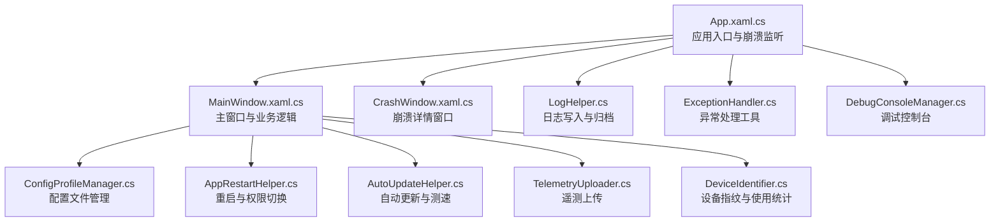
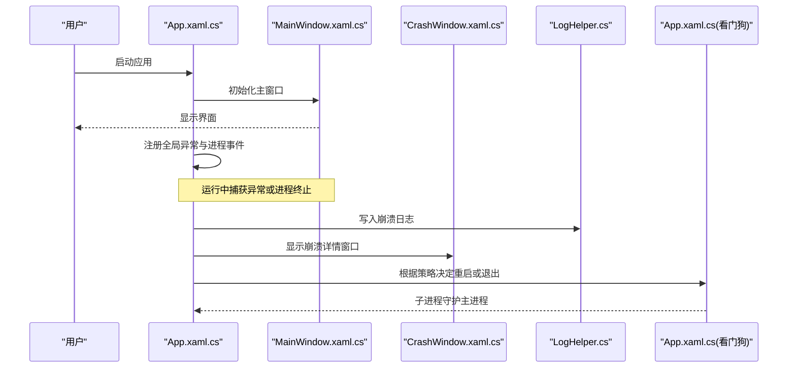
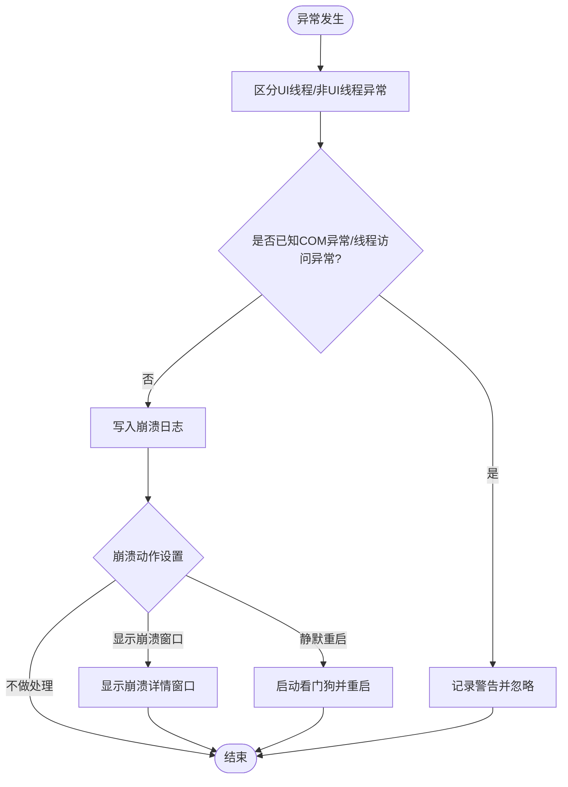
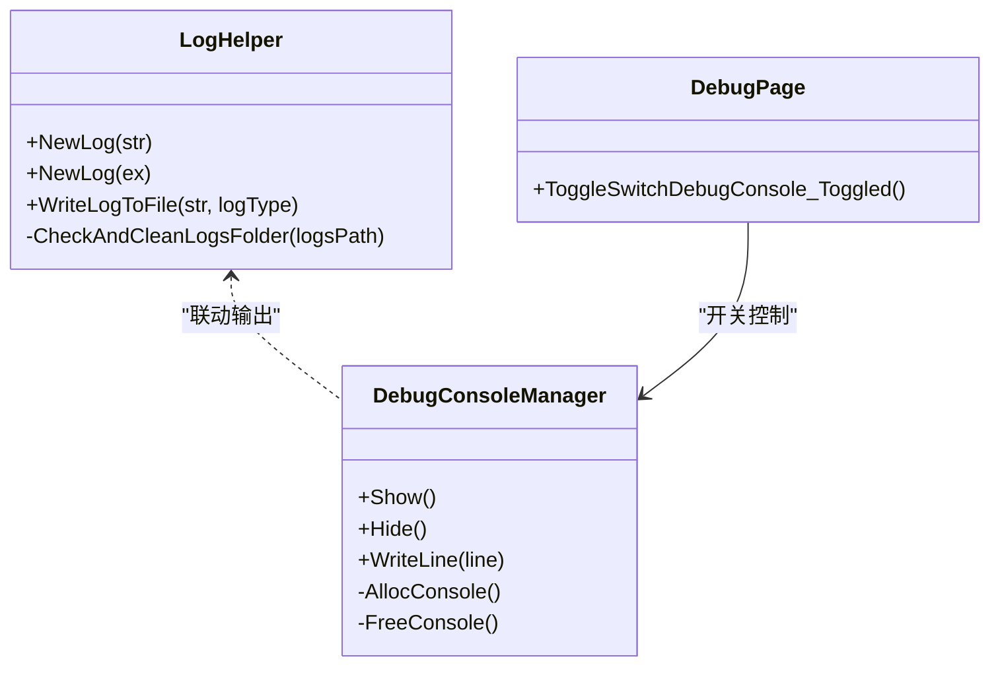
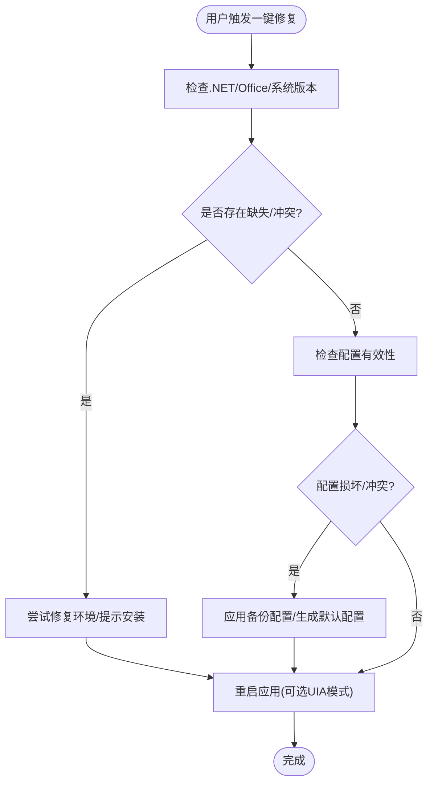
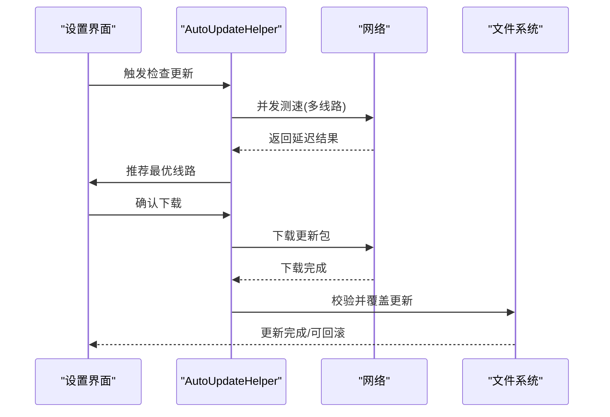
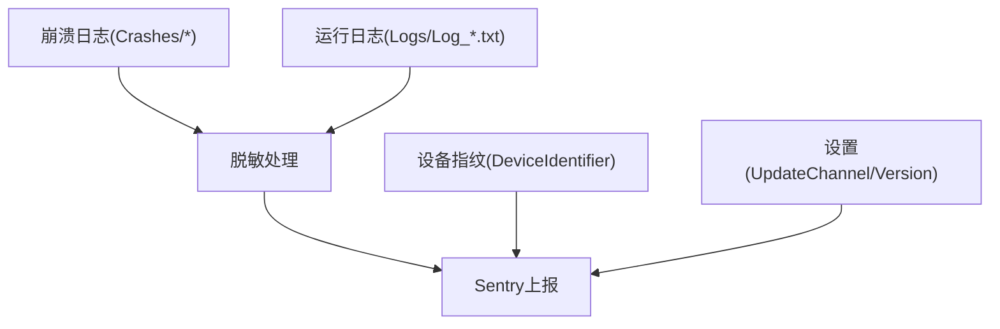
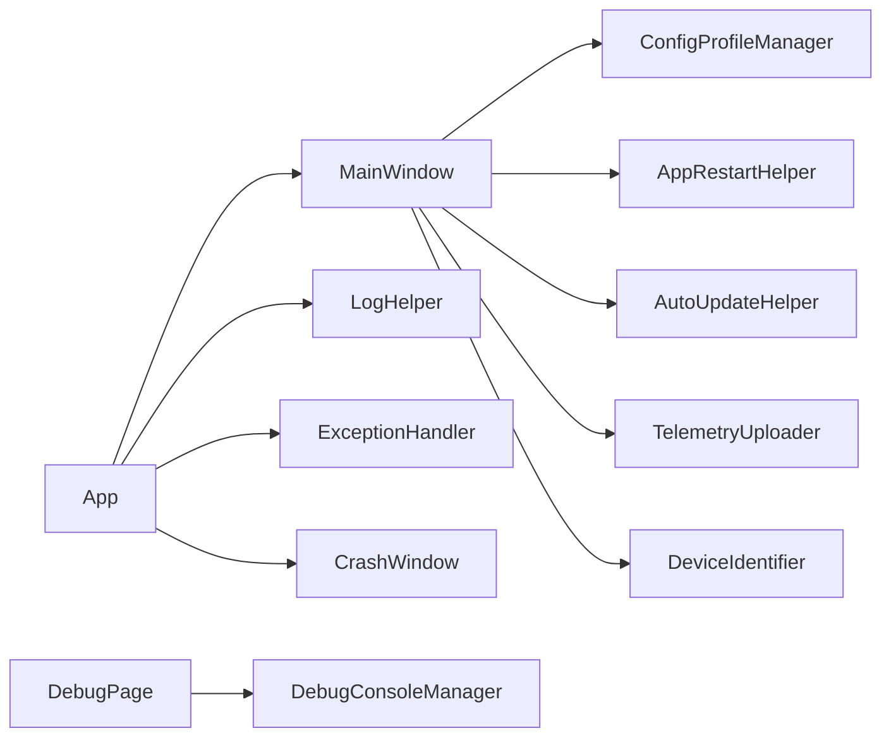

# 故障排除与支持

## 简介
本文件面向 InkCanvasForClass 用户与技术支持人员，提供系统化的故障排除与支持文档。内容涵盖启动失败、功能异常、性能问题的诊断与修复流程；崩溃分析方法（崩溃日志解读、堆栈跟踪分析、根因定位）；调试工具使用（内置调试控制台、日志查看器、性能分析思路）；用户反馈收集机制（问题报告模板、日志收集流程、支持渠道）；自助诊断与一键修复（系统环境检查、配置验证、自动修复建议）；以及紧急响应流程（快速修复方案、回滚策略、用户沟通指导）。

## 项目结构
InkCanvasForClass 采用 WPF 应用架构，核心入口为 App 类，主窗口 MainWindow 负责 UI 与业务逻辑，辅助模块分布在 Helpers、Windows、Controls、Properties 等目录中。关键支持能力包括：
- 异常与崩溃处理：全局未处理异常捕获、崩溃日志记录、看门狗重启机制
- 日志系统：统一日志写入、按启动时间归档、日志文件夹大小限制与清理
- 调试工具：内置调试控制台开关、日志输出联动
- 配置与修复：配置文件多档位管理、一键重启与权限切换、自动更新与线路测速
- 遥测与反馈：崩溃日志脱敏上传、设备指纹与使用统计

## 核心组件
- 应用入口与崩溃监听：负责初始化 TLS、注册全局异常与进程结束事件、崩溃日志落盘、看门狗启动与重启策略
- 主窗口：承载 UI、事件绑定、输入处理、页面管理、OOBE 流程、计时器与撤销/重做状态
- 崩溃详情窗口：展示崩溃信息、复制日志、置顶显示
- 日志系统：统一写入、线程安全、按启动时间归档、日志文件夹大小限制与清理
- 异常处理工具：封装异常记录与继续执行策略
- 调试控制台：可选的控制台窗口，用于实时输出日志
- 配置文件管理：多配置文件保存、切换与热重载
- 重启与权限切换：支持以管理员或普通用户身份重启，支持 UIA 置顶模式切换
- 自动更新：多线路测速、下载与覆盖、取消下载、版本选择
- 遥测上传：崩溃日志脱敏上传至 Sentry，携带设备指纹与使用统计
- 设备指纹与使用统计：设备唯一标识、使用频率与优先级评估

## 架构总览
InkCanvasForClass 的故障排除体系围绕“崩溃监测—日志记录—用户反馈—自动修复—紧急回滚”闭环展开。App 层负责崩溃监听与看门狗；MainWindow 承担业务状态与 UI；Helpers 提供日志、异常、配置、更新、遥测等支撑；Windows 提供设置与崩溃详情界面。

## 详细组件分析

### 崩溃与异常处理
- 全局异常捕获：UI 线程与非 UI 线程未处理异常均被捕获，记录到崩溃日志并根据设置决定是否显示崩溃窗口
- 崩溃日志：按启动时间命名，包含内存、CPU 时间、运行时长等系统状态信息
- 看门狗：在特定崩溃动作下启动子进程守护主进程，异常退出时按策略重启或提示
- COM 对象异常与线程访问异常：对已知问题进行安全处理，避免误报

### 日志系统与调试控制台
- 日志写入：统一入口，支持按启动时间归档，防止日志文件夹过大，自动清理超限文件
- 调试控制台：可选显示，标题固定，移除关闭菜单避免误关进程
- 日志查看器：通过设置页面开关调试控制台，便于实时观测

### 配置文件管理与一键修复
- 多配置文件：支持保存、列出、应用、删除配置文件，便于快速切换与热重载
- 一键重启：支持以管理员或普通用户身份重启，必要时切换 UIA 置顶模式
- 系统环境检查：.NET Runtime 6+、Office 激活状态、Windows 7 TLS 配置

### 自动更新与紧急回滚
- 多线路测速：并发检测各线路延迟，按延迟排序，优先选择最优线路
- 下载与覆盖：限定可覆盖文件集合，支持取消下载
- 回滚策略：保留历史版本，必要时回退至上一稳定版本

### 遥测与用户反馈
- 崩溃日志脱敏上传：通过 Sentry 上报，包含设备指纹、更新通道、应用版本、OS 版本、是否携带崩溃/运行日志等
- 设备指纹与使用统计：用于评估更新优先级与频率，辅助问题定位

## 依赖关系分析
- App 依赖 MainWindow、LogHelper、ExceptionHandler、CrashWindow、看门狗机制
- MainWindow 依赖配置管理、重启助手、自动更新、遥测、设备指纹
- DebugConsole 与 DebugPage 通过 SettingsManager 交互
- AutoUpdate 依赖网络与文件系统，受设置影响

## 性能考虑
- 日志写入采用互斥与追加写入，避免并发冲突
- 日志文件夹大小限制与自动清理，防止磁盘占用过高
- 看门狗与自动更新采用异步与超时控制，降低阻塞风险
- Windows 7 TLS 配置适配，确保网络通信稳定性

## 故障排除指南

### 启动失败
- 检查 .NET Runtime 是否满足要求
- 检查 Office 是否激活
- 查看日志文件与崩溃日志，定位具体异常
- 尝试以管理员或普通用户身份重启
- 如涉及 UIA 置顶，切换到普通置顶模式再重启

### 功能异常
- 识别是否为已知 COM 对象异常或线程访问异常，此类异常会被安全处理
- 查看崩溃日志与运行日志，结合堆栈信息定位根因
- 使用调试控制台观察实时日志
- 应用配置文件备份与恢复，或生成默认配置

### 性能问题
- 检查日志文件夹大小，必要时清理旧日志
- 关闭不必要的日志级别或归档功能
- 使用自动更新的线路测速功能，选择更优下载线路
- 关注看门狗与重启行为，避免频繁重启导致性能抖动

### 崩溃分析
- 崩溃日志解读：查看崩溃时间、进程 PID、内存/CPU/运行时长、异常信息
- 堆栈跟踪分析：结合 UI 线程与非 UI 线程异常，定位调用链
- 根因定位：优先处理已知 COM/线程访问异常；关注第三方组件（如 PowerPoint）的权限一致性

### 调试工具使用
- 内置调试控制台：在设置页面开启/关闭，实时输出日志
- 日志查看器：通过设置页面开关调试控制台
- 崩溃详情窗口：复制崩溃信息，便于反馈

### 用户反馈收集机制
- 问题报告模板：包含版本号、系统版本、复现步骤、日志文件（崩溃/运行）、截图
- 日志收集流程：打包 Crashes 与 Logs 目录，脱敏后上传
- 支持渠道：社区论坛、QQ 群、Discord

### 自助诊断与一键修复
- 系统环境检查：.NET Runtime、Office 激活、Windows 7 TLS
- 配置验证：检查 Settings.json 与配置文件夹权限
- 自动修复建议：安装缺失组件、修复 Office、调整权限、切换 UIA 置顶模式
- 一键重启：以不同权限重启，或切换置顶模式

### 紧急响应流程
- 快速修复方案：禁用/启用特定功能、切换配置文件、重启应用
- 回滚策略：使用自动更新的回滚能力，或手动替换为稳定版本
- 用户沟通指导：提供清晰的升级/回滚说明与联系方式

## 结论
InkCanvasForClass 提供了完善的崩溃监测、日志记录、调试工具与自动修复能力。通过规范的故障排除流程与用户反馈机制，能够有效提升问题定位与解决效率。建议在日常使用中定期检查日志、合理配置调试控制台、按需启用自动更新与遥测，以便在出现问题时快速响应与恢复。

## 附录
- 版本信息：参见程序集信息
- 常见问题 FAQ：参见项目自述文件

章节来源
