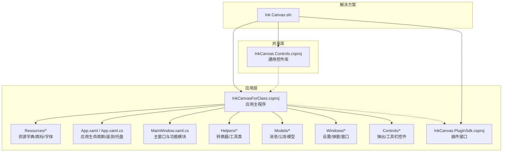
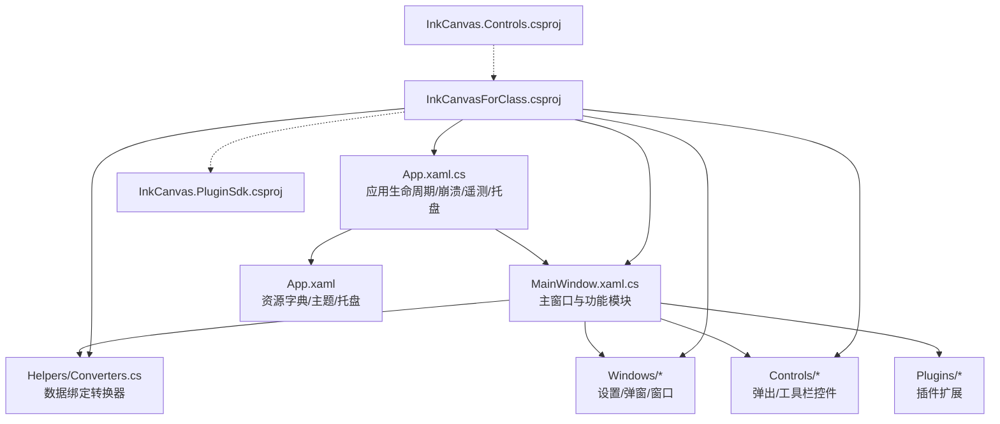
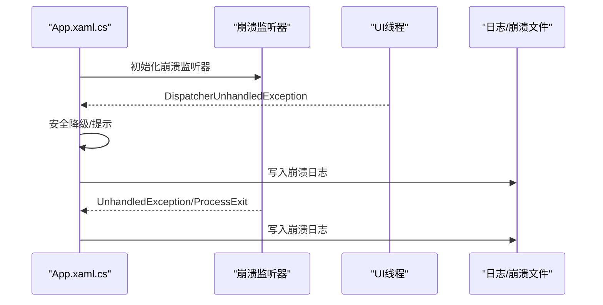
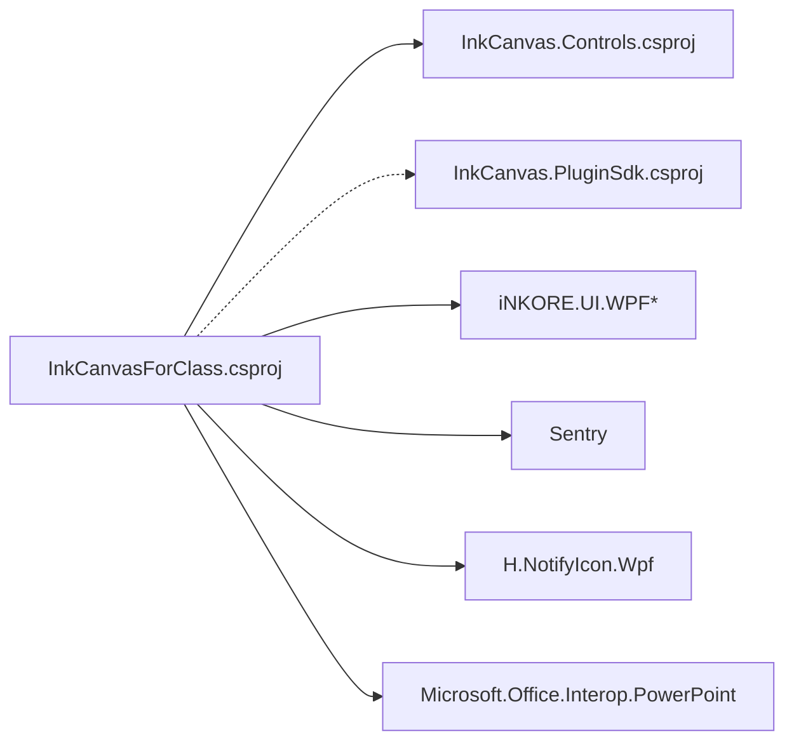

# 代码规范与最佳实践

## 引言
本文件面向 InkCanvasForClass 社区版项目的开发者与维护者，系统化梳理 C# 编码规范、WPF/XAML 最佳实践、项目结构组织原则、代码审查清单、构建与发布流程、测试与重构指导等内容，帮助团队达成一致的工程标准，提升可维护性、安全性与性能表现。

## 项目结构
项目采用多项目解决方案，核心应用与可复用控件、插件 SDK 分离，配合规则文档与资源字典，形成清晰的职责边界与扩展机制。

图示来源

## 核心组件
- 应用入口与生命周期：App.xaml.cs 负责应用启动、崩溃监听、遥测初始化、托盘菜单、看门狗与进程监控等。
- 主窗口与功能模块：MainWindow.xaml.cs 将复杂 UI 与业务逻辑按功能拆分至多个文件（如 MW_Settings.cs、MW_Colors.cs 等），并通过访问器暴露控件给主窗口。
- 资源与样式：App.xaml 统一合并主题与图标资源字典，确保全局一致的视觉风格。
- 数据绑定与转换：Helpers/Converters.cs 提供常用的布尔/可见性/几何转换器，支撑 XAML 绑定。
- 插件与控件：InkCanvas.PluginSdk.csproj 定义插件接口；InkCanvas.Controls.csproj 提供可复用控件库。

## 架构总览
应用采用“主程序 + 控件库 + 插件 SDK”的分层架构，结合规则文档约束 UI 与设置开发规范，确保一致性与可扩展性。

图示来源

## 组件详解

### C# 编码规范与命名约定
- 命名约定
  - 方法名：PascalCase
  - 变量名：camelCase
  - 私有字段：_ 前缀（如 _stylusDownTimestamp）
  - XAML 控件名：PascalCase（如 CardEnableInkFade）
  - XAML 资源键：PascalCase（如 PivotHeaderItemFontSize）
- 代码组织
  - 主窗口按功能拆分为多个文件（如 MW_Settings.cs、MW_Colors.cs 等）
  - 新功能应放入对应功能文件或新建文件
- 国际化
  - 用户可见文本统一通过 i18n 资源绑定，避免硬编码中英文文本

### WPF 与 XAML 最佳实践
- 控件使用规范
  - ComboBox 不设置宽度，让其自适应内容
  - 带开关的设置项统一使用 controls:LabeledSettingsCard，非开关使用 ui:SettingsCard
  - 可展开设置组使用 ui:SettingsExpander，子项使用 ui:SettingsCard
  - 互斥选项使用 ui:SettingsCard + ComboBox
- 数据绑定与转换
  - 使用 Converters 提供布尔/可见性/几何等转换器
  - Slider + TextBlock 实时显示当前值时，需在后端实现 UpdateSliderText 并在 ValueChanged 中保存设置
- 资源管理
  - App.xaml 统一合并主题与图标资源字典，确保全局一致
  - 资源键与图标采用 PascalCase，避免重复与冲突

### MVVM 模式应用与数据绑定规范
- 当前项目以代码隐藏（code-behind）为主，但可通过访问器属性与资源字典实现松耦合的数据绑定
- 建议在新增复杂视图时引入轻量 ViewModel，将 UI 逻辑与业务逻辑分离
- 使用依赖属性（DependencyProperty）暴露状态，便于绑定与样式控制

### 项目结构组织原则
- 命名空间层次
  - 应用：Ink_Canvas
  - 控件库：Ink_Canvas.Controls
  - 插件：Ink_Canvas.Plugins
- 文件夹组织
  - Helpers：转换器/工具类
  - Windows：设置/弹窗/窗口
  - Controls：弹出/工具栏控件
  - Resources：图标/字体/样式
- 模块划分
  - 主程序负责生命周期与系统集成
  - 控件库提供可复用 UI 组件
  - 插件 SDK 提供扩展接口

### 弹出菜单与工具栏规范
- PenPalettePopupContent 使用 PopupTabShellContent 与 PopupTabTitleBar 实现标签页切换
- EraserPopupContent 使用 Pivot 样式 TabControl 实现圆形擦/黑板擦切换
- 工具栏按钮使用 ToolbarRegistry 管理，支持显示/隐藏与排序

### 设置页面开发规范
- 添加/删除设置的完整流程：在 Resources/Settings.cs 中添加属性 → 在页面 XAML 中添加控件 → 在页面代码中添加事件处理 → 在 LoadSettings 中读取并应用 → 在主窗口中使用设置
- 笔工具栏滑块需特殊交叉同步处理，使用 _isUpdatingSliders 标志防止死循环，并使用 Math.Round 处理浮点数精度

### 应用生命周期与异常处理
- 应用启动时初始化崩溃监听器、遥测、托盘菜单与看门狗
- 非 UI 线程与 UI 线程未处理异常分别处理，对特定 COM 异常进行安全降级
- 提供崩溃日志记录与格式化输出

图示来源

### 主窗口与功能模块
- 主窗口将复杂逻辑按功能拆分至多个文件（如 MW_Settings.cs、MW_Colors.cs 等），并通过访问器暴露控件
- 事件绑定集中在 WireUp* 方法中，确保模块化与可维护性

## 依赖关系分析
应用通过项目引用与 NuGet 包管理依赖，形成清晰的分层与解耦。

图示来源

## 性能考量
- 启动与资源加载
  - 启动画面与进度控制，避免长时间阻塞 UI 线程
  - 合理使用资源字典与图标缓存，减少重复加载
- 绑定与渲染
  - 使用转换器减少 XAML 中复杂逻辑
  - 避免频繁触发依赖属性变更，批量更新设置
- 异常与稳定性
  - 对特定 COM 异常进行安全降级，避免影响整体稳定性
  - 崩溃日志记录与格式化，便于定位问题

## 故障排查指南
- 常见问题定位
  - 查看崩溃日志文件（Crashes 目录），包含时间戳、内存/CPU/运行时长等上下文
  - 检查设置文件（Settings.json）与应用启动参数，确认崩溃后操作设置
- 系统集成问题
  - 托盘菜单与系统会话结束事件处理，确保资源清理
  - 看门狗进程与进程销毁钩子，避免误判与资源泄漏

## 结论
本规范文档总结了 InkCanvasForClass 的编码与架构实践，涵盖命名约定、XAML 最佳实践、项目结构、生命周期与异常处理、依赖关系与性能考量等方面。建议在日常开发中严格遵循，持续完善规则文档与自动化检查，以保障项目的长期可维护性与稳定性。

## 附录

### 代码审查检查清单
- 命名与结构
  - 是否遵循 PascalCase/camelCase/_ 前缀约定
  - 是否按功能拆分文件，避免巨型类/窗口
  - 是否使用 i18n 资源而非硬编码文本
- XAML 与绑定
  - 是否使用规范控件（LabeledSettingsCard/SettingsCard/SettingsExpander/ComboBox）
  - Slider 是否实现 UpdateSliderText 并在 ValueChanged 中保存设置
  - 转换器是否集中管理，避免 XAML 中复杂逻辑
- 生命周期与异常
  - 是否正确初始化崩溃监听器与遥测
  - 是否对特定异常进行安全降级
  - 是否记录崩溃日志并包含必要上下文
- 性能与可维护性
  - 是否避免阻塞 UI 线程
  - 是否减少不必要的依赖属性变更
  - 是否使用项目引用与 NuGet 包管理依赖

### 构建与发布流程规范
- 目标框架与平台
  - 目标框架：net6.0-windows10.0.19041.0
  - 平台：AnyCPU/x86/x64/ARM64
  - 高 DPI：PerMonitorV2
- 包与资源
  - 使用 Costura.Fody 进行程序集打包
  - IACore 动态库与图标/字体资源嵌入/嵌入
- 版本与元数据
  - 版本号与产品信息在 AssemblyInfo.cs 中统一管理
  - 生成信息关闭（GenerateAssemblyInfo=False）

### 单元测试与集成测试规范
- 测试覆盖率
  - 建议核心转换器与工具类达到高覆盖率（>80%）
- 测试数据管理
  - 使用资源字典与本地化资源，避免硬编码
- 测试执行
  - 建议在 CI 中执行静态分析与关键路径回归测试

### 代码重构与优化指导
- 反模式识别
  - 避免巨型 MainWindow 与混合关注点
  - 避免在 XAML 中编写复杂逻辑
  - 避免硬编码文本与资源键
- 重构技巧
  - 将 UI 逻辑抽取到 ViewModel（MVVM）
  - 使用依赖属性与命令绑定
  - 通过访问器属性与资源字典降低耦合

章节来源
