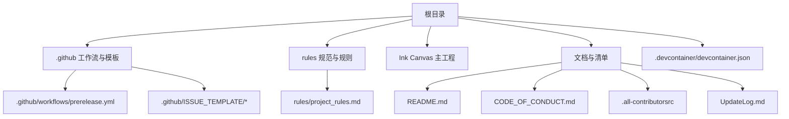
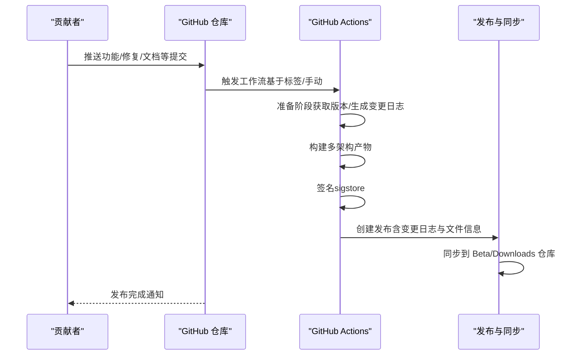
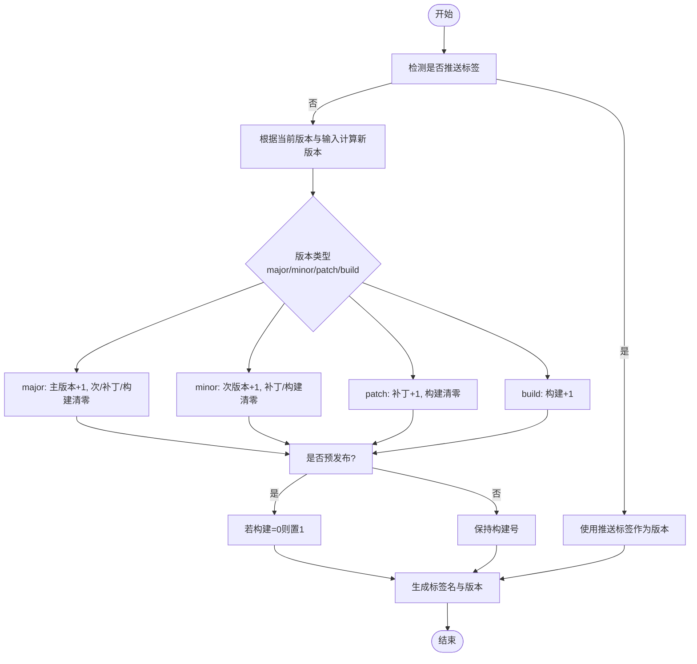
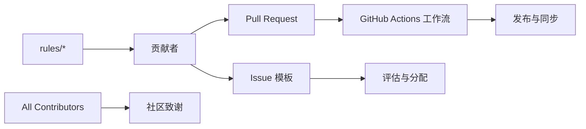

# 贡献流程

## 简介
本指南面向希望参与 InkCanvasForClass Community Edition 的贡献者，系统化说明从分支策略、Pull Request 审查、提交与变更日志、问题与功能请求处理，到持续集成与发布、社区行为准则与协作规范、贡献者认可与奖励机制，以及具体贡献示例与最佳实践。目标是帮助新老贡献者高效、一致地推进项目演进。

## 项目结构
仓库采用“根目录 + 多模块工程”的组织方式，核心贡献相关要素分布如下：
- 贡献与社区：README、行为准则、贡献者清单
- 持续集成与发布：GitHub Actions 工作流
- 问题模板：功能请求、Bug 报告
- 规范与规则：开发规范索引与各模块规范
- 开发环境：Dev Container 配置
- 发布与变更日志：更新日志与版本标签

## 核心组件
- 行为准则与协作规范：明确社区行为标准、执行与适用范围、违规处理流程与联系方式。
- 贡献者认可机制：通过 All Contributors 列表与贡献类型标注，记录各类贡献并公开致谢。
- 持续集成与发布：基于 GitHub Actions 的预发布与变更日志生成流水线，支持多架构产物签名与同步。
- 问题与功能请求模板：标准化 Bug 报告与功能请求的输入，提升问题定位与需求评估效率。
- 规范与规则：按模块划分的开发规范索引，指导 UI、设置页、弹出层、工具栏、编译与通用规范。
- 开发环境：Dev Container 配置，提供一致的 .NET 开发环境与扩展。

## 架构总览
下图展示了从贡献者提交到发布的主要流程：分支与标签策略、PR 审查、CI 构建与签名、变更日志生成、发布与同步。

## 详细组件分析

### 分支与标签管理策略
- 分支策略
  - net6 分支：用于保持与 main 的差异，确保 net6 版本总是新于 main。
  - main 分支：作为稳定基线，发布版本通常以标签形式标记。
- 标签与版本
  - 版本格式：采用 4 段格式（x.y.z.w），其中 w 为构建号；当 w=0 时表示正式版本，否则为预发布版本。
  - 标签命名：与版本号一致，推送标签触发发布流程；也可通过工作流手动指定版本类型与预发布标志。
- 预发布与正式版本
  - 预发布：w 非零或显式标记为预发布，发布时包含预发布提示与文件信息表。
  - 正式版本：w=0，发布时同步到 Release 与 Beta 仓库，并更新自动更新版本控制文件。

## 依赖关系分析
- 贡献者与仓库
  - 贡献者通过 PR 与 Issue 参与；工作流自动处理构建、签名与发布。
- 规范与规则
  - rules 目录提供模块化规范索引，指导开发一致性。
- 贡献者认可
  - .all-contributorsrc 与 README 协同维护贡献者列表。

## 性能考虑
- 构建性能
  - 多架构并行构建可缩短总耗时；缓存 NuGet 与 dotnet 依赖有助于加速恢复。
- 发布效率
  - 自动化生成变更日志与文件信息表减少人工成本；签名与同步流程一次性完成，降低遗漏风险。

## 故障排查指南
- 构建失败
  - 检查构建日志中的依赖还原与 MSBuild 参数；确认 .NET SDK 与 Inno Setup 环境。
- 签名失败
  - 确认 sigstore-python 环境与 GitHub Token 权限；检查产物文件是否存在。
- 发布未同步
  - 检查 Octo-Sts 令牌与目标仓库权限；确认版本号与预发布状态一致。
- 变更日志缺失
  - 确认 git-cliff 配置与提交消息符合约定式提交；检查标签与未发布段落参数。

## 结论
本指南将贡献流程的关键环节标准化：从分支与标签策略、PR 审查、提交与变更日志，到 CI/CD 发布、问题与功能请求处理、行为准则与贡献者认可，形成闭环。建议贡献者在每次提交前对照规范与模板，确保高质量交付与高效协作。

## 附录
- 开发环境
  - 使用 Dev Container 可一键获得 .NET 与 C# 扩展，减少环境差异带来的问题。
- 更新日志
  - UpdateLog.md 记录版本迭代与修复清单，便于回顾与审计。