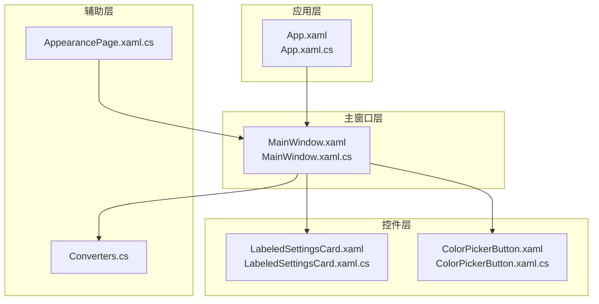
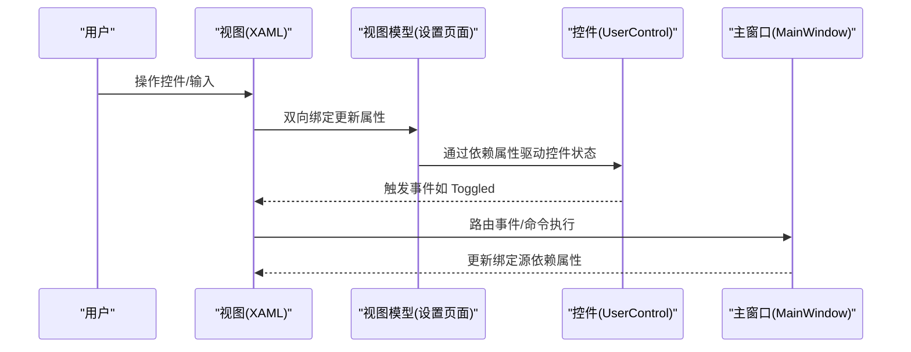
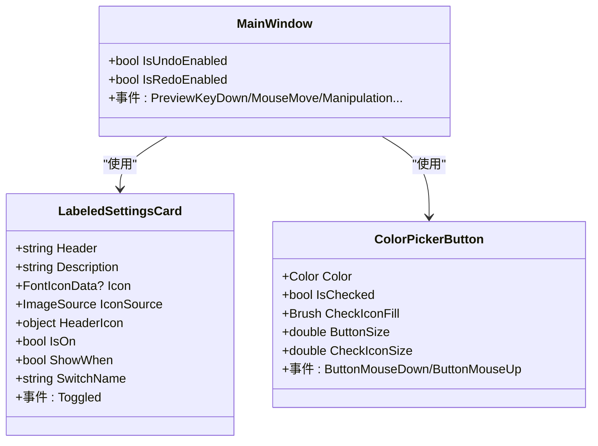
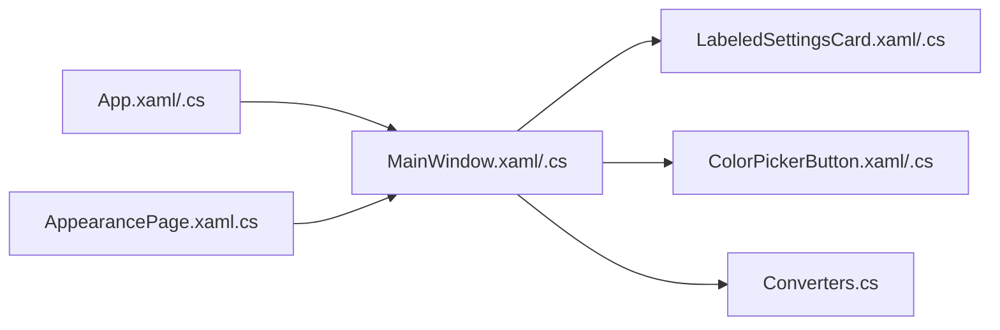

# 数据绑定与交互

## 简介
本文件聚焦于 WPF 数据绑定与用户交互机制，结合仓库中的实际实现，系统阐述以下主题：
- 单向绑定、双向绑定与一次性绑定的使用场景与实践
- 依赖属性的高级用法：属性变更回调、验证与转换器
- 命令模式在控件中的应用：ICommand 接口实现与绑定
- 用户交互事件处理：鼠标、键盘、触摸手势的捕获与响应
- 控件间通信：事件冒泡、路由事件与自定义事件
- MVVM 模式下的控件实现：ViewModel 设计与数据上下文绑定
- 实战案例：可编辑设置卡片与响应式颜色选择器

## 项目结构
本项目采用典型的 WPF 分层结构：
- 应用层：App.xaml(x) 提供应用级资源与托盘菜单
- 主窗口层：MainWindow.xaml(x) 定义主界面布局与交互事件
- 控件层：InkCanvas.Controls 提供可复用的用户控件（如 LabeledSettingsCard、ColorPickerButton）
- 辅助层：Helpers/Converters 提供值转换器；Windows/SettingsViews 提供设置页面与 MVVM 绑定

## 核心组件
- 应用资源与托盘菜单：在 App.xaml 中集中定义菜单项与图标资源，并通过事件处理器在 App.xaml.cs 中实现逻辑
- 主窗口交互：MainWindow.xaml 定义 InkCanvas、浮动栏、选择工具等 UI；MainWindow.xaml.cs 注册大量输入事件与依赖属性
- 自定义控件：LabeledSettingsCard 与 ColorPickerButton 展示依赖属性、属性变更回调与事件转发
- 值转换器：Converters.cs 提供布尔到可见性的转换、字符串到几何图形的转换等
- 设置页面：AppearancePage.xaml.cs 展示 MVVM 绑定与双向数据流

## 架构总览
WPF 数据绑定与交互在本项目中体现为“视图-视图模型-控件”的协同：
- 视图（XAML）：通过 Binding、命令绑定、样式与触发器实现 UI 表达
- 视图模型（ViewModel）：设置页面等页面承载数据与业务逻辑，实现双向绑定
- 控件（UserControl）：封装复杂交互与状态，暴露依赖属性与事件

## 详细组件分析

### 依赖属性与属性变更回调
- MainWindow 定义了 IsUndoEnabled、IsRedoEnabled 等依赖属性，用于状态驱动 UI
- LabeledSettingsCard 定义 Header、Description、Icon、IconSource、HeaderIcon、IsOn、ShowWhen、SwitchName 等依赖属性，并在变更时应用到内部控件
- ColorPickerButton 定义 Color、IsChecked、CheckIconFill、ButtonSize、CheckIconSize 等依赖属性，变更时即时更新外观

## 依赖关系分析
- App.xaml 与 App.xaml.cs：应用级资源与托盘菜单事件处理
- MainWindow.xaml 与 MainWindow.xaml.cs：主界面布局、输入事件与依赖属性
- 控件层（LabeledSettingsCard、ColorPickerButton）：依赖属性与事件转发
- 辅助层（Converters）：值转换器支撑绑定
- 设置页面（AppearancePage.xaml.cs）：MVVM 绑定与配置持久化

## 性能考量
- 启动画面与崩溃日志：App.xaml.cs 中包含启动画面与崩溃日志记录，有助于诊断性能瓶颈
- DPI 适配：MainWindow 在构造函数中根据 DPI 计算浮动栏位置，避免布局抖动
- 触摸滑动优化：MainWindow 对左右侧页签列表实现手动触摸滑动，减少不必要的布局开销
- 值转换器：Converters.cs 中的转换器应避免昂贵运算，必要时使用缓存或懒加载

## 故障排查指南
- 未处理异常：App.xaml.cs 中对 UI 线程与非 UI 线程异常进行分类处理，避免应用崩溃
- COM 对象异常：针对 PowerPoint/WPS COM 对象异常进行特殊处理
- 线程访问异常：对 WPF InkCanvas 的线程访问问题进行安全处理
- 崩溃日志：记录崩溃信息与系统状态，便于定位问题

## 结论
本项目在 WPF 数据绑定与用户交互方面展现了良好的工程实践：
- 通过依赖属性与值转换器实现清晰的数据流与 UI 表达
- 以 MVVM 模式组织设置页面，实现双向绑定与配置持久化
- 以自定义控件封装复杂交互，提供可复用的 UI 组件
- 通过路由事件与事件冒泡实现控件间通信
- 在性能与稳定性方面提供了启动画面、崩溃日志与异常处理机制

## 附录
- 绑定类型建议
  - 单向绑定：只读显示（如只读文本、图标）
  - 双向绑定：用户可编辑项（如开关、滑块、输入框）
  - 一次性绑定：初始化时使用且无需后续更新（如静态资源）
- 最佳实践
  - 使用依赖属性承载可绑定状态，配合属性变更回调更新 UI
  - 将复杂转换逻辑放入转换器，保持 XAML 简洁
  - 通过事件冒泡与路由事件实现松耦合的控件通信
  - 在 MVVM 中分离视图与视图模型，使用命令与绑定降低代码耦合