# 自定义控件开发

## 引言
本指南面向希望在WPF中开发自定义控件的工程师与设计人员，系统讲解控件继承、依赖属性定义、事件处理、模板与样式、交互行为（鼠标/键盘/触摸）、数据绑定（含双向绑定、转换器、命令）、主题与视觉状态、性能优化（虚拟化/延迟加载/内存管理）以及测试与调试方法。文档以仓库中的实际控件为案例，提供可直接参考的实现路径与最佳实践。

## 项目结构
本项目采用“功能域+控件库”的组织方式：InkCanvas.Controls 提供通用自定义控件；Ink Canvas/Resources/Styles 提供深浅主题资源；MainWindow_cs 中包含工具栏集成与控件实例化逻辑。下图给出与控件开发相关的核心文件与职责映射：

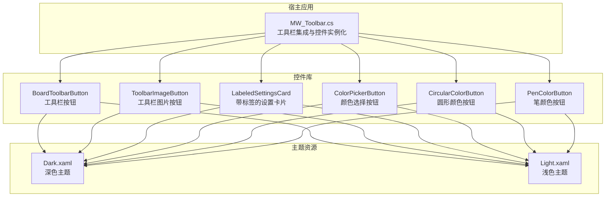

## 核心组件
本节聚焦于控件开发的关键要素：继承体系、依赖属性、事件、模板与样式、交互行为、数据绑定、主题与视觉状态、性能与测试。

- 继承与基类
  - 所有自定义控件均基于 UserControl，通过 XAML 定义外观，C# 代码隐藏实现逻辑与依赖属性。
  - 典型控件：BoardToolbarButton、ToolbarImageButton、LabeledSettingsCard、ColorPickerButton、CircularColorButton、PenColorButton。

- 依赖属性与通知
  - 使用 DependencyProperty.Register 注册属性，配合静态回调 OnXxxChanged 实现属性变更时的 UI 更新或行为触发。
  - 示例：BoardToolbarButton 的 Label、IconGeometry、Position、IconBrush；LabeledSettingsCard 的 Header、Description、Icon、IconSource、HeaderIcon、IsOn、ShowWhen、SwitchName；ColorPickerButton 的 Color、IsChecked、CheckIconFill、ButtonSize、CheckIconSize；CircularColorButton 的 Color、ColorOpacity、IsChecked、ButtonSize、BorderBrushColor、CheckIconSource；PenColorButton 的 Color、BorderBrushColor、IsHighlighter、IsChecked、CheckIconSource。

- 事件处理
  - 控件暴露事件（如 ButtonMouseDown、ButtonMouseUp、Toggled），由宿主页面订阅以响应用户操作。
  - 示例：BoardToolbarButton、ToolbarImageButton、ColorPickerButton、CircularColorButton、PenColorButton 在鼠标事件中转发自定义事件。

- 模板与样式
  - XAML 中通过 Grid/Border/Canvas 等布局容器组合几何图形、图像与文本，使用 {DynamicResource ...} 绑定主题资源。
  - 主题资源位于 Dark.xaml 与 Light.xaml，统一管理前景/背景/边框/图标等颜色与图标资源。

- 数据绑定
  - 支持单向/双向绑定：例如 LabeledSettingsCard 的 IsOn 双向绑定到 ToggleSwitch。
  - 资源字典与动态样式：通过 {DynamicResource ...} 实现运行时主题切换。

- 交互行为
  - 鼠标事件：MouseDown/MouseUp/MouseLeave；键盘/触摸：项目中未见显式键盘/触摸事件处理，建议在自定义控件中按需扩展。

- 主题与视觉状态
  - 通过资源字典实现深浅主题切换；控件内部根据 IsEnabled 或 IsChecked 等状态更新可见性/透明度/可见性。

- 性能优化
  - 虚拟化：列表类控件建议使用 VirtualizingStackPanel；本仓库未见大规模列表场景。
  - 延迟加载：控件在 Loaded 事件中应用属性，避免构造期昂贵操作。
  - 内存管理：注意解除事件订阅与释放图像资源（本仓库中未见显式释放逻辑，建议在控件卸载时清理）。

- 测试与调试
  - 单元测试：对业务逻辑（如颜色计算、状态机）进行单元测试；对 UI 行为建议使用 UI 自动化测试框架。
  - 可视化调试：使用 Live Visual Tree/ Live Property Explorer 进行实时检查。

## 架构总览
下图展示控件与主题资源、宿主应用之间的关系与交互流程：

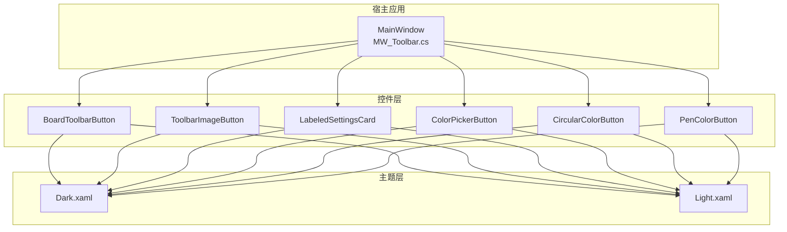

## 详细组件分析

### 工具栏按钮（BoardToolbarButton）
- 设计要点
  - 通过依赖属性 Label、IconGeometry、Position、IconBrush 控制显示内容与外观。
  - 通过 ButtonMouseDown/ButtonMouseUp 事件对外暴露点击行为。
  - 根据 Position 动态设置圆角与边框厚度，适配工具栏分组。
- 关键实现路径

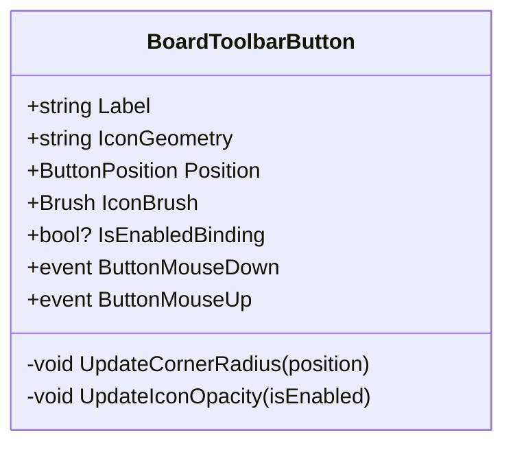

### 工具栏图片按钮（ToolbarImageButton）
- 设计要点
  - 依赖属性支持 Label、IconGeometryDrawing、IconBrush、LabelBrush 等。
  - 通过 IsEnabledChanged 控制图标与文字透明度。
  - 维护“最后按下”按钮的状态，实现工具栏按钮的选中高亮。
- 关键实现路径

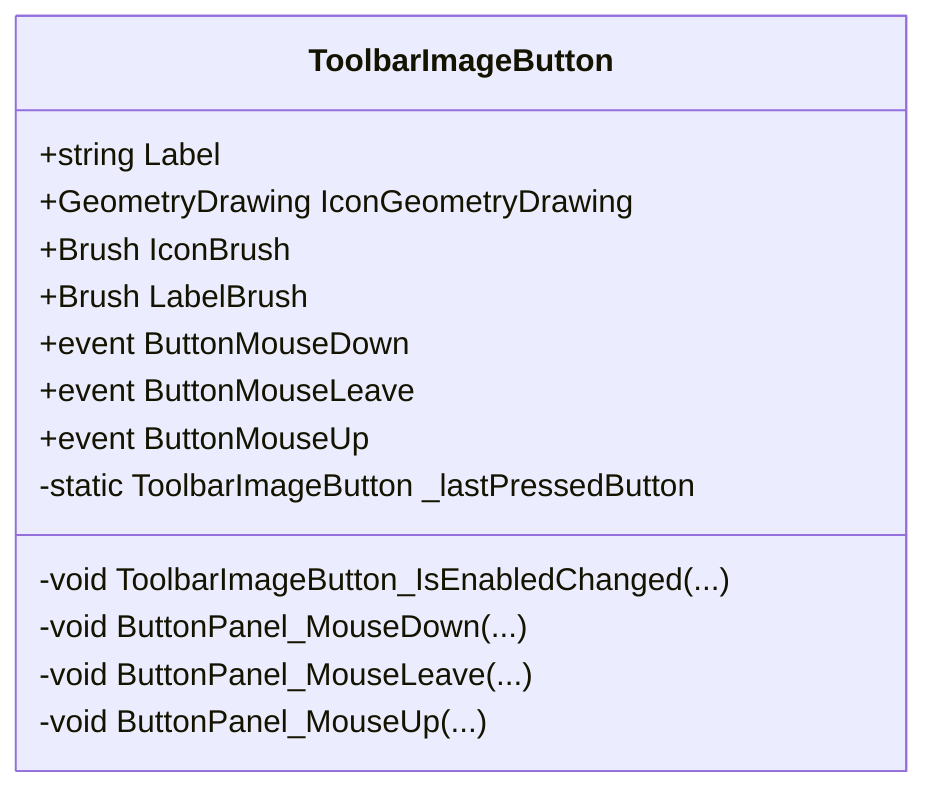

### 带标签的设置卡片（LabeledSettingsCard）
- 设计要点
  - Header/Description 文本绑定；Icon/IconSource/HeaderIcon 三者择一配置图标。
  - IsOn 双向绑定到 ToggleSwitch；ShowWhen 控制可见性；SwitchName 设置控件名称。
  - Toggled 事件对外暴露开关切换。
- 关键实现路径

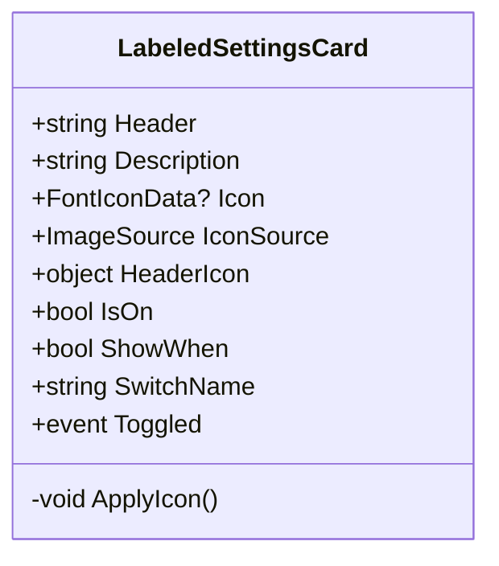

### 颜色选择按钮（ColorPickerButton）
- 设计要点
  - Color 控制背景色；IsChecked 控制勾选图标可见性；CheckIconFill 控制勾选图标填充色。
  - ButtonSize/CheckIconSize 控制尺寸；MouseDown/Leave/Up 事件对外暴露。
- 关键实现路径

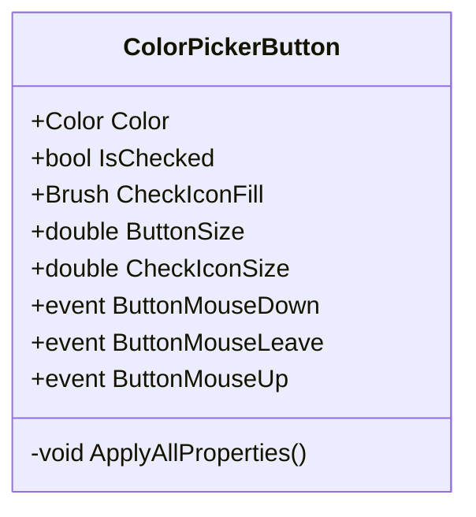

### 圆形颜色按钮（CircularColorButton）
- 设计要点
  - Color/ColorOpacity 控制覆盖层颜色与透明度；IsChecked 控制勾选图标可见性。
  - ButtonSize 动态计算内层元素半径与尺寸；BorderBrushColor 控制边框颜色。
  - CheckIconSource 支持动态更换勾选图标。
- 关键实现路径

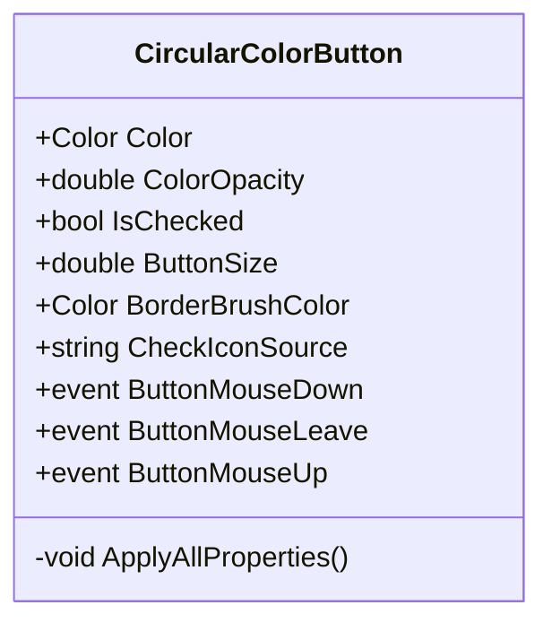

### 笔颜色按钮（PenColorButton）
- 设计要点
  - Color 控制颜色覆盖层；BorderBrushColor 控制边框颜色；IsHighlighter 控制透明网格与不透明度。
  - IsChecked 控制勾选图标可见性；CheckIconSource 支持动态更换勾选图标。
- 关键实现路径

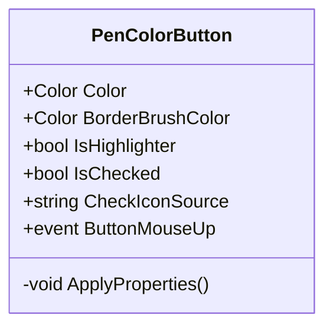

### 交互行为与事件序列（以按钮点击为例）
以下序列图展示从用户点击到控件事件转发再到宿主应用处理的完整流程：

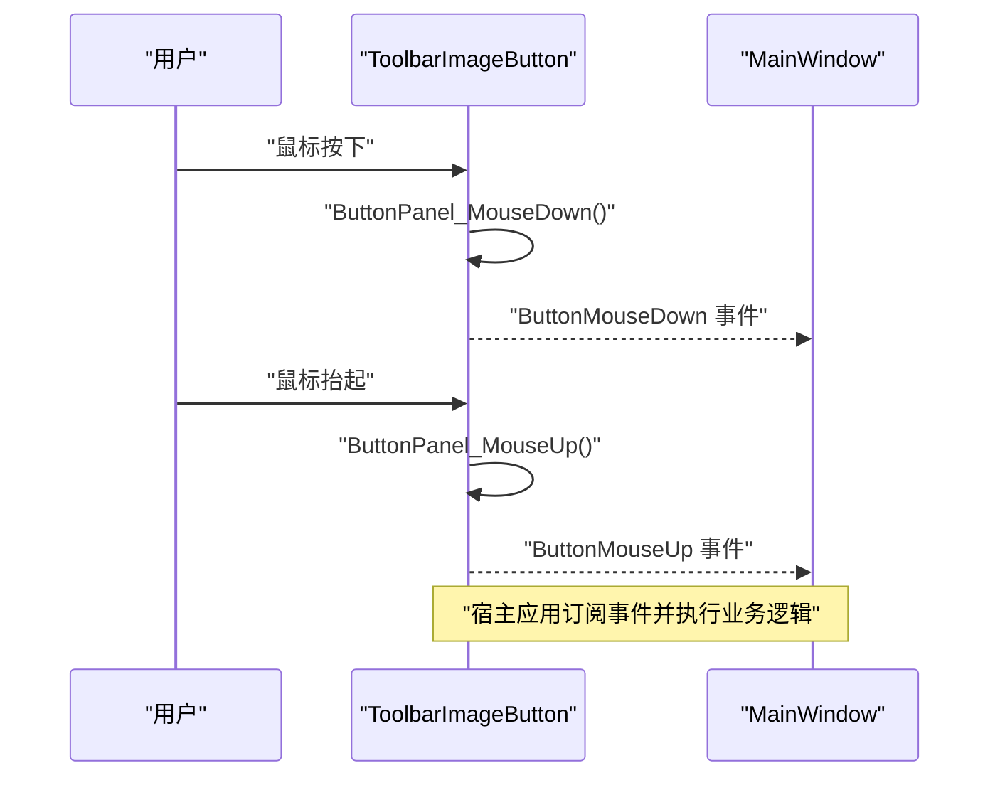

### 数据绑定流程（以设置卡片为例）
以下流程图展示 LabeledSettingsCard 的双向绑定与事件冒泡过程：

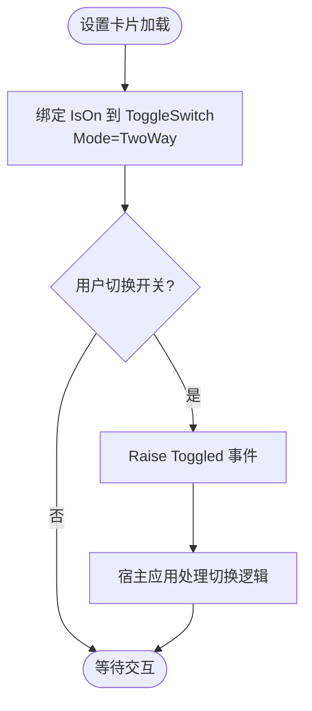

## 依赖关系分析
- 控件与主题资源
  - 所有控件通过 {DynamicResource ...} 引用主题资源，实现深浅主题切换。
- 控件与宿主应用
  - MainWindow 通过 ToolbarHost/Registry 将控件注入工具栏，实现运行时装配与状态同步。
- 控件间耦合
  - 各控件相对独立，通过依赖属性与事件解耦；颜色相关控件共享统一的颜色模型与资源键。

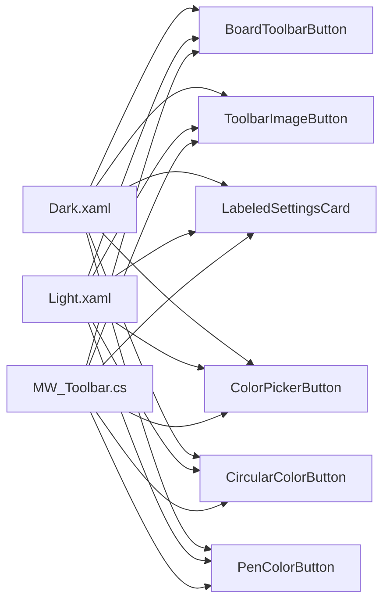

## 性能考虑
- 虚拟化
  - 对于长列表（如颜色调色板），建议使用 VirtualizingStackPanel 与 RecyclingBehavior，减少可视对象数量。
- 延迟加载
  - 控件在 Loaded 事件中应用属性，避免构造期昂贵操作；对大图标的加载可采用懒加载策略。
- 内存管理
  - 注意释放图像资源与取消事件订阅；在控件卸载时清理事件与临时对象，防止内存泄漏。
- 渲染优化
  - 使用 RenderOptions.BitmapScalingMode="HighQuality" 仅在需要高质量渲染时启用，避免不必要的开销。

## 故障排查指南
- 依赖属性未生效
  - 检查是否正确注册依赖属性与回调；确认 XAML 中绑定路径一致。
- 主题切换无效
  - 确认资源键存在且在对应主题文件中定义；确保控件使用 {DynamicResource ...}。
- 事件未触发
  - 检查事件订阅是否在控件初始化后完成；确认事件转发逻辑未被覆盖。
- 图像资源加载失败
  - 检查 URI 是否正确且资源打包方式为 Resource；确认路径大小写与斜杠方向。

## 结论
本指南基于仓库中的真实控件，总结了 WPF 自定义控件开发的关键实践：以 UserControl 为基础，通过依赖属性与事件实现清晰的接口；利用 XAML 模板与资源字典实现主题化与复用；结合宿主应用的工具栏集成实现模块化装配。遵循本文的依赖关系、性能与故障排查建议，可高效构建稳定、可维护的自定义控件体系。

## 附录
- 示例控件清单
  - 工具栏按钮：BoardToolbarButton、ToolbarImageButton
  - 设置卡片：LabeledSettingsCard
  - 颜色按钮：ColorPickerButton、CircularColorButton、PenColorButton
- 主题资源
  - 深色主题：Dark.xaml
  - 浅色主题：Light.xaml
- 宿主集成
  - 工具栏初始化与重建：MW_Toolbar.cs
