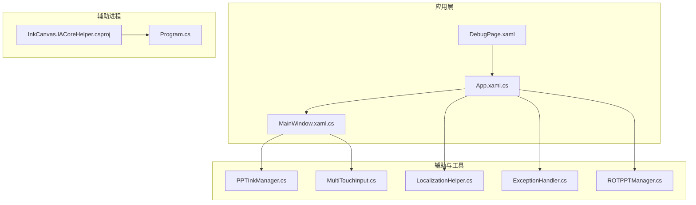
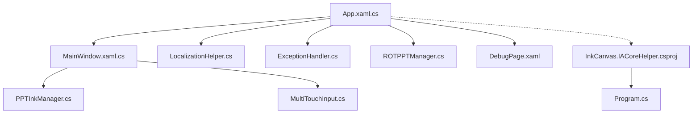
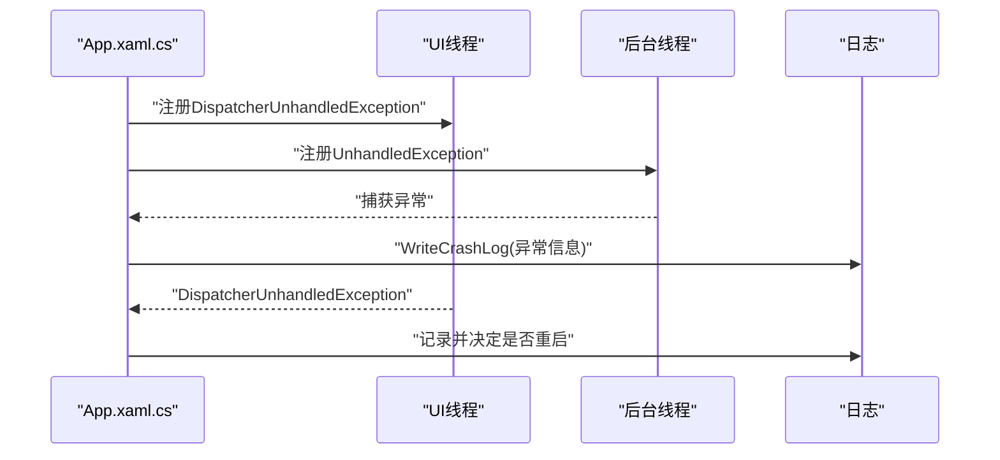
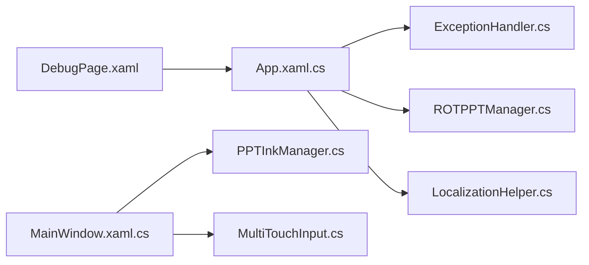

# 性能优化与最佳实践

## 简介
本指南聚焦于WPF自定义控件的性能优化与最佳实践，结合仓库中现有实现，系统阐述以下主题：
- 虚拟化与延迟加载：通过按需创建、懒加载与内存回收策略降低启动与运行时开销
- 渲染优化：利用缓存、位图缩放模式与边缘模式减少绘制成本
- 布局与视觉树简化：减少不必要的视觉节点与复杂变换
- 资源管理：资源字典缓存、样式复用与动态资源使用
- 生命周期优化：初始化延迟、事件订阅管理与异步处理
- 调试与性能分析：WPF性能计数器、Visual Studio性能分析器与第三方工具
- 性能测试与基准：如何设计与实施测试方案
- 实战案例：大量控件场景下的优化策略与内存泄漏预防

## 项目结构
该项目采用多模块组织方式，包含主应用、辅助工具、控件库与资源字典等。与性能优化密切相关的模块包括：
- 应用入口与生命周期：App.xaml.cs
- 主窗口与控件容器：MainWindow.xaml.cs
- 墨迹与渲染辅助：PPTInkManager.cs、MultiTouchInput.cs
- 资源与本地化：LocalizationHelper.cs
- 异常与资源释放：ExceptionHandler.cs、ROTPPTManager.cs
- 调试与诊断：DebugPage.xaml
- 辅助进程与内存映射：InkCanvas.IACoreHelper.csproj、Program.cs

## 核心组件
- 应用生命周期与崩溃处理：集中于App.xaml.cs，负责启动、异常捕获、崩溃日志与资源清理
- 主窗口与控件容器：MainWindow.xaml.cs承载大量控件与事件，涉及渲染、布局与交互
- 墨迹与渲染：PPTInkManager.cs与MultiTouchInput.cs分别负责内存化墨迹的清理与绘制优化
- 资源与本地化：LocalizationHelper.cs实现嵌入资源的缓存与替换，提升资源访问效率
- 异常与资源释放：ExceptionHandler.cs提供统一的TryExecute与异步执行封装；ROTPPTManager.cs提供COM对象的安全释放
- 调试与诊断：DebugPage.xaml提供调试开关与性能相关设置入口
- 辅助进程：InkCanvas.IACoreHelper.csproj与Program.cs通过共享内存与管道通信，减少主线程压力

## 架构总览
应用采用“主应用 + 辅助进程 + 资源/渲染辅助”的架构。主应用负责UI与业务逻辑，辅助进程通过共享内存与管道处理高吞吐任务，渲染与资源访问通过专用辅助类优化。

## 详细组件分析

### 组件A：应用生命周期与崩溃处理（App.xaml.cs）
- 初始化与异常捕获：集中处理UI线程与非UI线程异常，避免崩溃并记录日志
- 资源清理：在会话结束与进程退出时清理托管与非托管资源
- 启动监控：提供启动画面与崩溃日志收集，便于定位性能瓶颈

## 依赖关系分析
- App.xaml.cs依赖ExceptionHandler.cs与ROTPPTManager.cs进行异常与资源释放
- MainWindow.xaml.cs依赖PPTInkManager.cs与MultiTouchInput.cs进行渲染与内存管理
- LocalizationHelper.cs作为资源访问层，被App.xaml.cs间接使用
- DebugPage.xaml为调试入口，连接App.xaml.cs与各辅助模块

## 性能考量
- 虚拟化与延迟加载
  - 使用DispatcherPriority.ApplicationIdle与DispatcherPriority.Loaded延迟初始化关键组件，减少启动阻塞
  - 按需创建Canvas与控件，避免一次性构建大量视觉节点
- 渲染优化
  - 为VisualCanvas与DrawingVisual设置BitmapCache、BitmapScalingMode与CachingHint，降低重绘成本
  - 分段绘制笔迹，减少频繁绘制调用
- 布局与视觉树简化
  - 手动实现触摸滑动，避免复杂控件带来的布局计算
  - 合理隐藏/显示弹出面板，减少视觉树深度
- 资源管理
  - 嵌入资源缓存，避免重复解析与磁盘IO
  - 使用静态缓存与单例模式复用昂贵对象
- 生命周期优化
  - 在会话结束与进程退出时统一释放资源，防止泄漏
  - 使用TryExecute/TryExecuteAsync包裹异步操作，避免异常扩散
- 辅助进程
  - 通过共享内存与管道处理高吞吐任务，减轻主线程压力

## 故障排查指南
- 启动与崩溃
  - 使用App.xaml.cs中的崩溃日志记录，定位异常上下文与系统状态
  - 在SystemEvents.SessionEnding与CurrentDomain.ProcessExit中清理资源，避免泄漏
- COM对象异常
  - 使用ROTPPTManager.cs提供的SafeReleaseComObject与SafeFinalReleaseComObject，避免悬挂引用
- 资源访问异常
  - 使用ExceptionHandler.cs的TryExecute/TryExecuteAsync包装操作，确保异常可控
- 调试与诊断
  - 通过DebugPage.xaml启用调试开关，观察性能相关设置与行为

## 结论
本项目在应用生命周期、渲染优化、资源管理与异常处理等方面提供了良好的性能基础。建议在后续迭代中进一步引入：
- 更细粒度的虚拟化与延迟加载策略
- 性能计数器与分析器集成
- 明确的性能测试与基准方案
- 更完善的内存泄漏检测与报告机制

## 附录
- 性能测试与基准
  - 设计场景：大量控件、高频交互、高分辨率与高DPI环境
  - 指标：启动时间、帧率、内存占用、CPU占用、丢帧率
  - 工具：WPF性能计数器、Visual Studio性能分析器、PerfView、ETW
- 实战案例
  - 大量控件场景：采用延迟初始化与按需创建，配合缓存与复用
  - 内存泄漏预防：统一资源释放接口、COM对象安全释放、定期内存检查与清理