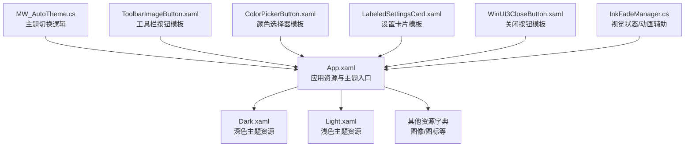
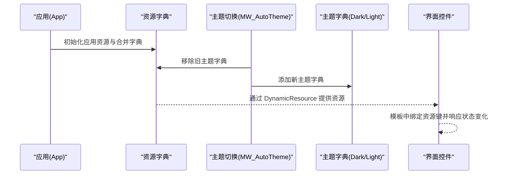
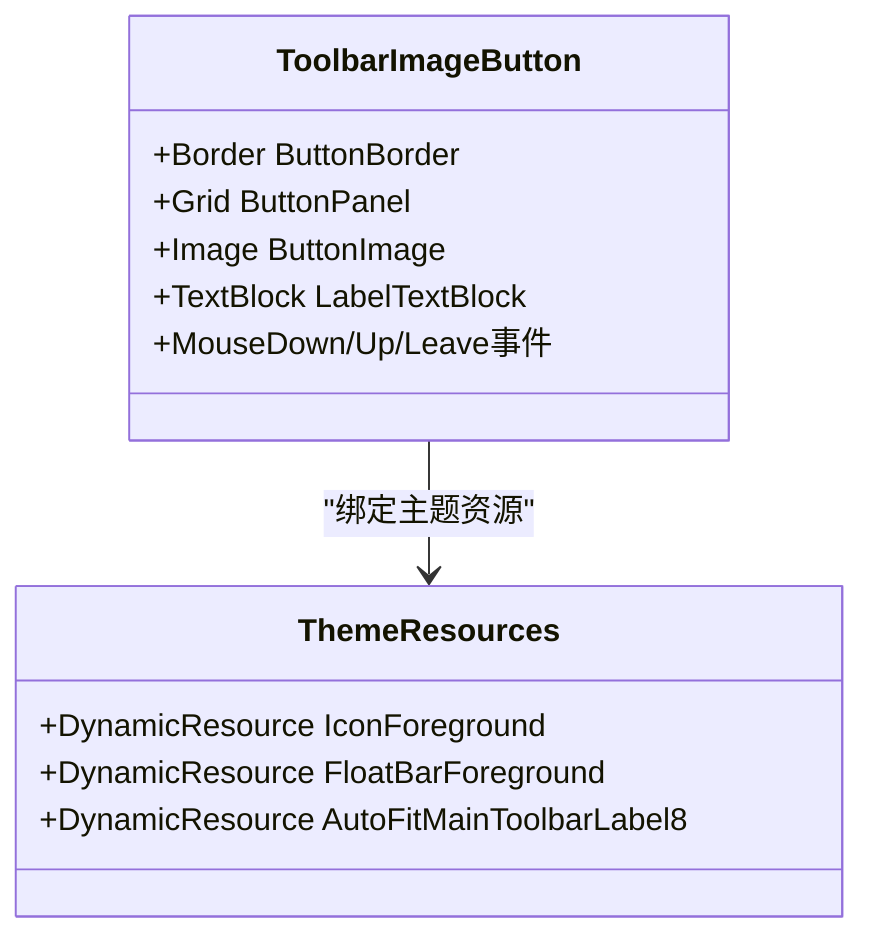
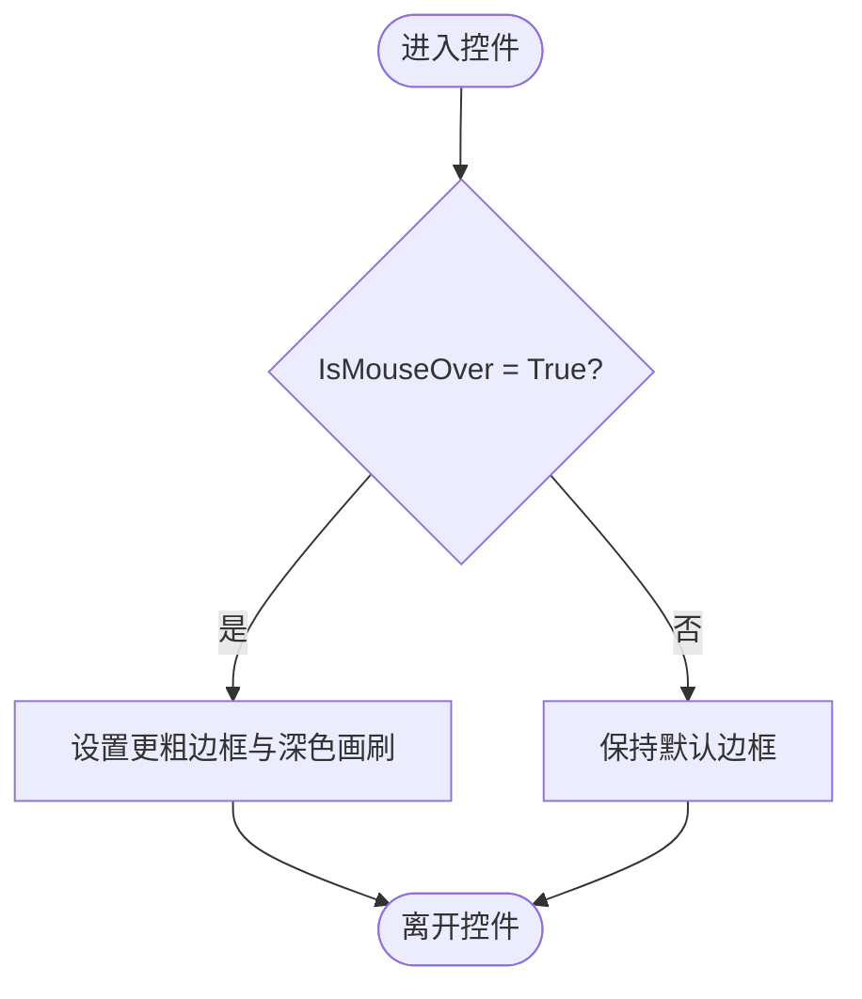
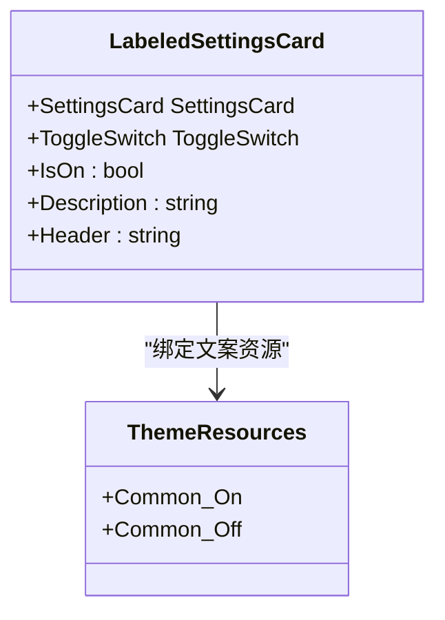
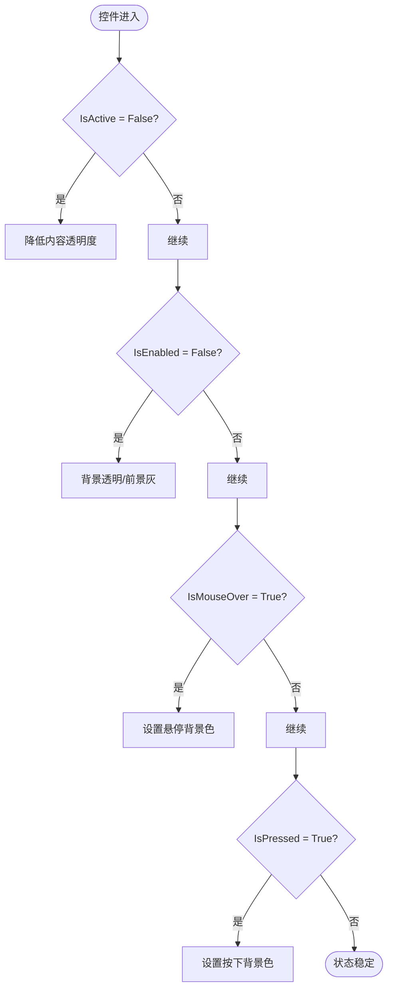
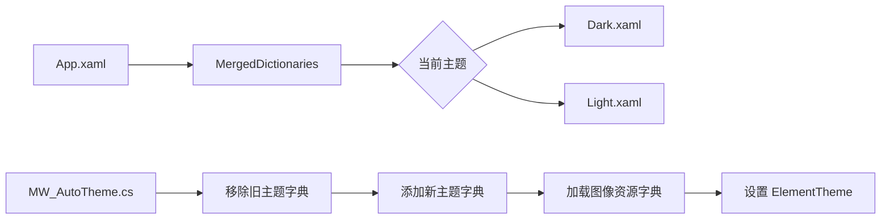
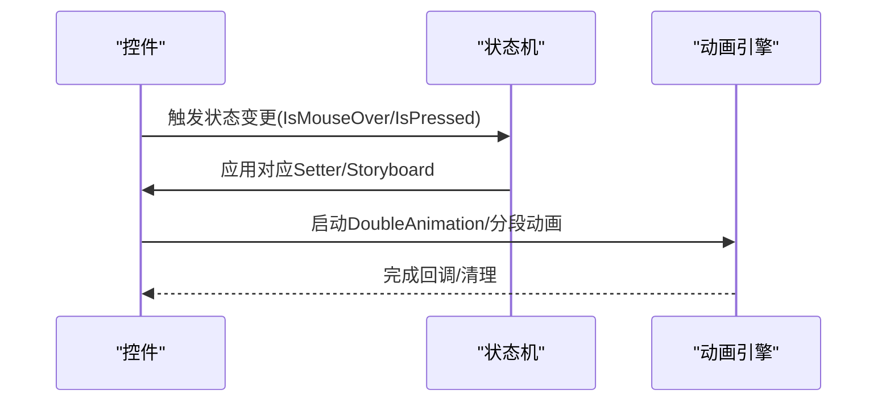
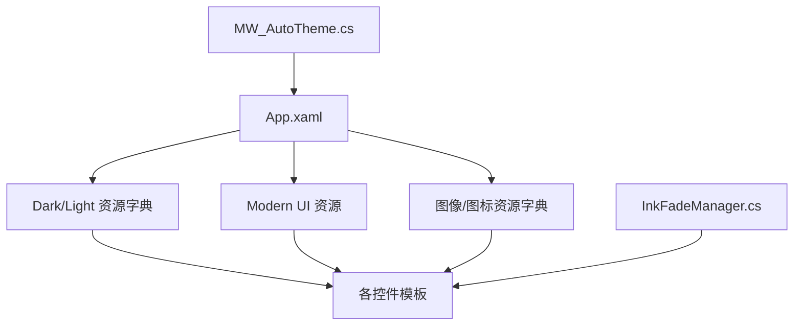

# 控件模板与样式

## 简介
本文件系统性阐述本项目的控件模板与样式体系，涵盖以下主题：
- ControlTemplate 的定义与使用：模板元素绑定、触发器与状态组
- Style 的组合使用：样式继承、资源引用与动态样式切换
- VisualStateManager 的使用：视觉状态管理与动画效果
- 主题系统：资源字典组织、主题切换与自定义主题创建
- 样式优先级与冲突解决：样式合并与覆盖规则
- 实战示例：设置卡片、工具栏按钮、颜色选择器的完整实现思路与参考路径

## 项目结构
本项目的样式与模板主要分布在以下位置：
- 应用级资源与主题入口：App.xaml
- 深色/浅色主题资源字典：Resources/Styles/Dark.xaml、Light.xaml
- 主题切换逻辑：MainWindow_cs/MW_AutoTheme.cs
- 典型控件模板与样式：InkCanvas.Controls/*.xaml 与 Ink Canvas/Windows/Controls/*.xaml
- 动画与视觉状态辅助：Helpers/InkFadeManager.cs

## 核心组件
- 应用资源与主题入口：App.xaml 定义了应用级资源字典与合并字典，包含 Modern UI 资源、图标与图像资源字典，并通过 MergedDictionaries 引入主题资源。
- 主题资源字典：Dark.xaml 与 Light.xaml 提供统一的颜色、画刷、图标位图等资源键，作为主题切换的基础。
- 主题切换逻辑：MW_AutoTheme.cs 通过移除旧主题字典、添加新主题字典并加载图片资源，完成主题切换；同时设置 ElementTheme 以驱动系统级外观。
- 控件模板与样式：
  - ToolbarImageButton.xaml：使用 Border 包裹 Grid，内部包含 Image 与 TextBlock，利用 DynamicResource 绑定主题资源。
  - ColorPickerButton.xaml：通过 Style.Triggers 实现鼠标悬停边框变化等交互。
  - LabeledSettingsCard.xaml：基于 SettingsCard 与 ToggleSwitch 的组合模板。
  - WinUI3CloseButton.xaml：使用 ControlTemplate 与多个 Trigger 实现禁用、悬停、按下等状态下的外观变化。
- 视觉状态与动画：InkFadeManager.cs 展示了基于 DispatcherTimer 与 DoubleAnimation 的分段渐隐动画，体现视觉状态管理与动画实现。

## 架构总览
应用启动时，App.xaml 加载基础资源与 Modern UI 资源，随后根据当前主题加载 Dark.xaml 或 Light.xaml。MW_AutoTheme.cs 在需要时替换合并字典以切换主题，并加载相关图像资源。各控件模板通过 DynamicResource 引用主题资源键，实现跨主题一致的外观与行为。

## 详细组件分析

### 工具栏按钮模板（ToolbarImageButton.xaml）
- 结构要点
  - 外层 Border 提供圆角与透明背景，内部 Grid 固定尺寸，包含 Image 与 TextBlock。
  - Image.Source 使用 DrawingImage 与 GeometryDrawing，Brush 绑定 DynamicResource IconForeground。
  - TextBlock 绑定 DynamicResource FloatBarForeground，并应用 AutoFit 样式。
- 模板元素绑定
  - 使用 {DynamicResource ...} 引用主题资源键，随主题切换自动更新。
- 触发器与状态组
  - 该控件本身未定义 ControlTemplate.Triggers，但其 Border 子元素可按需添加 Style.Triggers 实现交互态（如悬停、按下）。
- 适用场景
  - 浮动工具栏按钮、菜单项图标与标签组合。

### 颜色选择器按钮模板（ColorPickerButton.xaml）
- 结构要点
  - 外层 Border，内部 Path 作为勾选图标，初始可见性 Collapsed。
  - 通过 Style.Triggers 实现 IsMouseOver 时的边框厚度与颜色变化。
- 模板元素绑定
  - 边框画刷与文本颜色可通过主题资源键扩展绑定。
- 触发器与状态组
  - 当前包含一个 Trigger（悬停），可扩展为选中/禁用等状态。
- 适用场景
  - 快速颜色选择面板中的单色按钮。

### 设置卡片模板（LabeledSettingsCard.xaml）
- 结构要点
  - 基于 SettingsCard 与 ToggleSwitch 的组合，Header 与 Description 通过 RelativeSource 绑定到 UserControl 自身属性。
  - ToggleSwitch 的 OnContent/OffContent 绑定到主题资源键，实现本地化文案。
- 模板元素绑定
  - 使用 {Binding ... RelativeSource={RelativeSource AncestorType=UserControl}} 实现父子属性传递。
- 触发器与状态组
  - 该模板未显式定义触发器，但可在外层容器添加 Style.Triggers 以实现交互态。
- 适用场景
  - 设置页中的开关类设置项。

### 关闭按钮模板（WinUI3CloseButton.xaml）
- 结构要点
  - 使用 ControlTemplate，内部包含 Border 与 ContentPresenter。
  - 通过多个 Trigger 实现 IsActive=False、IsEnabled=False、IsMouseOver、IsPressed 等状态下的外观变化。
- 模板元素绑定
  - Background、Foreground、Opacity 等属性通过 Setter 动态设置。
- 触发器与状态组
  - 明确的状态组：IsActive、IsEnabled、IsMouseOver、IsPressed。
- 适用场景
  - 标准窗口标题栏关闭按钮。

### 主题系统与资源组织
- 资源字典组织
  - App.xaml 通过 MergedDictionaries 引入 Modern UI 资源与多套图像资源字典。
  - Dark.xaml 与 Light.xaml 提供统一的画刷、颜色与图标资源键，便于跨控件共享。
- 主题切换
  - MW_AutoTheme.cs 删除包含 Light/Dark 的现有字典，再添加目标主题字典，并延迟加载图像资源字典，最后设置 ElementTheme。
- 自定义主题创建
  - 新建资源字典，定义与现有键一致的资源键，按需补充缺失键，然后在 App.xaml 中按优先级合并或替换。

### 视觉状态管理与动画
- 视觉状态管理
  - WinUI3CloseButton.xaml 展示了通过 Trigger 管理不同视觉状态（禁用、悬停、按下）。
  - ToolbarImageButton.xaml 可扩展为包含 PointerOver/Pressed 等状态的模板。
- 动画效果实现
  - InkFadeManager.cs 使用 DispatcherTimer 与 DoubleAnimation 实现分段渐隐动画，体现视觉状态过渡与安全性保障（超时清理）。
- 与 VisualStateManager 的关系
  - 本项目常见使用 Trigger 与 Storyboard/Animation 实现状态切换；若需复杂状态机，可在控件模板中引入 VisualStateGroup/VisualState 并配合 Storyboard。

### 样式优先级与冲突解决
- 资源查找顺序
  - 控件本地资源 > 上下文资源 > 合并字典（从后向前）> 应用资源。
- 样式合并与覆盖
  - 通过 MergedDictionaries 的顺序控制资源覆盖；主题切换时先移除旧字典再添加新字典，确保新主题生效。
- 建议
  - 为常用资源键命名保持一致性，避免键名冲突；对可复用的样式尽量集中定义，减少重复。

## 依赖关系分析
- App.xaml 依赖 Modern UI 资源与多套图像资源字典；依赖 MW_AutoTheme.cs 进行主题切换。
- 控件模板依赖主题资源字典中的资源键；部分控件通过 DynamicResource 实现主题联动。
- InkFadeManager.cs 与界面控件无直接依赖，但其动画机制可作为视觉状态管理的参考实现。

## 性能考量
- 资源加载
  - 主题切换采用延迟加载图像资源字典，避免阻塞主线程。
- 动画性能
  - 分段动画通过 DispatcherTimer 控制节拍，结合安全超时清理，防止资源泄漏。
- UI 渲染
  - 控件模板尽量使用高分辨率位图缩放模式与布局优化，减少不必要的重绘。

## 故障排查指南
- 主题切换无效
  - 检查是否正确移除了旧主题字典并添加了新字典；确认资源键名称一致。
- 图标/图像不显示
  - 检查图像资源字典是否被正确加载；确认 UriSource 路径有效。
- 动画异常或卡顿
  - 检查动画时长与分段数量；确保在 Completed 回调中清理资源；必要时调整缓动函数。

## 结论
本项目的控件模板与样式体系以资源字典为核心，通过主题资源键实现跨控件的一致外观；借助 ControlTemplate 与 Trigger 实现丰富的交互态；通过 MW_AutoTheme.cs 完成主题切换与资源加载；InkFadeManager.cs 提供了视觉状态与动画的实践范例。遵循统一的资源键命名与合并字典顺序，可有效避免样式冲突并提升维护效率。

## 附录
- 实际示例参考路径
