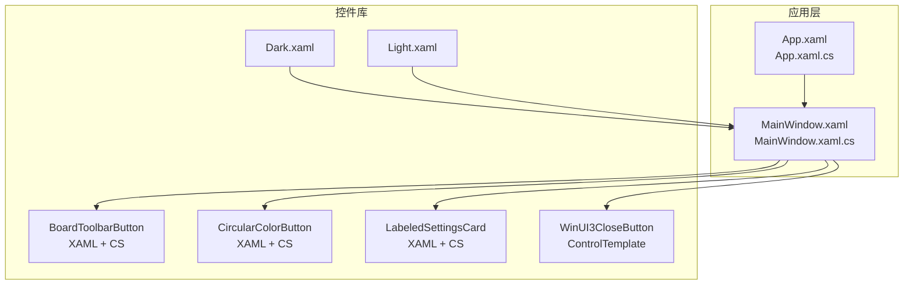
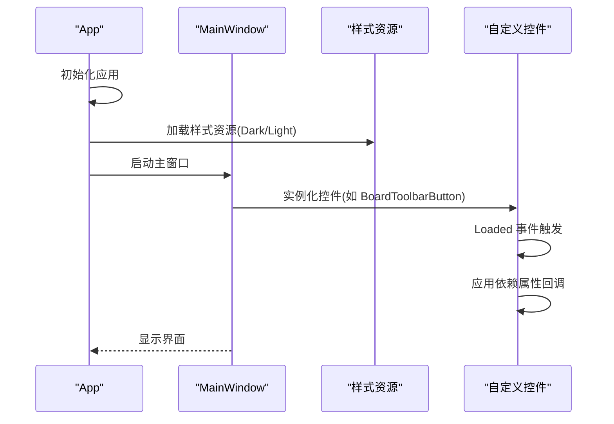
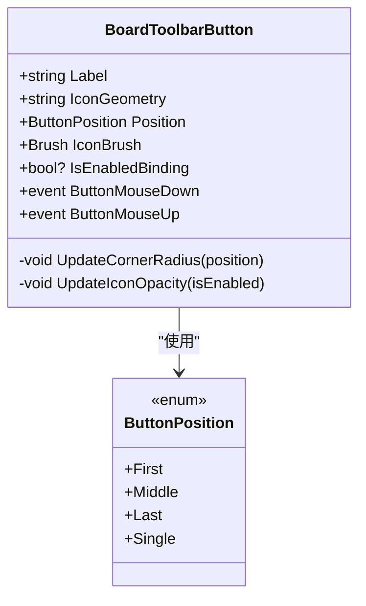
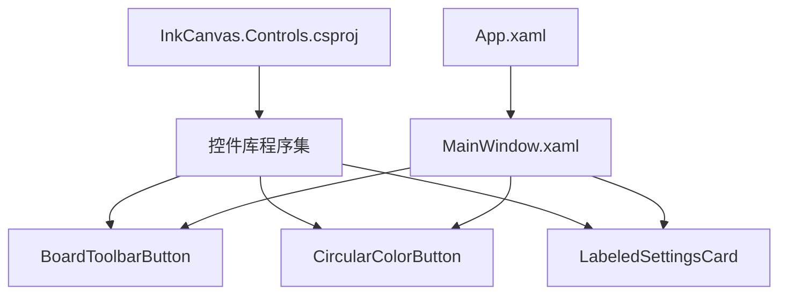

# WPF 控件基础

## 引言
本文件面向希望系统学习 WPF 控件开发的读者，结合仓库中的实际控件实现，讲解以下主题：
- WPF 控件体系结构：FrameworkElement 与 UserControl 的区别及适用场景
- 依赖属性：定义、元数据、回调函数与属性变更通知
- 控件模板与样式系统：ControlTemplate、DataTemplate 与 Style 的定义与应用
- 事件处理机制：路由事件、命令绑定与事件冒泡
- 控件生命周期：初始化、布局与渲染流程
- 实战示例：从简单自定义按钮到复杂复合控件的实现路径

## 项目结构
本仓库包含一个 WPF 应用与一组可复用的自定义控件库。控件库位于 InkCanvas.Controls，应用入口在 Ink Canvas。

## 核心组件
本节聚焦于三个典型控件，它们展示了依赖属性、事件处理、模板与样式的关键用法。

- BoardToolbarButton：多依赖属性驱动外观与行为，事件转发，位置相关圆角与边框动态计算
- CircularColorButton：颜色、尺寸、选中态等依赖属性联动 UI 子元素，Loaded 阶段统一应用属性
- LabeledSettingsCard：组合现代控件（SettingsCard/ToggleSwitch），通过依赖属性与绑定实现图标、标题、开关状态与可见性控制

## 架构总览
下图展示了应用启动、资源加载与控件实例化之间的关系，以及控件库与应用之间的装配方式。

## 详细组件分析

### BoardToolbarButton 组件分析
BoardToolbarButton 是一个典型的 UserControl，内部包含 Border、Image、TextBlock 等子元素，并通过多个依赖属性驱动其外观与交互。

- 依赖属性要点
  - Label：字符串标签文本，变更时同步更新内部 TextBlock 文本
  - IconGeometry：几何图形字符串，解析后赋给内部 GeometryDrawing
  - Position：枚举类型，决定 Border 圆角与边框厚度
  - IconBrush：图标画刷，直接设置内部 GeometryDrawing.Brush
  - IsEnabledBinding：三态启用状态，同时影响 IsEnabled 与图标透明度
- 事件处理
  - 将底层 Border 的鼠标事件向上转发为自定义事件，便于宿主窗口订阅
- 生命周期
  - 在 Loaded 中根据初始 Position 计算圆角与边框；若存在初始 IconGeometry，则进行几何解析

## 依赖关系分析
- 控件库与应用
  - 控件库项目文件声明 UseWPF=true，目标框架为 net6.0-windows，确保在 WPF 平台编译
  - 应用通过 XAML 引用控件库中的 UserControl，形成“库-应用”装配关系
- 控件内部依赖
  - BoardToolbarButton 与 CircularColorButton 通过依赖属性回调直接操作子元素，体现“属性驱动 UI”的设计
  - LabeledSettingsCard 通过绑定与事件转发，实现“数据-视图-交互”的解耦

## 性能考虑
- 依赖属性回调中避免频繁创建对象（如 Brush、Geometry），优先重用或延迟创建
- 在 Loaded 或属性回调中批量应用属性，减少多次布局/渲染
- 对于复杂几何绘制，尽量使用矢量资源而非频繁解析字符串
- 合理使用模板与资源复用，避免重复定义相同样式

## 故障排查指南
- 依赖属性不生效
  - 检查是否正确注册依赖属性并提供回调函数
  - 确认属性名称与模板/绑定一致
- 事件未触发
  - 确认事件转发逻辑是否正确，路由事件需使用 RoutedEventArgs 或相应参数类型
- 样式不生效
  - 检查资源字典合并顺序与键名一致性
  - 确认控件模板中对模板部件的引用是否正确

## 结论
通过对仓库中三个典型控件的深入分析，可以总结出 WPF 控件开发的关键实践：
- 使用依赖属性驱动 UI 更新，配合回调函数实现细粒度控制
- 通过 UserControl 组合现有控件，提升复用性与可维护性
- 利用 ControlTemplate 与样式资源实现主题化与一致的视觉语言
- 正确处理控件生命周期与事件流，保证交互体验与性能

## 附录
- 基础控件开发步骤建议
  - 明确控件职责与输入输出（依赖属性）
  - 设计 XAML 结构与 ControlTemplate
  - 在代码背后实现依赖属性回调与事件转发
  - 在应用层通过样式与资源统一主题
  - 编写测试或手动验证关键交互与边界情况