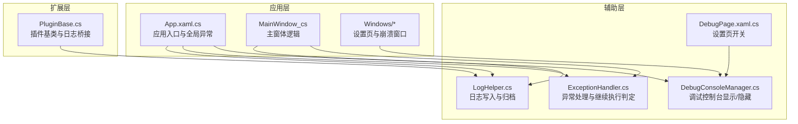
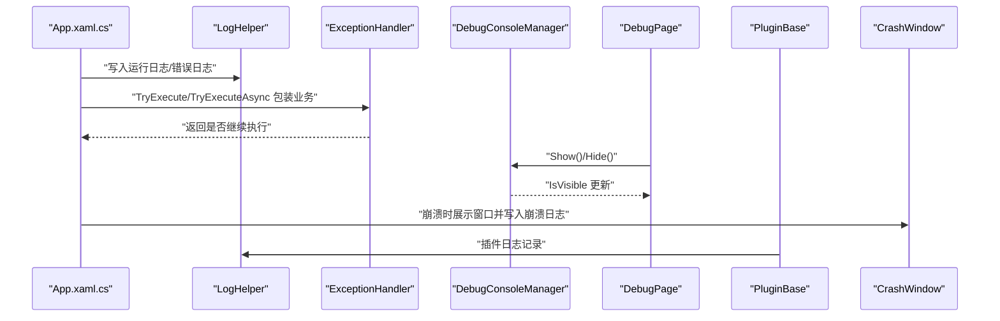
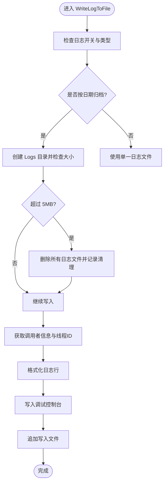
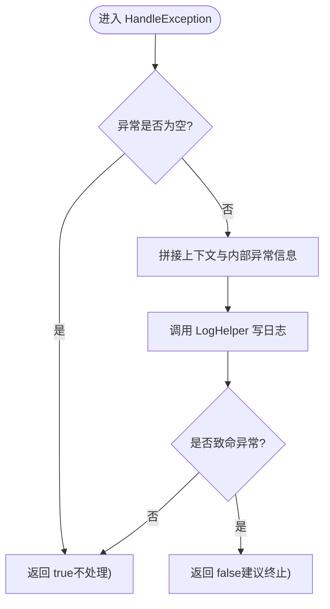
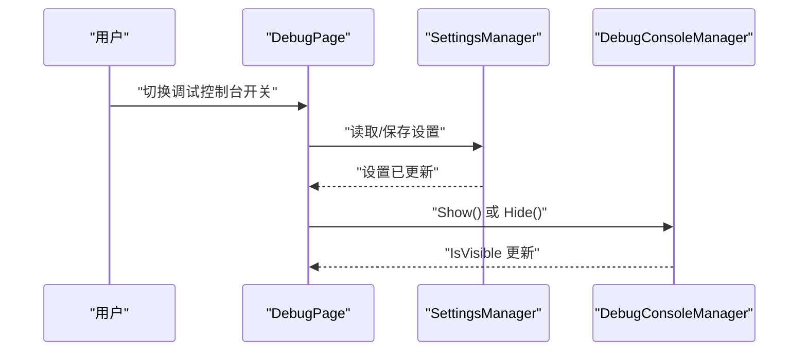
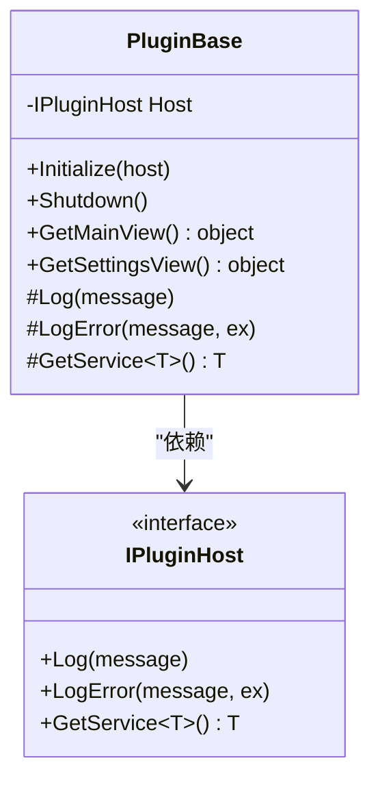
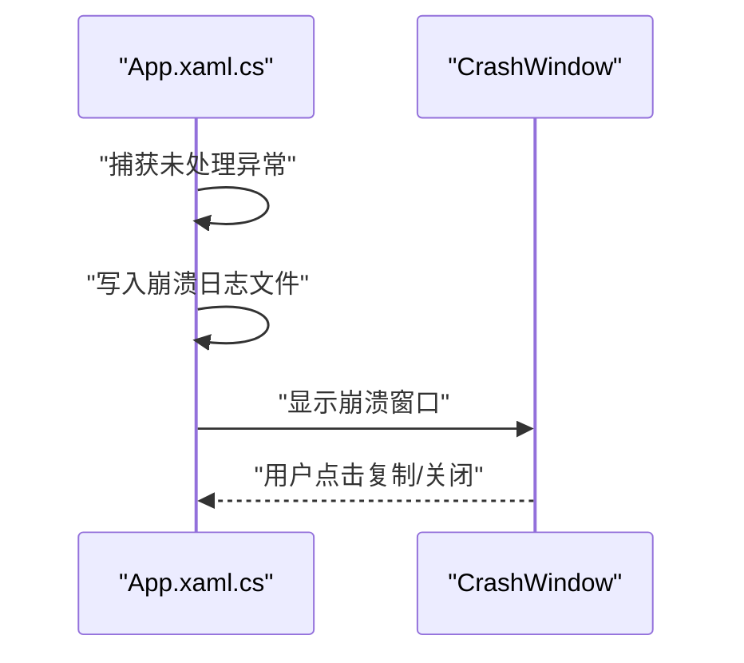
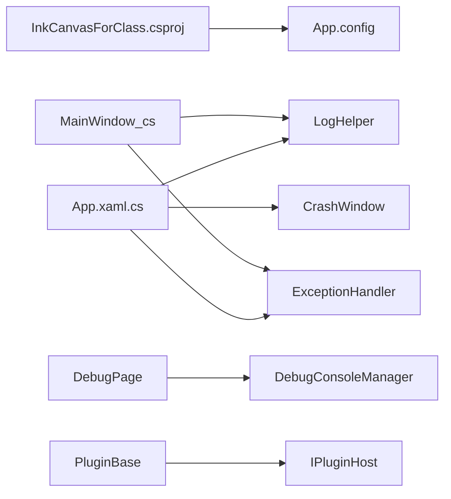

# 调试与测试

## 简介
本指南面向开发者与测试工程师，围绕 Visual Studio 调试器、日志系统、性能分析、单元测试与集成测试、异常与崩溃分析、代码覆盖率以及具体调试与测试场景展开。文档结合仓库中的实际实现（日志、异常处理、调试控制台、插件框架、崩溃窗口等），提供可操作的实践建议与可视化图示。

## 项目结构
- 应用工程采用 WPF/WinForms 混合技术栈，目标框架为 .NET 6（Windows），支持多平台标识符（x86/x64/ARM64）。
- 调试与测试相关的关键模块分布于以下位置：
  - 日志与异常：Helpers 目录
  - 调试控制台：Windows 设置页与 Helpers
  - 插件框架：InkCanvas.PluginSdk
  - 崩溃窗口与崩溃日志：Windows 与 App 启动逻辑
  - 构建与调试配置：InkCanvasForClass.csproj 与 App.config

## 核心组件
- 日志系统（LogHelper）
  - 支持按启动时间归档日志、日志文件夹大小上限清理、线程安全写入、调用者信息注入、统一输出到调试控制台。
  - 日志类型包含 Info、Trace、Error、Event、Warning。
- 异常处理（ExceptionHandler）
  - 统一记录异常上下文与内部异常；根据异常类型决定是否继续执行；提供同步/异步执行包装。
- 调试控制台（DebugConsoleManager + DebugPage）
  - 动态分配/释放控制台窗口，UTF-8 输出编码，标题定制；设置页开关控制显示/隐藏。
- 插件框架（PluginBase）
  - 插件可通过宿主接口进行日志记录与服务获取，便于插件侧调试与问题定位。
- 崩溃日志与窗口（App.xaml.cs + CrashWindow.xaml）
  - 全局异常捕获后生成带时间戳与进程状态的崩溃日志；崩溃窗口展示并允许复制信息。

## 架构总览
下图展示了从应用入口到日志、异常、调试控制台与崩溃窗口的整体交互：

## 组件详解

### 日志系统（LogHelper）
- 关键能力
  - 按启动时间归档日志（可选），防止日志文件夹过大，超过阈值自动清理。
  - 线程安全写入，递归调用保护。
  - 自动注入时间戳、线程 ID、日志类型与调用者信息。
  - 输出到调试控制台与文件。
- 使用建议
  - 在业务关键路径调用统一日志入口，区分日志类型（Info/Trace/Error/Warning）。
  - 对异常场景优先使用异常重载，确保堆栈信息完整记录。
  - 在需要长期追踪问题时开启“按日期归档”功能。

### 异常处理（ExceptionHandler）
- 关键能力
  - 统一记录异常上下文与内部异常链。
  - 对致命异常（如内存不足、访问违例）建议终止执行。
  - 提供同步与异步执行包装，支持“继续/抛出”策略。
- 使用建议
  - 在 UI 事件、后台任务、IPC 调用等易错路径使用 TryExecute/TryExecuteAsync。
  - 对可恢复错误记录日志并提示用户；对不可恢复错误及时退出并上报。

### 调试控制台（DebugConsoleManager + DebugPage）
- 关键能力
  - 动态分配控制台窗口，设置标题与输出编码，移除关闭菜单避免误关进程。
  - 提供 Show/Hide 接口与可见性状态。
  - 设置页开关联动，读取设置并持久化。
- 使用建议
  - 开发阶段在设置页启用调试控制台，观察实时日志。
  - 发布版本默认隐藏，避免影响用户体验。

### 插件框架（PluginBase）
- 关键能力
  - 插件通过宿主接口记录日志、记录错误、获取服务，便于统一问题定位。
- 使用建议
  - 在插件初始化、UI 交互、外部调用等关键节点记录日志。
  - 通过 GetService 获取宿主提供的服务，避免硬编码耦合。

### 崩溃日志与崩溃窗口（App.xaml.cs + CrashWindow.xaml）
- 关键能力
  - 全局异常捕获后写入崩溃日志，包含时间戳、进程 PID、内存/处理器时间/运行时长等状态信息。
  - 崩溃窗口展示日志内容，支持复制与关闭。
- 使用建议
  - 用户反馈崩溃时，优先查看崩溃日志文件，收集并附带到问题报告。
  - 在崩溃窗口中复制完整信息，便于快速复现与定位。

## 依赖关系分析
- 工程与运行时
  - InkCanvasForClass.csproj 定义了目标框架、平台标识符、调试符号类型、包引用与构建目标。
  - App.config 指定运行时版本，确保兼容性。
- 组件耦合
  - App.xaml.cs 与 MainWindow_cs 中的业务逻辑广泛依赖 LogHelper 与 ExceptionHandler。
  - DebugPage 与 DebugConsoleManager 通过设置页联动，形成 UI 控制台开关。
  - PluginBase 通过 IPluginHost 与宿主通信，避免直接依赖具体实现。

## 性能考量
- 日志开销控制
  - 归档日志与大小清理可避免磁盘膨胀；线程安全写入使用互斥标志，减少竞争。
- 调试控制台
  - 控制台仅在开发阶段启用，避免对 UI 响应性造成额外负担。
- 崩溃日志
  - 崩溃时写入关键系统状态（内存、CPU 时间、运行时长），有助于定位性能瓶颈。

## 故障排查指南
- 断点与条件断点
  - 在日志写入路径（如 LogHelper.WriteLogToFile）设置条件断点，过滤特定日志类型或调用者。
  - 在异常处理路径（ExceptionHandler.TryExecute/TryExecuteAsync）设置断点，观察异常传播与继续策略。
- 智能监视
  - 在调试器监视窗口添加常用表达式：当前线程 ID、调用者信息、日志开关状态。
- 日志级别与输出
  - 将日志类型设为 Error/Warning 以快速定位问题；在需要时临时提升到 Trace。
- 崩溃分析
  - 收集崩溃日志文件，结合堆栈信息与系统状态字段进行分析。
  - 在崩溃窗口中复制完整信息，附带到问题报告。

## 结论
本项目提供了完善的日志、异常处理与调试控制台机制，配合崩溃窗口与插件框架，能够有效支撑开发调试与问题定位。建议在日常开发中充分利用日志类型、条件断点与智能监视，在测试阶段结合崩溃日志与插件日志进行回归验证。

## 附录

### 单元测试框架选择与配置
- 仓库中包含 MSTest、NUnit、xUnit、Chutzpah、BenchmarkDotNet、覆盖率工具等测试相关产物与忽略规则。
- 建议
  - 选择与团队一致的框架（如 MSTest/NUnit/xUnit），在独立测试项目中组织用例。
  - 利用 .gitignore 中的测试结果与覆盖率文件忽略规则，保持仓库整洁。
  - 对关键模块（如日志、异常处理、插件基类）编写单元测试，覆盖正常与异常分支。

### 集成测试与端到端测试
- 策略建议
  - 使用 UI 自动化工具（如 WinAppDriver）对关键 UI 场景（如插件页面加载、设置页开关）进行端到端验证。
  - 在 CI 中集成测试步骤，结合崩溃日志与覆盖率报告评估质量。
  - 对插件加载与日志输出进行自动化校验，确保插件侧问题可被及时发现。

### 代码覆盖率与质量度量
- 覆盖率工具
  - 仓库包含 DotCover、AxoCover、Coverlet、VS 覆盖率等工具的产物与忽略规则。
- 建议
  - 在本地与 CI 中生成覆盖率报告，重点关注日志、异常处理与插件基类路径。
  - 将覆盖率阈值纳入质量门禁，持续改进测试覆盖面。

### 具体调试场景与测试用例

- 插件调试
  - 在插件初始化与 UI 交互处设置断点，结合插件日志（PluginBase.Log/LogError）定位问题。
  - 使用条件断点过滤特定插件或调用者。
  - 编写单元测试验证插件服务获取与日志输出。

- UI 测试
  - 在设置页（DebugPage）与插件页面（PluginPage）场景中，验证调试控制台开关与插件列表加载。
  - 使用条件断点与智能监视观察 UI 响应与日志输出。

- 性能基准测试
  - 使用 BenchmarkDotNet 对关键算法（如日志写入、异常处理包装）进行基准测试。
  - 在不同平台（x86/x64/ARM64）与配置（Debug/Release）下对比性能差异。

章节来源
