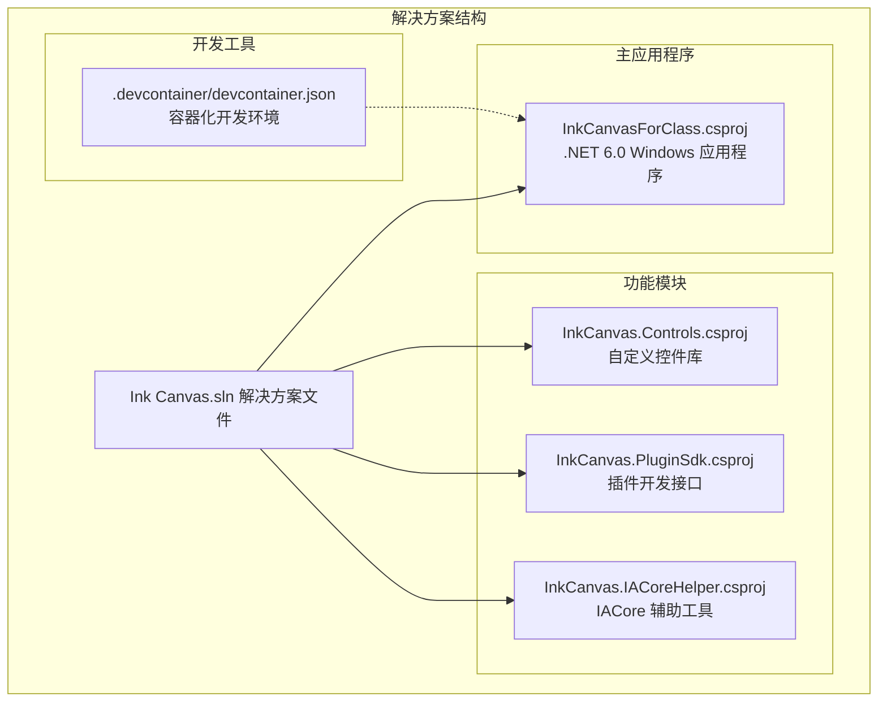
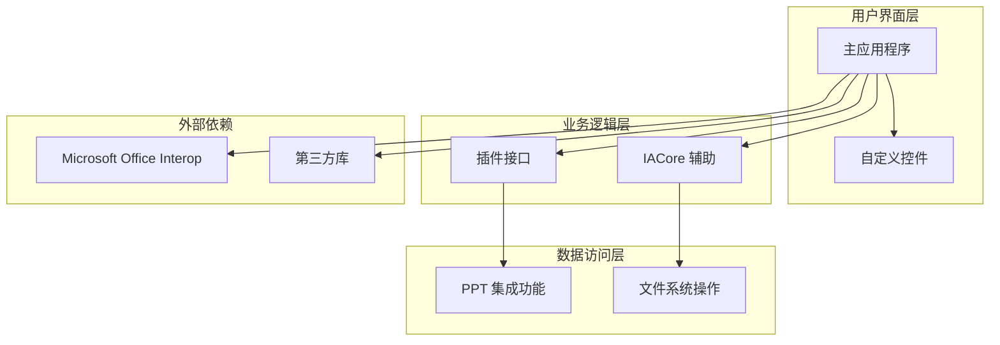
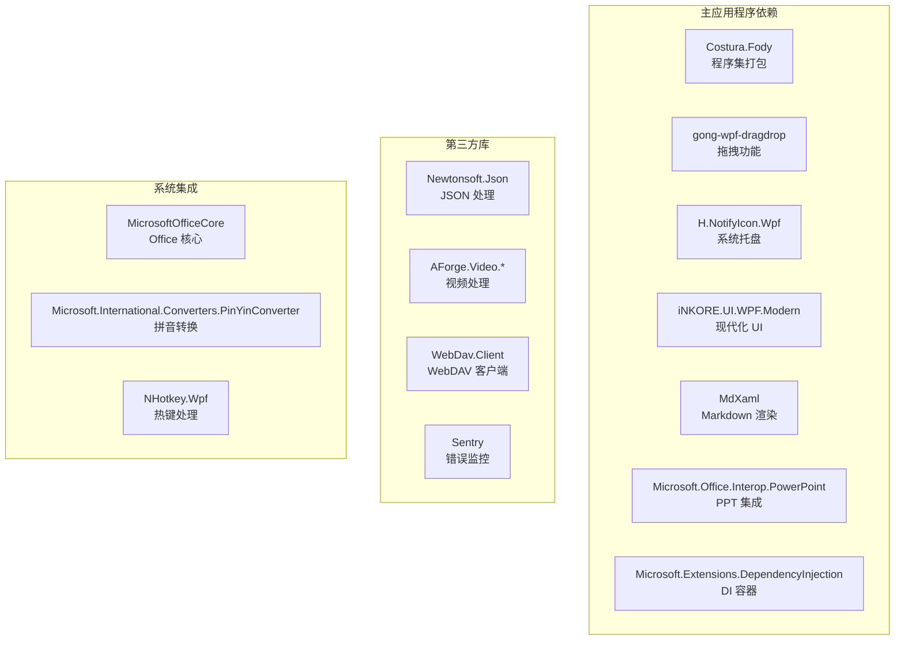

# 开发环境搭建

## 简介

InkCanvasForClass 是一个基于 WPF 技术的桌面应用程序，专为课堂教学设计。该项目采用 .NET 6.0 开发，支持 Windows 平台，具备丰富的教学辅助功能，包括手写输入、白板功能、PPT 集成等特性。

本指南将详细介绍如何搭建开发环境，包括 Visual Studio 2022 的安装配置、.NET 6.0 SDK 的安装验证、必要开发工具的配置，以及项目的完整构建流程。

## 项目结构

项目采用多项目解决方案架构，包含主应用程序和多个功能模块：



## 核心组件

### 主应用程序 (InkCanvasForClass)

主应用程序是整个系统的入口点，采用 WPF 技术构建，具有以下特点：

- **目标框架**: .NET 6.0 Windows 10.0.19041.0
- **输出类型**: WinExe (Windows 可执行文件)
- **平台支持**: x86, x64, ARM64
- **语言版本**: C# 10
- **WPF 支持**: 启用 Windows 标记

### 功能模块

#### 自定义控件库 (InkCanvas.Controls)
- 提供现代化的 UI 控件
- 支持 iNKORE.UI.WPF 和 iNKORE.UI.WPF.Modern 库
- 作为主应用程序的核心 UI 组件

#### 插件开发接口 (InkCanvas.PluginSdk)
- 定义插件开发的标准接口
- 支持扩展功能的插件架构

#### IACore 辅助工具 (InkCanvas.IACoreHelper)
- 基于 .NET Framework 4.7.2
- 提供 IACore 相关的辅助功能
- 与主应用程序协同工作

## 架构概览

项目采用分层架构设计，各组件职责明确：



## 详细组件分析

### 开发环境配置

#### Visual Studio 2022 安装配置

要成功开发此项目，需要安装以下组件：

**必需的工作负载:**
- .NET 桌面开发
- 使用 C# 的跨平台移动开发
- 使用 .NET 的跨平台开发

**必需的单个组件:**
- .NET 6.0 运行时
- .NET 6.0 SDK
- WPF 工具包
- NuGet 包管理器
- Git 客户端

#### .NET 6.0 SDK 安装和验证

**安装步骤:**
1. 访问 [.NET 6.0 下载页面](https://dotnet.microsoft.com/zh-cn/download/dotnet/6.0)
2. 下载适用于 Windows 的 .NET 6.0 SDK
3. 运行安装程序并完成安装
4. 验证安装结果

**验证方法:**
```powershell
dotnet --info
```

**预期输出包含:**
- .NET SDK 版本 6.0.x
- .NET 运行时版本 6.0.x
- 目标框架 6.0.0 及以上

#### 开发工具配置

**WPF 工具包:**
- Visual Studio 2022 中的 WPF 工具包已包含在 .NET 桌面开发工作负载中
- 支持 XAML 设计器和实时预览

**NuGet 包管理器:**
- 内置于 Visual Studio 2022
- 支持包还原和版本管理
- 自动处理项目依赖关系

**Git 客户端:**
- 可从 Visual Studio 安装
- 或单独安装 Git for Windows
- 支持版本控制和协作开发

### 项目克隆和构建

#### 克隆项目

```bash
git clone https://github.com/InkCanvasForClass/community.git
cd community
```

#### 依赖项安装

项目使用包锁定文件确保依赖项的一致性：

**自动包还原:**
- Visual Studio 2022 会自动执行包还原
- 或使用命令行: `dotnet restore`

**手动包还原:**
```powershell
dotnet restore
```

#### 首次编译

**使用 Visual Studio:**
1. 打开 `Ink Canvas.sln` 解决方案文件
2. 选择构建配置 (Debug/Release)
3. 选择目标平台 (Any CPU/x86/x64/ARM64)
4. 点击"生成解决方案"

**使用命令行:**
```powershell
dotnet build "Ink Canvas.sln"
```

### 调试环境配置

#### 启动项目设置

**主应用程序设置:**
- 启动项目: InkCanvasForClass
- 启动操作: 启动外部程序
- 外部程序路径: `bin\Debug\net6.0-windows10.0.19041.0\InkCanvasForClass.exe`

**调试器参数:**
- 工作目录: `bin\Debug\net6.0-windows10.0.19041.0`
- 环境变量: 根据需要配置

#### 调试配置

**断点设置:**
- 在主窗口加载事件中设置断点
- 在 PPT 集成功能中设置断点
- 在插件加载过程中设置断点

**调试技巧:**
- 使用即时窗口监视变量
- 使用调用堆栈查看执行流程
- 使用输出窗口查看日志信息

### 容器化开发环境

#### Devcontainer 配置

项目提供了完整的容器化开发环境配置：

```json
{
  "image": "mcr.microsoft.com/devcontainers/dotnet",
  "postCreateCommand": "dotnet restore",
  "customizations": {
    "vscode": {
      "extensions": [
        "ms-dotnettools.csdevkit",
        "ms-dotnettools.csharp"
      ]
    }
  }
}
```

**容器环境特点:**
- 基于官方 .NET 开发容器镜像
- 预装 C# 开发工具
- 自动执行包还原
- 支持 VS Code 远程开发

**使用步骤:**
1. 安装 VS Code 和 Remote - Containers 扩展
2. 打开项目文件夹
3. 使用命令面板选择 "Remote-Containers: Open Folder in Container..."
4. 等待容器构建完成

## 依赖关系分析

### NuGet 包依赖

项目使用包锁定文件确保依赖项的一致性和可重复性：



## 性能考虑

### 编译优化

**构建配置:**
- Debug 配置使用嵌入式调试符号
- Release 配置优化代码大小和性能
- 支持多目标平台编译

**依赖项优化:**
- 使用包锁定文件确保依赖项一致性
- 启用程序集合并减少部署文件数量
- 优化资源文件处理

### 运行时性能

**内存管理:**
- 合理使用垃圾回收机制
- 及时释放非托管资源
- 优化大对象分配

**UI 响应性:**
- 异步处理耗时操作
- 使用后台线程处理复杂计算
- 避免阻塞 UI 线程

## 故障排除指南

### 常见环境问题

#### NuGet 包还原失败

**问题症状:**
- 构建时提示找不到包
- 包还原过程报错

**解决方案:**
1. 清理 NuGet 缓存
```powershell
dotnet nuget locals all --clear
```

2. 删除 packages.lock.json 文件
3. 重新执行包还原
```powershell
dotnet restore
```

4. 检查网络连接和代理设置

#### SDK 版本不匹配

**问题症状:**
- 编译时提示 SDK 版本不匹配
- Visual Studio 显示 SDK 错误

**解决方案:**
1. 验证 .NET SDK 版本
```powershell
dotnet --list-sdks
```

2. 安装正确的 SDK 版本
3. 更新 Visual Studio 2022
4. 重启开发环境

#### PPT 集成问题

**问题症状:**
- 启动时 PPT 集成功能异常
- PowerPoint 无法正常启动

**解决方案:**
1. 确保安装 Microsoft Office 365
2. 检查 PowerPoint 的兼容性设置
3. 以相同权限级别运行应用程序和 PowerPoint
4. 参考 README.md 中的 PPT 相关说明

#### 图标显示问题

**问题症状:**
- Windows 10 以下版本图标显示为方框

**解决方案:**
1. 下载并安装 SegoeFonts 字体
2. 安装 `SegMDL2.ttf` 字体文件
3. 重启系统使更改生效

#### 编译冲突

**问题症状:**
- 编译时报错，提示进程占用

**解决方案:**
1. 按照构建规范清理项目
2. 杀掉所有 inkcanvas 进程
3. 删除所有 bin 和 obj 目录
4. 重新编译

## 结论

InkCanvasForClass 项目提供了完整的开发环境搭建指南，涵盖了从基础环境配置到高级调试技巧的各个方面。通过遵循本指南，开发者可以快速建立稳定的开发环境，并成功构建和调试项目。

**关键要点总结:**
- 确保安装 Visual Studio 2022 和 .NET 6.0 SDK
- 配置必要的开发工具和组件
- 理解项目架构和依赖关系
- 掌握容器化开发环境的使用
- 准备好故障排除方案

项目采用现代化的开发实践，包括容器化开发、包锁定管理和多目标平台支持，为开发者提供了灵活且可靠的开发体验。通过合理的环境配置和最佳实践，开发者可以高效地进行功能开发和维护工作。