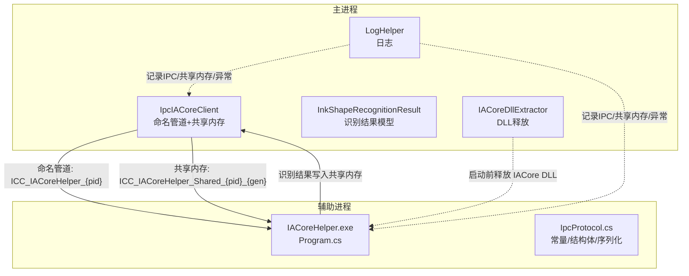
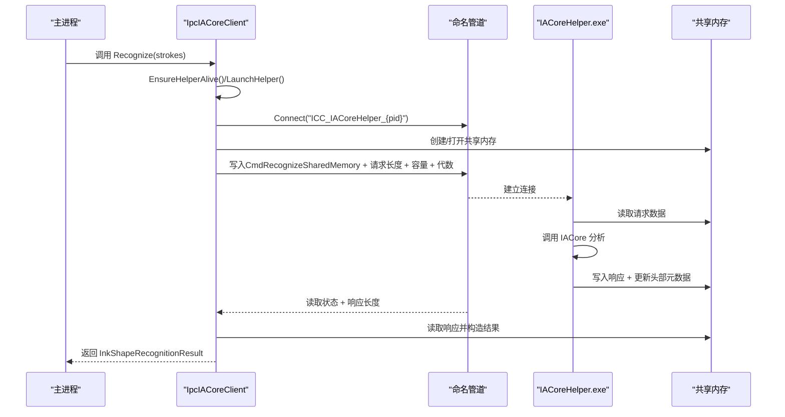
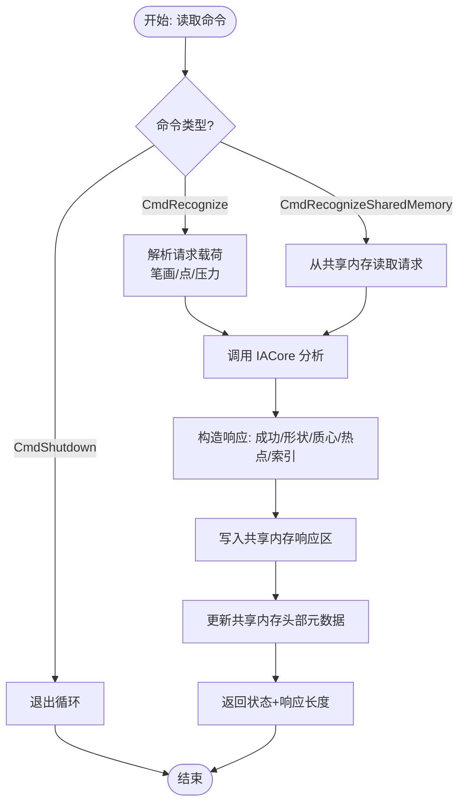
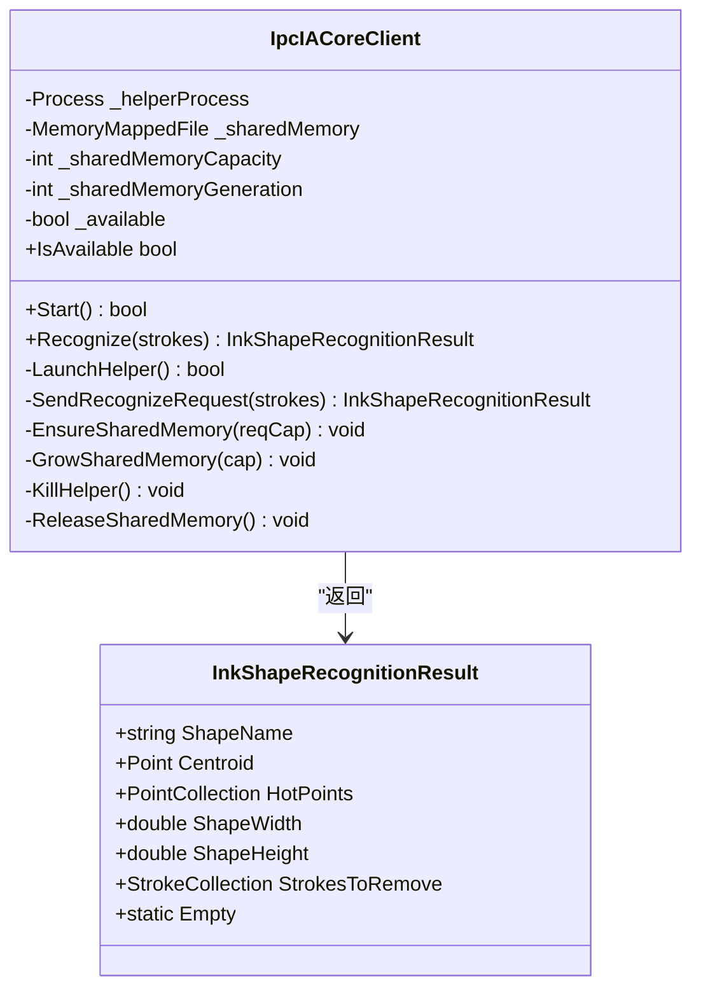
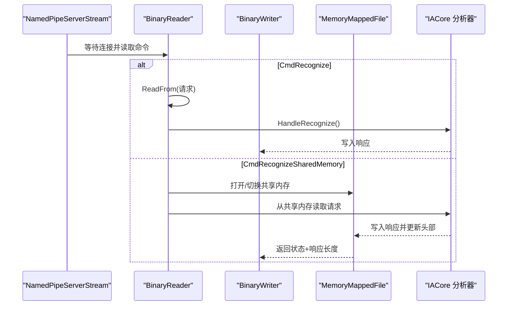
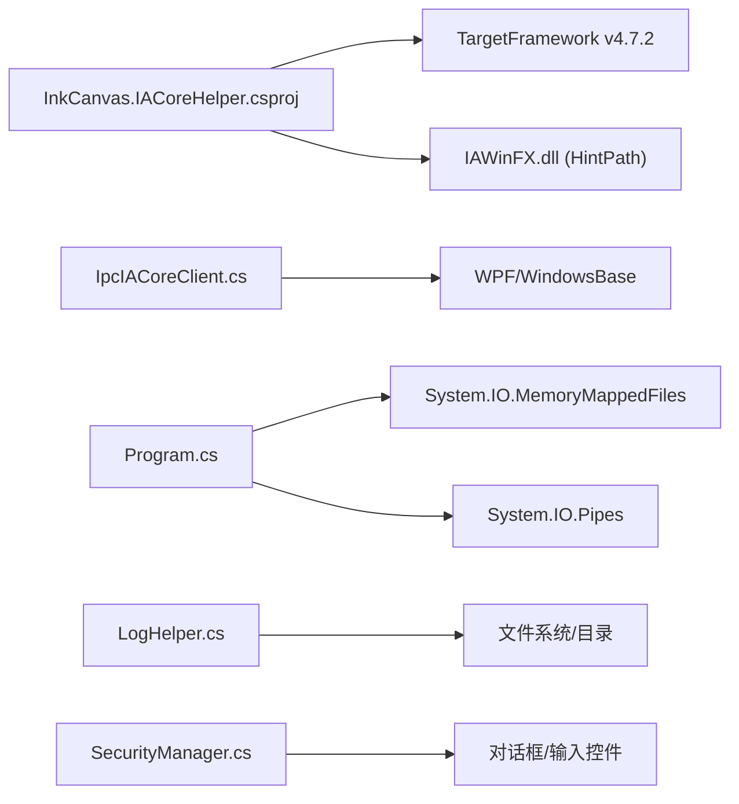

# IACore 辅助程序开发

## 简介
本指南面向需要集成 IACore 形状识别能力的开发者，系统讲解 IACore 辅助程序的 IPC 通信协议设计与实现、消息格式与序列化、错误处理策略；阐述进程间通信的安全性考虑（身份绑定、最小权限、共享内存边界）；给出完整的集成流程（进程启动、连接建立、会话管理）；说明辅助程序生命周期管理（启动参数、运行状态监控、异常恢复）；介绍数据传输优化（共享内存复用、容量自适应、头部校验）；并提供调试与监控工具使用建议及常见问题排查方法。

## 项目结构
IACore 辅助程序由两部分组成：
- 客户端侧（主进程）：负责启动辅助进程、通过命名管道发送请求、通过共享内存收发数据。
- 服务端侧（辅助进程）：监听命名管道、解析请求、调用 IACore 进行识别、将结果写入共享内存并通过头部元数据通知客户端。

## 核心组件
- 命名管道与共享内存协议
  - 管道名称格式：ICC_IACoreHelper_{父进程PID}
  - 共享内存命名格式：ICC_IACoreHelper_Shared_{父进程PID}_{代数}
  - 协议版本：v2
  - 请求超时：5000ms
  - 共享内存头部大小：24 字节
  - 默认/最大共享内存容量：4MiB ~ 32MiB
- 序列化与消息格式
  - 请求：识别命令 + 流水段落（笔画数量、每笔画点数、点坐标与压力）
  - 响应：布尔成功标志 + 形状名 + 质心 + 包围盒尺寸 + 热点坐标 + 参与笔画索引
- 客户端与服务端职责
  - 客户端：启动/维护辅助进程、命名管道通信、共享内存读写、容量自适应、异常恢复
  - 服务端：接收命令、解析请求、调用 IACore 分析、写入共享内存、更新头部元数据

## 架构总览
下图展示了主进程与辅助进程之间的交互时序，涵盖启动、握手、请求-响应以及共享内存读写。

## 组件详解

### IPC 协议与消息格式
- 命令集
  - 识别请求：CmdRecognize（字节值 0x01）
  - 共享内存识别：CmdRecognizeSharedMemory（字节值 0x02）
  - 关闭指令：CmdShutdown（字节值 0xFF）
- 请求载荷（共享内存模式）
  - 头部：请求长度、响应偏移、响应长度、状态
  - 数据区：笔画数量、每笔画点数、点坐标(X,Y,Pressure)
- 响应载荷
  - 成功标志、形状名、质心、包围盒宽高、热点坐标对、参与笔画索引
- 错误码
  - 正常：StatusOk
  - 错误：StatusError
  - 响应过大：StatusResponseTooLarge

### 客户端实现（IpcIACoreClient）
- 启动与可用性
  - 检查辅助进程可执行文件是否存在
  - 启动辅助进程并传入当前进程 PID
  - 通过轮询探测命名管道就绪
- 共享内存管理
  - 自适应扩容：请求过大时翻倍容量，必要时更换代数并重新创建共享内存
  - 头部校验：魔数、版本、状态、长度一致性检查
- 请求-响应
  - 写入请求到共享内存，通过命名管道发送共享内存识别命令
  - 读取响应并构造统一的结果模型
- 异常恢复
  - 管道异常或辅助进程退出时，清理共享内存并重启辅助进程

### 服务端实现（IACoreHelper.exe）
- 进程入口与参数
  - 接收父进程 PID，构造管道与共享内存名称
- 命名管道循环
  - 等待连接，读取命令并分派处理
  - 支持 CmdRecognize（直接读取管道载荷）与 CmdRecognizeSharedMemory（读取共享内存）
- 共享内存识别
  - 解析请求、调用 IACore 分析、写入响应并更新头部元数据
  - 对“响应过大”进行状态反馈，由客户端触发扩容重试
- 异常处理
  - 文件缺失、IO 异常、不支持异常均映射为错误码

### 安全与权限
- 进程边界与身份绑定
  - 管道与共享内存名称包含父进程 PID，确保仅父子进程可通信
- 最小权限原则
  - 辅助进程以隐藏窗口启动，避免 UI 干扰
  - 仅在需要时创建共享内存，及时释放
- 数据完整性
  - 共享内存头部包含魔数、版本、状态字段，客户端读取前进行校验
- 无明文敏感数据
  - 本模块不涉及密码/令牌等敏感数据交换，安全策略由其他模块（如 SecurityManager）负责

### 生命周期管理
- 启动参数
  - 传入父进程 PID，用于命名管道与共享内存命名
- 运行状态监控
  - 客户端轮询检测命名管道可达性
  - 监听辅助进程 Exited 事件，自动回收资源
- 异常恢复
  - 管道异常或响应过大时，销毁并重建辅助进程与共享内存
  - 超时或错误码触发降级返回空结果

### 数据传输优化
- 共享内存复用与自适应扩容
  - 客户端根据请求大小估算容量，不足时翻倍扩容并更换代数
  - 服务端在响应区写入后更新头部元数据，避免额外往返
- 头部校验与边界保护
  - 魔数、版本、状态、偏移、长度字段确保数据一致性
- 序列化紧凑
  - 浮点与整型连续写入，减少封送成本

### 集成流程（从零到一）
- 准备阶段
  - 确保 IACore DLL 已释放到应用目录（IACoreDllExtractor）
  - 启动前检查辅助进程可执行文件是否存在
- 启动阶段
  - 客户端启动辅助进程并传入当前 PID
  - 客户端轮询等待命名管道就绪
- 会话阶段
  - 客户端将请求写入共享内存，通过命名管道发送共享内存识别命令
  - 服务端解析请求、调用 IACore 分析、写入响应并更新头部
  - 客户端读取响应并构造统一结果对象
- 结束阶段
  - 客户端可显式发送关闭命令或直接退出
  - 客户端负责释放共享内存与进程句柄

## 依赖关系分析
- 项目依赖
  - IACoreHelper.csproj 指定 .NET Framework 4.7.2，目标平台 x86
  - 引用 IAWinFX.dll（位于资源目录），非私有复制，需随包分发
- 运行时依赖
  - 主进程 IpcIACoreClient 依赖 WPF/WindowsBase/PresentationCore
  - 辅助进程 Program 依赖 System.IO.MemoryMappedFiles/System.IO.Pipes
- 日志与安全
  - LogHelper 提供统一日志输出与归档
  - SecurityManager 提供密码/TOTP 等安全能力（与 IPC 互补）

## 性能考量
- 传输路径
  - 共享内存模式避免大对象跨进程拷贝，显著降低封送成本
  - 命名管道仅传递元数据（状态、长度、代数），减少 IO 往返
- 容量策略
  - 默认容量 4MiB，按需翻倍，上限 32MiB，避免频繁重建
- 序列化
  - 连续写入浮点/整型，减少封送与装箱
- 并发与稳定性
  - 客户端持有管道锁，避免并发写入竞争
  - 服务端单连接循环处理，简化同步逻辑

[本节为通用性能建议，无需特定文件引用]

## 故障排查指南
- 连接失败
  - 现象：WaitForPipe 超时或辅助进程立即退出
  - 排查：确认可执行文件存在、工作目录正确、父进程 PID 有效
  - 参考
- 数据丢失/解析错误
  - 现象：响应为空或字段缺失
  - 排查：检查共享内存头部魔数/版本/状态；确认响应偏移与长度合法
  - 参考
- 响应过大
  - 现象：服务端返回“响应过大”，客户端触发扩容重试
  - 排查：确认默认容量与最大容量限制；必要时增大请求粒度或减少笔画数量
  - 参考
- 性能瓶颈
  - 现象：识别耗时长或 CPU 占用高
  - 排查：减少单次请求笔画数量、合并多帧输入、避免频繁重建共享内存
  - 参考
- 日志与诊断
  - 使用 LogHelper 输出关键节点日志，定位异常发生位置
  - 参考

## 结论
IACore 辅助程序通过“命名管道 + 共享内存”的组合实现了高效、稳定的跨进程识别通道。客户端负责生命周期管理与容错恢复，服务端专注识别计算与数据写回。配合严格的头部校验与自适应扩容策略，可在复杂场景下保持稳定与高性能。建议在生产环境中结合日志与监控工具持续观察性能与稳定性。

[本节为总结性内容，无需特定文件引用]

## 附录

### 常见 IPC 示例（路径指引）
- 请求-响应（共享内存模式）
  - 客户端写入共享内存并发送命令
  - 服务端解析请求并写入响应
  - 参考
- 事件订阅机制
  - 本仓库未提供事件订阅接口；如需事件推送，可在现有共享内存基础上扩展“事件队列”与“通知信号”
  - 参考头部字段与共享内存读写流程

章节来源
