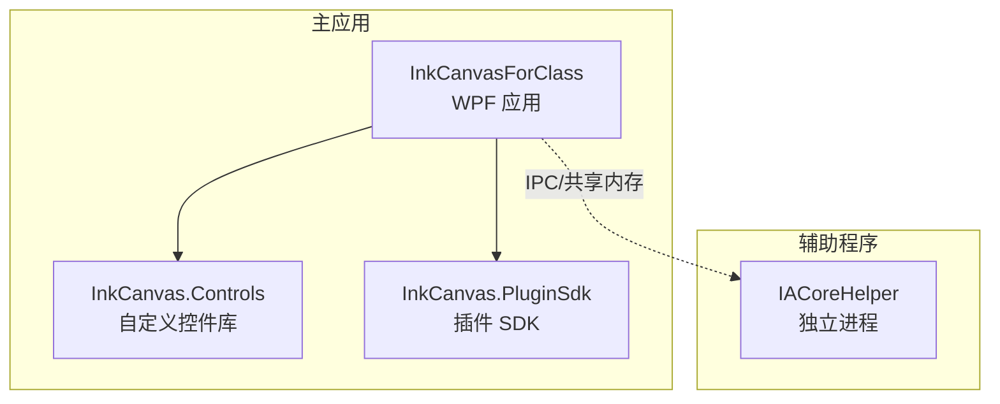
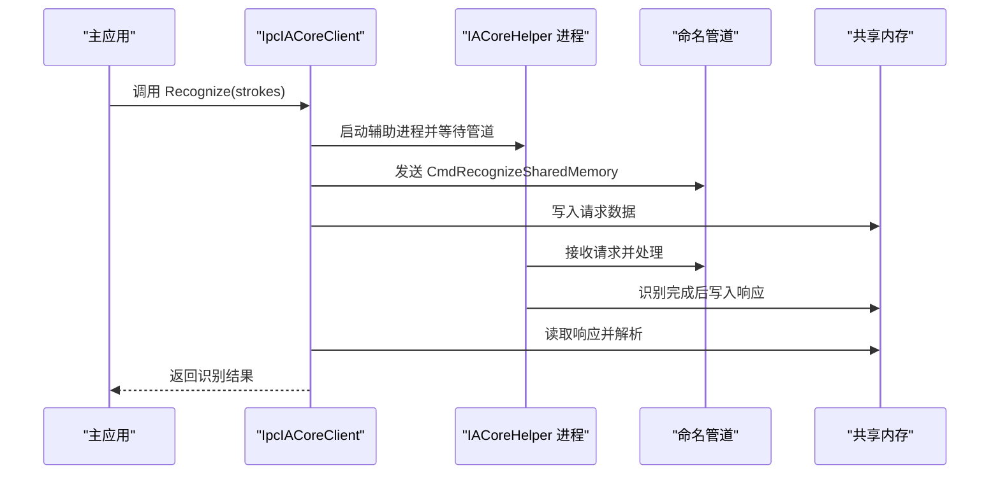
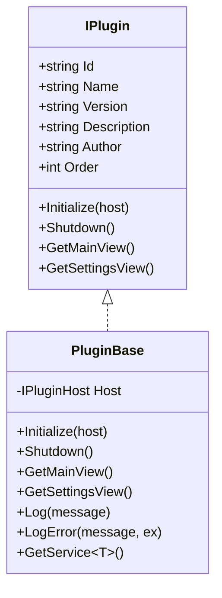
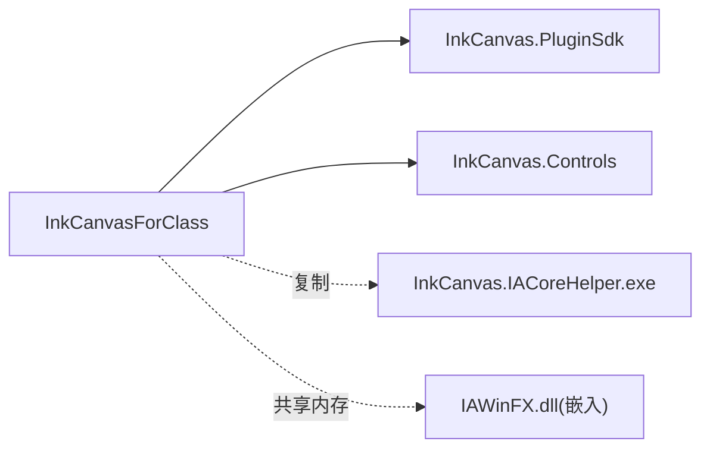
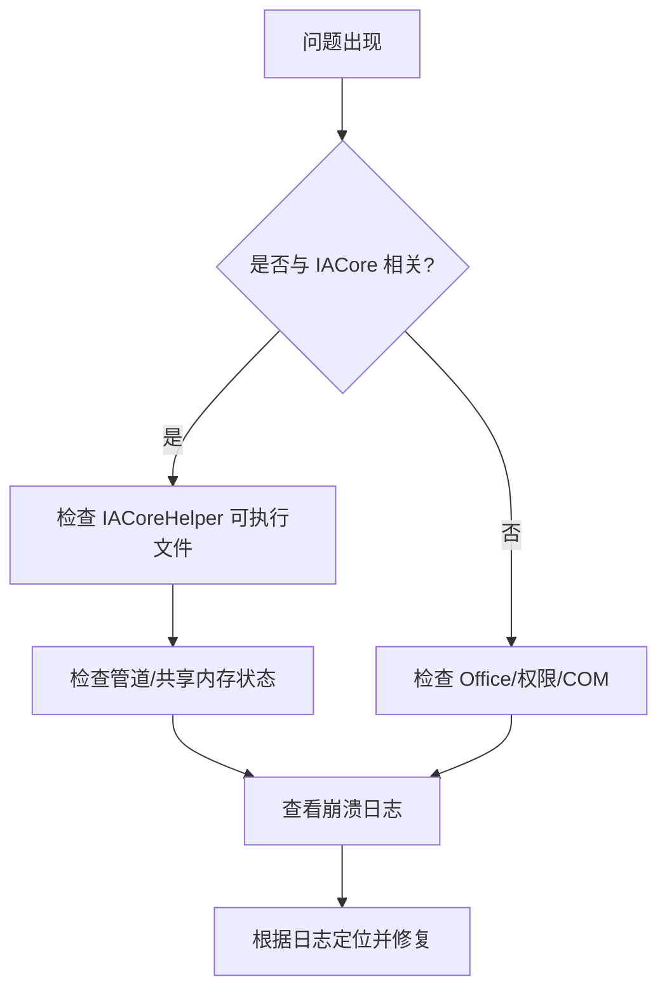

# 开发者指南

## 简介
本指南面向 InkCanvasForClass 的开发者，覆盖开发环境搭建、代码规范、插件开发流程、自定义控件开发、IACore 辅助程序的开发与集成、调试与性能分析、内存泄漏检测、代码贡献流程与 Pull Request 规范，以及常见问题与解决方案。目标是帮助你快速理解并高效参与项目开发。

## 项目结构
仓库采用多项目解决方案，围绕 InkCanvasForClass 主应用、插件 SDK、自定义控件库、IACore 辅助程序等模块构建。核心项目与职责概览：
- InkCanvasForClass：WPF 主应用，承载 UI、业务逻辑与插件加载。
- InkCanvas.PluginSdk：插件接口与基类定义，统一插件生命周期与服务注入。
- InkCanvas.Controls：自定义 WPF 控件集合，提供复用 UI 组件。
- InkCanvas.IACoreHelper：独立进程辅助程序，负责与 IACore 进行 IPC 通信与识别任务。
- Ink Canvas：主应用工程目录，包含控件、窗口、助手、模型、插件等。
- rules：开发规范与规则文档索引。
- .devcontainer：容器化开发环境配置。

## 核心组件
- 插件接口与基类：IPlugin、PluginBase，提供插件元数据、生命周期回调与服务注入能力。
- IACore 辅助程序：IpcIACoreClient（客户端）、IpcProtocol（协议常量与 DTO）、Program（服务端进程）。
- 主应用：App.xaml.cs 负责应用级异常处理、遥测、看门狗、启动画面等。

## 架构总览
InkCanvasForClass 通过独立进程 IACoreHelper 实现高性能手写形状识别，主进程与辅助进程通过命名管道与共享内存进行 IPC 通信。插件体系通过 PluginSdk 提供统一扩展点。

## 详细组件分析

### 插件开发组件分析
- IPlugin：定义插件标识、元数据与生命周期回调。
- PluginBase：提供默认实现与服务注入、日志封装。
- 主应用加载插件：通过项目引用 InkCanvas.PluginSdk 并在运行时扫描加载。

## 依赖关系分析
- 主应用依赖插件 SDK 与自定义控件库，并在构建阶段复制 IACoreHelper 可执行文件。
- IACoreHelper 依赖 IAWinFX DLL 并嵌入到主应用资源中，通过共享内存与主进程通信。

## 性能考虑
- IPC 通信：使用共享内存承载大体量请求/响应，减少序列化开销；当响应过大时自动扩容共享内存。
- 进程隔离：IACoreHelper 独立进程避免阻塞 UI 线程，提升稳定性。
- 启动优化：启动画面与异步初始化策略降低首帧延迟。
- 资源管理：主应用集中处理异常与崩溃日志，辅助程序及时释放资源。

## 故障排查指南
- 启动失败：检查 .NET 6 运行时是否安装，Office 是否激活。
- PowerPoint 模式切换异常：检查权限一致性、COM 组件状态。
- IACore 识别异常：确认 IACoreHelper 可执行文件存在、管道名称匹配、共享内存容量足够。
- 崩溃与日志：主应用记录崩溃日志文件，定位异常类型与堆栈。

## 结论
通过清晰的模块划分、稳定的 IPC 通信与完善的插件体系，InkCanvasForClass 提供了良好的扩展性与可维护性。遵循本文档的开发规范与流程，可高效完成插件与自定义控件开发，并确保与 IACore 的稳定集成。

## 附录

### 开发环境搭建
- 系统要求：Windows（支持 WPF），.NET 6.0 SDK。
- IDE：Visual Studio（推荐）或 VS Code（Dev Container）。
- Dev Container：使用提供的 devcontainer.json，自动拉起 .NET 环境并安装 C# 扩展。