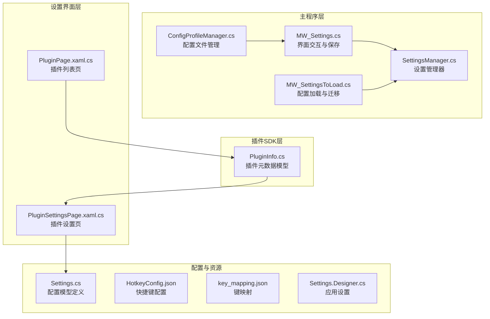
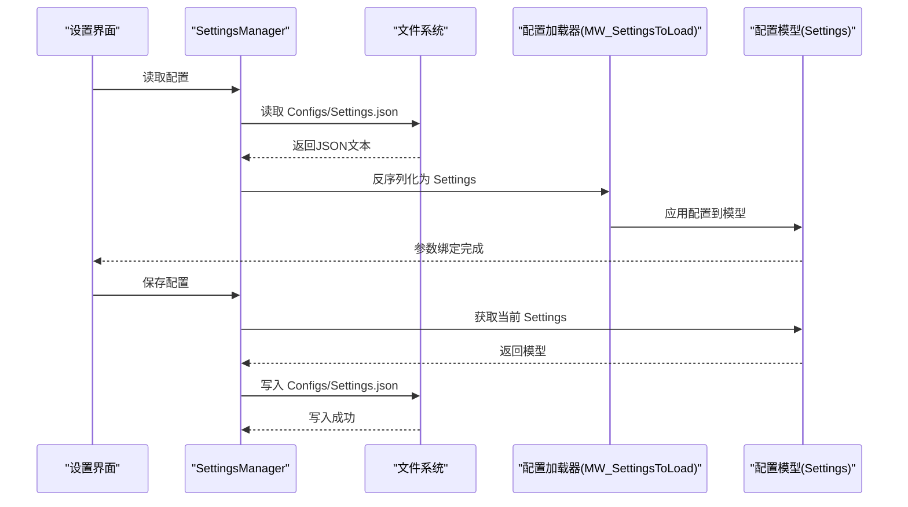
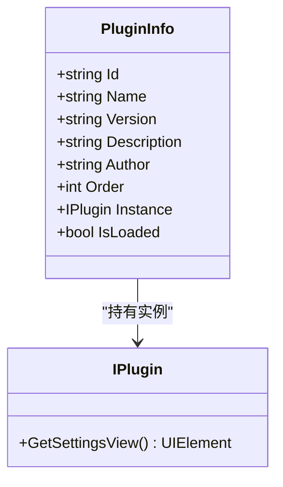
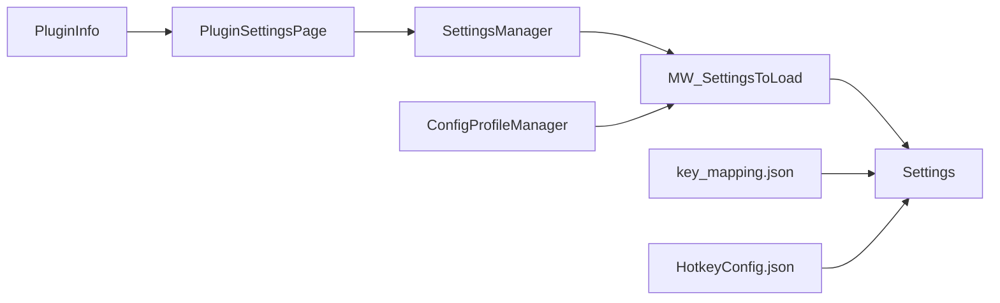

# 插件配置系统

## 简介
本文件系统性梳理 Ink Canvas 插件配置系统，重点围绕以下目标展开：
- 解释 PluginInfo 类的配置模型及其在插件生命周期中的作用
- 说明配置文件的格式与结构（以 JSON 为主）、解析与持久化机制
- 列举配置参数的验证规则（必填字段、数据类型、范围限制）
- 阐述配置的持久化策略（用户配置与全局配置的区别、存储位置）
- 给出配置界面的实现指南（设置页面创建、参数绑定、实时预览）
- 说明配置迁移与版本兼容（清理过期项、热重载、备份恢复）
- 提供从简单参数到复杂设置的使用示例
- 总结配置安全考虑（敏感信息保护、权限控制）

## 项目结构
插件配置系统涉及多个层次：
- 插件 SDK 层：定义插件元数据模型
- 主程序层：负责配置文件的读取、解析、持久化、热重载与迁移
- 设置界面层：提供插件设置页面的动态加载与绑定
- 辅助工具层：配置文件管理、备份恢复、进程保护

## 核心组件
- PluginInfo：插件元数据模型，包含插件标识、名称、版本、描述、作者、排序、实例与加载状态等字段，用于承载插件注册与运行时状态。
- Settings：配置模型根类，包含 Startup、Appearance、Canvas、Gesture、PowerPointSettings、Automation、RandSettings、ModeSettings、InkToShape、Advanced、Upload、Security、Notification、Toolbar 等子模块，统一管理应用配置。
- ConfigProfileManager：提供配置文件的保存、切换、应用与删除能力，支持多配置文件与热重载。
- SettingsManager：提供配置读取与保存的便捷接口，支持在设置界面层快速访问配置。
- PluginSettingsPage：动态加载插件提供的设置视图，实现插件配置的界面集成。

## 架构总览
配置系统采用“模型驱动 + 文件持久化 + 界面绑定”的架构：
- 模型层：通过 Settings 及其子模块定义配置结构
- 文件层：以 JSON 形式存储配置，位于 Configs/Settings.json
- 界面层：通过 SettingsManager 与 MainWindow 的加载/保存逻辑实现参数绑定与热重载
- 插件层：通过 PluginInfo 与 PluginSettingsPage 动态注入插件设置视图

## 详细组件分析

### PluginInfo 类分析
- 职责：承载插件元数据与运行时状态，便于插件注册、排序与实例化
- 关键字段：
  - Id、Name、Version、Description、Author：插件元信息
  - Order：插件排序
  - Instance：插件实例（实现 IPlugin 接口）
  - IsLoaded：插件加载状态
- 依赖关系：与插件管理器协作，通过 IPlugin 获取设置视图并注入设置页面

## 依赖关系分析
- 插件层依赖 Settings 模型与 IPlugin 接口
- 设置界面依赖 SettingsManager 与 MainWindow 的加载/保存逻辑
- 配置文件管理依赖 ConfigProfileManager 与文件系统
- 键映射与快捷键配置独立于主配置，但遵循类似的 JSON 结构

## 性能考量
- JSON 解析与序列化：建议在后台线程执行，避免阻塞 UI
- 热重载：ReloadSettingsFromFile 跳过自动更新检查，减少不必要的网络请求
- 文件写入：通过 ProcessProtectionManager 包裹写入操作，降低权限问题导致的失败率

## 故障排除指南
- 配置文件损坏：加载失败时尝试从备份恢复，仍失败则使用默认配置
- 配置项过期：CleanupObsoleteSettings 会自动清理冗余键并保存
- 写入失败：检查目录权限与磁盘空间，确保 Configs 目录可写

## 结论
本插件配置系统以 Settings 模型为核心，结合 ConfigProfileManager 与 SettingsManager 实现了灵活的配置管理、持久化与热重载能力。通过 PluginInfo 与 PluginSettingsPage，系统实现了插件配置的动态注入与界面集成。配合过期项清理与备份恢复机制，系统在版本演进中保持了良好的兼容性与稳定性。

## 附录
- 键映射与快捷键配置：key_mapping.json 与 HotkeyConfig.json 提供了键名映射与快捷键定义的参考结构
- 应用设置基类：Settings.Designer.cs 提供了 WPF 应用设置的基础框架