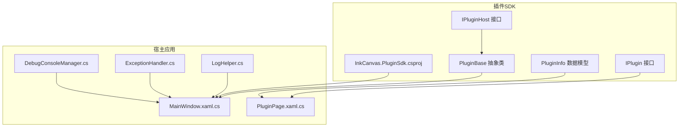
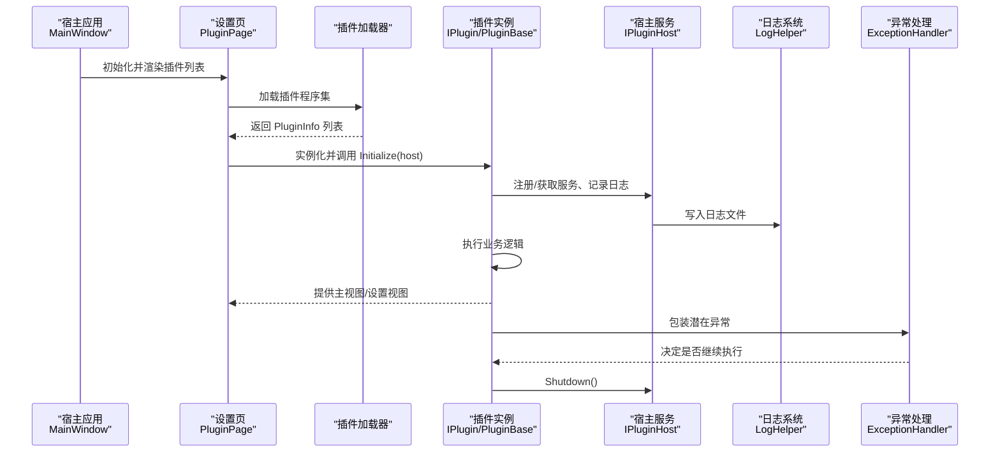
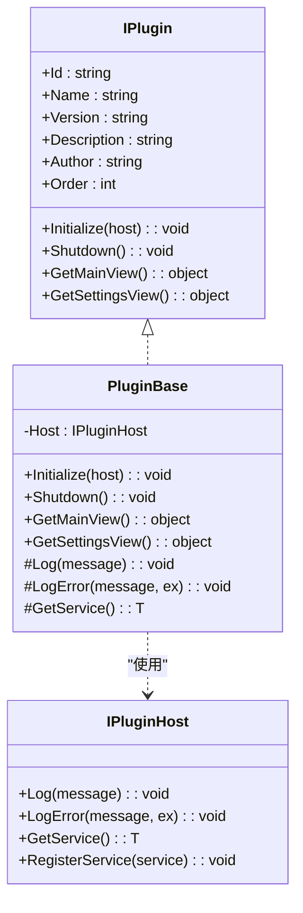
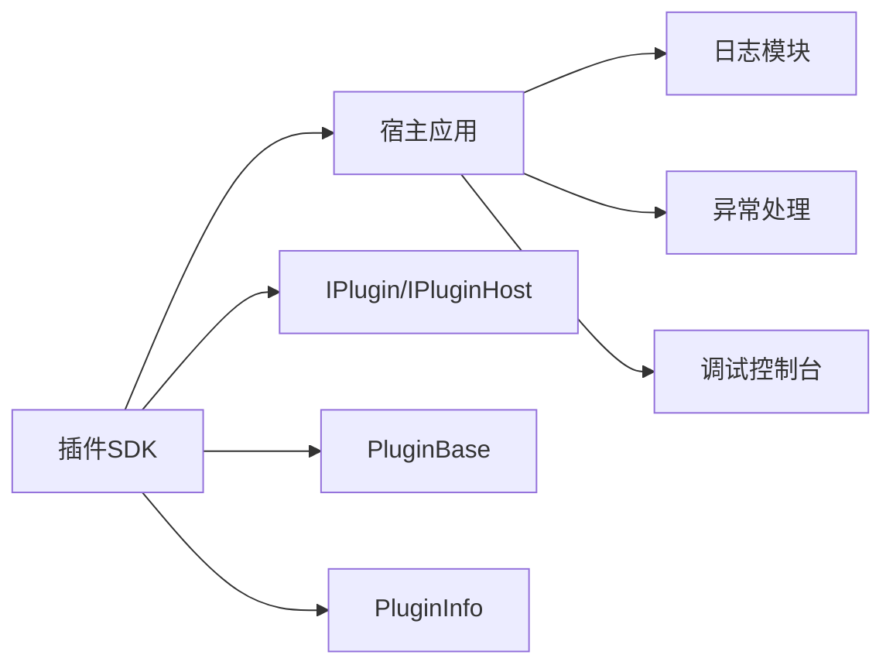

# 插件调试与测试

## 引言
本指南面向插件开发者与测试工程师，围绕 InkCanvas 插件体系提供一套系统化的调试与测试方法论。内容涵盖：
- 调试技术：断点设置、变量监视、调用堆栈分析
- 单元测试：测试用例设计、模拟对象、断言验证
- 集成测试：插件与宿主交互、端到端功能验证
- 性能测试：内存使用、CPU 占用、响应时间
- 日志记录：调试输出、错误追踪、性能指标采集
- 插件隔离测试：沙箱与安全边界
- 常见问题诊断：加载失败、运行时错误、兼容性问题
- 完整测试示例：从基础功能到复杂场景

## 项目结构
InkCanvas 采用多项目分层组织，插件 SDK 位于独立工程中，宿主应用负责加载与管理插件生命周期。

## 核心组件
- 插件接口 IPlugin：定义插件元数据与生命周期方法（初始化、关闭、主视图、设置视图）
- 插件宿主接口 IPluginHost：提供日志、异常记录、服务注册与获取能力
- 插件基类 PluginBase：封装宿主交互、日志与服务访问的通用逻辑
- 插件信息模型 PluginInfo：承载插件实例、加载状态等运行时信息
- 日志与异常处理：统一日志格式、递归保护、异常分级与恢复策略
- 调试控制台：可选的 Win32 控制台输出，便于实时观测

## 架构总览
下图展示了插件从加载到运行的关键交互链路，以及日志与异常处理在其中的作用。

## 详细组件分析

### 组件一：插件接口与基类
- IPlugin：声明插件元数据与生命周期方法，是插件与宿主交互的契约
- PluginBase：提供默认实现与通用能力（日志、服务访问），子类仅需关注业务实现
- IPluginHost：为插件提供日志、异常记录、服务注册与获取的统一入口

## 依赖关系分析
- 插件 SDK 与宿主应用解耦：通过接口契约通信，降低耦合度
- 日志与异常处理模块内聚：集中式日志与异常策略，便于统一治理
- 调试控制台可选接入：不影响生产环境，仅在需要时启用

## 性能考虑
- 日志写入保护：使用原子标记防止递归写入，避免死锁与性能抖动
- 日志归档与清理：按启动时间归档并限制目录大小，避免磁盘膨胀
- 异常处理策略：区分致命异常（如内存不足、访问违例）与可恢复异常，减少崩溃风险
- 调试控制台：仅在需要时开启，避免额外 IO 开销

## 故障排查指南
- 加载失败
  - 现象：设置页显示加载错误
  - 排查：查看日志文件与异常记录，确认插件程序集版本与目标框架匹配
- 运行时错误
  - 现象：插件初始化或执行过程中抛出异常
  - 排查：使用异常处理器记录上下文与内部异常，结合日志定位调用者
- 兼容性问题
  - 现象：插件在不同系统或 WPF 版本下行为不一致
  - 排查：核对 SDK 目标框架与宿主应用配置，确保 WinForms/WPF 组件版本一致
- 调试控制台不可见
  - 现象：无法看到控制台输出
  - 排查：确认控制台已分配且未被意外关闭；检查权限与系统菜单禁用逻辑

## 结论
通过接口契约、统一日志与异常处理、可选调试控制台，InkCanvas 插件体系提供了清晰的调试与测试支撑。建议在开发阶段充分利用日志与异常处理机制，在测试阶段结合设置页加载流程与端到端场景，逐步完善单元与集成测试覆盖，确保插件在宿主环境中的稳定性与性能表现。

## 附录：测试示例清单
以下为可直接映射到源码的测试示例清单，便于快速落地：

- 单元测试：插件基类日志与服务访问
  - 关注点：Log/LogError 是否调用宿主；GetService 是否返回期望服务
- 单元测试：异常处理策略
  - 关注点：继续执行条件与异常冒泡
- 集成测试：插件加载与渲染
  - 关注点：加载成功/失败分支、UI 卡片生成
- 端到端：插件生命周期
  - 关注点：初始化顺序、资源释放、视图提供
- 性能测试：日志写入与清理
  - 关注点：并发写入保护、大小阈值、清理触发
- 调试辅助：控制台输出
  - 关注点：窗口可见性、输出编码、关闭菜单禁用