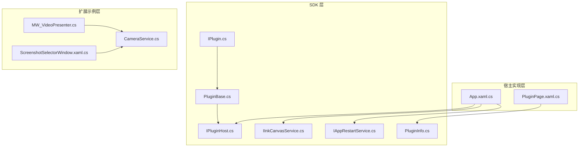
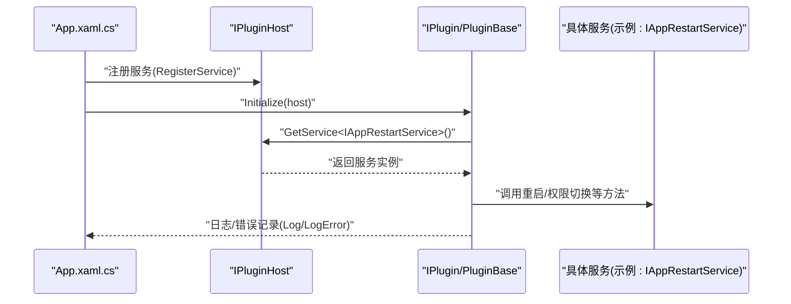
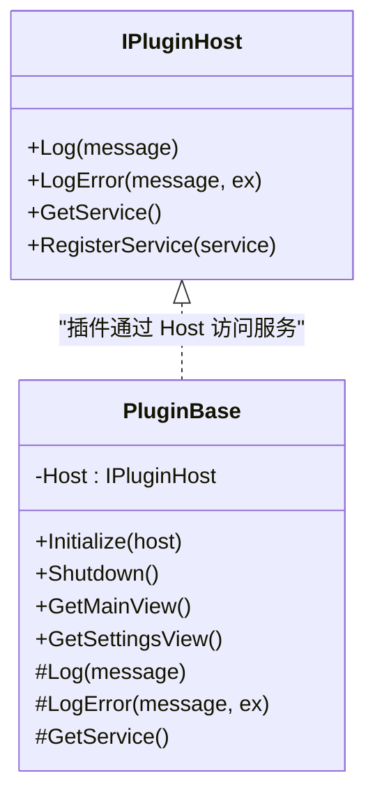
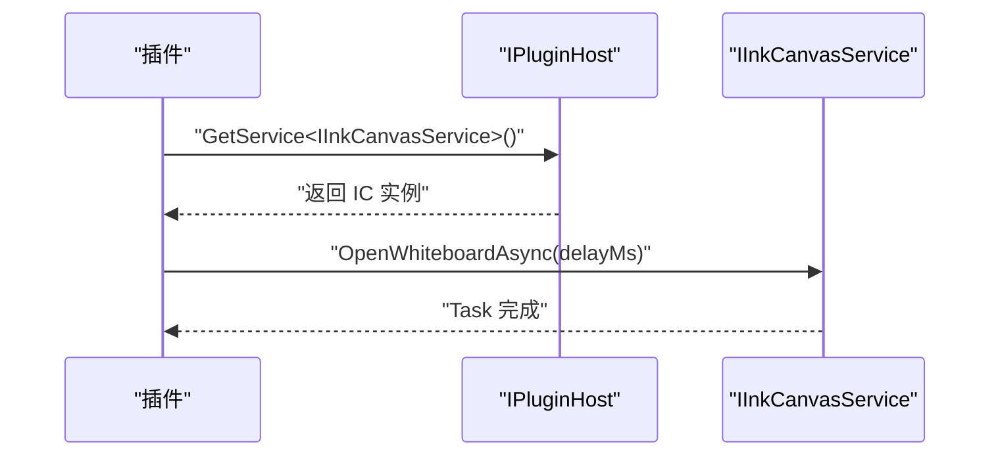
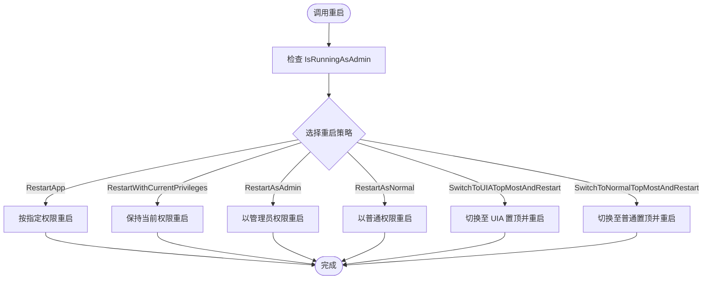
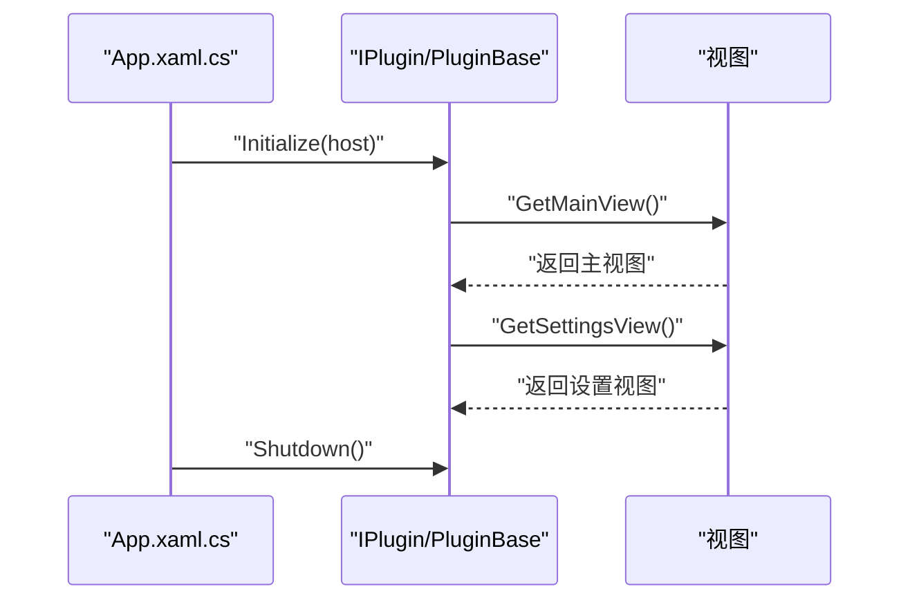
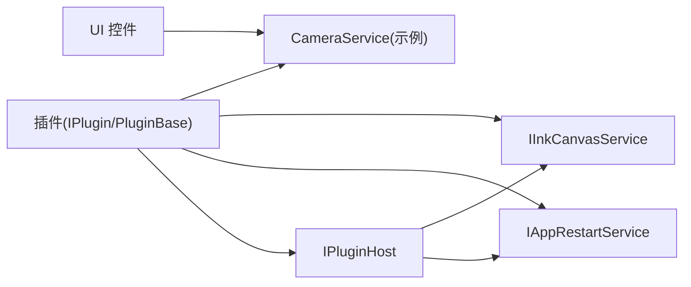

# 插件宿主服务

## 简介
本文件面向插件开发者与维护者，系统性阐述插件宿主服务的设计与实现，重点覆盖以下方面：
- IPluginHost 接口提供的核心能力：日志、错误记录、服务注册与发现
- IInkCanvasService 白板服务：打开/关闭白板、异步延迟打开
- IAppRestartService 应用重启服务：权限级别切换与优雅重启策略
- 插件生命周期与视图扩展：主视图、设置视图、初始化与关闭
- 服务注册与发现机制：基于泛型接口的服务容器约定
- 最佳实践：异步调用、错误处理、资源管理
- 扩展指南：如何为插件添加自定义服务接口并被宿主统一管理

## 项目结构
围绕插件宿主服务的关键目录与文件如下：
- SDK 层（对外契约）：IPluginHost、IInkCanvasService、IAppRestartService、IPlugin、PluginBase、PluginInfo
- 宿主实现层（应用入口与服务注册）：App.xaml.cs（应用生命周期与看门狗）、PluginPage.xaml.cs（插件管理界面）
- 示例扩展层（演示如何使用服务）：MW_VideoPresenter.cs（与摄像头服务联动）、CameraService.cs（具体服务实现）、ScreenshotSelectorWindow.xaml.cs（UI 控制与服务交互）

## 核心组件
- IPluginHost：插件与宿主之间的桥梁，提供日志、错误记录、服务注册与发现能力
- IInkCanvasService：白板服务接口，负责打开/关闭白板以及异步延迟打开
- IAppRestartService：应用重启服务接口，支持不同权限级别的重启与 UIA 置顶模式切换
- IPlugin 与 PluginBase：插件契约与基类，提供插件元信息、生命周期回调与服务访问便捷方法
- PluginInfo：插件信息载体，承载插件元数据与实例状态

## 架构总览
插件宿主服务采用“接口契约 + 泛型服务容器”的设计：
- 插件通过 IPluginHost.GetService&lt;T&gt;() 获取所需服务
- 宿主在 App 启动阶段注册 IAppRestartService、IInkCanvasService 等服务
- 插件通过 IPlugin.Initialize(host) 获得宿主引用，随后可按需获取服务
- 插件可通过 IPlugin.GetMainView()/GetSettingsView() 提供自定义 UI

## 详细组件分析

### IPluginHost 接口与服务注册/发现
- 能力概览
  - 日志与错误记录：便于插件输出诊断信息
  - 服务注册：宿主向容器注册服务实例
  - 服务发现：插件通过泛型方法获取服务
- 设计要点
  - 使用泛型约束 T : class，保证类型安全
  - 服务注册与发现遵循“先注册、后使用”的约定
  - 插件基类 PluginBase 封装了对 Host 的访问，简化插件开发

### IInkCanvasService 白板服务
- 能力概览
  - 打开/关闭白板：同步接口
  - 异步延迟打开：带延迟参数的异步接口
- 使用场景
  - 插件需要在特定时机唤起白板进行批注或演示
  - 结合 UI 控件（如工具栏按钮）触发白板打开
- 实现建议
  - 使用异步延迟打开避免 UI 卡顿
  - 在打开前检查白板状态，避免重复打开

### IAppRestartService 应用重启服务
- 能力概览
  - 权限级别查询：IsRunningAsAdmin
  - 重启策略：
    - RestartApp(asAdmin)
    - RestartWithCurrentPrivileges()
    - RestartAsAdmin()
    - RestartAsNormal()
    - SwitchToUIATopMostAndRestart()
    - SwitchToNormalTopMostAndRestart()
- 使用场景
  - 插件需要在设置变更后重启应用以生效
  - 需要以管理员权限或普通权限重启
  - 需要在 UIA 置顶模式与普通模式之间切换并重启

### 插件生命周期与视图扩展
- 生命周期
  - Initialize(host)：插件初始化，获得宿主引用
  - Shutdown()：插件关闭，释放资源
- 视图扩展
  - GetMainView()：返回插件主视图（可用于自定义工具面板）
  - GetSettingsView()：返回插件设置视图（用于配置项）
- 元信息
  - PluginInfo：承载插件 ID、名称、版本、作者、排序等

### 服务使用的最佳实践
- 异步调用
  - 对耗时或 UI 相关操作使用异步接口（如 IInkCanvasService.OpenWhiteboardAsync）
  - 避免阻塞 UI 线程，合理使用 Task.Delay 或 Dispatcher
- 错误处理
  - 使用 IPluginHost.LogError 输出异常信息
  - 在插件内部捕获异常并记录，避免传播到宿主
- 资源管理
  - 在 Shutdown 中释放托管与非托管资源
  - 对外部服务（如摄像头）订阅事件时注意解绑，防止内存泄漏
- 服务访问
  - 通过 IPluginBase.GetService&lt;T&gt;() 获取服务，避免直接依赖具体实现
  - 在宿主中集中注册服务，插件只负责消费

### 插件如何利用宿主服务扩展功能
- 添加自定义工具
  - 通过 GetMainView 返回自定义控件，集成到工具栏或侧边栏
  - 使用 IInkCanvasService 打开白板进行批注
- 修改界面布局
  - 在设置视图中暴露布局选项，结合宿主的设置页进行持久化
- 集成外部数据源
  - 通过 IPluginHost.GetService&lt;T&gt;() 获取数据服务接口，实现数据拉取与缓存
  - 示例：与摄像头服务联动，实现视频展台功能（见扩展示例）

### 服务调用的实际示例（路径指引）
- 打开白板（异步延迟）
- 应用重启（权限切换）
- 摄像头服务联动（UI 控制）

### 服务扩展指南（如何创建自定义服务接口）
- 步骤
  1) 在 SDK 层定义服务接口（命名空间与现有保持一致）
  2) 在宿主 App 中实现服务类，并通过 IPluginHost.RegisterService&lt;T&gt;(instance) 注册
  3) 在插件中通过 IPluginHost.GetService&lt;T&gt;() 获取服务实例
  4) 在插件基类 PluginBase 中封装服务访问方法，提升易用性
- 注意事项
  - 服务接口应尽量无 UI 依赖，便于跨模块复用
  - 对外暴露的接口应明确职责边界，避免过度耦合
  - 对于需要 UI 的服务，建议通过视图接口分离（如 GetMainView/GetSettingsView）

## 依赖关系分析
- 插件与宿主
  - 插件依赖 IPluginHost 进行日志与服务访问
  - 宿主在启动阶段集中注册服务，插件通过泛型接口发现
- 服务与实现
  - IAppRestartService/IInkCanvasService 由宿主实现并注册
  - 插件通过 PluginBase.GetService&lt;T&gt;() 获取服务实例
- UI 与服务
  - UI 控件通过事件调用服务（如摄像头服务），插件可复用这些服务

## 性能考量
- 异步优先：对于可能阻塞的操作（如网络请求、文件 IO、白板打开），优先使用异步接口
- 资源释放：在 Shutdown 中及时释放非托管资源，避免内存泄漏
- UI 线程：避免在 UI 线程中执行长时间任务，必要时使用后台线程与进度反馈
- 服务复用：通过服务注册与发现减少重复创建，提高启动效率

## 故障排查指南
- 插件加载失败
  - 检查插件信息与实例状态（PluginInfo.IsLoaded）
  - 查看设置页中的错误提示与日志
- 服务不可用
  - 确认宿主已在启动阶段注册对应服务
  - 检查插件是否正确调用 GetService&lt;T&gt;()
- 应用重启问题
  - 根据权限需求选择合适的重启策略
  - 关注 UIA 置顶模式切换是否成功
- 看门狗与静默重启
  - 应用启动阶段与主线程无响应时可能触发静默重启
  - 连续重启超过阈值会弹窗提示并退出

## 结论
本文件系统梳理了插件宿主服务的核心接口与实现约定，明确了服务注册与发现机制、最佳实践与扩展指南。通过 IPluginHost、IInkCanvasService、IAppRestartService 等接口，插件可以安全地访问宿主能力并扩展功能。建议在实际开发中遵循异步调用、错误处理与资源管理的最佳实践，确保插件的稳定性与可维护性。

## 附录
- 插件管理界面（插件卡片与错误提示）
- 摄像头服务与 UI 控制联动
