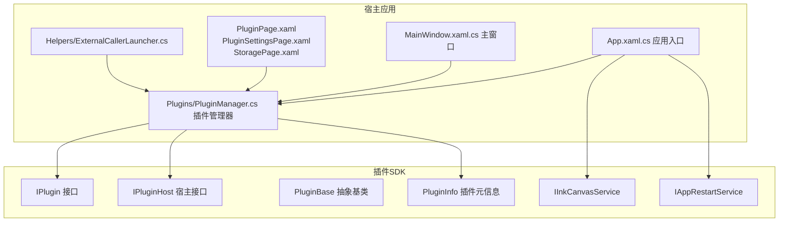
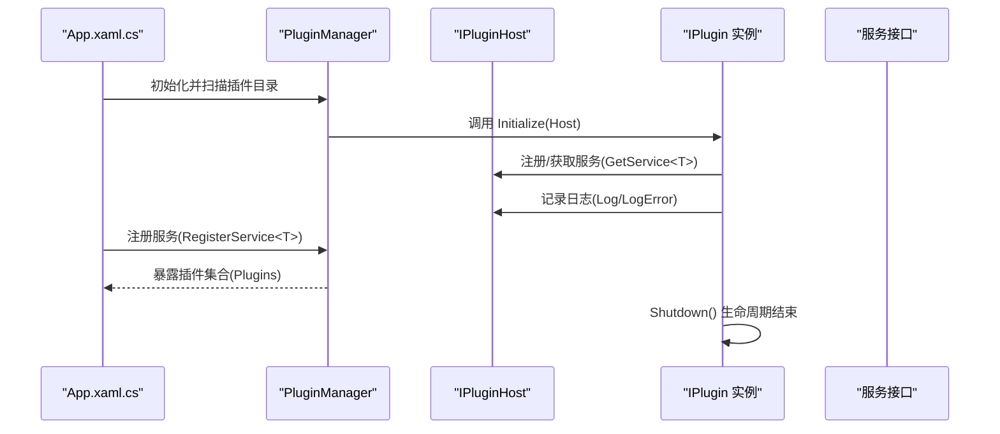
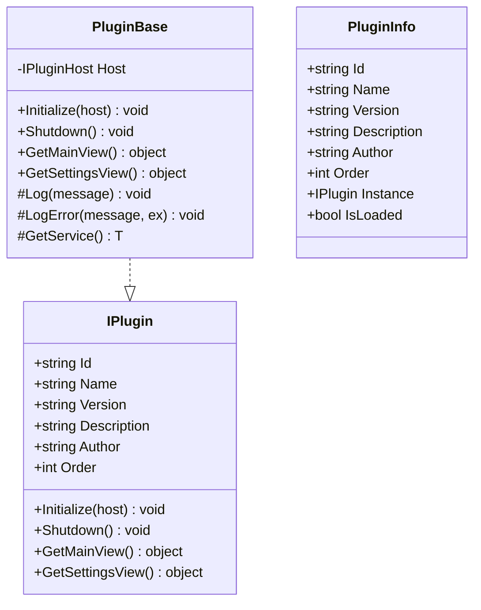
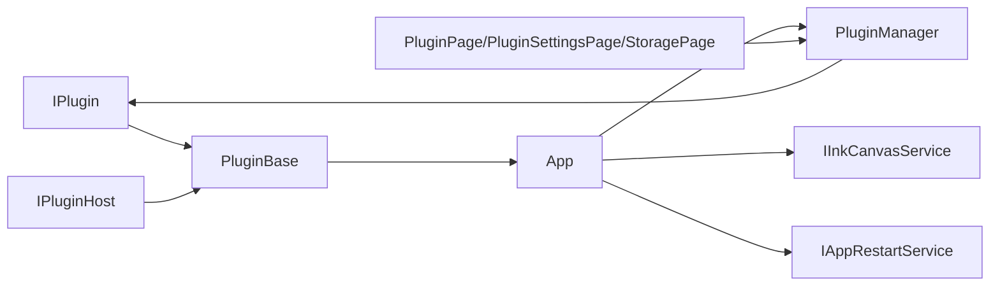

# 插件开发指南

## 简介
本指南面向希望基于 Ink Canvas 平台开发插件的开发者，系统讲解插件接口设计与实现、宿主服务使用、插件生命周期管理、视图接口、配置系统、调试与测试、打包分发、安全注意事项，以及常见插件场景的实践建议。内容基于仓库中实际的 SDK 与宿主实现，帮助你快速上手并构建稳定可靠的插件。

## 项目结构
Ink Canvas 的插件体系由“插件 SDK”和“宿主应用”两部分组成：
- 插件 SDK 提供 IPlugin 接口、宿主接口 IPluginHost、基础类 PluginBase、服务接口（如 IInkCanvasService、IAppRestartService）与插件元信息模型 PluginInfo。
- 宿主应用负责加载插件、注册服务、暴露 UI 与设置入口，并通过 PluginManager 统一管理插件集合。

## 核心组件
- IPlugin：定义插件标识符、元数据、生命周期与视图接口。
- IPluginHost：提供日志、异常记录与服务注册/获取能力。
- PluginBase：提供默认空实现与对宿主服务的便捷访问。
- PluginInfo：承载插件实例、加载状态与元数据。
- 服务接口：IInkCanvasService、IAppRestartService，用于与宿主交互。

## 架构总览
插件系统采用“接口驱动 + 宿主托管”的模式：
- 插件通过 IPlugin 暴露元数据与生命周期钩子。
- 宿主在启动阶段注册服务（如 IInkCanvasService、IAppRestartService），并通过 PluginManager 加载插件。
- 插件通过 IPluginHost 获取服务、记录日志、提供视图。
- 宿主 UI（设置页）展示插件列表与设置视图。

## 组件详解

### IPlugin 接口与生命周期
- 标识与元数据：Id、Name、Version、Description、Author、Order。
- 生命周期：Initialize(host)、Shutdown()。
- 视图接口：GetMainView()、GetSettingsView()，用于宿主注入 UI。

### IPluginHost 与服务注册
- 日志：Log(message)、LogError(message, ex)。
- 服务：RegisterService&lt;T&gt;(service)、GetService&lt;T&gt;()。

宿主在应用启动时注册服务，供插件使用。

### 插件基类 PluginBase
- 默认空实现：Initialize/Shutdown/GetMainView/GetSettingsView。
- 便捷方法：Log、LogError、GetService&lt;T&gt;，内部委托给宿主。

### 插件管理与加载（宿主侧）
- PluginManager：维护插件目录、加载插件、暴露 Plugins 列表。
- 插件目录：位于应用基目录下的 Plugins 文件夹。

### 宿主服务示例
- IInkCanvasService：打开/关闭白板、异步打开白板。
- IAppRestartService：以不同权限级别重启应用、切换置顶模式后重启。

### 插件 UI 与设置入口
- 插件列表与设置页：PluginPage.xaml、PluginSettingsPage.xaml。
- 存储页展示插件占用空间与提示。

### 外部调用与插件交互
- ExternalCallerLauncher：提供 classisland:// 插件调用 URI，便于外部客户端触发插件动作。

## 依赖关系分析
- 插件依赖 IPlugin 与 IPluginHost；通过 PluginBase 可快速实现。
- 宿主依赖 PluginManager 管理插件；同时注册 IInkCanvasService、IAppRestartService 等服务。
- UI 层通过设置页展示插件状态与设置视图。

## 性能考量
- 插件生命周期：尽量在 Initialize 中完成一次性初始化；在 Shutdown 中释放资源，避免内存泄漏。
- 视图接口：GetMainView/GetSettingsView 返回的对象应轻量、可复用；避免在 UI 线程执行耗时操作。
- 服务调用：通过 IPluginHost.GetService&lt;T&gt;() 获取服务，减少直接依赖硬编码类型。
- 日志：使用 Host.Log/LogError 输出关键信息，便于定位性能瓶颈。

## 故障排查指南
- 插件未加载：检查插件目录与 PluginManager 初始化逻辑；查看宿主日志输出。
- 服务不可用：确认宿主在启动阶段已 RegisterService&lt;T&gt;；插件端通过 GetService&lt;T&gt;() 获取。
- UI 不显示：确认 GetMainView/GetSettingsView 返回有效对象；检查设置页绑定。
- 外部调用失败：核对 ExternalCallerLauncher 中的 URI 格式与目标插件实现。

## 结论
通过 IPlugin 接口与 IPluginHost 宿主接口，结合 PluginBase 快速实现与 PluginManager 统一管理，Ink Canvas 插件体系实现了清晰的职责分离与良好的扩展性。配合服务注册、UI 设置入口与外部调用机制，开发者可以高效构建工具扩展、界面定制与数据处理等插件场景。

## 附录

### 插件项目模板与结构建议
- 建议以 SDK 中的 IPlugin 为契约，继承 PluginBase 快速实现。
- 项目结构可参考现有插件目录 Plugins，按需组织插件 DLL 与资源。
- 在宿主启动阶段，确保 PluginManager 能正确扫描并加载插件目录。

### 插件宿主服务使用清单
- 注册服务：在应用启动时调用 RegisterService&lt;T&gt;，传入具体服务实例。
- 获取服务：在插件 Initialize 中通过 GetService&lt;T&gt;() 获取所需服务。
- 常用服务：IInkCanvasService、IAppRestartService。

### 插件配置系统
- 配置文件位置：通常位于应用根目录的 Configs/Settings.json。
- 参数验证：在插件 Initialize 中读取并校验必要配置项，设置默认值。
- 默认值：当配置缺失时，使用合理的默认值并记录日志。

### 插件调试与测试
- 单元测试：针对纯逻辑类（不含 UI）编写单元测试，模拟 IPluginHost 行为。
- 集成测试：在宿主应用中加载插件，验证 Initialize/Shutdown 与视图接口。
- 日志：使用 Host.Log/LogError 输出关键路径与异常信息。

### 插件打包与分发
- 版本管理：遵循 IPlugin.Version 字段规范，统一版本号格式。
- 依赖声明：确保插件 DLL 与依赖在同一目录；避免运行时找不到程序集。
- 安装程序：将插件 DLL 放入宿主 Plugins 目录；提供卸载脚本清理资源。

### 插件安全考虑
- 权限控制：通过 IAppRestartService 的权限切换能力，谨慎提升权限。
- 沙箱机制：避免直接访问系统敏感资源；通过服务接口与宿主协作。
- 恶意代码防护：严格校验外部输入与 URI 参数；最小化插件权限范围。

### 常见插件场景示例
- 工具扩展：通过 IInkCanvasService 打开/关闭白板，或与其他工具联动。
- 界面定制：实现 GetMainView/GetSettingsView，提供自定义控件与设置页。
- 数据处理：在 Initialize 中订阅事件或读取配置，处理数据并持久化。

章节来源
