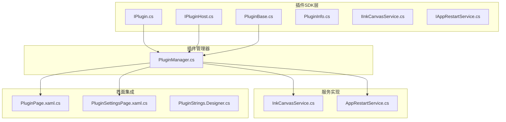
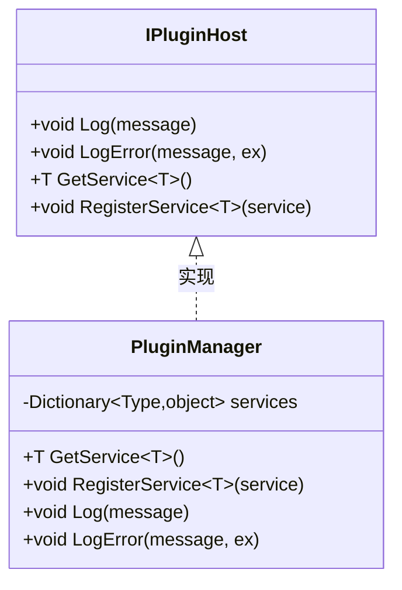
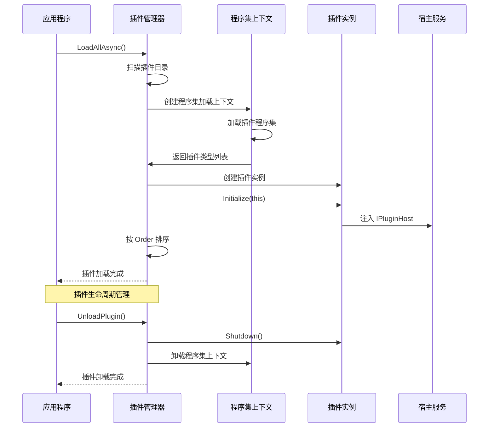
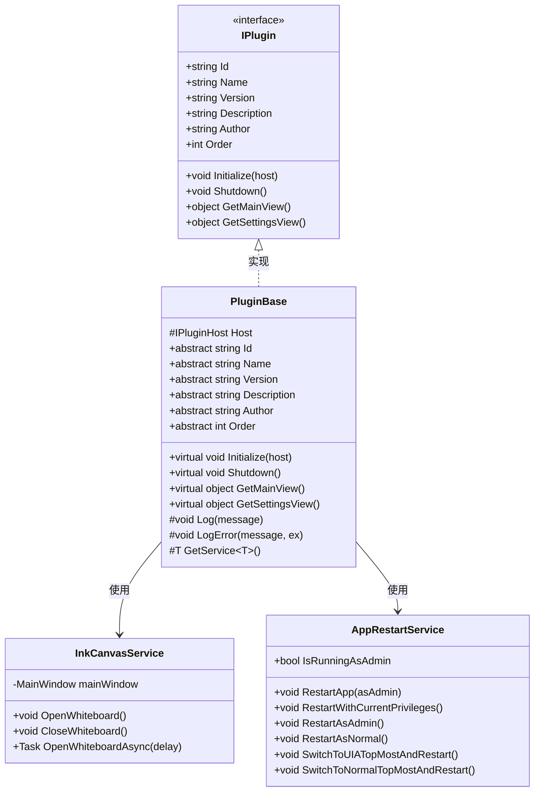
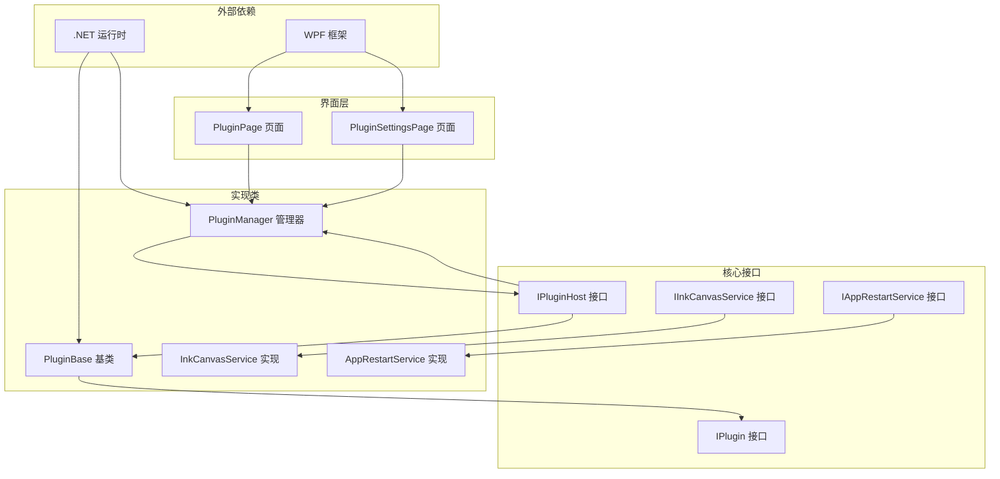
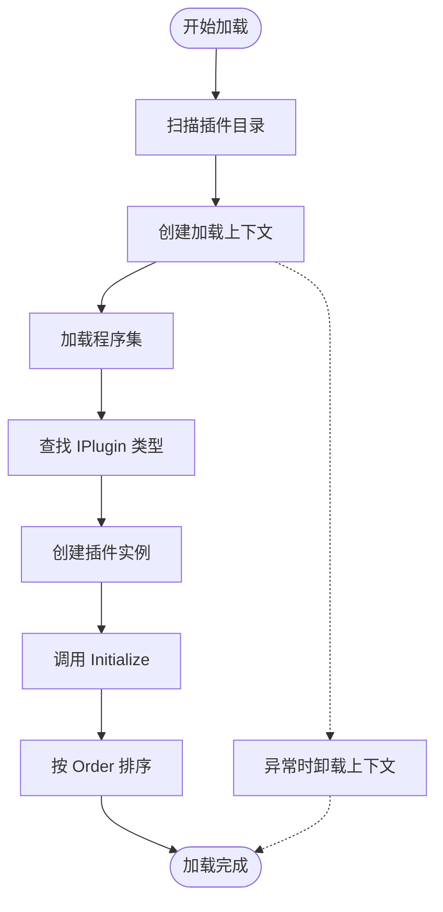
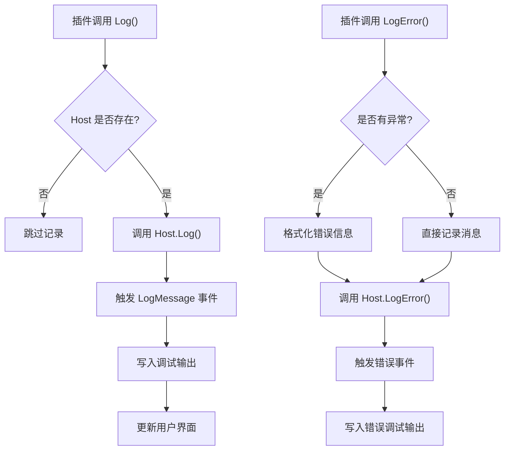

# 插件接口设计

## 简介

本文件详细阐述了 Ink Canvas 插件系统的接口设计与实现规范。该插件系统采用基于接口的扩展架构，通过标准化的 IPlugin 接口定义插件行为契约，通过 IPluginHost 提供宿主服务注入机制，通过 PluginBase 抽象基类简化插件开发流程。系统支持动态加载、卸载插件，提供日志记录、服务注册等基础设施功能。

## 项目结构

插件系统主要分布在以下目录中：

## 核心组件

### IPlugin 接口定义

IPlugin 接口是插件系统的核心契约，定义了插件必须实现的基本能力：

| 属性/方法 | 类型 | 必需性 | 说明 |
|-----------|------|--------|------|
| Id | string | 必需 | 插件唯一标识符，用于区分不同插件实例 |
| Name | string | 必需 | 插件显示名称，用于用户界面展示 |
| Version | string | 必需 | 插件版本号，遵循语义化版本控制 |
| Description | string | 可选 | 插件功能描述信息 |
| Author | string | 可选 | 插件作者信息 |
| Order | int | 必需 | 插件加载顺序，数值越小优先级越高 |
| Initialize | 方法 | 必需 | 插件初始化方法，接收 IPluginHost 参数 |
| Shutdown | 方法 | 必需 | 插件清理方法，负责资源释放 |
| GetMainView | 方法 | 可选 | 返回插件主界面视图对象 |
| GetSettingsView | 方法 | 可选 | 返回插件设置界面视图对象 |

### IPluginHost 接口功能

IPluginHost 作为宿主服务容器，为插件提供运行时必需的服务：

## 架构概览

插件系统采用分层架构设计，实现了松耦合的插件管理机制：

## 详细组件分析

### PluginBase 抽象基类

PluginBase 提供了插件开发的基础框架，简化了常见功能的实现：

## 依赖关系分析

插件系统内部的依赖关系如下：

## 性能考虑

### 程序集加载优化

插件系统采用独立的程序集加载上下文，每个插件都有独立的 AssemblyLoadContext，这提供了：

- **内存隔离**：插件程序集可以被独立卸载
- **依赖解析**：使用 AssemblyDependencyResolver 精确解析依赖
- **垃圾回收**：支持插件卸载后的内存回收

### 异步加载机制

## 故障排除指南

### 常见问题及解决方案

| 问题类型 | 症状 | 解决方案 |
|----------|------|----------|
| 插件无法加载 | 程序集找不到或类型不匹配 | 检查插件 DLL 文件完整性，确认实现 IPlugin 接口 |
| 初始化失败 | Initialize 抛出异常 | 检查宿主服务可用性，查看日志输出 |
| 界面显示异常 | 设置界面不显示或布局错误 | 确保 GetSettingsView 返回有效的 UIElement |
| 内存泄漏 | 应用程序内存持续增长 | 检查 Shutdown 方法是否正确释放资源 |

### 日志记录机制

插件系统提供两级日志记录：

## 结论

Ink Canvas 插件系统通过清晰的接口设计和完善的生命周期管理，为应用程序提供了强大的扩展能力。IPlugin 接口定义了插件的核心行为，IPluginHost 提供了灵活的服务注入机制，PluginBase 基类简化了开发流程。系统支持动态加载卸载、内存隔离、异步处理等现代插件管理特性，为开发者提供了良好的扩展平台。

## 附录

### 插件开发最佳实践

1. **接口实现**：确保完整实现 IPlugin 接口的所有必需成员
2. **资源管理**：在 Shutdown 中正确释放所有资源
3. **错误处理**：避免在 Initialize 中抛出未处理异常
4. **线程安全**：注意多线程环境下的状态同步
5. **版本兼容**：遵循语义化版本控制策略

### 示例代码路径

标准插件实现的基本结构可参考以下文件：