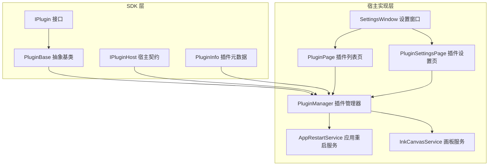
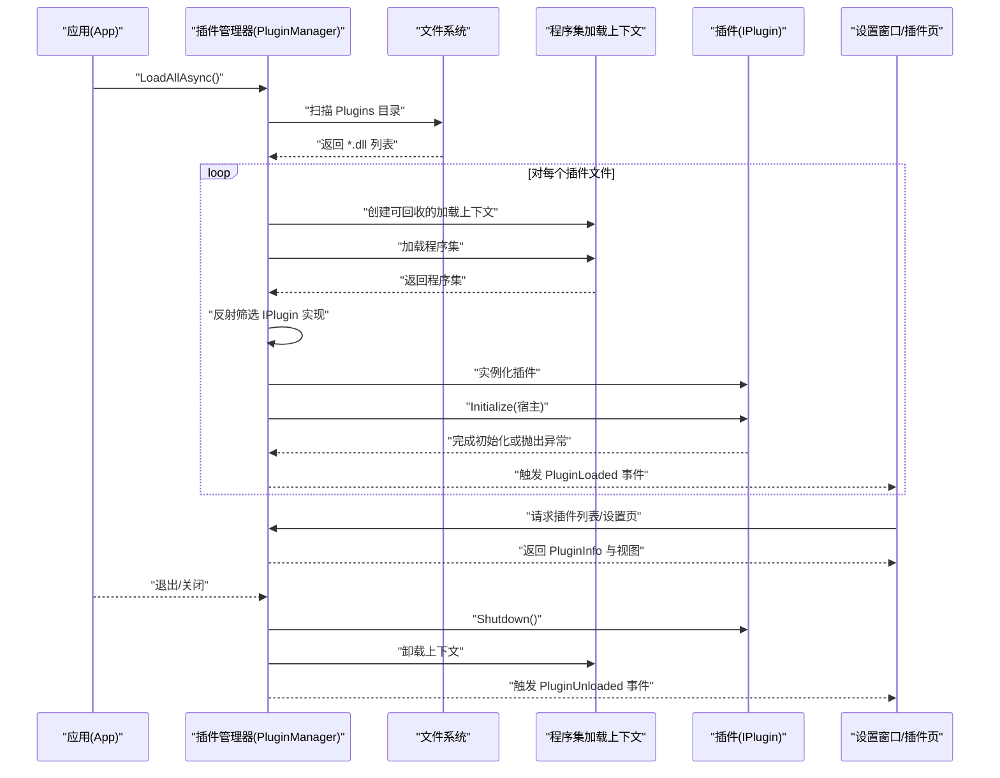
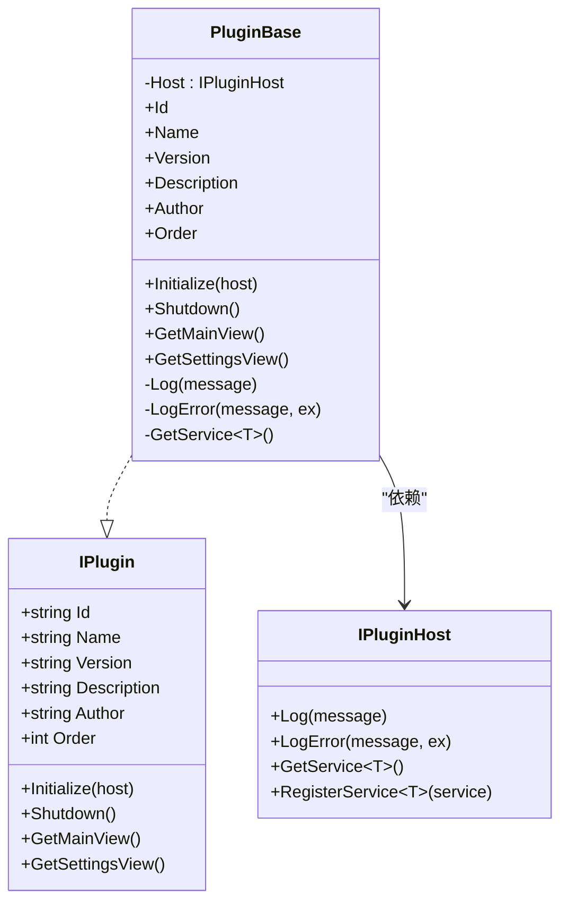
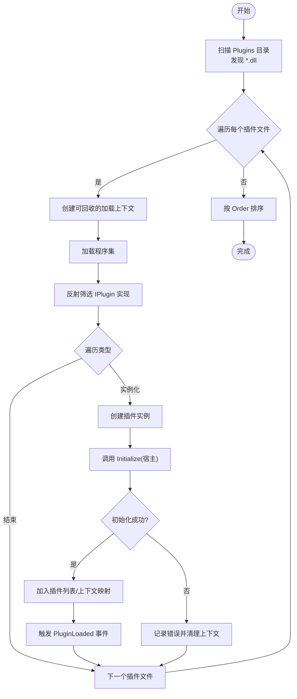
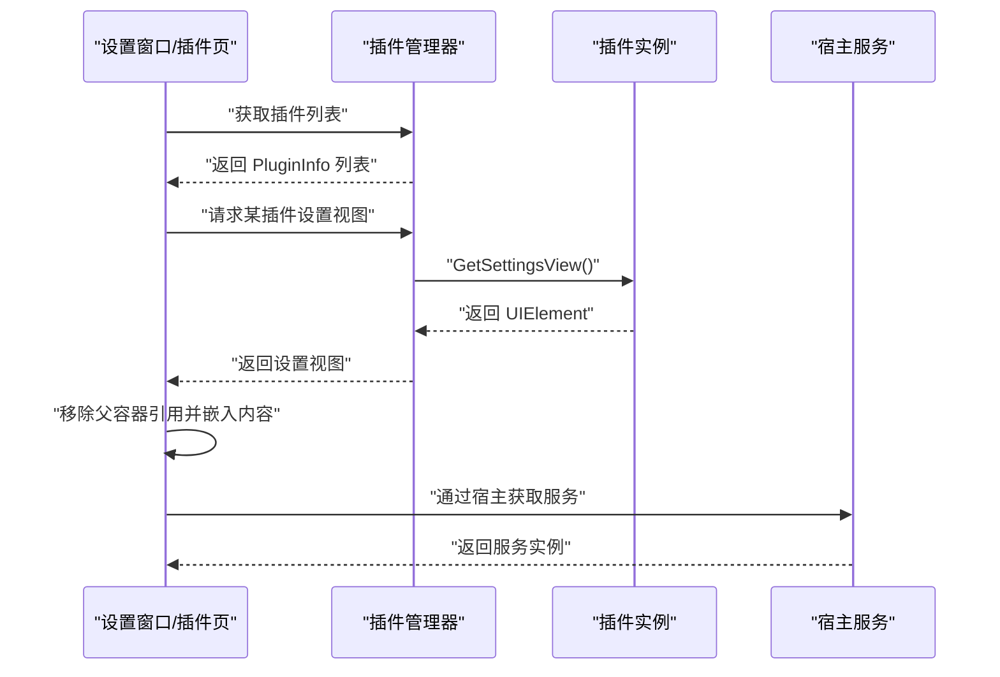
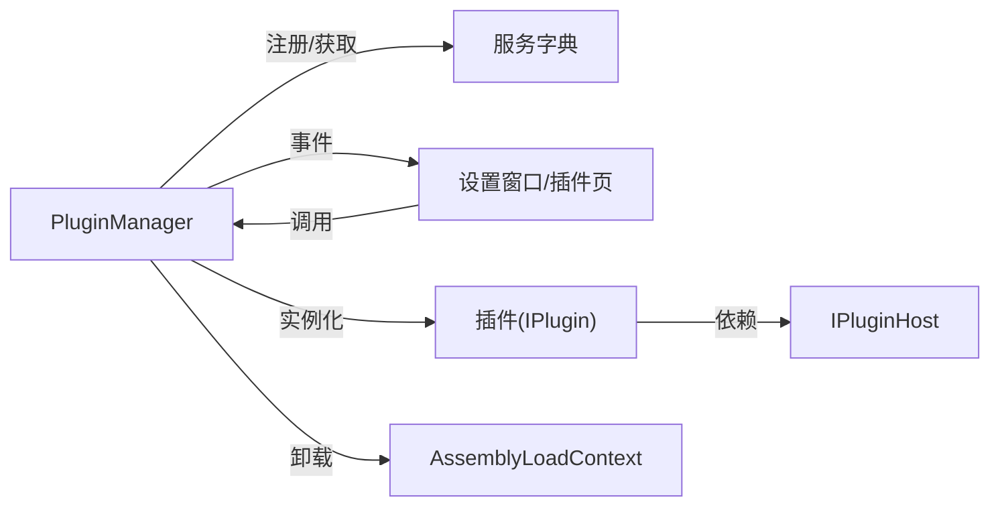

# 插件生命周期管理

## 简介
本文件系统性阐述该代码库中的插件生命周期管理方案，覆盖从插件发现、加载、初始化、运行期事件处理、服务注册与依赖注入、到卸载与热插拔支持的完整流程。同时给出事件广播、消息传递与数据共享策略建议，以及生命周期钩子使用指南、异常处理与性能优化实践，并通过循序渐进的示例帮助开发者快速落地。

## 项目结构
插件系统由“SDK 接口层”和“宿主实现层”组成：
- SDK 层定义插件接口、基类与宿主契约，确保插件与宿主解耦。
- 宿主实现层负责扫描插件目录、动态加载程序集、实例化插件、注册服务、触发生命周期钩子，并提供 UI 集成以展示插件信息与设置页。

## 核心组件
- 插件接口与基类
  - IPlugin：定义插件标识、元数据、生命周期钩子（Initialize、Shutdown）与视图导出（GetMainView、GetSettingsView）。
  - PluginBase：提供日志、错误记录、服务获取等通用能力，默认空实现，便于继承扩展。
- 宿主契约
  - IPluginHost：为插件提供日志、错误记录、服务注册与获取能力；作为插件初始化参数传入。
- 插件信息模型
  - PluginInfo：承载插件元数据与实例状态，用于 UI 展示与管理。
- 插件管理器
  - 负责扫描插件目录、按顺序加载程序集、反射发现 IPlugin 实现、实例化并调用 Initialize，维护插件集合与卸载上下文，发布加载/卸载事件，统一日志输出。
- 服务示例
  - AppRestartService：封装应用重启策略。
  - InkCanvasService：封装对主窗体画板模式的切换操作，演示如何通过宿主服务与 UI 线程交互。

## 架构总览
下图展示了从应用启动到插件加载、初始化、运行与卸载的整体流程，以及 UI 如何与插件管理器交互。

## 详细组件分析

### 插件接口与基类
- IPlugin：定义插件标识、元数据与生命周期钩子，要求插件实现者提供稳定的 Id、Name、Version、Description、Author、Order，并在 Initialize 中接受宿主，Shutdown 时释放资源。
- PluginBase：提供日志与错误记录（通过宿主）、服务获取（GetService&lt;T&gt;），默认空实现，便于最小化接入。

### 插件管理器（PluginManager）
- 职责
  - 扫描 Plugins 目录，递归发现 *.dll。
  - 使用可回收的 AssemblyLoadContext 动态加载插件程序集，避免强引用导致无法卸载。
  - 反射筛选 IPlugin 实现，实例化后调用 Initialize 并注册到管理器。
  - 维护插件列表与按 Order 排序，发布 PluginLoaded/PluginUnloaded 事件。
  - 提供服务注册与获取（字典存储），统一日志输出。
  - 支持 UnloadPlugin 与 UnloadAll，触发 Shutdown 并卸载对应上下文。
- 关键点
  - 异常隔离：单个插件加载失败不会阻断整体加载。
  - 上下文隔离：每个插件独立的加载上下文，支持卸载。
  - 生命周期钩子：Initialize/Shutdown 由管理器直接调用，保证一致性。

### 宿主服务与 UI 集成
- 设置窗口与插件页
  - SettingsWindow 维护页面映射与插件页面缓存，加载时预取插件设置页并注入 UI。
  - PluginPage 展示已加载插件列表，PluginSettingsPage 将插件返回的设置视图嵌入容器。
- 服务示例
  - InkCanvasService：通过 Dispatcher 在 UI 线程上执行主窗体操作，演示线程安全与异步延迟打开。
  - AppRestartService：封装多种重启策略，便于插件在需要时触发应用重启。

## 依赖关系分析
- 组件内聚与耦合
  - 插件与宿主通过 IPlugin/IPluginHost 解耦，插件仅依赖 SDK 接口，不感知宿主实现细节。
  - PluginManager 内部持有服务字典与插件集合，对外暴露事件与查询接口，降低外部耦合。
- 外部依赖
  - 使用 System.Reflection、System.Runtime.Loader 的 AssemblyLoadContext 进行动态加载与卸载。
  - UI 层依赖 WPF 控件与导航框架，通过 SettingsWindow 统一承载插件页面。
- 循环依赖
  - 未见循环依赖迹象；插件对宿主为单向依赖，管理器对插件为控制反转。

## 性能考量
- 程序集加载与卸载
  - 使用可回收的 AssemblyLoadContext，避免内存泄漏；卸载前先调用 Shutdown，释放托管与非托管资源。
- I/O 与扫描
  - 扫描插件目录采用异步加载策略，逐个文件尝试加载，失败不影响其他插件。
- UI 线程与异步
  - 通过 Dispatcher.Invoke 或异步延迟打开画板，避免阻塞 UI 线程。
- 事件风暴
  - 插件加载/卸载事件应谨慎订阅，避免在高频场景中产生过多回调。

[本节为通用指导，无需特定文件引用]

## 故障排查指南
- 加载失败
  - 检查插件目录是否存在、权限是否足够、依赖程序集是否齐全。
  - 查看日志输出（PluginManager.Log/LogError）定位具体文件与异常堆栈。
- 初始化异常
  - 插件 Initialize 抛出异常会导致该插件被移除并卸载其上下文，确认宿主服务可用性与依赖注入正确。
- 卸载问题
  - 确保插件在 Shutdown 中释放所有资源；若仍出现内存占用，检查是否存在静态引用或后台线程未终止。
- UI 呈现异常
  - 插件设置视图需从其父容器中移除后再嵌入，避免重复树结构导致异常。

## 结论
该插件系统通过清晰的接口与宿主契约、可回收的程序集加载上下文、完善的生命周期钩子与事件机制，实现了稳定、可扩展且具备热插拔潜力的插件管理能力。结合 UI 集成与服务注册，开发者可以快速构建从简单到复杂的插件生态。

[本节为总结，无需特定文件引用]

## 附录：生命周期管理最佳实践与示例

### 生命周期钩子使用指南
- 启动前检查
  - 在 Initialize 中校验宿主服务可用性与必要配置；失败时记录错误并尽早返回。
- 运行时监控
  - 通过 IPluginHost.RegisterService 注册可观测服务，插件内部定期上报状态。
- 异常处理
  - 在 Shutdown 中捕获并记录异常，确保资源释放与上下文卸载。

### 插件间通信策略
- 事件广播
  - 通过 IPluginHost.RegisterService 注册事件总线或消息中心，插件发布/订阅各自领域事件。
- 消息传递
  - 使用轻量消息对象（DTO）在插件间传递数据，避免直接耦合。
- 数据共享
  - 将共享数据封装为服务，通过 GetService&lt;T&gt;() 获取；避免全局静态变量。

### 热插拔支持实现要点
- 动态加载
  - 使用可回收的 AssemblyLoadContext 加载插件程序集；失败时立即 Unload。
- 卸载
  - 先调用 Shutdown，再移除插件记录并卸载上下文。
- 重新加载
  - 通过再次调用 LoadPluginAsync 实现；注意避免同名 Id 冲突。

### 完整生命周期示例（步骤级）
- 步骤 1：应用启动
  - 在应用初始化阶段调用 PluginManager.Instance.LoadAllAsync()。
- 步骤 2：插件发现与加载
  - 管理器扫描 Plugins 目录，加载程序集并实例化 IPlugin 实现。
- 步骤 3：初始化与依赖注入
  - 调用 Initialize(宿主)，插件通过 GetService&lt;T&gt;() 获取所需服务。
- 步骤 4：运行期事件与状态管理
  - 插件注册 UI 事件、应用事件与状态变更通知，通过宿主日志记录运行状态。
- 步骤 5：卸载与热插拔
  - 调用 UnloadPlugin 或 UnloadAll，插件执行 Shutdown，管理器卸载上下文并触发事件。
- 步骤 6：UI 集成
  - 设置窗口加载插件列表与设置页，插件返回的设置视图通过 PluginSettingsPage 嵌入。

章节来源
