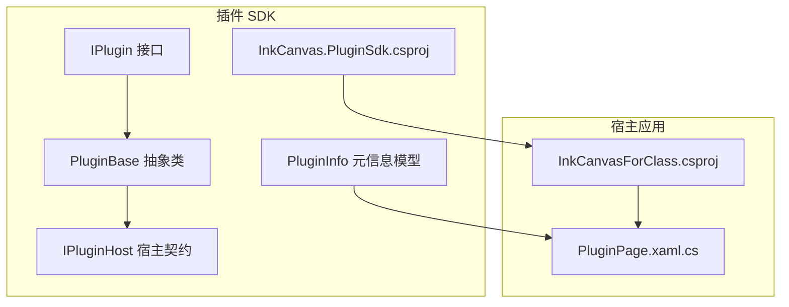
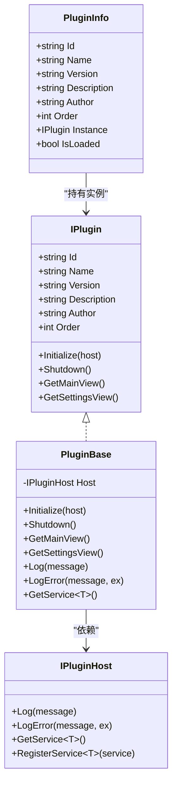
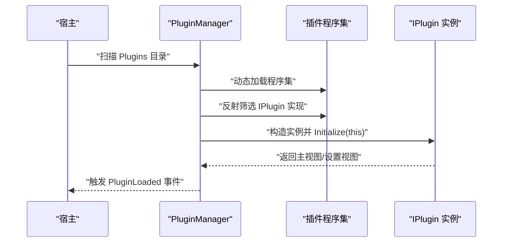
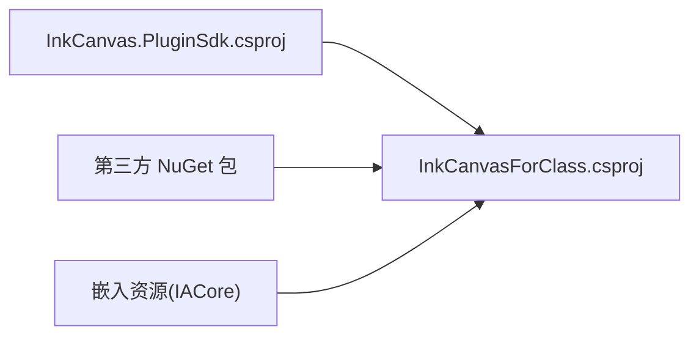

# 插件打包与分发

## 简介
本文件面向希望在 InkCanvasForClass 生态中开发、打包与分发插件的开发者，系统阐述插件包结构、版本管理、依赖管理、打包与安装、分发渠道、签名与验证，以及从开发完成到发布的完整流程示例与维护策略。内容基于仓库中的插件 SDK、宿主工程与相关文档进行提炼与扩展，帮助非专业打包人员也能顺利完成插件交付。

## 项目结构
- 插件 SDK 位于 InkCanvas.PluginSdk，定义了插件接口、基类、宿主契约与插件元信息模型，是所有插件必须遵循的规范。
- 主程序 InkCanvasForClass.csproj 是宿主应用，负责扫描、加载与管理插件，并提供 UI 展示与交互。
- 插件页面 PluginPage.xaml.cs 展示已加载插件列表，体现插件生命周期与状态。
- 文档 .qoder/.../插件 API.md 明确了宿主侧 PluginManager 的职责与行为，是理解插件加载机制的关键。

## 核心组件
- 插件接口 IPlugin：定义插件标识、名称、版本、描述、作者、加载顺序，以及初始化、关闭、主视图与设置视图的约定。
- 插件基类 PluginBase：提供通用生命周期钩子、日志与错误记录、服务获取能力，并通过宿主注入实现松耦合。
- 宿主契约 IPluginHost：提供日志、错误日志、服务注册与获取能力，作为插件与宿主通信的桥梁。
- 插件元信息 PluginInfo：承载插件 ID、名称、版本、描述、作者、加载顺序、实例与加载状态，用于 UI 展示与管理。
- 宿主工程 InkCanvasForClass.csproj：定义目标框架、运行时标识、打包与部署属性，以及资源嵌入与第三方依赖。
- 插件页面 PluginPage.xaml.cs：展示已加载插件数量与列表，体现插件加载与异常处理流程。

## 架构总览
插件体系采用“接口+抽象基类+宿主契约”的设计，插件通过实现 IPlugin 并继承 PluginBase，获得统一的生命周期与服务访问能力。宿主通过 PluginManager（见文档）扫描 Plugins 目录，动态加载程序集，反射筛选 IPlugin 实现，按 Order 排序并触发事件，支持单个与批量卸载。

## 详细组件分析

### 插件接口与基类
- IPlugin 规定了插件的基本元数据与生命周期方法，确保宿主可以统一管理不同插件。
- PluginBase 提供默认实现与宿主交互能力，减少重复代码，便于扩展。
- IPluginHost 为插件提供日志、错误记录与服务注册/获取，形成稳定的扩展点。

## 依赖分析
- 插件 SDK 与宿主工程的依赖关系：宿主工程引用插件 SDK，确保编译期类型安全与运行时加载一致性。
- 第三方依赖：宿主工程引入多种 NuGet 包，涵盖 UI、互操作、通知、日志等，插件应避免与宿主存在冲突的高版本依赖。
- 资源与嵌入：IACore 等二进制资源以嵌入方式参与宿主构建，插件不应与之产生命名冲突。

## 性能考虑
- 动态加载与卸载：插件采用可卸载的 AssemblyLoadContext 加载，避免内存泄漏与资源占用，建议插件在 Shutdown 中释放非托管资源。
- UI 渲染：插件页面按需渲染插件卡片，异常捕获与空列表提示降低 UI 响应时间。
- 依赖最小化：插件尽量复用宿主提供的服务，减少额外依赖，避免与宿主依赖版本冲突。

[本节为通用指导，无需列出具体文件来源]

## 故障排查指南
- 插件未显示：检查宿主是否正确扫描 Plugins 目录、插件是否实现 IPlugin、是否通过 Initialize 注入宿主。
- 插件加载失败：查看宿主日志与错误记录，确认依赖版本、资源路径与权限。
- UI 异常：确认插件主视图/设置视图返回值与宿主 UI 线程调用一致性。

## 结论
通过标准化的插件接口、统一的基类与宿主契约，结合宿主工程的资源与依赖管理，开发者可以快速构建符合生态规范的插件。遵循本文档的打包与分发流程，可确保插件在不同平台上稳定运行并顺利交付。

[本节为总结性内容，无需列出具体文件来源]

## 附录

### 插件包结构与组成
- 必需文件
  - 插件程序集：包含实现 IPlugin 的类与资源。
  - 插件元数据：由宿主读取的版本、名称、作者、描述等信息（通常来自插件自身属性或清单）。
- 可选资源
  - 图标、本地化资源、字体、样式等。
- 元数据文件
  - 插件清单（建议）：包含 ID、版本、依赖、兼容性声明等，便于宿主与分发系统识别。

[本节为概念性说明，无需列出具体文件来源]

### 版本管理策略
- 版本号规则
  - 建议采用语义化版本（主.次.补丁），如 1.2.3。
  - 插件版本与宿主版本解耦，但需声明最低宿主版本要求。
- 语义化版本控制
  - 主版本变更：破坏性更新，需用户手动升级。
  - 次版本变更：新增功能，保持向后兼容。
  - 补丁版本：修复问题，保持完全兼容。
- 版本兼容性声明
  - 在插件清单中声明支持的宿主版本范围，避免在不兼容版本上加载。

[本节为通用指导，无需列出具体文件来源]

### 依赖管理机制
- 运行时依赖检查
  - 插件应避免直接依赖与宿主冲突的第三方库版本。
  - 通过宿主 IPluginHost.RegisterService 提供服务，插件间共享能力。
- 第三方库引用
  - 优先使用宿主已提供的能力，减少重复依赖。
  - 若必须引用，确保版本与宿主锁定一致，避免运行时冲突。
- 冲突解决
  - 当出现依赖冲突时，优先升级或降级插件依赖至与宿主一致的版本。
  - 使用宿主提供的日志与错误记录定位冲突来源。

[本节为通用指导，无需列出具体文件来源]

### 打包工具与自动化流程
- 命令行工具
  - 使用 dotnet CLI 构建与打包，生成插件程序集与资源。
- 构建脚本
  - 在 CI/CD 中定义构建矩阵（x86/x64/arm64），执行 restore/build/publish。
- 自动化流程
  - 构建完成后自动压缩为 zip 包，包含插件程序集与必要资源。
  - 生成校验和（如 SHA256）与版本元数据文件，便于分发与验证。

[本节为通用指导，无需列出具体文件来源]

### 安装程序制作
- 安装包生成
  - 将插件 zip 包与安装脚本打包为 MSI/EXE 安装包。
- 注册表配置
  - 安装时写入插件安装路径与版本信息，便于宿主识别。
- 卸载程序创建
  - 提供卸载逻辑，清理注册表项与文件，恢复初始状态。

[本节为通用指导，无需列出具体文件来源]

### 分发渠道选择
- 官方插件市场
  - 在社区官方平台发布，提供版本历史与下载统计。
- 第三方平台
  - GitHub Releases、NuGet（若适用）、技术社区资源站。
- 自建分发系统
  - 搭建内部或公开的下载与更新通道，配合签名校验与版本推送。

[本节为通用指导，无需列出具体文件来源]

### 签名与验证机制
- 数字签名
  - 对插件包与安装程序进行代码签名，提升可信度。
- 完整性检查
  - 生成并校验 SHA256 校验和，防止篡改。
- 来源验证
  - 在宿主中校验签名与来源，仅允许受信渠道的插件加载。

[本节为通用指导，无需列出具体文件来源]

### 完整打包示例（从开发到发布）
- 开发阶段
  - 实现 IPlugin 并继承 PluginBase，完善主视图与设置视图。
- 构建阶段
  - 使用 dotnet build 生成插件程序集，复制到宿主 Plugins 目录进行联调。
- 打包阶段
  - 将插件程序集与资源打包为 zip，生成版本元数据与校验和。
- 发布阶段
  - 上传至官方插件市场或自建分发系统，附带变更日志与安装说明。
- 用户安装
  - 下载安装包，执行安装，宿主自动扫描并加载插件。

[本节为通用指导，无需列出具体文件来源]

### 发布后维护策略
- 更新推送
  - 通过官方渠道发布新版本，提供升级提示与自动更新（如可行）。
- 用户反馈处理
  - 建立反馈收集与分类机制，结合宿主日志定位问题。
- 问题修复流程
  - 快速修复并发布热修补丁，确保与宿主版本兼容性。

[本节为通用指导，无需列出具体文件来源]