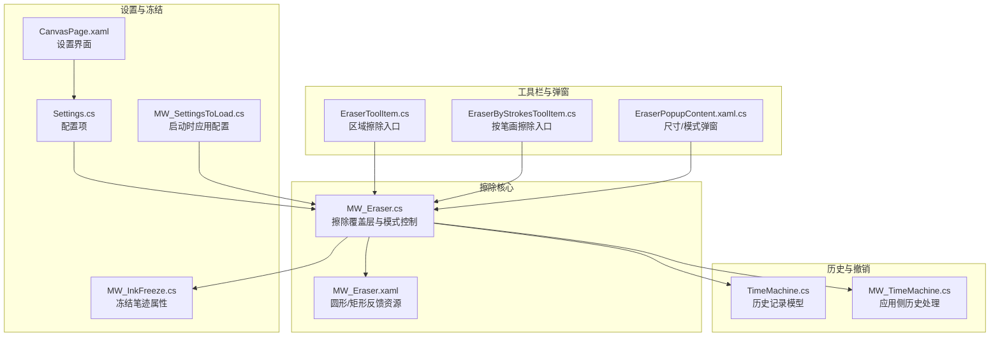
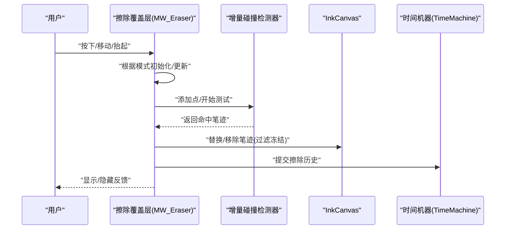
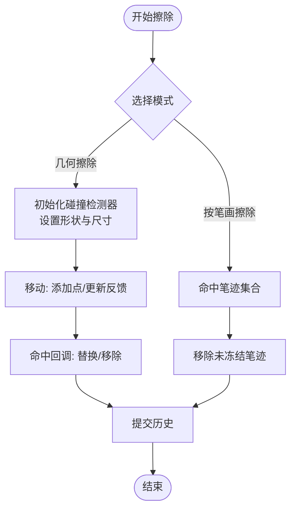
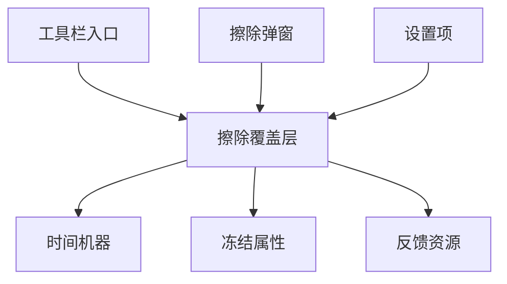

# 擦除功能系统

## 简介
本文件系统性梳理 InkCanvasForClass 的擦除功能体系，涵盖以下主题：
- 擦除模式与实现：像素级擦除（几何擦除）、笔迹级擦除、区域擦除
- 工具配置：擦除尺寸、形状（圆形/矩形）、模式切换、自动切回等
- 历史管理与撤销：擦除操作记录、撤销/重做流程
- 性能优化：大画布处理、实时擦除的保障策略
- 用户体验与无障碍：交互反馈、视觉提示、可访问性
- 适用场景与最佳实践：不同模式的使用建议

## 项目结构
围绕擦除功能的关键文件分布如下：

## 核心组件
- 擦除覆盖层与模式控制：负责监听指针/触控事件、初始化几何擦除的碰撞检测器、维护擦除反馈（圆形/矩形）、在抬起时提交历史并处理自动切回。
- 擦除反馈资源：提供圆形与矩形两种反馈位图资源，随尺寸与形状动态调整显示。
- 工具栏入口：区域擦除（几何擦除）与按笔画擦除两个入口，分别对应不同的交互与性能特征。
- 历史与撤销：通过时间机器记录擦除操作，支持撤销/重做；同时对冻结页进行保护。
- 设置与配置：擦除尺寸、形状、自动切回等设置项，以及启动时的应用逻辑。

## 架构总览
擦除功能由“输入事件 -> 模式判断 -> 几何/笔迹处理 -> 历史记录 -> 反馈呈现”的链路构成。几何擦除采用增量式碰撞检测器，按需替换或移除笔迹；笔迹擦除直接从集合中移除未冻结的笔迹；两者均受冻结属性保护。

## 详细组件分析

### 擦除模式与实现
- 几何擦除（像素级/区域擦除）
  - 使用增量式碰撞检测器，基于当前擦除形状（圆形/矩形）与尺寸，逐点添加并触发命中回调，按命中结果替换或移除笔迹。
  - 支持实时反馈：在移动过程中显示圆形/矩形反馈，并通过变换定位到指针位置。
  - 抬起时结束测试并提交历史，随后可自动切回原工具。
- 笔迹擦除（按笔画擦除）
  - 在移动时直接对命中笔迹集合执行移除，同样过滤冻结属性。
  - 无需碰撞检测器，交互更直接但不支持“像素级”精细擦除。
- 冻结保护
  - 对带有特定冻结属性的笔迹进行跳过，避免误删。

## 依赖关系分析
- 输入事件链：工具栏入口 -> 覆盖层事件 -> 模式处理 -> 历史提交。
- 资源依赖：反馈位图资源与尺寸/形状设置耦合。
- 历史依赖：擦除提交依赖时间机器；冻结页保护依赖冻结属性。
- 设置依赖：尺寸/形状/自动切回等设置贯穿加载与运行期。

## 性能考虑
- 增量碰撞检测
  - 使用增量式命中测试，仅在移动时持续添加点，降低每次全量扫描开销。
- 实时反馈最小化
  - 仅在几何擦除移动阶段显示反馈，减少不必要的渲染。
- 尺寸与形状适配
  - 圆形/矩形反馈位图与实际擦除尺寸匹配，避免过度缩放带来的额外成本。
- 大画布处理
  - 命中测试与替换/移除发生在命中集合上，尽量减少对未命中笔迹的影响。
- 冻结页保护
  - 通过属性过滤避免对冻结笔迹的无效操作，提升整体吞吐。

## 故障排查指南
- 擦除无效
  - 检查是否处于冻结页；若笔迹带冻结属性则会被跳过。
  - 确认当前模式是否正确（几何/笔迹）。
- 反馈不显示
  - 确认覆盖层是否启用且可见；几何擦除移动阶段才显示反馈。
- 历史无法撤销/重做
  - 检查时间机器历史是否被清空；确认当前页是否被冻结导致提交失败。
- 自动切回异常
  - 检查设置项“擦除后自动切回”是否开启及延迟配置是否合理。

## 结论
该擦除系统以“几何擦除+笔迹擦除”双模式并存，配合增量碰撞检测与反馈资源，实现了高效、直观的擦除体验。通过时间机器与冻结页保护，系统在功能完整性与安全性之间取得平衡；设置项与弹窗进一步提升了可配置性与易用性。建议在大画布场景优先使用几何擦除，并结合自动切回与合适的尺寸/形状以获得最佳体验。

## 附录

### 不同擦除模式的适用场景与最佳实践
- 几何擦除（区域擦除）
  - 适用：需要精确擦除某片区域、边缘平滑、与手写笔迹契合度高。
  - 最佳实践：在移动时保持稳定速度，避免频繁启停；大尺寸适合大面积擦除，小尺寸适合细节清理。
- 按笔画擦除
  - 适用：快速删除整条笔迹、批量清理。
  - 最佳实践：适用于非冻结笔迹；注意与冻结页保护配合使用。
- 自动切回
  - 适用：连续书写-擦除-书写的高频场景。
  - 最佳实践：根据使用习惯设置合理延迟，避免误切回。