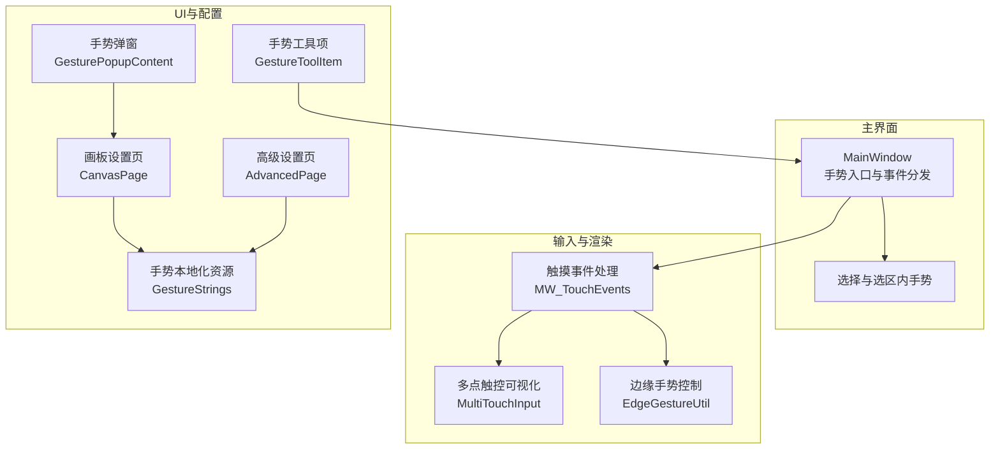
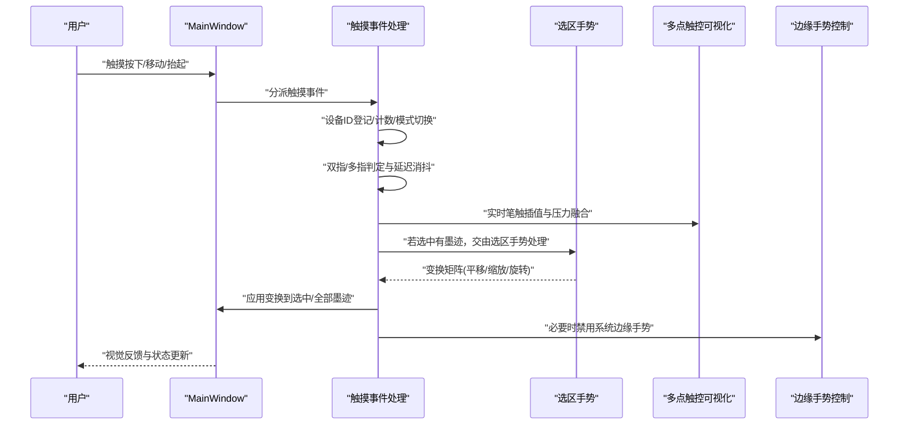
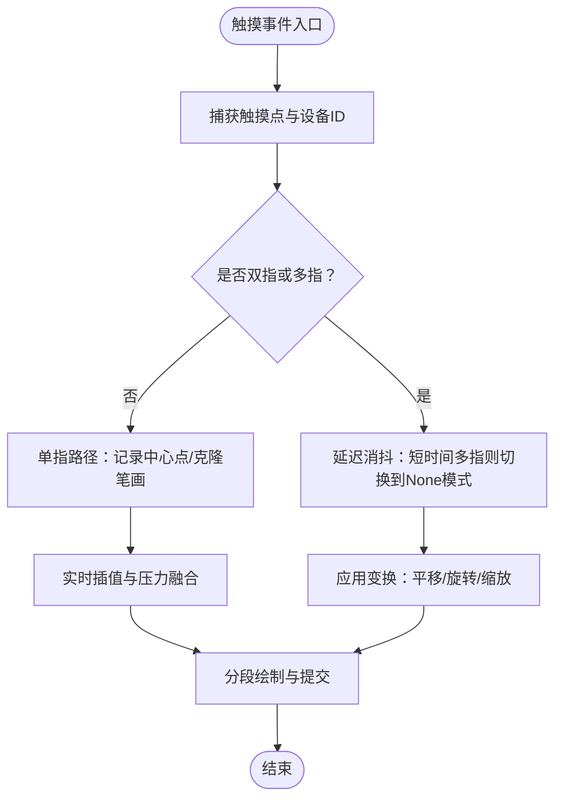
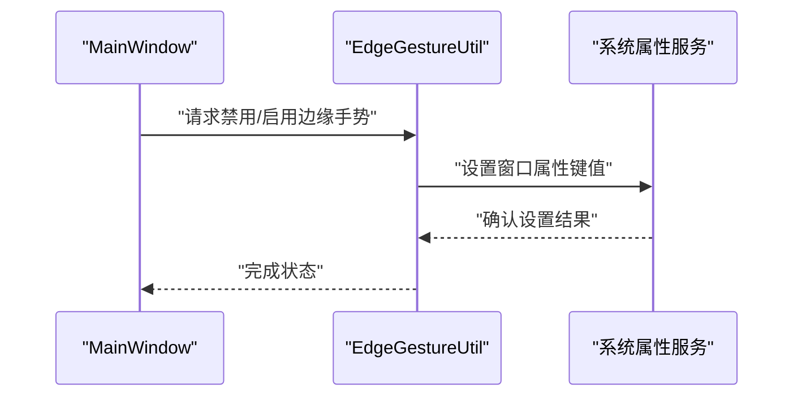
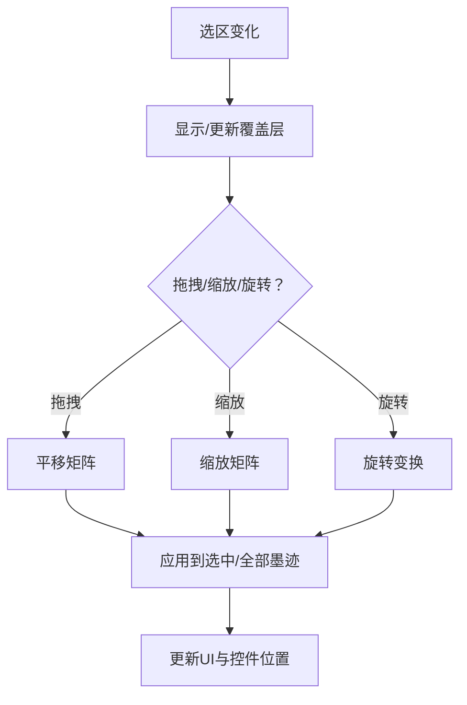
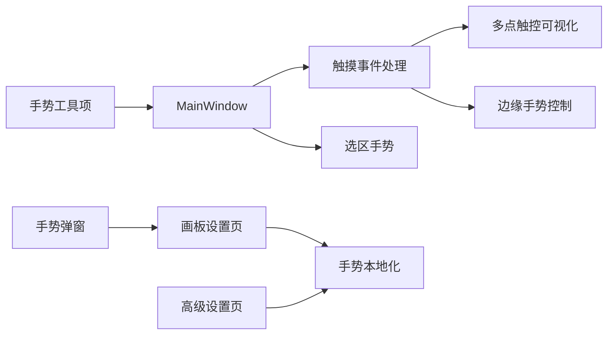

# 手势识别与交互

## 简介
本文件围绕 InkCanvasForClass 的手势识别与交互能力进行系统化说明，重点覆盖：
- 多点触控输入的捕获、解析与响应流程
- 边缘手势与手掌擦（掌侧误触抑制）的实现原理
- 手势配置选项（灵敏度、自定义映射、冲突处理）
- 手势与传统鼠标/键盘输入的协同机制
- 用户体验优化与无障碍支持
- 不同设备类型的适配与性能优化建议

## 项目结构
与手势交互相关的核心模块分布如下：
- 主窗口事件与手势处理：MainWindow_cs/MW_TouchEvents.cs
- 选择与选区内手势：MainWindow_cs/MW_SelectionGestures.cs
- 边缘手势禁用辅助：Helpers/EdgeGestureUtil.cs
- 实时笔触可视化与插值：Helpers/MultiTouchInput.cs
- 手势弹窗与工具项：Controls/Popups/GesturePopupContent.xaml.cs、Controls/Toolbar/Items/GestureToolItem.cs
- 设置页与本地化：Windows/SettingsViews/Pages/CanvasPage.xaml.cs、Windows/SettingsViews/Pages/AdvancedPage.xaml.cs、Properties/GestureStrings.Designer.cs

## 核心组件
- 触摸事件与多点触控处理：负责捕获触摸、管理设备ID、双指/多指手势判定、实时笔触插值与压力感知融合。
- 选区手势与变换：在选中墨迹时提供拖拽、缩放、旋转等手势支持，并与主画布变换联动。
- 边缘手势禁用：通过系统属性接口禁用系统边缘手势，避免与应用内手势冲突。
- 实时笔触可视化：以 DrawingVisual 与 StrokeVisual 提供高质量、低延迟的笔触渲染与重绘。
- 手势弹窗与工具项：提供手势开关与状态指示，连接到主窗口手势入口。
- 设置与本地化：提供手势灵敏度、手掌擦、双指旋转等配置项及国际化文案。

## 架构总览
整体交互流程从触摸事件进入，经过设备状态管理、手势判定与冲突消解，再到渲染与变换应用，最终反馈到 UI 与设置。

## 详细组件分析

### 多点触控输入处理与实时笔触
- 设备状态管理：维护设备ID列表、中心点、上次编辑模式、多指延迟与掌侧误触状态。
- 双指/多指判定：基于设备数量、设置开关与当前编辑模式，决定是否进入多指手势模式或延迟消抖。
- 实时笔触插值：对触摸点进行线性或贝塞尔插值，结合方向向量与距离，生成平滑轨迹。
- 压力与速度融合：根据采样率、速度与硬件压力因子，动态计算笔触宽度与压力，减少抖动并提升观感。
- 可视化与重绘：通过 StrokeVisual 与 DrawingVisual 分段绘制，按阈值提交，避免频繁重绘。

### 边缘手势与系统集成
- 系统边缘手势禁用：通过系统属性接口设置特定窗口属性，禁用系统边缘手势，避免与应用内手势冲突。
- 适用场景：在演示模式或全屏白板模式下，确保用户手势不被系统边缘手势打断。

### 选区手势与变换
- 选区覆盖层：在选中墨迹时显示覆盖层，支持拖拽、缩放、旋转与翻转等操作。
- 变换矩阵：统一使用 Matrix 进行平移、缩放与旋转，应用于选中墨迹或全部墨迹。
- 与主画布联动：对图片与媒体元素同样应用变换，保持一致性。

### 手势配置与本地化
- 手势开关：多指模式、双指平移/缩放/旋转、选区内旋转缩放、手掌擦等。
- 灵敏度与阈值：手掌擦灵敏度、特殊屏阈值、触控乘数等。
- 本地化：手势标题、提示与灵敏度文案通过资源文件提供多语言支持。

### 手势弹窗与工具项
- 手势弹窗：提供多指模式与双指手势开关，以及状态指示面板。
- 工具项：将手势按钮与主窗口手势入口绑定，便于快速切换。

## 依赖关系分析
- MainWindow 作为中枢，依赖触摸事件处理模块、选区手势模块与边缘手势控制模块。
- 触摸事件处理模块依赖多点触控可视化模块进行实时渲染。
- 设置页与本地化资源为手势功能提供可配置性与国际化支持。
- 工具项与弹窗作为用户入口，连接到主窗口手势入口。

## 性能考量
- 实时笔触插值与压力融合：通过一元滤波与中点链去抖，平衡流畅度与稳定性。
- 分段绘制与阈值提交：减少重绘频率，提高渲染效率。
- 硬件加速与缓存：开启硬件加速与缓存提示，降低 CPU/GPU 开销。
- 多指延迟消抖：避免误触发，减少不必要的模式切换。
- 图片与媒体元素同步变换：统一矩阵应用，避免重复遍历。

## 故障排查指南
- 手势无响应
  - 检查是否处于演示模式且禁用了双指手势
  - 确认多指模式与双指平移/缩放/旋转开关
  - 查看边缘手势是否被系统拦截
- 手掌擦误触发
  - 调整手掌擦灵敏度与阈值
  - 特殊屏下校准触控乘数
- 笔触抖动或不连贯
  - 检查压力与速度融合参数
  - 确认硬件压力是否被禁用
- 选区变换异常
  - 确认选中墨迹数量与边界
  - 检查是否启用了选区内旋转缩放

## 结论
InkCanvasForClass 的手势体系以多点触控为核心，结合边缘手势禁用、选区变换与实时笔触渲染，形成完整的输入-处理-反馈闭环。通过丰富的配置项与本地化支持，既满足专业场景需求，又兼顾易用性与可访问性。建议在不同设备类型上按需调优灵敏度与性能参数，确保最佳用户体验。

## 附录
- 设备适配建议
  - 触控板：适度提高双指平移阈值，启用压力融合
  - 触控屏：启用边缘手势禁用，校准触控乘数
  - 手写笔：保留压力与速度融合，关闭手掌擦
- 无障碍支持
  - 提供手势开关与状态提示
  - 支持键盘替代操作（如全选、删除、复制）
  - 提供高对比度主题与大字号选项
