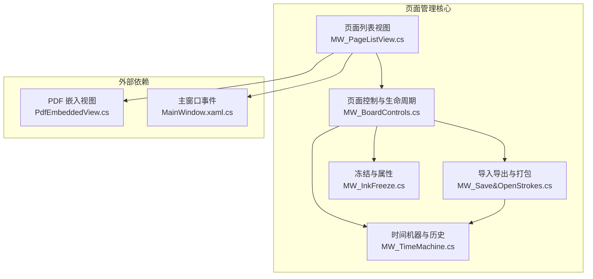
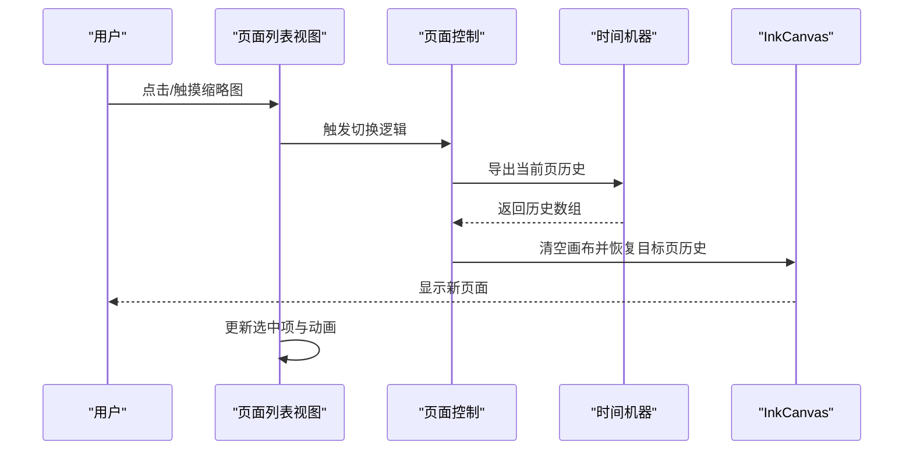
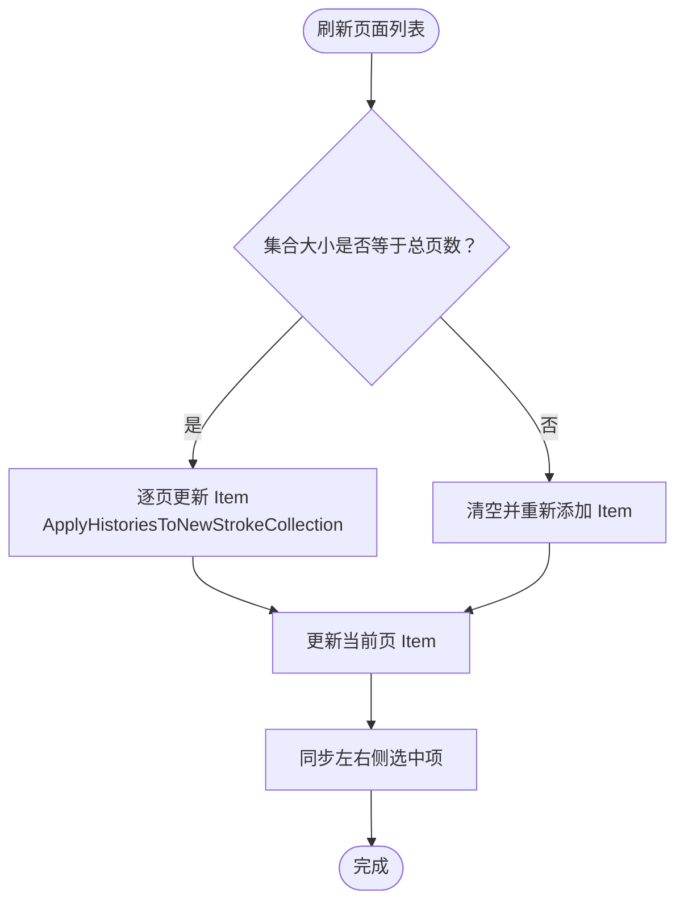
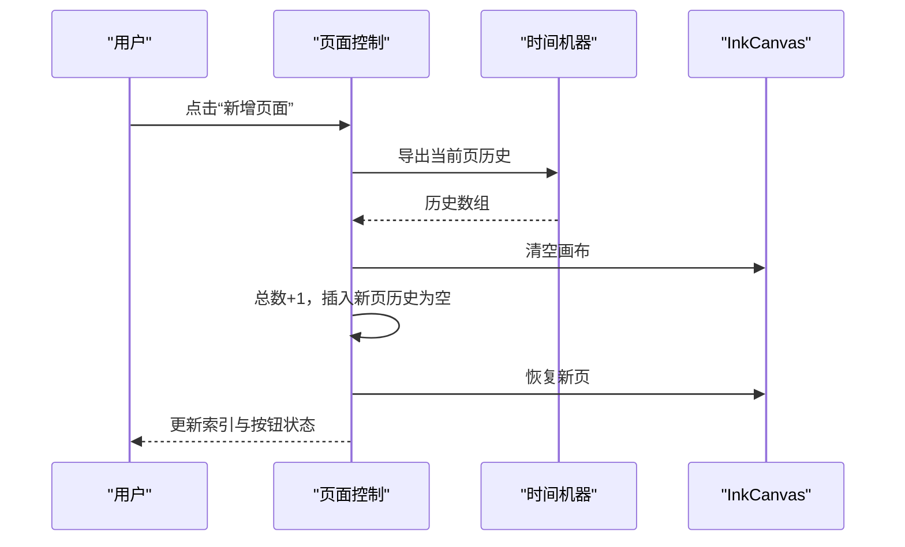
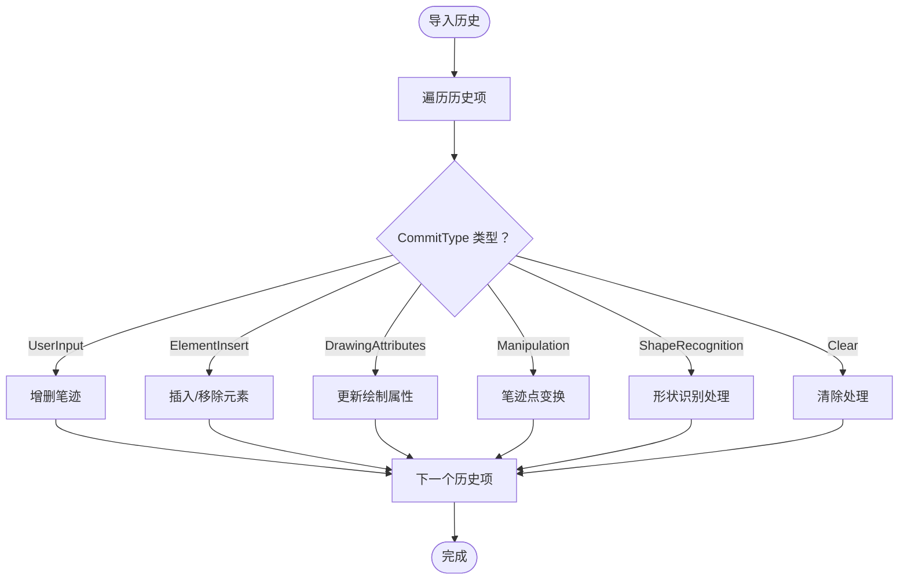
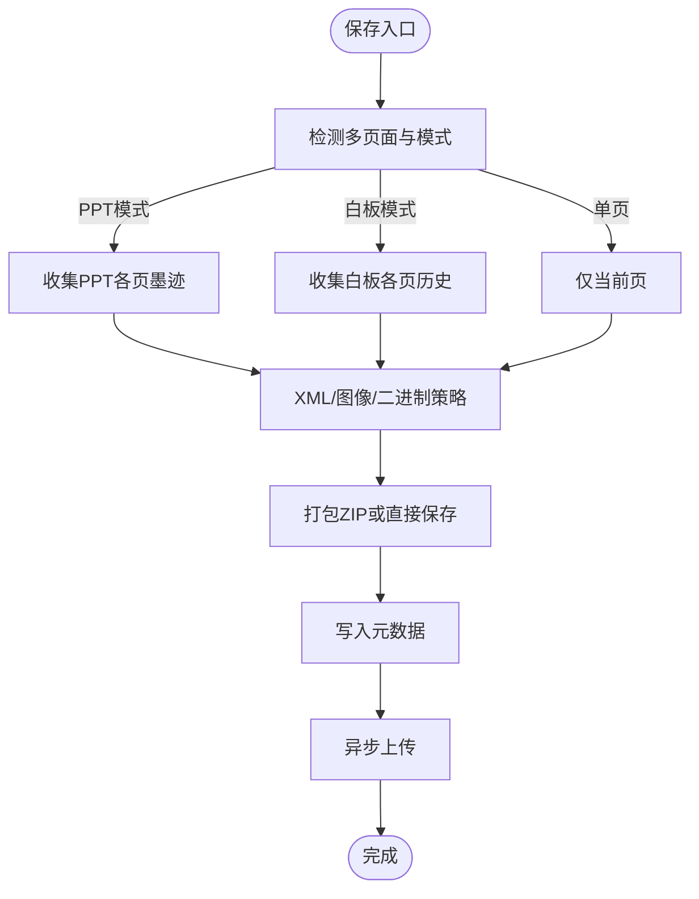
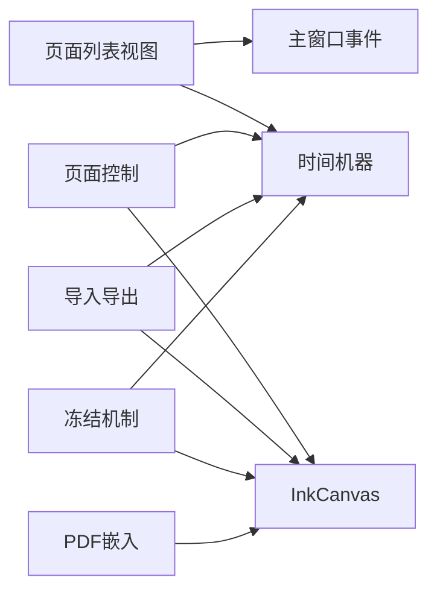

# 页面管理功能

## 简介
本文件面向 InkCanvasForClass 的页面管理功能，系统性阐述多页面支持的实现原理与工程实践，覆盖以下关键主题：
- Canvas 对象的创建、管理和销毁机制
- 页面列表视图（缩略图）的生成、切换与交互
- 页面的添加、删除、重命名与排序
- 页面状态的持久化（序列化与反序列化）
- 页面模板系统与自定义样式的实现思路
- 页面导入导出的技术实现与性能优化策略

## 项目结构
页面管理功能主要分布在 MainWindow 的多个部分：
- 页面列表视图与交互：MW_PageListView.cs
- 页面生命周期与状态管理：MW_BoardControls.cs
- 历史与状态持久化：MW_TimeMachine.cs
- 导入导出与多页面打包：MW_Save&OpenStrokes.cs
- 冻结保护与页面属性：MW_InkFreeze.cs
- PDF 页面嵌入与分页：PdfEmbeddedView.cs
- 主窗口事件与触摸交互：MainWindow.xaml.cs

## 核心组件
- 页面列表视图与缩略图生成：负责构建每页的笔迹快照，生成缩略图并支持点击/触摸切换。
- 页面生命周期管理：负责新增、删除、移动页面，维护当前页索引与总数。
- 历史与状态持久化：通过时间机器记录笔迹、元素插入、属性变更等，支持扁平化以优化性能。
- 导入导出与打包：支持多页面墨迹的 XML/ICSTK/图像打包，以及元素元数据保存。
- 冻结与页面属性：提供页面冻结保护、状态标记与安全验证。

## 架构总览
页面管理围绕“历史记录 + 画布状态 + 缩略图”的三元结构展开：
- 历史记录：TimeMachineHistory 数组，记录每页的笔迹、元素插入、属性变更等。
- 画布状态：当前 InkCanvas 的笔迹与子元素集合，配合清空/恢复流程。
- 缩略图：基于历史记录在临时画布上重放，生成每页笔迹快照作为缩略图。

## 详细组件分析

### 页面列表视图与缩略图生成
- 数据模型：PageListViewItem 包含页索引与笔迹集合。
- 列表刷新：遍历所有页，基于 ApplyHistoriesToNewStrokeCollection 生成每页笔迹快照，裁剪至画布边界，更新 ObservableCollection。
- 交互逻辑：支持鼠标/触摸命中测试，定位 ListViewItem，触发保存当前页、清空画布、切换索引、恢复目标页、更新索引显示与选中状态。
- 动画与滚动：切换后隐藏边框，滚动到当前页容器顶部，保证列表与画布状态一致。

### 页面生命周期与状态管理
- 新增页面：保存当前页历史，清空画布，总数+1，插入新页（历史为空），恢复新页，更新按钮状态与索引显示。
- 删除页面：检查冻结状态，若非当前页则整体前移，当前页删除时需扁平化后续页历史以优化性能；更新总数与索引。
- 切换页面：保存当前页，清空画布，切换索引，恢复目标页，更新索引显示与按钮状态。
- 多指模式状态：保存/恢复每页的多指书写模式状态，提升跨页一致性体验。

### 历史与状态持久化
- 历史记录类型：用户输入、形状识别、笔迹操作、绘制属性、清除、元素插入等。
- 应用历史：根据类型分别处理笔迹增删、元素插入/移除、属性变更等。
- 扁平化优化：删除页面前将历史重放至临时画布，导出“仅最终状态”，减少冗长历史带来的卡顿。
- 元素处理：批量添加元素后再统一处理位置与事件，降低布局抖动。

### 导入导出与多页面打包
- 多页面检测：根据模式（PPT/白板）与页数决定是否多页面保存。
- 保存策略：
  - XML 模式：单页保存为 XML，多页保存为 ZIP 包含多个 XML 文件与元数据。
  - 图像模式：全页面保存为图像 ZIP 包，包含每页图像与元数据。
  - 二进制模式：单页保存为 .icstk，多页保存为多个 .icstk 文件与元数据。
- 元数据：保存元素类型、位置、尺寸、PDF 当前页与总页数等。
- 异步上传：保存完成后异步上传文件，避免阻塞 UI。

### 冻结与页面属性
- 冻结机制：通过为笔迹附加属性标记冻结状态，阻止非游标工具下的修改；切换冻结状态时同步到当前页笔迹。
- 安全验证：解冻需要二次验证（密码/TOTP），防止误操作。
- 属性标记：记录每页最近一次用户墨迹变更时间，便于课程/课堂场景的审计与追踪。

### PDF 页面嵌入与分页
- 初始化：根据 PDF 路径与页数初始化，支持压缩大图与当前页切换。
- 分页控制：提供上一页/下一页可用性判断与标签文本更新。

## 依赖关系分析
- 页面列表视图依赖历史记录生成缩略图，依赖主窗口的触摸/鼠标事件处理。
- 页面控制依赖时间机器导出/导入历史，依赖 InkCanvas 的清空/恢复流程。
- 导入导出依赖时间机器生成多页笔迹快照，依赖元素元数据收集。
- 冻结机制依赖时间机器的笔迹属性标记与工具模式切换。

## 性能考量
- 历史扁平化：删除页面前将历史重放至临时画布，导出“仅最终状态”，显著减少后续翻页卡顿。
- 批量元素处理：恢复页面后统一处理元素位置与事件绑定，降低布局抖动与多次布局更新。
- 异步上传：保存完成后异步上传文件，避免阻塞 UI 线程。
- 缩略图生成：仅应用笔迹历史，不包含元素插入，避免缩略图渲染复杂度上升。
- 多指模式状态缓存：每页保存多指模式状态，减少切换时的重复判断。

## 故障排查指南
- 页面切换无效：检查当前页是否被冻结，冻结状态下禁止修改；确认历史记录是否正确导入/导出。
- 缩略图不更新：确认 RefreshBlackBoardSidePageListView 是否被调用，以及 ApplyHistoriesToNewStrokeCollection 是否正确生成笔迹快照。
- 删除页面报错：确认页面总数大于 1，且非冻结状态；检查扁平化过程是否成功。
- 导出失败：检查保存路径权限、ZIP 压缩库可用性与网络上传状态；查看日志输出。
- PDF 分页不可用：确认 PDF 路径与页数有效，当前页索引未越界。

## 结论
页面管理功能通过“历史记录 + 画布状态 + 缩略图”的协同设计，实现了稳定高效的多页面支持。历史扁平化、批量元素处理与异步上传等策略有效提升了性能与用户体验。导入导出模块支持多种格式与模式，满足教学与演示场景的多样化需求。冻结机制与安全验证进一步增强了课堂场景的可控性与安全性。

## 附录
- 页面模板系统与自定义样式建议：
  - 模板：基于历史记录的“最终状态”导出，可作为模板基线；在新页面创建时可参考模板的笔迹与元素布局。
  - 样式：通过绘制属性历史与元素插入历史，统一管理颜色、宽度、高亮等样式；结合冻结机制保护模板页。
- 页面排序与重命名：
  - 排序：通过移动页面索引实现，注意维护历史数组与多指模式状态的同步。
  - 重命名：可在 UI 层提供编辑入口，结合历史扁平化与状态持久化保持一致性。
