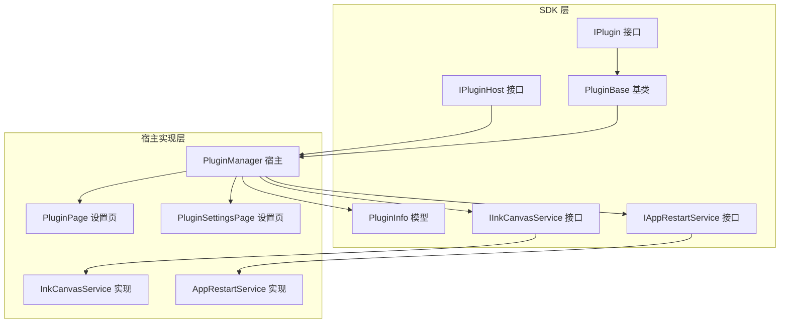
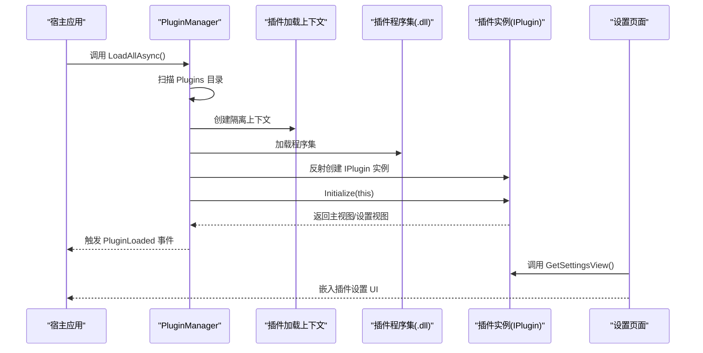
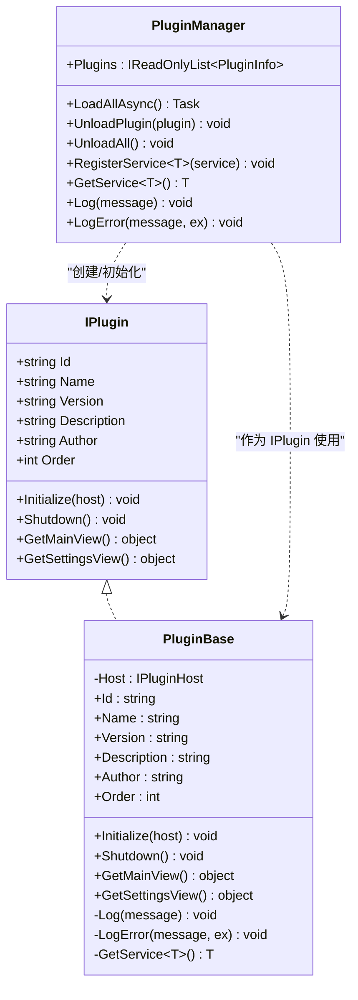
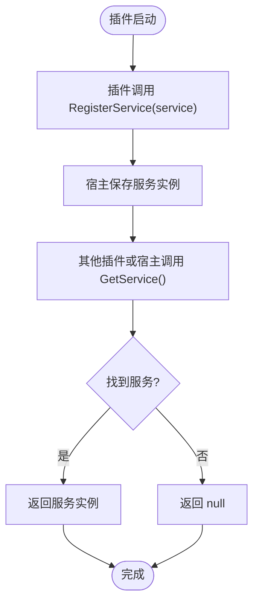
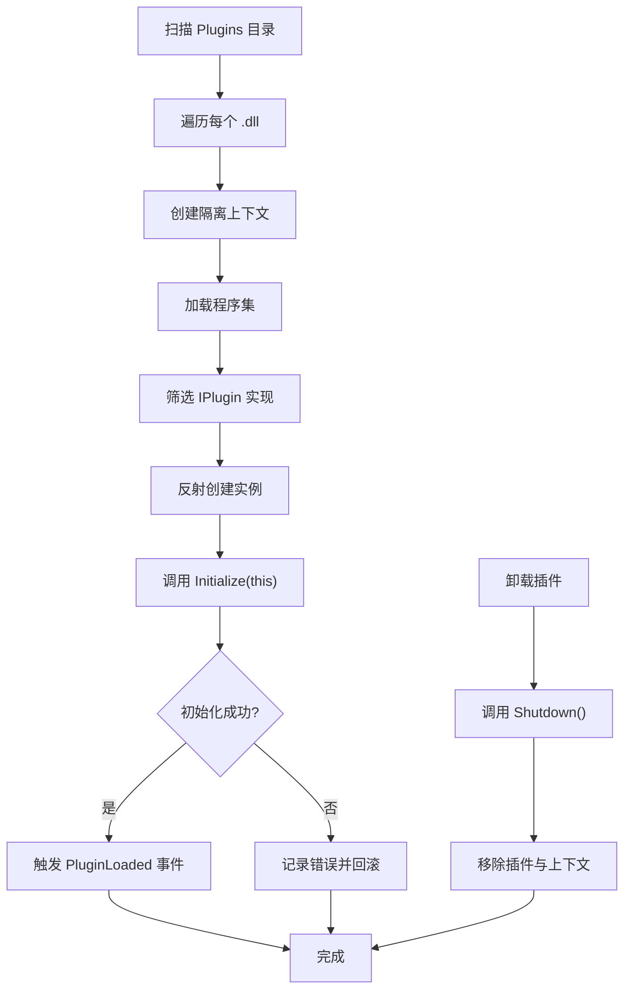
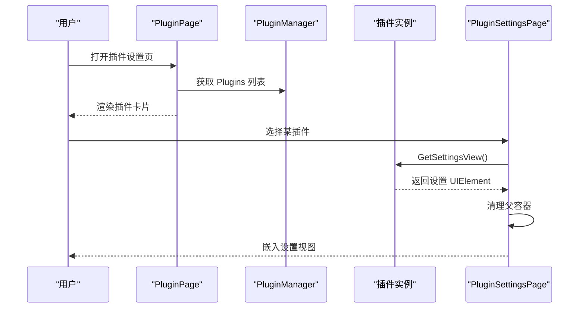
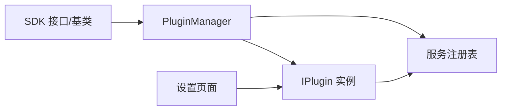

# 插件系统架构

## 简介
本文件系统性梳理 InkCanvasForClass 插件系统的设计理念与实现原理，覆盖插件接口标准、宿主服务职责、生命周期管理、动态加载机制、服务注册与依赖管理、错误隔离与日志记录、UI 集成与跨插件通信路径，以及安全与权限控制策略。目标是帮助开发者快速理解并构建高质量的扩展功能。

## 项目结构
插件系统由“SDK 层”和“宿主实现层”组成：
- SDK 层（InkCanvas.PluginSdk）：定义插件接口 IPlugin、宿主接口 IPluginHost、基础类 PluginBase、插件信息模型 PluginInfo，以及若干服务接口（如 IInkCanvasService、IAppRestartService）。
- 宿主实现层（Ink Canvas/Plugins）：实现插件管理器 PluginManager，负责扫描、加载、初始化、卸载插件；提供具体服务实现 InkCanvasService、AppRestartService，并在设置页面中集成插件 UI。

## 核心组件
- IPlugin：插件标准接口，定义标识、元数据、生命周期方法与 UI 获取方法。
- IPluginHost：宿主对插件暴露的服务面，提供日志、异常记录、服务注册与获取。
- PluginBase：插件基类，提供默认空实现与对宿主的便捷访问。
- PluginInfo：插件运行时信息，承载插件实例、加载状态与排序字段。
- PluginManager：插件管理器，负责插件发现、装配、初始化、卸载、事件发布与日志输出。
- 具体服务：
  - IInkCanvasService：白板打开/关闭等 UI 控制。
  - IAppRestartService：应用重启与权限切换。
- 设置页面：PluginPage 与 PluginSettingsPage 提供插件列表与设置视图集成。

## 架构总览
插件系统采用“接口驱动 + 动态加载 + 隔离上下文”的设计：
- 插件通过实现 IPlugin 接口参与系统。
- 宿主使用 PluginManager 扫描 Plugins 目录下的 *.dll，基于自定义 AssemblyLoadContext 进行加载与卸载，确保插件间隔离与可回收。
- 插件通过 IPluginHost 注册服务、获取服务、记录日志，实现与宿主的松耦合交互。
- 设置页面通过调用插件的 GetMainView/GetSettingsView 将插件 UI 集成到应用界面。

## 详细组件分析

### IPlugin 接口与 PluginBase 基类
- IPlugin 定义了插件的标识、元数据与生命周期方法，以及获取主视图与设置视图的方法。
- PluginBase 提供默认空实现，便于插件快速继承；同时封装对 IPluginHost 的访问，统一日志与服务获取入口。

### IPluginHost 与服务注册
- IPluginHost 提供日志、异常记录、泛型服务注册与获取能力。
- PluginManager 实现 IPluginHost，内部维护服务字典，支持插件向宿主注册服务，插件通过 GetService 获取所需能力。

### 动态加载与卸载机制
- PluginManager 在应用启动时扫描 Plugins 目录，支持顶层与子目录中的 *.dll。
- 使用自定义 AssemblyLoadContext 加载插件，确保依赖解析与可回收。
- 初始化成功后触发 PluginLoaded 事件；卸载时调用插件 Shutdown 并释放上下文。

### 插件 UI 集成与设置页面
- PluginPage 列出已加载插件的基本信息。
- PluginSettingsPage 通过调用插件的 GetSettingsView 获取设置视图并嵌入到设置窗口中，处理父容器清理以避免重复嵌入。

### 具体服务实现
- InkCanvasService：封装对主窗口的 UI 操作，提供打开/关闭白板与异步延迟打开的能力。
- AppRestartService：封装应用重启与权限切换逻辑，供插件在需要时调用。

## 依赖关系分析
- 插件对宿主的依赖通过 IPluginHost 解耦；插件仅依赖 SDK 接口，不直接依赖宿主实现细节。
- 宿主对插件的依赖通过反射与接口约定实现，避免编译期强绑定。
- 服务依赖通过 IPluginHost.RegisterService/GetService 统一管理，形成弱耦合的服务总线。

## 性能考量
- 动态加载与卸载：使用隔离上下文可回收插件程序集，降低内存占用与版本冲突风险。
- 异步加载：LoadAllAsync 支持并发扫描与初始化，但当前实现为顺序逐个加载，建议在插件数量较多时考虑分批或并行化优化。
- UI 访问：对 WPF Dispatcher 的调用需谨慎，避免阻塞 UI 线程；InkCanvasService 已通过 Dispatcher.Invoke 包裹，插件应遵循相同模式。
- 日志与异常：集中日志与异常记录有助于定位问题，但过多输出会影响性能，建议按级别过滤。

## 故障排查指南
- 插件未加载：检查 Plugins 目录是否存在、*.dll 是否符合 IPlugin 接口实现、初始化是否抛出异常。
- 卸载失败：确认 Shutdown 是否正确释放资源、上下文是否被卸载。
- UI 嵌入异常：检查 GetSettingsView 返回的 UIElement 是否已被父容器持有，必要时先清理父容器再嵌入。
- 日志定位：利用宿主日志事件与 Debug 输出定位问题，关注错误堆栈与消息。

## 结论
该插件系统以清晰的接口抽象、严格的生命周期管理与动态加载机制为核心，结合服务注册与 UI 集成，提供了良好的扩展能力。通过隔离上下文与事件驱动的加载/卸载流程，系统在稳定性与可维护性方面具备优势。建议在后续版本中进一步完善并行加载、配置持久化与权限控制策略，以提升大规模场景下的可用性与安全性。

## 附录：插件开发指南与最佳实践

### 开发环境搭建
- 使用 SDK 接口与基类进行开发，确保插件实现 IPlugin 或继承 PluginBase。
- 在本地 Plugins 目录下放置插件程序集，确保其依赖项齐全。

### 生命周期与初始化
- 在 Initialize 中完成服务注册、订阅事件、初始化资源；避免在构造函数中执行耗时操作。
- 在 Shutdown 中释放资源、取消订阅、清理状态；保证可重复加载与卸载。

### 服务注册与跨插件通信
- 通过 IPluginHost.RegisterService&lt;T&gt; 向宿主注册服务，供其他插件或宿主使用。
- 通过 IPluginHost.GetService&lt;T&gt; 获取所需服务，实现松耦合通信。

### 用户界面集成
- 通过 GetMainView/GetSettingsView 返回 UIElement，设置页面会自动嵌入。
- 注意处理 UIElement 的父容器，避免重复嵌入导致异常。

### 安全机制与权限控制
- 插件运行于隔离上下文中，减少对宿主的直接耦合。
- 对需要高权限的操作（如重启），建议通过 IAppRestartService 提供受控入口，并在 UI 中提示用户确认。
- 建议在插件元数据中声明最小权限需求，便于用户决策。

### 配置管理与持久化
- 插件可通过宿主注册的服务访问配置存储（例如应用提供的配置管理器），避免直接访问文件系统。
- 建议在设置页提供导出/导入配置的功能，提升用户体验。

### 打包与发布
- 将插件编译为独立的 .dll，连同必要的依赖放入 Plugins 目录。
- 在插件元数据中明确 Id、Name、Version、Author、Description、Order，确保显示与排序正常。
- 发布前进行兼容性测试，验证加载、初始化、设置页嵌入与卸载流程。

章节来源
