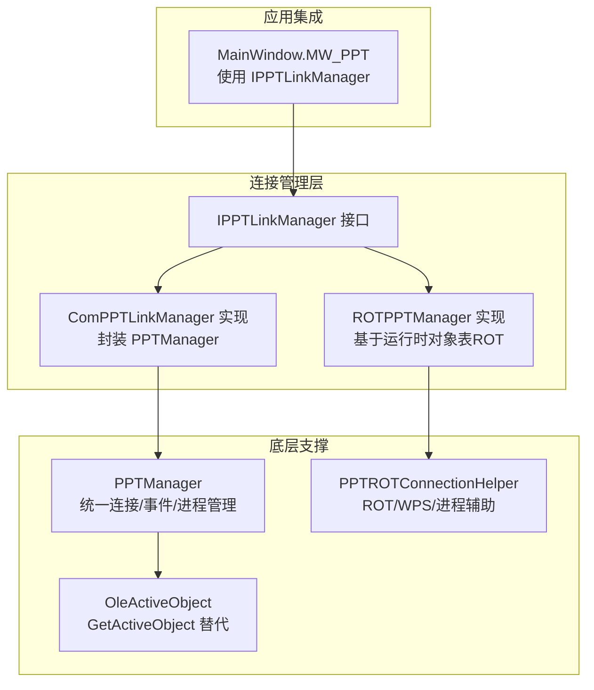
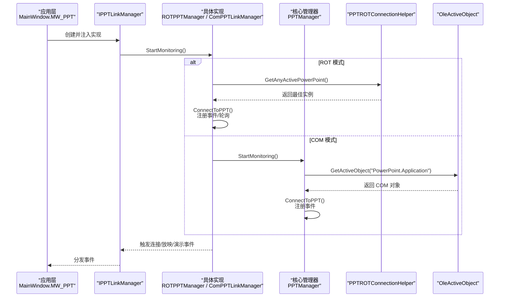
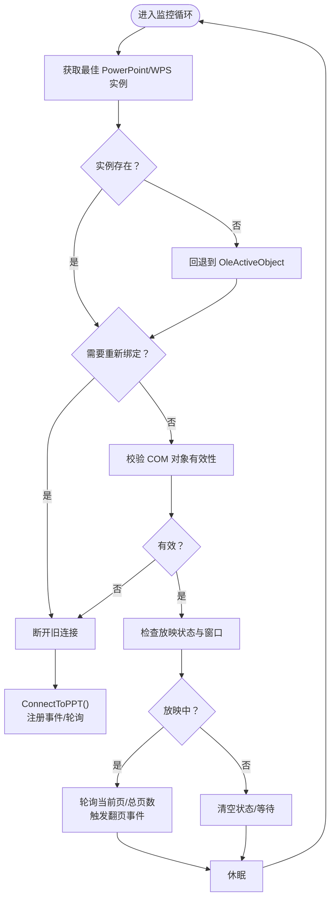
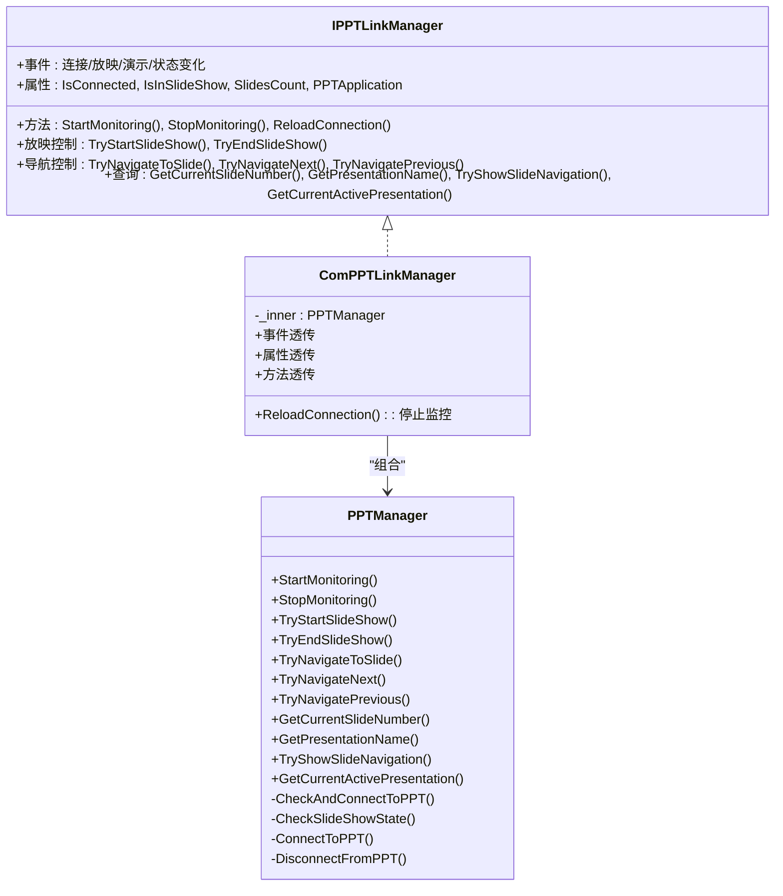

# 连接管理机制

## 简介
本文件系统化梳理 PowerPoint 连接管理机制，围绕接口设计、两种连接模式（ROT 与 COM）、连接建立流程、状态监控与事件处理、断线重连策略、常见故障排查等方面展开。目标是帮助开发者与维护者快速理解并高效定位与修复连接相关问题。

## 项目结构
与连接管理直接相关的代码主要集中在 Helpers 目录下的接口与实现类，以及主窗体中对连接管理器的集成使用。整体采用“接口抽象 + 两种实现”的分层设计，便于在不同场景选择最优策略。

图示来源

## 核心组件
- IPPTLinkManager：定义连接管理器的统一契约，包括事件、属性、生命周期管理、放映控制、导航控制、查询能力等。
- ROTPPTManager：基于运行时对象表（ROT）扫描 PowerPoint/WPS 实例，动态绑定 COM 对象，事件驱动 + 轮询兜底，具备断线重连与退避策略。
- ComPPTLinkManager：轻量包装器，将 PPTManager 的能力暴露为 IPPTLinkManager，便于统一接入。
- PPTManager：统一的 PowerPoint/WPS 连接与事件管理器，定时器驱动的状态机，负责连接、放映状态、事件注册/注销、资源释放与模块卸载。
- PPTROTConnectionHelper：ROT/WPS/进程辅助工具，提供实例优先级判定、窗口前台判断、安全释放 COM 对象等。
- OleActiveObject：.NET Core/5+ 下的 GetActiveObject 替代实现，用于直接获取 PowerPoint/WPS 的活动对象。
- MainWindow.MW_PPT：应用层集成点，持有 IPPTLinkManager 实例，订阅其事件并驱动 UI 逻辑。

## 架构总览
两种连接模式的差异与选择：
- ROT 模式（ROTPPTManager）
  - 通过 PPTROTConnectionHelper 枚举 ROT，优先匹配处于放映且前台的窗口，动态绑定 COM 对象。
  - 事件驱动为主，必要时启用轮询兜底，具备断线检测与重连退避。
- COM 模式（ComPPTLinkManager + PPTManager）
  - 通过 OleActiveObject 直接获取 PowerPoint 或 WPS 的活动对象，事件注册在 UI 线程 Dispatcher 中，确保 COM 回调正确线程上下文。
  - 统一的定时器驱动状态机，分别控制连接检查、放映状态检查与 WPS 进程检查的频率。

图示来源

## 详细组件分析

### IPPTLinkManager 接口设计
- 事件体系：连接变更、放映开始/结束/翻页、演示打开/关闭、放映状态变化。
- 属性：连接状态、放映状态、WPS 支持开关、导航动画跳过开关、幻灯片总数、PPT 应用对象。
- 生命周期：StartMonitoring、StopMonitoring、ReloadConnection。
- 功能：放映控制（开始/结束）、导航控制（跳转/下一页/上一页）、查询（当前页、演示名称、展示导航、当前演示）。

### ROTPPTManager（基于 ROT 的稳定模式）
- 连接建立
  - 通过 PPTROTConnectionHelper.GetAnyActivePowerPoint 从 ROT 中挑选优先级最高的 PowerPoint/WPS 实例。
  - 若无实例，回退到 OleActiveObject 直接获取。
  - 绑定成功后注册 COM 事件，同时根据可用性决定是否启用轮询兜底。
- 状态监控
  - 后台线程循环：检测 COM 对象有效性、ActivePresentation 变更、SlideShowWindows 数量与前台窗口。
  - 放映状态变化时触发事件；轮询模式下定期拉取当前页与总页数，检测页码变化触发翻页事件。
- 断线与重连
  - 发生 InvalidComObject/COM 异常时主动断开并等待重连。
  - 采用指数退避策略控制重连频率，避免频繁抖动。
- WPS 支持
  - 通过前台窗口 PID 判定与 WPS/WPP 进程关联，记录并管理 WPS 进程。

图示来源

### ComPPTLinkManager（COM 直接模式）
- 设计思路
  - 作为包装器，将 PPTManager 的能力通过 IPPTLinkManager 暴露，简化上层接入复杂度。
  - ReloadConnection 直接调用 StopMonitoring，实现“强制断开并重新连接”的语义。
- 与 PPTManager 的关系
  - 事件透传：PresentationOpen/Close、SlideShowBegin/NextSlide/End、PPTConnectionChanged、SlideShowStateChanged。
  - 属性与方法透传：IsConnected、IsInSlideShow、SlidesCount、PPTApplication、TryStartSlideShow/TryEndSlideShow、导航与查询等。

图示来源

### PPTROTConnectionHelper（ROT/WPS/进程辅助）
- ROT 扫描与优先级
  - 从 IRunningObjectTable 枚举条目，识别 PowerPoint/WPS 应用与演示文稿对象，计算优先级（有活动演示 > 有放映 > 有前台放映）。
- 前台窗口判定
  - 通过 GetForegroundWindow + GetWindowThreadProcessId 判断放映窗口是否前台，兼容 WPS/WPP 进程名差异。
- 安全释放与对象相等性
  - SafeReleaseComObject 提供异常兜底；AreComObjectsEqual 使用 GetIUnknownForObject 比较 COM 对象句柄，避免引用误判。

### OleActiveObject（.NET Core/5+ 的 GetActiveObject）
- 通过 P/Invoke 调用 CLSIDFromProgID 与 GetActiveObject，实现与 .NET Framework 下 Marshal.GetActiveObject 等效的行为，用于直接获取 PowerPoint/WPS 的活动对象。

### MainWindow.MW_PPT（应用集成点）
- 持有 IPPTLinkManager 实例，订阅其事件以驱动 UI 与交互逻辑。
- 提供断线后的延时退出 PPT 模式、放映可见性探测等增强体验的定时器与状态变量。

## 依赖关系分析
- 接口与实现解耦：IPPTLinkManager 抽象了连接管理器的契约，ROTPPTManager 与 ComPPTLinkManager 分别满足不同场景需求。
- COM 互操作：两个实现均依赖 Microsoft.Office.Interop.PowerPoint，涉及 COM 对象生命周期管理与线程上下文要求。
- 线程模型：ROTPPTManager 使用后台线程循环；PPTManager 在 UI 线程 Dispatcher 中注册 COM 事件，避免跨线程回调问题。
- 外部依赖：Win32 API（ROT/WIN32）与 OleActiveObject，用于进程与对象表的探测与获取。

图示来源

## 性能考量
- 轮询与事件结合：ROTPPTManager 在事件可用时优先事件驱动，否则启用轮询兜底，兼顾实时性与稳定性。
- 退避重连：指数退避减少频繁重连带来的系统压力。
- 定时器节流：PPTManager 的连接检查、放映检查、WPS 进程检查分别设置不同的检查间隔，降低 CPU 占用。
- COM 对象释放：统一 SafeReleaseComObject 与 FinalReleaseComObject，避免句柄泄漏与 RCW 分离导致的异常。

## 故障诊断指南
- 常见 COM 异常与处理
  - 0x8001010A/0x80010001/0x80004005：表示 COM 对象忙或无效，触发断开连接与重连。
  - 0x80048240：无活动演示文稿，需等待或检查 ActivePresentation。
  - 无效 COM 对象：捕获 InvalidComObjectException，立即断开并等待重连。
- 进程通信问题排查
  - ROT 扫描失败：确认 PowerPoint/WPS 是否在 ROT 中注册，检查前台窗口 PID 与进程名匹配。
  - WPS 支持：开启 IsSupportWPS 后，确认 KWPP.Application 是否可被 OleActiveObject 获取。
- 日志与可观测性
  - 关键路径均有日志记录（连接、事件触发、异常、重连），建议结合日志定位问题阶段。
- 重连与退避
  - ROT 模式内置退避策略，避免频繁重试；如需强制恢复，可调用 ReloadConnection 或等待退避结束。

## 结论
该连接管理机制通过接口抽象与双实现策略，既满足了基于 ROT 的稳定连接（ROTPPTManager），也提供了直接 COM 绑定的简洁方案（ComPPTLinkManager + PPTManager）。两者在事件驱动、轮询兜底、断线重连、WPS 支持与线程模型方面各有侧重，配合完善的日志与异常处理，能够较好地应对实际使用中的复杂场景与故障。
