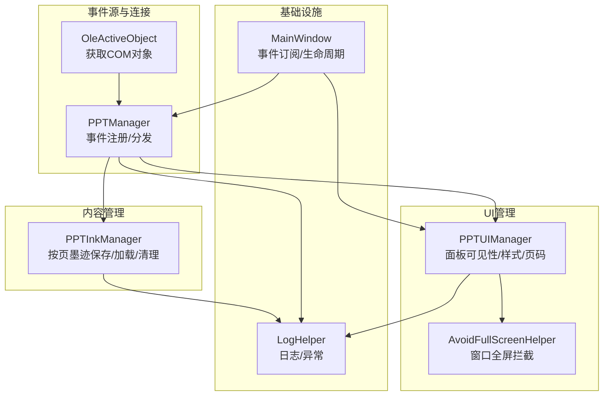
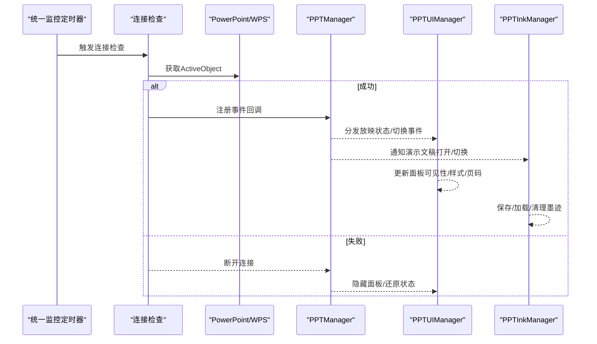
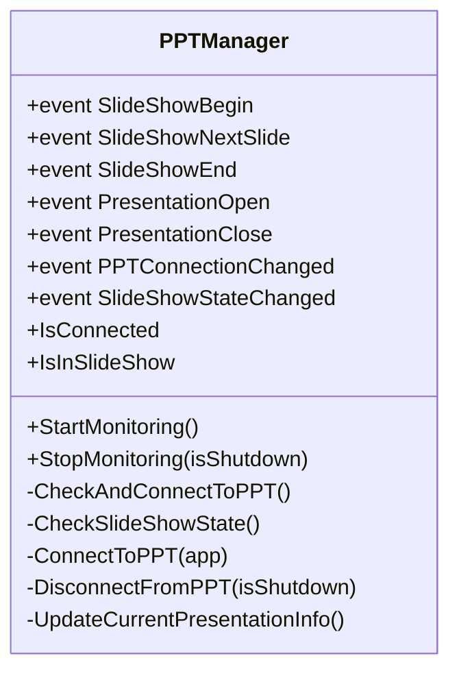
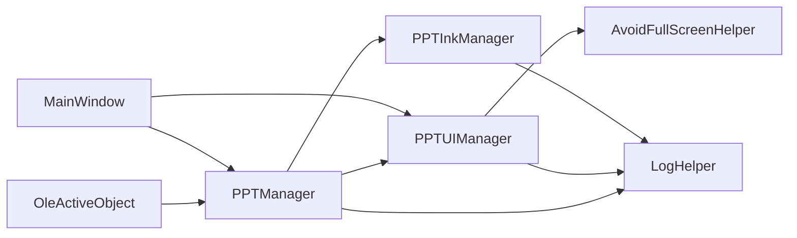

# 事件处理系统

## 简介
本文件面向 PowerPoint 事件处理系统，系统性梳理事件分类与处理机制，涵盖演示事件（开始、结束、切换）、演示文稿事件（打开、关闭）以及用户交互事件的处理流程；阐述事件监听器的注册与注销机制、订阅安全性与生命周期管理；详解异步模式下的线程安全与异常处理策略；解释 PPTUIManager 的职责与用户界面元素的动态创建、位置管理与状态同步；并提供性能优化、内存管理与用户体验保障的最佳实践及常见问题诊断方案。

## 项目结构
围绕 PowerPoint 事件处理的关键文件组织如下：
- 事件源与连接管理：PPTManager（负责 COM 连接、事件注册与分发）
- UI 状态与面板管理：PPTUIManager（负责放映模式下的 UI 展示、面板可见性与样式）
- 墨迹持久化与内存管理：PPTInkManager（负责按页保存/加载墨迹、自动保存与内存回收）
- COM 对象获取：OleActiveObject（跨平台获取 ActiveObject）
- 全屏辅助：AvoidFullScreenHelper（在放映模式下控制窗口行为）
- 日志与异常：LogHelper（统一日志与递归保护）
- 主窗口集成：MainWindow（事件订阅、生命周期管理）

## 核心组件
- PPTManager：统一管理 PowerPoint/WPS 连接、事件注册与分发、放映状态检查、演示文稿打开/关闭与幻灯片切换事件。
- PPTUIManager：在放映模式下动态更新 UI，包括导航面板可见性、按钮样式、页码同步、全屏辅助配合与透明度设置。
- PPTInkManager：按页保存/加载墨迹，提供自动保存、内存上限控制与快速切换保护，确保放映期间的稳定性。
- OleActiveObject：在 .NET Core/5+ 环境下实现等效的 COM ActiveObject 获取。
- AvoidFullScreenHelper：在非画板模式下阻止主窗口进入全屏最大化，确保演示体验。
- LogHelper：统一日志输出与递归保护，便于问题定位。
- MainWindow：作为事件订阅入口与生命周期管理中枢，协调各组件。

## 架构总览
系统采用“连接-事件-UI-内容”四层协同：
- 连接层：定时器驱动的连接检查，成功后在 UI 线程注册 COM 事件。
- 事件层：分发演示事件（打开/关闭/开始/结束/切换）与连接状态变更。
- UI 层：根据放映状态与配置动态更新面板可见性、样式与页码。
- 内容层：按页管理墨迹，提供自动保存与内存回收，保障流畅体验。

## 详细组件分析

### PPTManager：事件源与连接管理
- 事件定义：演示事件（开始、结束、切换）、演示文稿事件（打开、关闭）、连接状态与放映状态变更。
- 连接策略：定时器周期性检查，区分连接检查、放映状态检查与 WPS 进程检查的频率；支持 PowerPoint 与 WPS 双栈。
- 事件注册：在 UI 线程注册 COM 事件，确保线程亲和性；断开时在 UI 线程反注册，兼容多种 COM 异常。
- 状态缓存：缓存连接与放映状态，避免频繁查询 COM；异常时及时降级并断开。
- 生命周期：StartMonitoring/StopMonitoring/Dispose 协同，断开时安全释放 COM 对象并触发重载逻辑。

## 依赖关系分析
- PPTManager 依赖 OleActiveObject 获取 COM 对象，依赖 LogHelper 记录事件与异常。
- PPTUIManager 依赖 MainWindow 的 UI 元素与设置，依赖 AvoidFullScreenHelper 协同全屏。
- PPTInkManager 依赖 LogHelper 记录内存清理与保存失败。
- MainWindow 作为中枢，协调 PPTManager 与 PPTUIManager 的事件订阅与生命周期。

## 性能考量
- 定时器节流：连接检查、放映状态检查与 WPS 检查采用不同 tick 周期，降低开销。
- 线程亲和：COM 事件在 UI 线程注册与处理，避免跨线程访问风险。
- 内存控制：PPTInkManager 设定内存上限与定期清理策略，避免长时间放映导致内存膨胀。
- UI 异步：PPTUIManager 使用 InvokeAsync/BeginInvoke，避免阻塞 UI 线程。
- COM 释放：断开连接时彻底释放 RCW 并 FinalRelease，减少句柄泄漏风险。

[本节为通用性能建议，不直接分析具体文件]

## 故障排查指南
- 连接失败
  - 现象：无法获取 PowerPoint/WPS ActiveObject 或连接状态异常。
  - 排查：确认 PowerPoint/WPS 是否运行；检查 COM 异常 HR 值；查看日志中连接检查与断开记录。
  - 参考
- 事件未触发或重复触发
  - 现象：放映开始/结束/切换事件缺失或多次触发。
  - 排查：确认 UI 线程注册是否成功；检查断开连接时的反注册逻辑；核对放映状态缓存一致性。
  - 参考
- UI 不更新或闪烁
  - 现象：面板不显示、页码不同步或样式异常。
  - 排查：确认 Dispatcher 调用路径；检查显示选项与放映状态；验证 AvoidFullScreenHelper 的模式切换。
  - 参考
- 墨迹丢失或卡顿
  - 现象：切换页面墨迹未加载或内存占用过高。
  - 排查：检查快速切换保护与写入锁；查看内存清理日志；确认自动保存路径与权限。
  - 参考

## 结论
该事件处理系统通过 PPTManager 提供稳定的 COM 事件源，结合 PPTUIManager 的 UI 同步与 PPTInkManager 的内容管理，实现了放映场景下的高可靠与高性能。系统在连接策略、线程安全、异常处理与资源释放方面均有明确设计，配合日志与全屏辅助，能够有效提升用户体验与系统稳定性。

[本节为总结性内容，不直接分析具体文件]

## 附录
- 最佳实践清单
  - 事件注册与注销必须成对出现，断开时务必在 UI 线程反注册。
  - 使用 Dispatcher.InvokeAsync/BeginInvoke 更新 UI，避免阻塞。
  - 合理设置定时器 tick 周期，平衡响应性与性能。
  - 严格控制墨迹内存，设定上限并定期清理。
  - 记录关键事件与异常，利用日志定位问题。
  - 在放映模式下谨慎使用全屏，必要时启用 AvoidFullScreenHelper。

[本节为通用建议，不直接分析具体文件]