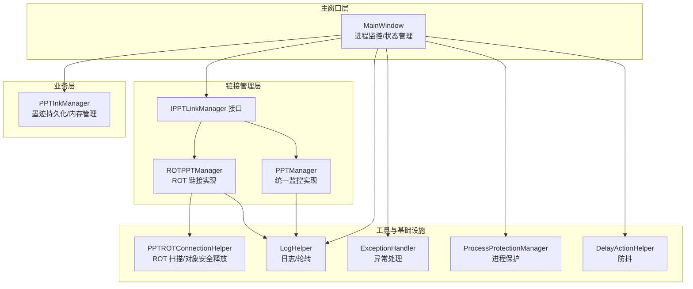
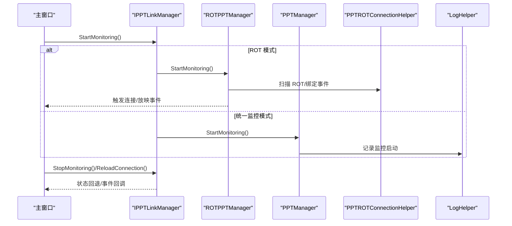
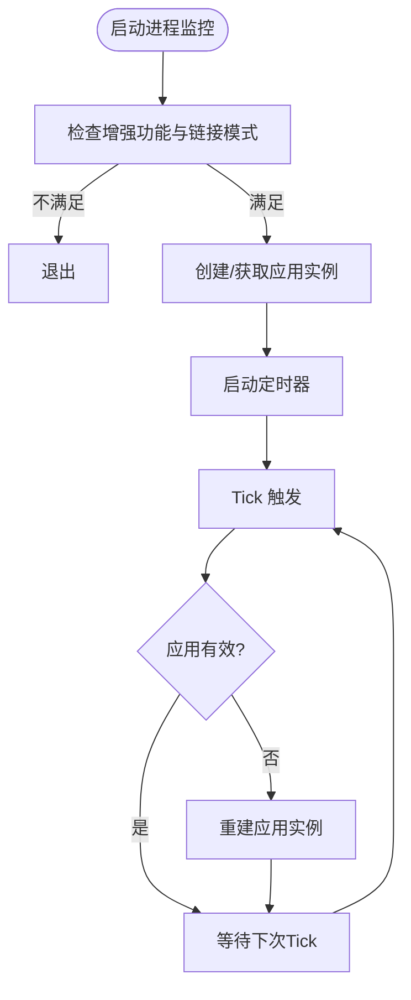
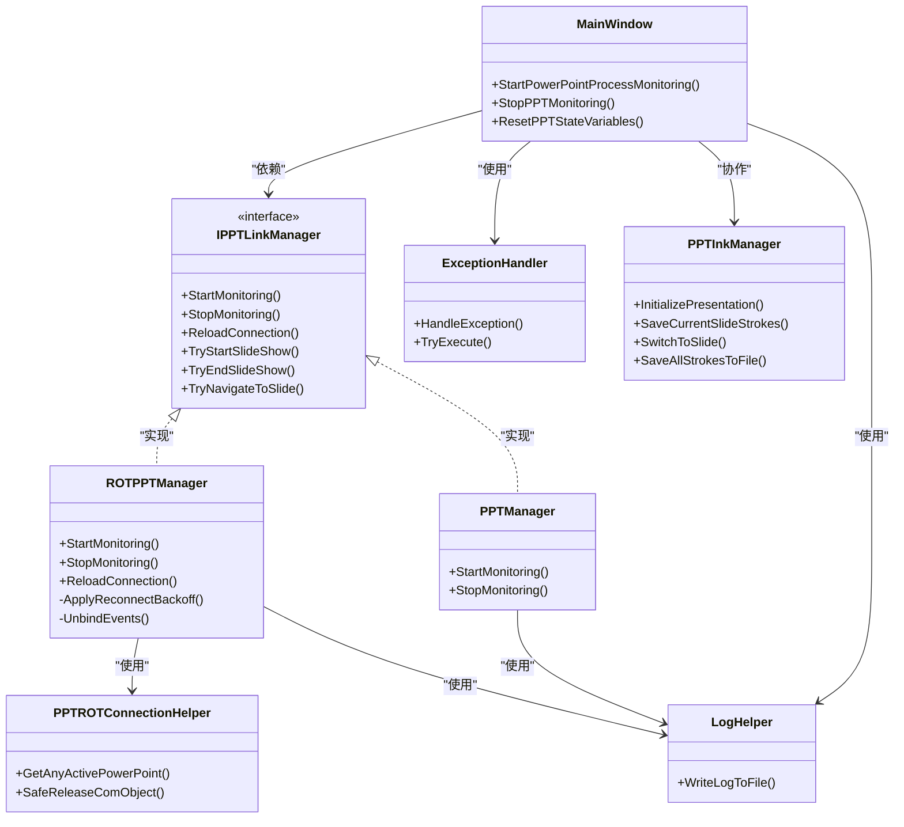
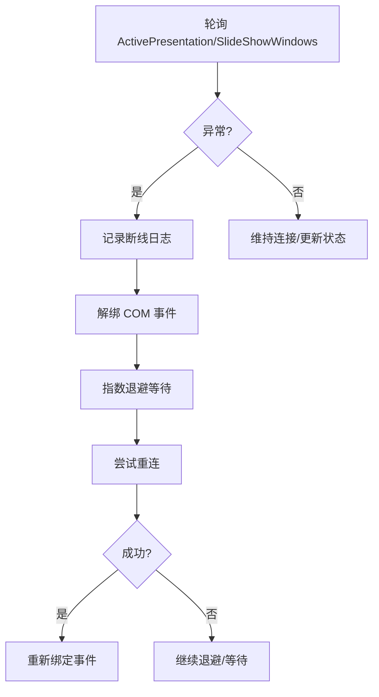

# 故障处理与恢复

## 简介
本文件面向 PowerPoint 集成场景，系统化梳理故障处理与恢复机制，涵盖进程监控、连接断开处理、COM 对象失效应对、演示模式稳定性保障、故障诊断与日志分析、系统级预防与应急方案。内容基于仓库中 MainWindow、Helpers 与 Windows 层面的实现进行归纳总结，帮助开发者与运维人员快速定位问题并实施修复。

## 项目结构
围绕 PowerPoint 集成的关键模块与职责如下：
- 主窗口与状态管理：负责 PowerPoint 进程守护、断线延迟退出、演示模式状态维护等。
- 链接管理器接口与实现：统一抽象连接生命周期、事件与导航能力，支持 ROT 链接与普通链接两种模式。
- 连接辅助与工具：提供 ROT 扫描、COM 对象安全释放、异常与日志处理、进程保护、防抖等通用能力。
- 墨迹管理：负责演示文稿级墨迹持久化、内存管理与切换保护，保障放映期间的稳定性。

## 核心组件
- 进程监控与守护
  - 主窗口通过定时器对 PowerPoint 进程进行周期性检查，若检测到应用失效则重建实例，确保增强功能可用。
- 链接管理器
  - 统一抽象连接生命周期与事件，支持两种模式：
    - ROT 链接：后台线程扫描 ROT 表，绑定 COM 事件，具备断线退避与事件解绑/重绑逻辑。
    - 统一监控：定时器驱动的连接检查与状态轮询。
- COM 对象安全
  - 提供对象有效性检测、终态释放与异常过滤，避免因 RPC/对象断开导致崩溃。
- 日志与异常
  - 结构化日志、日志轮转与进程保护，异常处理策略区分致命与非致命错误。
- 墨迹稳定性
  - 演示文稿级墨迹持久化、内存上限与清理、写入锁与快速切换保护，降低放映期间的数据丢失风险。

## 架构总览
PowerPoint 集成采用“主窗口协调 + 链接管理器抽象 + 工具层支撑”的分层设计。主窗口负责高层状态与 UI 协同，链接管理器负责与 PowerPoint 的连接与事件，工具层提供日志、异常、COM 安全与进程保护等横切能力。

## 详细组件分析

### 进程监控与自动重启
- 监控入口与条件
  - 仅在启用增强功能且未使用 ROT 链接时启动守护。
  - 启动后创建 PowerPoint 应用实例并启动定时器。
- 检测与重建
  - 定时器 Tick 中检查应用有效性，失效则重建。
  - 停止监控时清理延迟退出定时器与预览缓存。
- 用户体验
  - 断线后延迟退出 PPT 模式，避免误触。

## 依赖关系分析
- 主窗口依赖链接管理器接口，具体实现可切换（ROT/统一监控）。
- 链接管理器依赖连接辅助与日志工具，ROTPPTManager 还依赖 COM 事件绑定。
- 墨迹管理器独立于链接层，但与主窗口协作完成放映期间的数据保护。
- 异常与日志贯穿各层，进程保护在写入路径上提供额外可靠性。

## 性能考量
- 轮询与退避
  - ROT 管理器对断线重连采用指数退避，避免频繁重试造成 CPU 占用。
- 内存与 I/O
  - 墨迹管理器设定内存上限与清理周期，自动删除无用文件，平衡内存与磁盘 I/O。
- 线程与同步
  - 主窗口使用 DispatcherTimer，链接层使用后台线程，避免阻塞 UI；COM 回调与 UI 更新通过同步上下文处理。
- 日志与写入
  - 日志写入采用互斥与进程保护，避免高并发写入导致的文件锁争用。

## 故障排查指南

### 常见错误与定位
- 进程监控未生效
  - 检查是否启用增强功能且未使用 ROT 链接；确认定时器已启动。
  - 关注日志中“PowerPoint应用程序守护已启动/失败”等事件。
- 连接断开频繁
  - 查看断线退避是否生效，确认 HResult 是否属于断线类别（RPC/对象断开/服务器死亡）。
  - 检查事件解绑与重绑流程是否正常。
- COM 对象异常
  - 关注“释放 COM 对象时 COM 异常”日志，确认是否为可忽略断线异常。
  - 在 UI 调用前增加对象有效性校验。
- 放映期间崩溃或卡顿
  - 检查内存清理是否及时，确认写入锁与快速切换保护是否触发。
  - 查看全局异常处理中对特定 HResult 的降级处理记录。

## 结论
本集成方案通过“进程守护 + 连接监控 + COM 安全 + 墨迹保护 + 日志与异常”五维协同，实现了 PowerPoint 集成的高可用与稳定性。在演示模式下，断线退避、事件解绑/重绑、延迟退出与内存清理等机制共同保障了用户体验与数据安全。建议在生产环境中启用进程保护与日志轮转，并结合本文的排查方法快速定位与解决问题。

## 附录

### 关键流程图：断线检测与恢复
