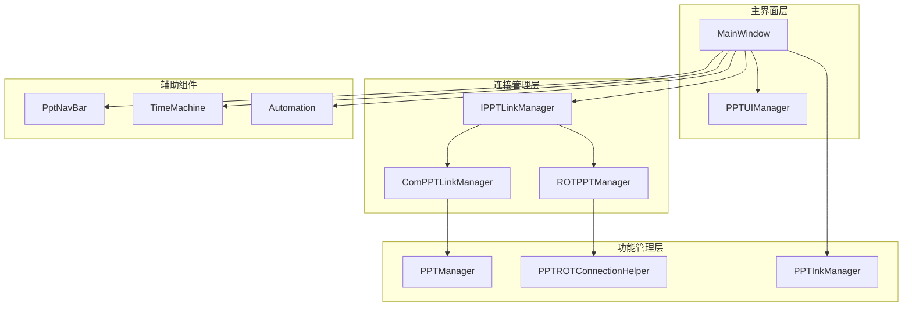
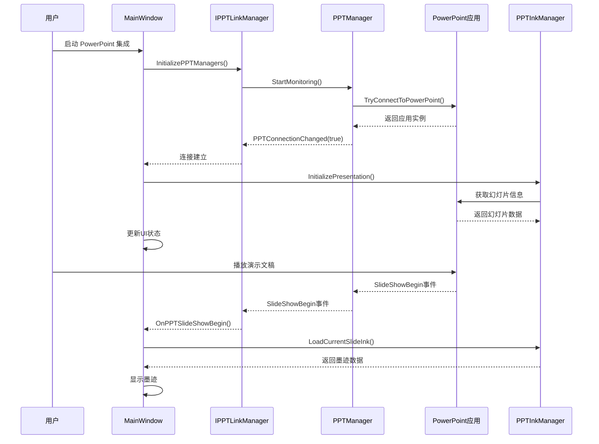
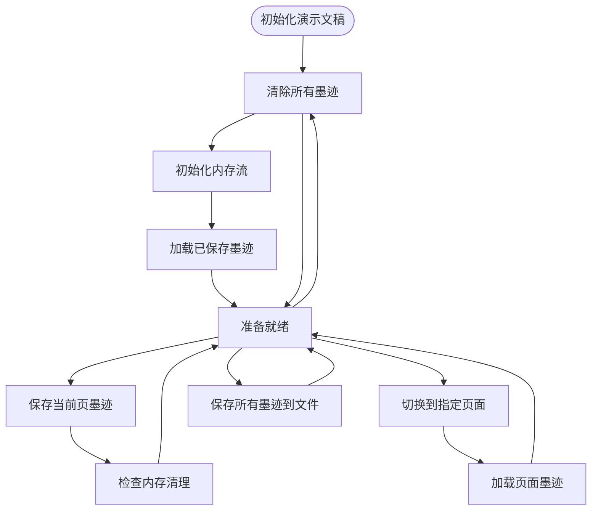
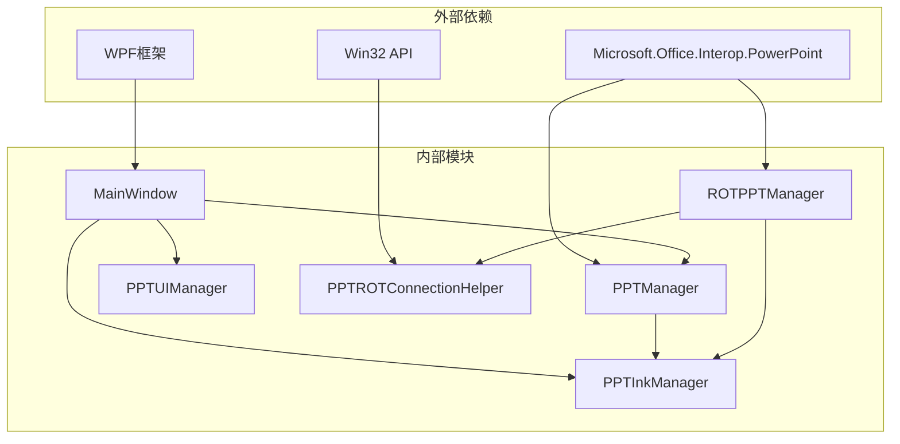
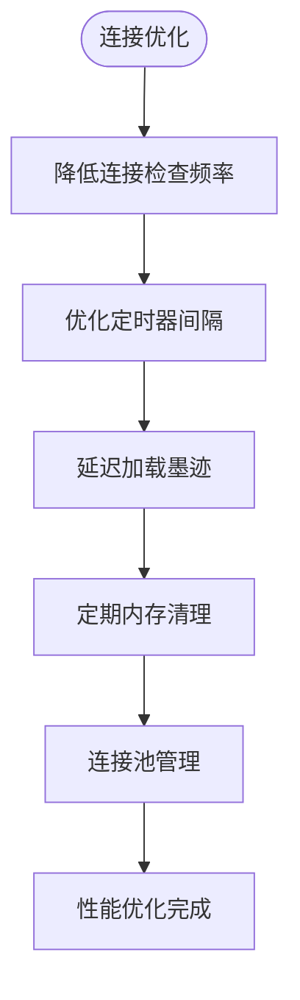

# PowerPoint 集成功能

## 简介

InkCanvasForClass 的 PowerPoint 集成功能是一个完整的演示模式解决方案，提供了与 Microsoft PowerPoint 和 WPS 演示文稿的深度集成。该功能实现了实时墨迹同步、幻灯片导航同步、多显示器支持以及稳定的连接管理机制。

该系统采用双架构设计，支持基于 COM 对象的传统连接方式和基于运行对象表（ROT）的现代连接方式，确保了与不同版本 Office 应用的兼容性。

## 项目结构

PowerPoint 集成功能主要分布在以下模块中：

## 核心组件

### PPTInkManager - 墨迹管理器

PPTInkManager 是整个 PowerPoint 集成功能的核心组件，负责管理演示文稿中的墨迹数据。其主要特性包括：

- **内存管理**：智能内存流数组管理，支持动态扩容和垃圾回收
- **自动保存**：基于文件系统的墨迹持久化机制
- **并发控制**：通过锁机制确保线程安全
- **内存清理**：自动监控内存使用并清理不活跃页面的墨迹

### PPTManager - 连接管理器

PPTManager 提供了与 PowerPoint 应用程序的稳定连接，支持以下功能：

- **进程检测**：自动检测 PowerPoint 和 WPS 进程
- **事件监听**：实时监听演示文稿的打开、关闭和放映状态变化
- **状态同步**：维护与 PowerPoint 应用程序的状态同步
- **COM 对象管理**：安全地管理 COM 对象生命周期

### PPTUIManager - 用户界面管理器

PPTUIManager 负责 PowerPoint 模式下的用户界面管理：

- **状态显示**：实时更新连接状态和放映状态
- **导航控制**：管理导航面板的显示和隐藏
- **样式设置**：根据设置调整界面外观
- **全屏处理**：支持全屏放映模式的特殊处理

## 架构概览

PowerPoint 集成功能采用了分层架构设计，确保了模块间的松耦合和高内聚：

## 详细组件分析

### PPTInkManager 工作流程

PPTInkManager 实现了完整的墨迹生命周期管理：

## 依赖关系分析

PowerPoint 集成功能的依赖关系如下：

## 性能考虑

### 内存管理优化

系统采用了多种内存管理策略来确保性能：

1. **智能内存流管理**：使用固定大小的内存流数组，支持动态扩容
2. **自动内存清理**：监控内存使用，超过阈值时自动清理不活跃页面
3. **内存使用限制**：设置最大内存使用量（默认 100MB）
4. **垃圾回收优化**：及时释放不再使用的内存流

### 连接性能优化

## 故障排除指南

### 常见问题和解决方案

#### 连接问题

| 问题类型 | 症状 | 解决方案 |
|---------|------|----------|
| PowerPoint 未启动 | 连接状态显示为断开 | 启动 PowerPoint 应用程序 |
| COM 对象失效 | 抛出 InvalidComObjectException | 重新连接或重启应用程序 |
| WPS 兼容性问题 | WPS 无法正常工作 | 禁用 WPS 支持或更新到最新版本 |
| 内存不足 | 应用程序响应缓慢 | 清理内存或增加系统内存 |

#### 墨迹同步问题

| 问题类型 | 症状 | 解决方案 |
|---------|------|----------|
| 墨迹丢失 | 切换页面后墨迹消失 | 检查自动保存设置 |
| 墨迹延迟 | 操作后墨迹显示延迟 | 调整网络设置或减少墨迹复杂度 |
| 内存溢出 | 应用程序崩溃 | 清理内存或减少同时打开的演示文稿数量 |

#### UI 显示问题

| 问题类型 | 症状 | 解决方案 |
|---------|------|----------|
| 导航栏不显示 | 导航按钮不可见 | 检查显示设置和权限 |
| 全屏模式异常 | 全屏显示不正确 | 重置全屏设置或更新显卡驱动 |
| 按钮无响应 | 点击按钮无反应 | 重启应用程序或检查输入设备 |

## 结论

InkCanvasForClass 的 PowerPoint 集成功能提供了一个完整、稳定且高性能的演示模式解决方案。通过采用分层架构设计、智能内存管理和多重连接策略，系统能够可靠地支持各种使用场景。

该功能的主要优势包括：

1. **高兼容性**：支持 PowerPoint 和 WPS，兼容多个 Office 版本
2. **高性能**：优化的内存管理和异步处理机制
3. **稳定性**：完善的错误处理和故障恢复机制
4. **易用性**：直观的用户界面和自动化功能
5. **扩展性**：模块化的架构设计便于功能扩展

通过持续的性能优化和功能完善，该 PowerPoint 集成功能将继续为用户提供优质的演示体验。